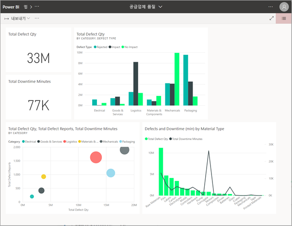
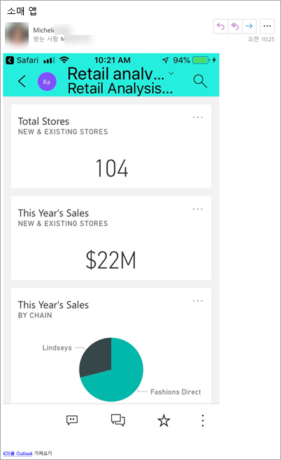
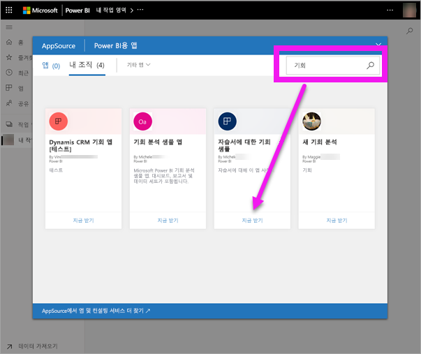
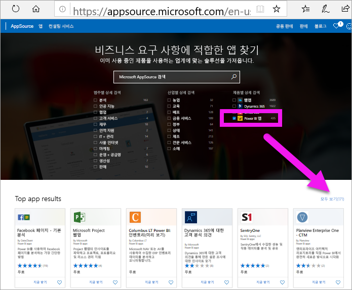
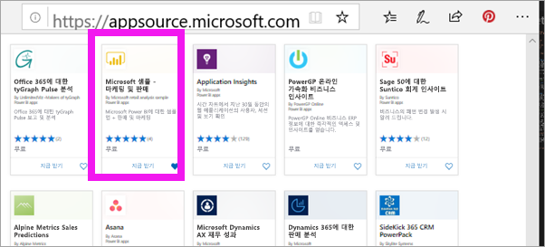
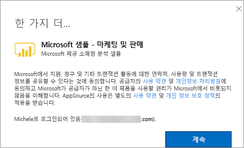
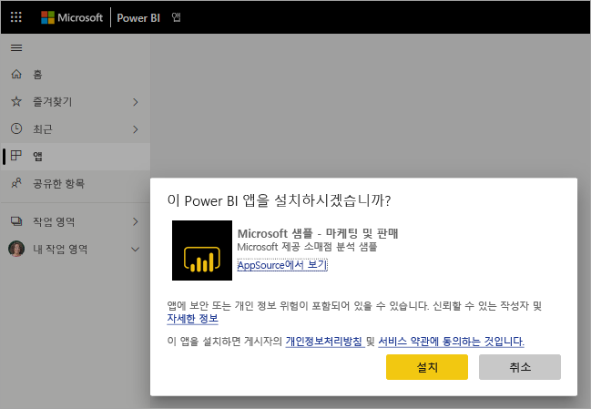
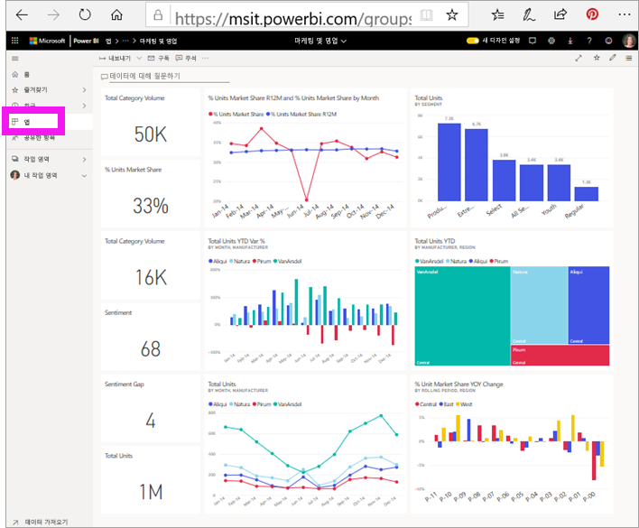

# Power BI에서 대시보드 및 보고서로 앱 설치 및 사용

[!INCLUDE [power-bi-service-new-look-include](../includes/power-bi-service-new-look-include.md)]

이제 [앱에 대한 기본 이해](end-user-apps.md)을 했으므로, 앱을 열고 상호 작용하는 방법에 대해 알아보겠습니다. 

## 새 앱을 가져오는 방법
새 앱을 가져오는 방법에는 몇 가지가 있습니다. 보고서 디자이너 동료는 Power BI 계정에 자동으로 앱을 설치하거나 앱에 직접 링크를 보낼 수 있습니다. 또한 AppSource로 가서 회사 내부 및 외부의 앱 디자이너가 제공하는 앱을 검색할 수 있습니다. 

모바일 디바이스의 Power BI에서는 AppSource가 아닌 직접 링크를 통해서만 설치할 수 있습니다. 앱 설계자가 앱을 자동 설치할 경우 앱 목록이 표시됩니다.

## 직접 링크에서 앱 설치
새 앱을 설치하는 가장 쉬운 방법은 앱 디자이너가 메일로 직접 링크를 받는 것입니다.  

**컴퓨터에서** 

메일의 링크를 선택하면 Power BI 서비스([https://powerbi.com](https://powerbi.com))가 브라우저에서 앱을 엽니다. 

**iOS 또는 Android 모바일 디바이스에서** 

모바일 디바이스에서 메일의 링크를 선택하면 앱이 자동으로 설치되어 모바일 앱으로 열립니다. 먼저 로그인해야 할 수 있습니다. 

## Microsoft AppSource에서 앱 가져오기
Microsoft AppSource에서 앱을 찾아 설치할 수도 있습니다. 액세스할 수 있는 앱(즉, 앱 작성자가 귀하에게 권한을 부여했거나 모든 사용자에게 부여한 앱)만 표시됩니다.

1. **앱**  > **앱 가져오기**를 선택합니다. 
   
        
2. AppSource의 **내 조직**에서 검색하여 결과 범위를 좁힌 후 찾고자 하는 앱을 찾을 수 있습니다.
   
    
3. **지금 가져오기**를 선택하여 앱 콘텐츠 목록에 추가합니다. 

## Microsoft AppSource 웹 사이트(https://appsource.microsoft.com) )에서 앱을 가져옵니다.
이 예제에서는 Microsoft 샘플 앱 중 하나를 엽니다. AppSource에서 비즈니스 운영에 사용하는 다양한 서비스용 앱을 찾을 수 있습니다.  Salesforce, Microsoft Dynamics, Google 애널리틱스, GitHub, Zendesk, Marketo 등의 서비스가 있습니다. 자세한 내용은 [Power BI를 통해 사용 중인 서비스용 앱](../service-connect-to-services.md)을 참조하세요. 

1. 브라우저에서 https://appsource.microsoft.com 을 열고 **Power BI 앱**을 선택합니다.

    

2. **모두 보기**를 선택하여 현재 AppSource에서 사용할 수 있는 모든 Power BI 앱 목록을 표시합니다. **Microsoft Sample - Sales &amp; Marketing**이라는 앱을 스크롤하거나 검색합니다.

    

3. **지금 받기**를 선택하고 사용 약관에 동의합니다.

    

4. 이 앱을 설치할 것인지 확인합니다.

    

5. 앱이 설치되면 Power BI 서비스에 성공 메시지가 표시됩니다. **앱으로 이동**을 선택하여 앱을 엽니다. 디자이너가 앱을 만든 방법에 따라, 앱 대시보드 또는 앱 보고서가 표시됩니다.

    

    **앱**을 선택하고 **영업 및 마케팅**을 선택하여 앱 콘텐츠 목록에서 직접 앱을 열 수도 있습니다.

    

6. 새 앱을 탐색할지 또는 사용자 지정하고 공유할지를 선택합니다. Microsoft 샘플 앱을 선택했으므로 먼저 살펴보겠습니다. 

    

7.  새 앱이 대시보드를 사용하여 열립니다. 앱 *디자이너*가 대신 보고서로 열리도록 앱을 설정했을 수 있습니다.  

    

## 앱에서 대시보드 및 보고서와 상호 작용
앱을 구성하는 대시보드 및 보고서에서 데이터를 잠시 살펴보세요. 필터링, 강조 표시, 정렬 및 드릴다운과 같은 모든 표준 Power BI 상호 작용에 액세스할 수 있습니다.  대시보드와 보고서 간의 차이점이 약간 혼동되시나요?  [대시보드에 대한 문서](end-user-dashboards.md) 및 [보고서에 대한 문서](end-user-reports.md)를 읽어보세요.  

## 다음 단계
* [앱 개요로 돌아가기](end-user-apps.md)
* [Power BI 보고서 보기](end-user-report-open.md)
* [콘텐츠를 공유하는 다른 방법](end-user-shared-with-me.md)
