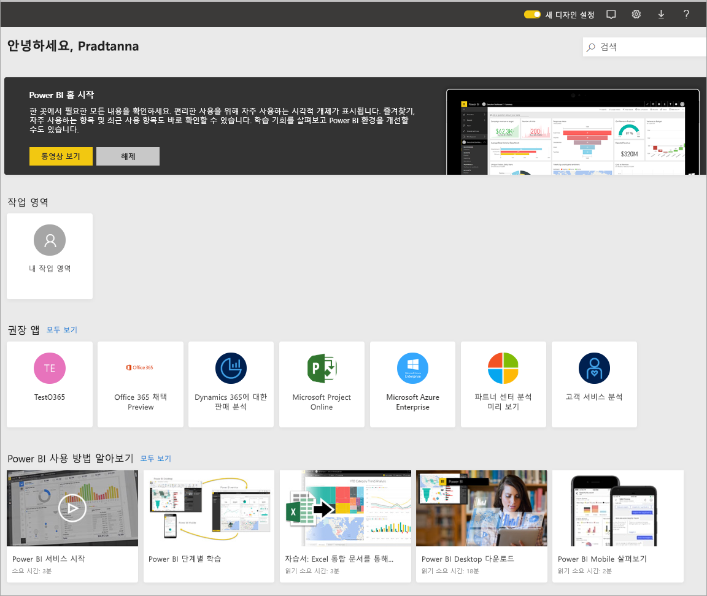
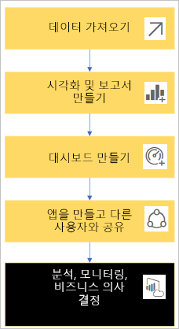
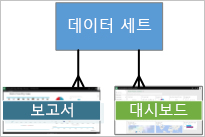
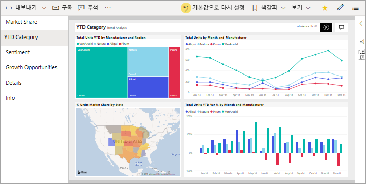
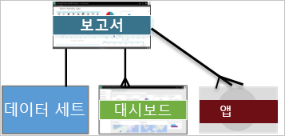
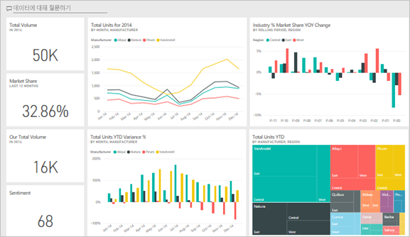
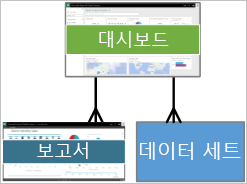
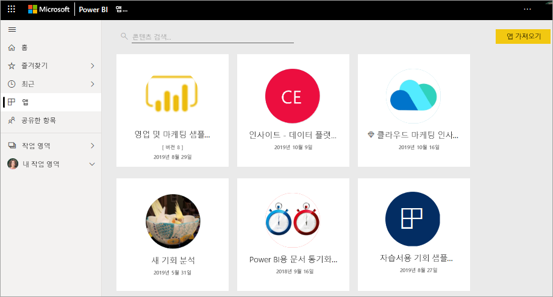
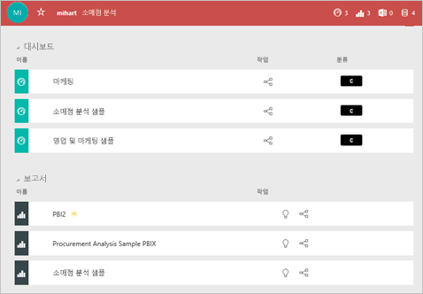

# Power BI 서비스 소비자를 위한 기본 개념

[!INCLUDE [power-bi-service-new-look-include](../includes/power-bi-service-new-look-include.md)]

이 문서에서는 독자가 [Power BI 개요](../fundamentals/power-bi-overview.md)를 이미 읽었고 자신을 [Power BI ***소비자***](end-user-consumer.md)로 인식하고 있다고 가정합니다. 소비자는 동료로부터 대시보드 및 보고서와 같은 Power BI 콘텐츠를 받습니다. 소비자는 웹 사이트 기반 버전의 Power BI인 Power BI 서비스를 사용합니다.

분명히 “Power BI Desktop” 또는 “Desktop”이라는 용어를 들어 보았을 것입니다. 이는 대시보드와 보고서를 빌드하고 소비자와 공유하는 ‘디자이너’가 사용하는 독립 실행형 도구입니다.  다른 Power BI 도구가 있다는 것을 알고 있어야 합니다. 소비자는 Power BI 서비스만 사용하게 됩니다. 이 문서는 Power BI 서비스에만 적용됩니다.

## 용어 및 개념

이 문서는 Power BI의 시각적 둘러보기나 실습용 자습서가 아닙니다. 오히려 Power BI 용어 및 개념을 익힐 수 있는 개요 문서입니다. 용어와 전반적인 개념을 알려줄 것입니다. Power BI 서비스 및 해당 탐색을 둘러보려면 [빠른 시작 - Power BI 서비스 살펴보기](end-user-experience.md)를 방문하세요.

## Power BI 서비스를 처음으로 열기

대부분의 Power BI 소비자는 1) 자신의 회사에서 라이선스를 구입했고, 2) 관리자가 라이선스를 직원에게 할당했기 때문에 Power BI 서비스를 사용합니다.

시작하려면 브라우저를 열고 **app.powerbi.com**을 입력합니다. Power BI 서비스를 처음 열면 다음과 같은 내용이 표시됩니다.

Power BI를 사용할 때는 웹 사이트를 열 때마다 표시되는 내용을 개인 설정할 수 있습니다. 예를 들어, Power BI가 **홈**페이지를 여는 것을 선호하는 사람도 있고, 즐겨찾기 대시보드에 먼저 표시되는 것을 선호하는 사람도 있습니다. 이처럼 환경을 개인 설정하는 자세한 방법은 다음 문서에서 확인할 수 있습니다.

- [Power BI 홈 및 전역 검색 소개](https://powerbi.microsoft.com/blog/introducing-power-bi-home-and-global-search)

- [Power BI 서비스의 주요 대시보드](end-user-featured.md)

하지만 좀 더 자세히 살펴보기 전에 Power BI 서비스를 구성하는 요소에 대한 이야기로 돌아가 보겠습니다.

_______________________________________________________

## Power BI 콘텐츠

### 구성 요소 소개

Power BI 소비자를 위한 5가지 구성 요소는 ***시각화***, ***대시보드***, ***보고서***, ***앱***, ***데이터 세트***입니다. 이를 *Power BI* ***콘텐츠***라고 부르기도 합니다.  ‘콘텐츠’는 작업 영역 에 있습**** 니다. 일반적인 워크플로에서는 이와 같은 구성 요소가 모두 사용됩니다. Power BI ‘디자이너’(아래 다이어그램에서 노란색으로 표시)는 ‘데이터 세트’에서 데이터를 수집하고, 분석을 위해 Power BI로 가져오고, 유용한 사실과 인사이트를 보여 주는 다양한 ‘시각화’로 구성된 ‘보고서’를 만들고, 보고서의 시각화를 대시보드에 고정하고, 보고서 및 대시보드를 ‘소비자’와 공유합니다(아래 다이어그램에서 검은색으로 표시).      ‘디자이너’는 보고서와 대시보드를 ‘앱’ 또는 다른 유형의 공유 콘텐츠 형태로 공유합니다.  

가장 기본적으로

-  ***시각화***(또는 ‘시각적 개체’)는 Power BI ‘디자이너’에 의해 빌드된 차트 유형입니다.   시각적 개체는 ‘보고서’ 및 ‘데이터 세트’의 데이터를 표시합니다.   일반적으로 *설계자*는 Power BI Desktop의 시각적 개체를 빌드합니다.

    자세한 내용은 [보고서, 대시보드 및 앱에서 시각적 개체 조작](end-user-visualizations.md)을 참조하세요.

-  ‘데이터 세트’는 데이터의 컨테이너입니다.  예를 들어 세계 보건 기구의 Excel 파일이 여기에 해당할 수 있습니다. 회사 소유의 고객 데이터베이스 또는 Salesforce 파일일 수도 있습니다.  

-  ‘대시보드’는 대화형 시각적 개체, 텍스트 및 그래픽이 표시되는 단일 화면입니다.  대시보드는 가장 중요한 메트릭을 하나의 화면에 담아 스토리를 알려주거나 궁금증을 해결해 줍니다. 대시보드 콘텐츠는 하나 이상의 보고서와 하나 이상의 데이터 세트에서 가져옵니다.

    자세한 내용은 [Power BI 서비스 소비자에 대한 대시보드](end-user-dashboards.md)를 참조하세요.

-  ‘보고서’는 대화형 시각적 개체, 텍스트 및 그래픽으로 구성된 여러 페이지의 모음을 말합니다.  Power BI는 단일 데이터 세트를 기반으로 보고서를 만듭니다. 종종 이 서비스는 주 관심 분야를 다루거나 단일 질문에 답하도록 보고서 페이지를 구성합니다.

    자세한 내용은 [Power BI의 보고서](end-user-reports.md)를 참조하세요.

-  ‘앱’은 ‘디자이너’가 관련 대시보드와 보고서를 번들로 묶고 공유하는 방법입니다.   *소비자*는 일부 앱을 자동으로 받지만 동료나 커뮤니티에서 만든 다른 앱을 검색하러 갈 수도 있습니다. 예를 들어 이미 사용 중일 수 있는 Google Analytics 및 Microsoft Dynamics CRM과 같은 외부 서비스는 Power BI 앱을 제공합니다.

자세히 말해서, 신규 사용자가 Power BI에 처음 로그인한 경우 아직 대시보드, 앱 또는 보고서가 표시되지 않습니다.

_______________________________________________________

## 데이터 세트

*데이터 세트*는 *설계자*가 가져오거나 연결한 다음, 보고서와 대시보드를 빌드하는 데 사용하는 데이터 컬렉션입니다. 소비자는 데이터 세트와 직접 상호 작용하지 않지만 더 큰 그림에 어떻게 부합하는지 알아보면 도움이 될 것입니다.  

각 데이터 세트는 단일 데이터 원본을 나타냅니다. 예를 들어 원본은 OneDrive, 온-프레미스 SQL Server Analysis Services 테이블 형식 데이터 세트 또는 Salesforce 데이터 세트에 해당할 수 있습니다. Power BI는 다양한 데이터 원본을 지원합니다.

디자이너가 소비자와 앱을 공유하면 소비자는 디자이너가 앱에 포함한 데이터 세트를 확인할 수 있습니다.

하나의 데이터 세트...

- 보고서 디자이너가 사용하여 대시보드와 보고서를 만드는 데 반복해서 사용할 수 있습니다.

- 다양한 보고서를 만드는 데 사용할 수 있습니다.

- 단일 데이터 세트의 시각적 개체가 다양한 대시보드에 표시될 수 있습니다.

  

다음 단원(시각화)에서 계속.

_______________________________________________________

## 시각화

시각화(시각적 개체라고도 함)는 Power BI가 데이터에서 검색한 인사이트를 표시합니다. 인간의 뇌는 숫자로 된 스프레드시트보다 그림을 더 빠르게 이해하므로 시각화를 사용하면 인사이트를 더 쉽게 파악할 수 있습니다.

Power BI에서 볼 수 있는 시각화로는 폭포, 리본, 트리맵, 원형, 깔때기, 카드, 분산형 및 계기 등이 있습니다.

   

[Power BI에 포함된 시각화의 전체 목록](../power-bi-visualization-types-for-reports-and-q-and-a.md)을 참조하세요.

‘사용자 지정 시각적 개체’라는 시각화는 커뮤니티에서도 사용할 수 있습니다.  인식할 수 없는 시각적 개체가 포함된 보고서를 받은 경우 사용자 지정 시각적 개체일 가능성이 높습니다. 사용자 지정 시각적 개체를 해석하는 데 도움이 필요하면 보고서 또는 대시보드 ‘디자이너’의 이름을 조회하고 해당 디자이너에게 문의하세요. 

한 보고서의 단일 시각화...

- 동일한 보고서에 여러 번 표시될 수 있습니다.

- 다양한 대시보드에 표시될 수 있습니다.

_______________________________________________________

## 보고서

Power BI 보고서는 시각화, 그래픽 및 텍스트로 이루어진 하나 이상의 페이지입니다. 보고서의 모든 시각화는 단일 데이터 세트에서 제공합니다. *설계자*는 [*읽기 보기*에서 보고서와 상호 작용하는](end-user-reading-view.md) *소비자*와 보고서를 공유합니다.

단일 보고서...

- 여러 대시보드에 연결할 수 있습니다(보고서에 고정된 타일이 여러 대시보드에 나타날 수 있습니다).

- 데이터 세트 하나의 데이터만 사용하여 만들 수 있습니다.  

- 여러 앱의 일부일 수 있습니다.

  

_______________________________________________________

## 대시보드

대시보드는 기본 데이터 세트의 일부 하위 세트에 대한 사용자 지정 보기를 나타냅니다. *설계자*는 대시보드를 빌드하고 개인적으로 혹은 앱에 포함하는 방법으로 *소비자*와 공유합니다. 대시보드는 ‘타일’, 그래픽 및 텍스트가 포함된 단일 캔버스입니다. 

  

타일은 *설계자*가 보고서에서 대시보드 등으로 *고정*하는 시각적 개체의 렌더링입니다. 고정된 각 타일에는 디자이너가 데이터 세트에서 만들고 대시보드에 고정한 [시각화](end-user-visualizations.md)가 표시됩니다. 또한 타일에는 전체 보고서 페이지가 포함될 수 있으며, 라이브 스트리밍 데이터 또는 동영상도 포함될 수 있습니다. ‘디자이너’가 대시보드에 타일을 추가할 수 있는 여러 가지 방법이 있습니다.  이 개요 문서에서 다루기엔 너무 많습니다. 자세히 알아보려면 [Power BI의 대시보드 타일](end-user-tiles.md)을 참조하세요.

소비자는 대시보드를 편집할 수 없습니다. 하지만 주석을 추가하고, 관련 데이터를 보고, 즐겨찾기로 설정하고, 구독하는 등의 작업은 가능합니다.

대시보드는 어떤 용도로 사용됩니까?  몇 가지만 말하자면 다음과 같습니다.

- 의사 결정을 내리는 데 필요한 모든 정보를 한눈에 보기 위해서

- 비즈니스에 가장 중요한 정보를 모니터링하기 위해서

- 모든 동료가 동일한 페이지에서 동일한 정보를 보고 사용하도록 하기 위해서

- 비즈니스, 제품, 사업부, 마케팅 캠페인 등의 상태를 모니터링하기 위해서

- 더 큰 대시보드의 개인 설정된 보기를 만들어 자신에게 중요한 모든 메트릭을 표시하기 위해서

**하나의** 대시보드는...

- 여러 데이터 세트의 시각화를 표시할 수 있습니다.

- 여러 보고서의 시각화를 표시할 수 있습니다.

- 다른 도구(예: Excel)에서 고정된 시각화를 표시할 수 있습니다.

  

_______________________________________________________

## 앱

이러한 대시보드 및 보고서 컬렉션은 관련 콘텐츠를 단일 패키지로 정리합니다. Power BI *설계자*는 이를 빌드하고 개인, 그룹, 전체 조직 또는 대중과 공유합니다. 소비자는 자신이 동료와 동일한 데이터(단일 버전의 진실한 정보)로 작업하고 있음을 확신할 수 있습니다.

앱은 [Power BI 서비스](https://powerbi.com) 및 모바일 디바이스에서 쉽게 찾아 설치할 수 있습니다. 앱을 설치한 후에는 다양한 여러 대시보드의 이름을 기억할 필요가 없습니다. 여러 대시보드가 모두 앱, 브라우저 또는 모바일 디바이스에 함께 있습니다.

이 앱에는 단일 앱을 구성하는 관련 대시보드 3개와 관련 보고서 3개가 있습니다.

앱을 사용하면 앱 작성자가 업데이트를 릴리스할 때마다 자동으로 변경 사항을 확인할 수 있습니다. 작성자는 Power BI가 데이터를 새로 고치는 빈도에 대한 일정도 제어합니다. 데이터를 최신 상태로 유지하는 것에 대해서는 염려하지 않아도 됩니다.

몇 가지 방법으로 앱을 가져올 수 있습니다.

- 앱 디자이너는 Power BI 계정에 자동으로 앱을 설치할 수 있습니다.

- 앱 디자이너는 앱의 직접 링크를 소비자에게 보낼 수 있습니다.

- 사용할 수 있는 모든 앱을 볼 수 있는 [Microsoft AppSource](https://appsource.microsoft.com/marketplace/apps?product=power-bi)에서 앱을 검색할 수 있습니다.

모바일 디바이스의 Power BI에서는 AppSource가 아닌 직접 링크를 통해서만 설치할 수 있습니다. 앱 설계자가 앱을 자동 설치할 경우 앱 목록이 표시됩니다.

앱을 설치한 후 앱 목록에서 선택하고 어떤 대시보드나 보고서를 첫 번째로 열어서 살펴볼지 선택합니다.

이 문서가 소비자용 Power BI 서비스를 이루는 구성 요소를 이해하는 데 도움이 되었기를 바랍니다.

## 다음 단계

- [용어집](end-user-glossary.md) 검토 및 책갈피에 추가

- [Power BI 서비스 둘러보기](end-user-experience.md)

- [소비자를 위해 특별히 작성된 Power BI 개요](end-user-consumer.md) 읽기

- Will이 Power BI 서비스의 기본 개념을 검토하고 간략한 둘러보기를 제공하는 동영상을 보세요.

    <iframe width="560" height="315" src="https://www.youtube.com/embed/B2vd4MQrz4M" frameborder="0" allowfullscreen></iframe>
