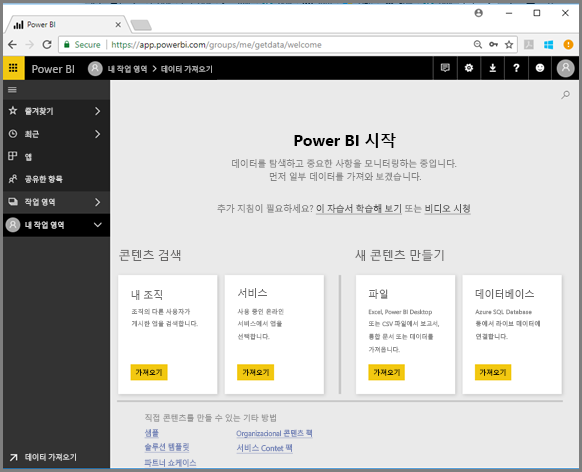

# 빠른 시작 - Power BI 서비스 살펴보기

이제 Power BI의 기본 사항을 알아보았으므로 **Power BI 서비스**를 살펴보겠습니다. 앞서 언급했듯이 특정 팀원이 **Power BI Desktop**에서 모든 시간을 보내면서 데이터를 결합하고 다른 사용자를 위한 보고서를 만들 수 있습니다. 그러나 다른 한편으로는 Power BI 서비스에서 모든 시간을 보내면서 다른 사람이 만든 콘텐츠를 보고 상호 작용(**소비** 경험)할 수도 있습니다. 이 빠른 시작에서는 샘플 데이터를 가져오고, 해당 데이터를 사용하여 Power BI 서비스에 대해 알아봅니다. 
 
## 필수 조건

- 아직 Power BI에 등록하지 않은 경우 시작하기 전에 [평가판에 등록합니다](https://app.powerbi.com/signupredirect?pbi_source=web).

- [Power BI 서비스 기본 개념](end-user-basic-concepts.md)을 참조합니다.

## Power BI 서비스 열기 및 일부 데이터 가져오기
Power BI 서비스 둘러보기에서 사용할 샘플 데이터를 가져오겠습니다. 제공되는 모든 유형의 샘플 데이터를 살펴볼 수 있으며, 이번에는 소매점에 대한 데이터를 사용하겠습니다.    
1. app.powerbi.com을 열고 **샘플** 링크를 선택합니다. 

    

2. **소매점 분석 샘플 > 연결**을 선택합니다.

    

    Power BI 서비스에서 샘플을 가져오고 대시보드를 표시합니다. 대시보드는 Power BI Desktop과 Power BI 서비스를 구분할 수 있는 항목입니다. 또한 샘플에는 보고서와 데이터 세트가 포함되어 있으며 나중에 살펴보겠습니다.

    

Amanda가 여러분에게 Power BI 서비스 탐색 환경을 안내하는 것을 시청해 보세요.  그런 다음 비디오 아래에 있는 단계별 지침을 따라서 직접 탐색해 볼 수 있습니다.

<iframe width="560" height="315" src="https://www.youtube.com/embed/G26dr2PsEpk" frameborder="0" allowfullscreen></iframe>

## 콘텐츠(대시보드, 보고서, 통합 문서, 데이터 세트, 작업 영역, 앱) 보기
먼저 기본 콘텐츠(대시보드, 보고서, 데이터 세트, 통합 문서)가 어떻게 구성되는지 살펴 보겠습니다. 콘텐츠는 작업 영역 컨텍스트 내에서 표시됩니다. 지금은 하나의 작업 영역만 있으며 **내 작업 영역**이라고 합니다. 일반적으로 소비자는 다른 모든 작업 영역을 사용하지 않거나 필요로 하지 않습니다. [내 작업 영역]에는 소유한 모든 콘텐츠가 저장됩니다. 고유한 콘텐츠에 대한 개인 샌드박스 또는 작업 영역으로 생각하면 됩니다. 내 작업 영역은 방금 다운로드한 소매점 분석 샘플이 저장되는 위치입니다. 

내 작업 영역에서는 콘텐츠가 네 개의 탭(대시보드, 보고서, 통합 문서, 데이터 세트)으로 구성됩니다.

왼쪽 탐색 창(왼쪽 탐색 창)에서 작업 영역을 선택하면 Power BI 캔버스의 오른쪽에 연결된 콘텐츠(대시보드, 보고서, 통합 문서, 데이터 세트)의 탭으로 채워집니다.

새 사용자인 경우 **내 작업 영역**과 같은 하나의 작업 영역만 표시됩니다.

이러한 탭(‘콘텐츠 보기’라고 함)에는 콘텐츠 정보와 해당 콘텐츠로 수행할 수 있는 작업이 표시됩니다.   예를 들어 [대시보드] 탭에서 대시보드 열기, 검색, 정렬 작업 등을 수행할 수 있습니다.

대시보드 이름을 선택하여 대시보드를 엽니다.

## 대시보드 및 보고서 즐겨찾기
**즐겨찾기**를 통해 가장 중요한 콘텐츠에 빠르게 액세스할 수 있습니다.  

1. 대시보드가 열려 있는 상태에서 오른쪽 위 모서리의 **즐겨찾기**를 선택합니다.
   
   
   
   **즐겨찾기**가 **즐겨찾기에서 제거**로 변경되고 별표 아이콘이 노란색으로 바뀝니다.
   
   

2. 즐겨찾기에 추가된 모든 콘텐츠의 목록을 표시하려면 왼쪽 탐색 창에서 **즐겨찾기** 오른쪽에 있는 화살표를 선택합니다. 왼쪽 탐색 창은 Power BI 서비스의 영구 기능이기 때문에 Power BI 서비스의 어디에서든 목록에 액세스할 수 있습니다.
   
    
   
    지금까지 단 하나의 즐겨찾기만 있습니다. 즐겨찾기는 대시보드, 보고서 또는 앱일 수 있습니다.  

1. 대시보드 또는 보고서를 즐겨찾기로 표시하는 또 다른 방법은 **대시보드** 또는 **보고서** 콘텐츠 보기 탭에서 선택하는 것입니다.  **보고서** 탭을 열고, 보고서 이름 왼쪽에 있는 별표 아이콘을 선택합니다.
   
   

3. 왼쪽 탐색 창에서 **즐겨찾기**를 선택하거나 별표 아이콘()을 선택하여 **즐겨찾기** *창*을 엽니다.
   
   
   
   이제 각각 대시보드 및 보고서인 두 개의 즐겨찾기가 있습니다. 여기서는 콘텐츠를 열거나, 검색하거나, 즐겨찾기에서 제거하거나, 동료와 함께 공유할 수 있습니다.

4. 보고서 이름을 선택하여 보고서 편집기에서 엽니다.

    

자세한 내용은 [즐겨찾기](end-user-favorite.md)를 참조하세요.

## 가장 최근의 콘텐츠 찾기

1. 즐겨찾기와 마찬가지로, 왼쪽 탐색 창에서 **최근** 옆에 있는 화살표를 선택하여 Power BI 서비스의 어디에서든 가장 최근에 액세스한 컨텐츠를 빠르게 확인할 수 있습니다.

   

    플라이아웃에서 콘텐츠를 선택하여 엽니다.

2. 최근 콘텐츠를 열지 않고 정보를 보거나 공유, Insights 보기 또는 Excel로 내보내기와 같은 다른 작업을 수행하려는 경우가 있습니다. 이러한 경우 왼쪽 탐색 창에서 **최근** 또는 해당 아이콘을 선택하여 **최근** 창을 엽니다. 둘 이상의 작업 영역이 있는 경우 이 목록에는 모든 작업 영역의 콘텐츠가 포함됩니다.

   

자세한 내용은 [Power BI의 최근 항목](end-user-recent.md)을 참조하세요.

### 콘텐츠 검색 및 정렬
콘텐츠 보기를 사용하면 콘텐츠를 더 쉽게 검색, 필터링 및 정렬할 수 있습니다. 대시보드, 보고서 또는 통합 문서를 검색하려면 검색 영역에서 입력합니다. Power BI에서는 검색 문자열이 이름의 일부로 포함된 콘텐츠만 필터링합니다.

하나의 샘플만 있으므로 검색 및 정렬이 필요하지 않습니다.  그러나 대시보드, 보고서, 통합 문서 및 데이터 세트의 긴 목록이 있으면 검색과 정렬이 매우 유용합니다.

또한, 이름 또는 소유자별로 콘텐츠를 정렬할 수도 있습니다. **이름** 오른쪽의 위쪽 화살표를 보세요. 현재 83개 항목을 이름의 알파벳을 기준으로 오름차순으로 정렬하는 중입니다. 내림차순으로 정렬 순서를 변경하려면 **이름을** 선택하세요. 위쪽 화살표는 아래쪽 화살표로 변경됩니다.

모든 열을 정렬할 수 있는 것은 아닙니다. 열 제목을 가리켜 정렬 가능한 항목을 확인하세요.

자세한 내용은 [Power BI 탐색: 검색 및 정렬](end-user-search-sort.md)을 참조하세요.

## 리소스 정리
이 빠른 시작을 완료한 후 원하는 경우 소매점 분석 샘플 대시보드, 보고서 및 데이터 세트를 삭제할 수 있습니다.

1. Power BI 서비스(app.powerbi.com)를 열고 로그인합니다.    
2. 왼쪽 탐색 창에서 **작업 영역 > 내 작업 영역**을 선택합니다.  
    즐겨찾기를 나타내는 노란색 별모양이 보이나요?    
3. **대시보드** 탭에서 소매점 분석 대시보드 옆에 있는 휴지통 **삭제** 아이콘을 선택합니다.    

    

4. **보고서** 탭을 선택하고 소매점 분석 보고서에 대해 동일한 작업을 수행합니다.
1. **데이터 세트** 탭을 선택하고 소매점 분석 데이터 세트에 대해 동일한 작업을 수행합니다.

## 다음 단계

> [!div class="nextstepaction"]
> [Power BI 서비스의 읽기용 보기](end-user-reading-view.md)
