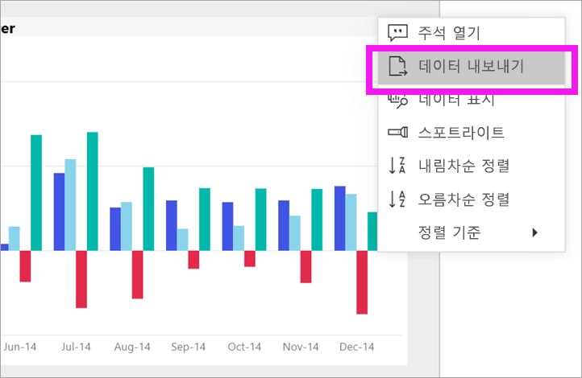

# 시각적 데이터 내보내기
시각적 개체를 만드는 데 사용 되는 데이터를 보려면 싶다면 [Power BI에서 해당 데이터를 표시할 수 있습니다](end-user-show-data.md) 또는 Excel로 데이터 내보내기. 데이터를 내보낼 옵션을 특정 형식 또는 특정 라이선스 필요 및 콘텐츠 사용 권한을 편집 합니다. 를 내보낼 수 없는 경우 Power BI 관리자에 게 문의 하십시오. 

## Power BI 대시보드에서 시각적 개체에서

1. Power BI 대시보드를 시작 합니다. 여기에서 대시보드를 사용 하는 것은 ***마케팅 및 판매 샘플*** 앱. 할 수 있습니다 [AppSource.com에서이 앱을 다운로드할](https://appsource.microsoft.com/en-us/product/power-bi/microsoft-retail-analysis-sample.salesandmarketingsample-preview?flightCodes=e2b06c7a-a438-4d99-9eb6-4324ce87f282)합니다.

    

2. 줄임표 (...)를 표시 하려면 시각적 개체 위에 놓고 동작 메뉴를 표시 하려면 클릭 합니다.

    

3. 선택 **Excel로 내보내기**합니다.

4. 이후에 사용 중인 브라우저에 따라 달라 집니다. 파일 또는 월에 저장 하 라는 메시지가 있습니다 브라우저의 맨 아래에서 내보낸된 파일에 대 한 링크를 참조 하세요. 

    

5. Excel에서 파일을 엽니다.  

    

## 보고서에서 시각적 개체에서
.Csv 또는.xlsx (Excel)으로 보고서에서 시각적 개체에서 데이터를 내보낼 수 형식입니다. 

1. 대시보드에서, 기본 보고서를 열기 위해 타일을 선택합니다.  이 예제에서는 위와 동일한 시각적 개체로 *총 단위 YTD Var %* 를 선택하겠습니다. 

    

    이 타일을 만든 이후에 *영업 및 마케팅 샘플* 보고서 열리는 보고서입니다. 및 선택한 타일 시각적 개체를 포함 하는 페이지에 열립니다. 

2. 보고서에서 타일을 선택 합니다. 알림 합니다 **필터** 오른쪽에 있는 창입니다. 이 시각적 개체에 필터를 적용 합니다. 필터에 대 한 자세한 내용은 참조 하세요 [보고서에 필터를 사용 하 여](end-user-report-filter.md)입니다.

    

3. 시각화의 오른쪽 위 모서리에 있는 줄임표를 선택합니다. 선택할 **데이터 내보내기**합니다.

    

4. 요약 된 데이터 나 원본 데이터를 내보내는 옵션이 표시 됩니다. 사용 중인 경우는 *영업 및 마케팅 샘플* 앱 **기본 데이터** 수 없게 됩니다. 하지만 두 옵션을 사용할 수 있는 보고서를 발생할 수 있습니다. 차이 설명은 다음과 같습니다.

    **요약 된 데이터**: 시각적 개체에 표시 되는 내용에 대 한 데이터를 내보내려면이 옵션을 선택 합니다.  이 유형의 내보내기는 시각적 개체를 만드는 데 사용한 데이터만 보여 줍니다. 시각적 개체에 적용 된 필터가 있는 경우에 내보내는 데이터를도 필터링 됩니다. 예를 들어이 시각적 개체 내보내기만 2014에 대 한 데이터 중부 지역 및 제조업체 중 4 개에 대 한 데이터만 포함 됩니다. VanArsdel, Natura, Aliqui, 및 Prirum 합니다.
  

    **내부 데이터**: 시각적 개체에 표시 되는 내용에 대 한 데이터를 내보내려면이 옵션을 선택 **plus** 기본 데이터 집합에서 데이터를 추가 합니다.  이 데이터 집합에 포함 되어 있지만 시각적 개체에서 미사용 데이터를 포함할 수 있습니다. 

    

5. 이후에 사용 중인 브라우저에 따라 달라 집니다. 파일 또는 월에 저장 하 라는 메시지가 있습니다 브라우저의 맨 아래에서 내보낸된 파일에 대 한 링크를 참조 하세요. 

    

7. Excel에서 파일을 엽니다. 대시보드에서 동일한 시각적 개체에서 내보낸 데이터를 내보낸 데이터의 양을 비교 합니다. 이 내보내기에 다른 점은 **기본 데이터**입니다. 

    

