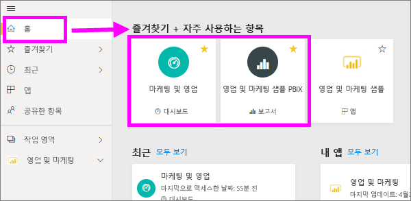
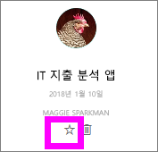

# 즐겨 찾는 대시보드, 보고서 및 Power BI 서비스의 앱
하는 경우 콘텐츠를 *즐겨 찾는*에서 신속 하 게 액세스할 수 합니다 **즐겨찾기** 콘텐츠 목록에서 **Power BI 홈**  >   **즐겨찾기 frequents 및**합니다.  즐겨찾기는 일반적으로 가장 많이 방문 하 고 노란색 별표를 사용 하 여 식별 됩니다.

   

   

단일 대시보드를 선택할 수도 있습니다는 [대시보드를 추천](end-user-featured.md) Power BI 서비스에서.

## 대시보드 또는 보고서를 *즐겨찾기*로 추가

1. 자주 사용하는 대시보드 또는 보고서를 엽니다. 공유한 콘텐츠도 *즐겨찾기*가 될 수 있습니다.

2. Power BI 서비스의 위쪽 리본에서 선택 **즐겨 찾는** 나 별  아이콘입니다.
   
   
   
   또한 자주 사용 하면 대시보드 또는 보고서를 어디에서 나 공유한 홈, 최근 항목, 앱, 공유 등 별 모양 아이콘을 표시 합니다. 
   
   

## 앱을 *즐겨찾기*로 추가

1. 탐색 창에서 선택 **앱**합니다.

   

2. 앱을 마우스로 가리키면 세부 정보가 표시됩니다.  별모양 선택   즐겨찾기로 설정할 아이콘
   
   

## *즐겨찾기* 작업
1. 즐겨찾기에 액세스 하려면 오른쪽의 플라이 아웃 화살표를 선택 **즐겨찾기**합니다.  여기에서 즐겨찾기를 선택하여 열 수 있습니다. 즐겨찾기 5개만 나열됩니다(사전순). 5 개 있는 경우 선택할 **모두 보기** 콘텐츠 즐겨찾기를 엽니다 (아래 #2 참조)을 나열 합니다. 
   
   
2. 보려는 **모든** 탐색 창에서 즐겨찾기 선택 추가한 콘텐츠 **즐겨찾기** 하거나 즐겨찾기  아이콘입니다.  
   
    
   
   여기에서 열기, 소유자 식별, 동료와 공유 등의 작업을 수행할 수 있습니다.

## 즐겨찾기에서 제거된 콘텐츠
이제 보고서를 예전만큼 자주 사용하지 않나요?  즐겨찾기에서 제거할 수 있습니다. 즐겨찾기에서 제거하면 콘텐츠는 즐겨찾기 목록에서 제거되지만 Power BI에서는 제거되지 않습니다.

1. 왼쪽 탐색 창에서 **즐겨찾기**를 선택하여 **즐겨찾기** 화면을 엽니다.
   
   
2. 즐겨찾기에서 제거할 콘텐츠 옆의 노란색 별표를 선택합니다.

> [!NOTE]
> 대시보드, 보고서 또는 앱 자체를 즐겨찾기에서 제거할 수도 있습니다. 노란색 아이콘을 열고 선택 취소만 하면 됩니다.   
> 
> 
## 제한 사항 및 고려 사항
현재, 앱을 즐겨찾기에 추가 하 고이 자동으로 즐겨찾기 모든 보고서 및 해당 앱에 대 한 대시보드를 수 있습니다. 개별 앱 즐겨 찾는 보고서 또는 대시보드는 것이 불가능합니다. 

## 다음 단계
[Power BI - 기본 개념](end-user-basic-concepts.md)

궁금한 점이 더 있나요? [Power BI 커뮤니티를 이용하세요.](http://community.powerbi.com/)

