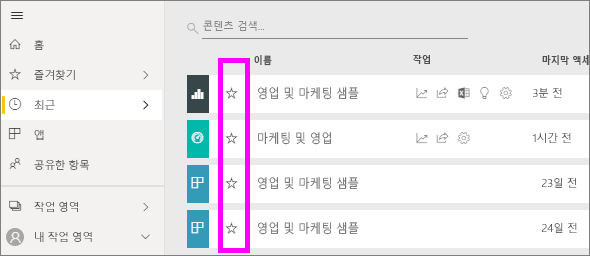
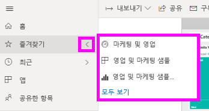

# Power BI 서비스의 즐겨찾는 대시보드, 보고서 및 앱
콘텐츠를 *즐겨찾기*로 만드는 경우, **즐겨찾기** 콘텐츠 목록과 **Power BI 홈** > **즐겨찾기 + 자주 사용하는 항목**에서 신속하게 액세스할 수 있습니다. 즐겨찾기는 일반적으로 가장 많이 방문하고 노란색 별표를 사용하여 식별됩니다.

   

   

Power BI 서비스에서 [주요 대시보드](end-user-featured.md)로 단일 대시보드를 선택할 수도 있습니다.

## 대시보드 또는 보고서를 *즐겨찾기*로 추가

1. 자주 사용하는 대시보드 또는 보고서를 엽니다. 공유받은 콘텐츠도 *즐겨찾기*가 될 수 있습니다.

2. Power BI 서비스의 위쪽 리본에서 **즐겨찾기** 나 별  아이콘을 선택합니다.
   
   
   
   또한 홈, 최근 항목, 앱, 공유 등 별 모양 아이콘이 보이는 곳 어디에서나 대시보드 또는 보고서를 즐겨찾기 할 수 있습니다. 
   
   

## 앱을 *즐겨찾기*로 추가

1. 탐색 창에서 **앱**을 선택합니다.

   

2. 앱을 마우스로 가리키면 세부 정보가 표시됩니다. 즐겨찾기로 설정하기 위해 별모양  아이콘을 선택합니다.
   
   

## *즐겨찾기* 작업
1. 즐겨찾기에 액세스 하려면 **즐겨찾기**의 오른쪽의 플라이 아웃 화살표를 선택합니다. 여기에서 즐겨찾기를 선택하여 열 수 있습니다. 즐겨찾기 5개만 나열됩니다(사전순). 5 개 이상 있는 경우, **모두 보기**를 선택하여 콘텐츠 즐겨찾기 목록을 엽니다(아래 #2 참조). 
   
   
2. 즐겨찾기에 추가한 **모든** 콘텐츠를 보려면, 탐색 창에서 **즐겨찾기** 또는 즐겨찾기  아이콘을 선택합니다.  
   
    
   
   여기에서 열기, 소유자 식별, 동료와 공유 등의 작업을 수행할 수 있습니다.

## 콘텐츠를 즐겨찾기에서 제거
이제 보고서를 예전만큼 자주 사용하지 않나요? 즐겨찾기에서 제거할 수 있습니다. 즐겨찾기에서 제거하면 콘텐츠는 즐겨찾기 목록에서 제거되지만 Power BI에서는 제거되지 않습니다.

1. 왼쪽 탐색 창에서 **즐겨찾기**를 선택하여 **즐겨찾기** 화면을 엽니다.
   
   
2. 즐겨찾기에서 제거할 콘텐츠 옆의 노란색 별표를 선택합니다.

> [!NOTE]
> 대시보드, 보고서 또는 앱 자체를 즐겨찾기에서 제거할 수도 있습니다. 노란색 아이콘을 열고 선택 취소만 하면 됩니다.   
> 
> 
## 제한 사항 및 고려 사항
현재, 앱을 즐겨찾기에 추가하면 자동으로 앱의 모든 보고서 및 대시보드가 즐겨찾기 됩니다. 개별 앱 보고서 또는 대시보드를 즐겨찾기 하는 것은 불가능합니다. 

## 다음 단계
[Power BI - 기본 개념](end-user-basic-concepts.md)

궁금한 점이 더 있나요? [Power BI 커뮤니티를 이용하세요.](http://community.powerbi.com/)

