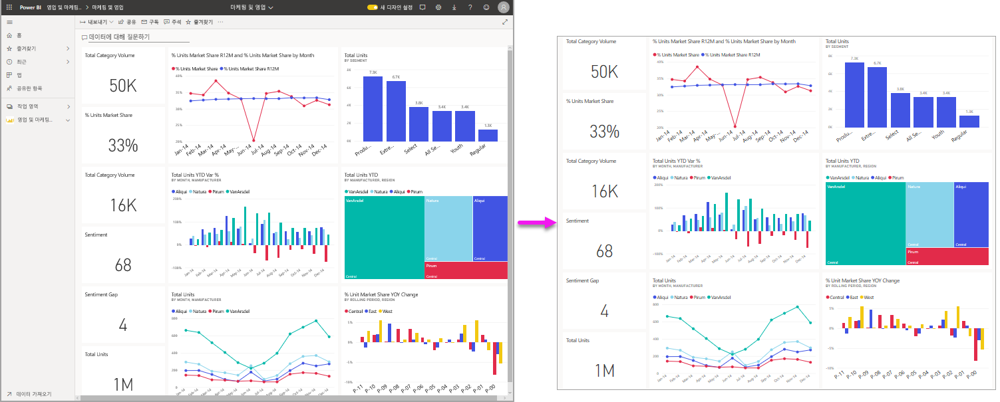
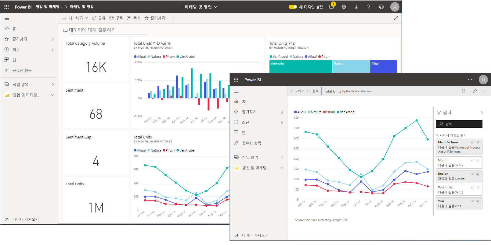
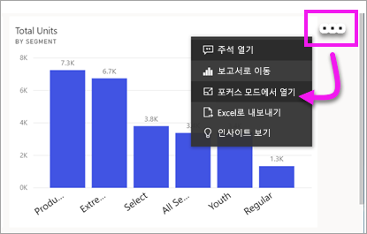
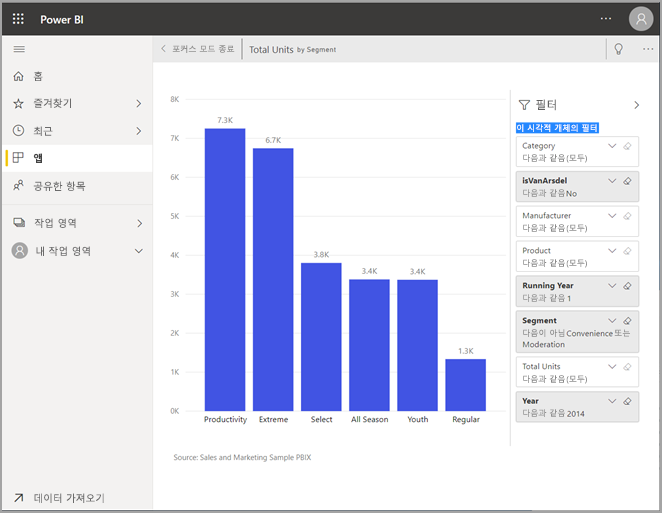
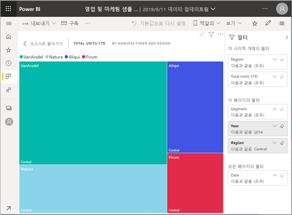

# 콘텐츠를 더 자세히 표시: 포커스 모드 및 전체 화면 모드

[!INCLUDE [power-bi-service-new-look-include](../includes/power-bi-service-new-look-include.md)]    

<iframe width="560" height="315" src="https://www.youtube.com/embed/dtdLul6otYE" frameborder="0" allowfullscreen></iframe>

포커스 모드 및 전체 화면 모드는 시각적 개체, 보고서 및 대시보드에서 더 자세한 정보를 보는 두 가지 방법입니다.  기본 차이점은 전체 화면은 콘텐츠 주위의 모든 창을 제거하지만 포커스 모드에서는 시각적 개체를 조작할 수 있다는 것입니다. 유사점과 차이점을 자세히 살펴보겠습니다.  

|콘텐츠    | 포커스 모드  |전체 화면 모드  |
|---------|---------|----------------------|
|대시보드     |   가능하지 않음     | 예 |
|보고서 페이지   | 가능하지 않음  | 예|
|시각적 개체 보고 | 예    | 예 |
|대시보드 타일 | 예    | 예 |
|Windows 10 모바일 | 가능하지 않음 | 예 |

## 전체 화면 모드란?

메뉴 및 탐색 모음 없이 Power BI 서비스 콘텐츠(대시보드, 보고서 페이지, 타일 및 시각적 개체)를 표시합니다.  항상 한눈에 콘텐츠 전체를 볼 수 있습니다. 이를 TV 모드라고도 합니다.   

전체 화면 모드를 열려면 대시보드, 보고서, 포커스 모드의 타일 또는 포커스 모드의 시각적 위에 있는 Power BI 서비스 메뉴 모음에서 **전체 화면** 아이콘 을 선택합니다.  선택한 콘텐츠가 전체 화면을 채웁니다.
Power BI Mobile을 사용하는 경우 [Windows 10 모바일 앱에서 전체 화면을 사용할 수 있습니다](./mobile/mobile-windows-10-app-presentation-mode.md). 

다음과 같은 경우에 전체 화면 모드를 사용합니다.

* 모임이나 회의에서 대시보드, 타일, 시각적 개체 또는 보고서 프레젠테이션
* 사무실의 큰 전용 화면이나 프로젝터에 표시
* 작은 화면으로 보기
* 잠금 모드에서 검토 - 기본 보고서 또는 대시보드를 열지 않고 화면을 터치하거나 타일을 마우스로 가리킬 수 있습니다.

## 포커스 모드란?

***포커스*** 모드를 사용하면 시각적 개체 또는 타일을 확장(팝아웃)하여 더 자세한 정보를 볼 수 있습니다.  약간 복잡한 대시보드 또는 보고서가 있고 하나의 시각적 개체만 확대하려고 할 수 있습니다.  이 경우 포커스 모드가 적합합니다.  

포커스 모드에 있는 동안 Power BI ‘소비자’는 이 시각적 개체가 만들어질 때 적용된 모든 필터를 조작할 수 있습니다.  Power BI 서비스에서는 대시보드 타일 또는 보고서 시각적 개체에서 포커스 모드를 사용할 수 있습니다.

## 전체 화면 모드에서 작업

전체 화면 모드에서 대시보드 또는 보고서 페이지를 열려면 전체 화면 아이콘을 선택합니다.  위쪽 탐색 모음에서. 전체 화면 모드에서 마우스 또는 커서를 이동하면 상황에 맞는 메뉴가 표시됩니다. 전체 화면은 매우 다양한 콘텐츠에 사용할 수 있으므로 상황에 맞는 메뉴의 옵션은 각각 약간 다르지만 별도의 설명 없이도 바로 이해할 수 있습니다.  마우스로 정의의 아이콘을 가리키면 됩니다.

대시보드에 대한 메뉴    
    

보고서 페이지에 대한 메뉴    
    

  *     
  **뒤로** 단추를 사용하여 브라우저에서 이전 페이지로 이동합니다. 이전 페이지가 Power BI 페이지였다면 그것 또한 전체 화면 모드로 표시됩니다.  전체 화면 모드는 종료할 때까지 지속됩니다.

  *     
  전체 화면 모드에서 대시보드 또는 보고서 페이지를 인쇄하려면 이 단추를 사용합니다.

  *     
    스크롤 바에 의지하지 않고 가능한 가장 큰 크기로 대시보드를 표시하려면 **화면에 맞춤** 버튼을 사용합니다.  

    

  *        
    때로 종종 스크롤 막대를 신경 쓰지 않지만 대시보드로 사용 가능한 공간의 전체 너비를 채우려면. **너비에 맞춤** 버튼을 선택합니다.    

    

  *        
    전체 화면 보기에서 이러한 화살표를 사용하여 보고서의 페이지 간을 이동합니다.    
  *      
  전체 화면 모드를 종료하려면 **전체 화면 종료** 아이콘을 선택합니다.

      

## 포커스 모드에서 작업

포커스 모드를 여는 방법에는 두 가지가 있습니다. 하나는 대시보드 타일을 사용하는 것이고, 다른 하나는 보고서 시각적 개체를 사용하는 것입니다.

### 대시보드의 포커스 모드

1. Power BI 서비스에서 대시보드를 엽니다.

2. 대시보드 타일 또는 보고서 시각적 개체를 마우스로 가리키고 **추가 옵션**(...)을 선택한 다음, **포커스 모드에서 열기**를 선택합니다.

    .

2. 타일이 열리고 전체 보고서 캔버스를 채웁니다. 시각적 개체를 조작하는 데 사용할 수 있는 **필터** 창이 아직 있는 것을 볼 수 있습니다. **필터** 창은 축소할 수 있습니다.

   

4. [필터를 수정](end-user-report-filter.md)하고 데이터에서 원하는 정보를 찾아 추가로 살펴봅니다.  

5. 포커스 모드에서 나와 시각적 개체의 왼쪽 위 모서리에서 **포커스 모드 종료**를 선택하여 대시보드로 돌아갑니다.

        

## 보고서 시각적 개체를 위한 포커스 모드

1. Power BI 서비스에서 보고서를 엽니다.  이 예제에서는 판매 및 마케팅 샘플을 사용하여 설명합니다.

1. 보고서가 열리면 **YTD 범주** 탭을 선택합니다.

2. 왼쪽 위 모서리의 트리맵을 마우스로 가리키고 **포커스 모드** 아이콘 을 선택합니다.  

   
2. 시각적 개체가 열리고 전체 캔버스를 채웁니다.

   

3. 선택적으로 **필터** 창을 사용하여 이 시각적 개체에 적용된 필터를 조작합니다. 데이터를 분석하여 새로운 인사이트와 질문에 대한 대답을 찾아봅니다. ‘소비자’는 새 필터를 추가하거나, 시각적 개체에 사용 중인 필드를 변경하거나, 새 시각적 개체를 만들 수 없습니다.  그러나 Power BI를 종료할 때 기존 필터에 적용하는 모든 변경 내용이 저장됩니다. Power BI가 수정 내용을 기억하지 않도록 하려면 **기본값으로 다시 설정**을 선택합니다.   

5. 포커스 모드에서 나와 시각적 개체의 왼쪽 위 모서리에서 **보고서로 돌아가기**를 선택하여 보고서로 돌아갑니다.

      

## 고려 사항 및 문제 해결

* 보고서의 시각적 개체에서 포커스 모드를 사용할 때는 모든 필터(시각적 수준, 페이지 수준, 드릴스루 및 보고서 수준)을 보고 조작할 수 있습니다.    
* 대시보드에서 포커스 모드를 시각적 개체와 함께 사용할 때에는 시각적 수준 필터만 보고 조작할 수 있습니다.

## 다음 단계

[보고서 설정 보기](end-user-report-view.md)