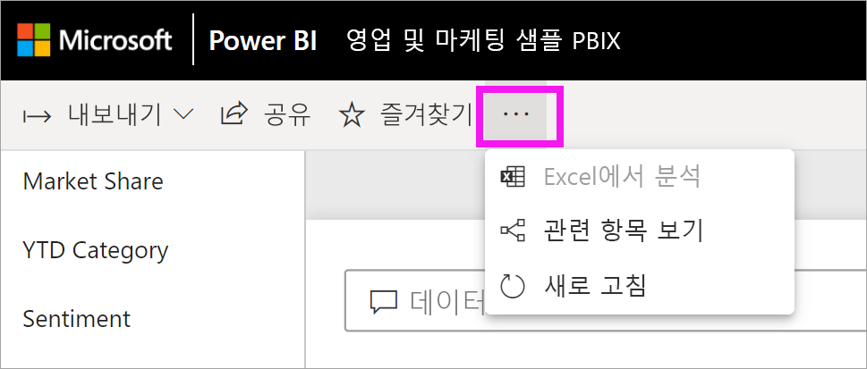
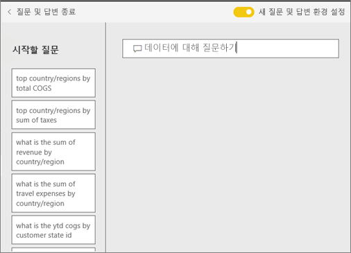

# Power BI **소비자**를 위한 질문 및 답변

[!INCLUDE [power-bi-service-new-look-include](../includes/power-bi-service-new-look-include.md)]

## 질문 및 답변이란 무엇인가요?
경우에 따라 자연어를 사용하여 질문을 하면 가장 빠르게 사용자 데이터로 답변을 받을 수 있습니다. 예를 들어 “지난 해 총 매출은 얼마인가요?”와 같이 질문합니다.

질문 및 답변을 사용하면 직관적인 자연어 기능을 사용하여 데이터를 탐색하고 차트 및 그래프 형식으로 답변을 받을 수 있습니다. 질문 및 답변은 검색 엔진과 다릅니다. 질문 및 답변은 Power BI에서 데이터에 대한 결과만 제공합니다.

## 질문 및 답변에서 사용하는 시각화는 무엇인가요?
질문 및 답변에서는 표시되는 데이터를 기반으로 최적의 시각화를 선택합니다. 경우에 따라 기본 데이터 세트의 데이터가 특정 형식 또는 범주로 정의되며, 질문 및 답변에 데이터 표시 방법을 알리는 데 도움이 됩니다. 예를 들어 데이터가 날짜 형식으로 정의되는 경우 꺾은선형 차트로 표시될 가능성이 높습니다. 도시로 분류된 데이터는 지도로 표시될 가능성이 높습니다.

질문에 사용할 시각적 개체를 추가하여 사용할 시각적 개체를 알리는 방법도 있습니다. 하지만 질문 및 답변에서 항상 사용자가 요청한 시각적 개체 유형으로 데이터를 표시할 수 있는 것은 아님을 유의해야 합니다. 질문 및 답변에서는 사용 가능한 시각적 개체 유형 목록을 메시지로 표시합니다.

## 질문 및 답변은 어디에서 볼 수 있나요?
Power BI 서비스의 대시보드 및 Power BI 모바일의 경우 대시보드 하단에서 질문 및 답변을 볼 수 있습니다. 설계자가 편집 권한을 부여하지 않는 한, 사용자는 질문 및 답변을 사용하여 데이터를 탐색할 수 있지만 질문 및 답변을 사용하여 만든 시각화를 저장할 수 없습니다.

보고서 ‘디자이너’가 [질문 및 답변 시각적 개체](../visuals/power-bi-visualization-q-and-a.md)를 추가한 경우 보고서에 대한 질문 및 답변도 찾을 수 있습니다.    

## 대시보드에 대한 질문 및 답변

**Power BI 질문 및 답변**은 Pro 또는 Premium 라이선스로 제공됩니다.  [Power BI 모바일 앱의 질문 및 답변](mobile/mobile-apps-ios-qna.md) 및 [Power BI Embedded의 질문 및 답변](../developer/qanda.md)은 별도의 문서에서 다룹니다. 현재, **Power BI 질문 및 답변**는 영어로 질문한 자연어 쿼리에 대한 답변만 지원하며 Power BI 관리자가 사용 설정할 수 있는 스페인어용 미리 보기도 있습니다.

질문은 시작일 뿐입니다.  질문을 구체화 또는 확장하거나 신뢰할 수 있는 새로운 정보를 발견하거나 세부 사항에 집중하거나 한발 물러서서 넓은 관점에서 살펴보는 등 데이터를 다양하게 활용할 수 있습니다. 이를 통해 통찰력을 얻고 발견의 즐거움을 느낄 수 있게 됩니다.

이러한 모든 경험이 진정한 대화형으로 신속하게 이루어집니다! 메모리 내 스토리지를 통해 응답이 거의 즉각적으로 이루어집니다.

## Power BI 서비스의 대시보드에서 질문 및 답변 사용
Power BI 서비스(app.powerbi.com)의 대시보드에는 하나 이상의 데이터 세트에서 고정된 타일이 포함되어 있으므로 이러한 데이터 세트에 포함된 데이터에 대해 질문할 수 있습니다. 대시보드를 만드는 데 사용된 보고서와 데이터 세트를 확인하려면 **추가 작업** 드롭다운에서 **관련 항목 보기**를 선택합니다.

## 어떻게 시작하나요?
먼저 콘텐츠를 눈에 익힙니다. 대시보드 및 보고서의 시각적 개체를 살펴보고 사용 가능한 데이터의 형식 및 범위에 대한 감을 잡으세요. 

예:

* 시각적 개체의 축 레이블과 값에 “sales”, “account”, “month” 및 “opportunities”가 포함된, 경우 "Which *account* has the highest *opportunity*"(opportunity가 가장 큰 account는?), "Show *sales* by month as a bar chart"(월별 sales를 막대형 차트로 표시)와 같은 질문을 할 수 있습니다.

* Google 분석의 웹 사이트 성능 데이터가 있는 경우 웹 페이지에 소요된 시간, 페이지 순 방문 수 및 사용자 참여율에 대한 질문 및 답변을 할 수 있습니다. 또는 인구 통계 데이터를 쿼리하는 경우 지역별 연령 및 가구 소득에 대한 질문을 할 수 있습니다.

데이터에 익숙해지고 나면 대시보드로 돌아가서 커서를 질문 상자에 놓습니다. 그러면 질문 및 답변 화면이 열립니다.

 

입력을 시작하기 전에 질문 및 답변이 제안과 함께 새 화면을 표시하여 질문 형성을 돕습니다. 기본 데이터 세트의 테이블 이름이 포함된 구문과 질문이 표시되며, 데이터 세트 소유자가 만든 ‘추천’ 질문이 표시될 수도 있습니다. 

하나를 선택하여 질문 상자에 추가한 후 상세 검색으로 구체적인 답변을 찾을 수 있습니다. 

질문 및 답변은 프롬프트, 자동 완성 및 시각적 단서를 통해 질문을 쉽게 작성할 수 있게 지원합니다. 

<!--  -->

## 질문 및 답변 시각적 개체

질문 및 답변 시각적 개체를 사용하면 자연어로 질문하고 시각적 개체 형태로 답변을 얻을 수 있습니다. 질문 및 답변 시각적 개체는 다른 시각적 개체처럼 동작하며, 교차 필터링/교차 강조 표시가 가능하고 책갈피와 주석도 지원합니다. 

맨 위에 표시되는 질문 상자를 통해 질문 및 답변 시각적 개체를 확인할 수 있습니다. 여기서 자연어를 사용하여 질문을 입력합니다. 질문 및 답변 시각적 개체를 반복해서 사용하여 데이터에 대해 질문할 수 있습니다. 보고서를 나가면 질문 및 답변 시각적 개체가 기본값으로 다시 설정됩니다. 

## 질문 및 답변 시각적 개체 사용
질문 및 답변 시각적 개체를 사용하려면 제안된 질문 중 하나를 선택하거나 고유한 자연어 질문을 입력합니다. 

### 제안된 질문을 사용하여 질문 및 답변 시각적 개체 만들기

여기서는 **top geo states by total units**를 선택했습니다. Power BI는 최선을 다해 사용할 시각적 개체 유형을 선택합니다. 이 예제에서는 지도입니다.

그러나 자연어 쿼리에 추가하여 사용할 시각적 개체 유형을 Power BI에 지시할 수 있습니다. 일부 시각적 개체 유형은 데이터에서 작동하지 않거나 데이터에 적합하지 않습니다. 예를 들어 이 데이터는 의미 있는 분산형 차트를 생성하지 않고 채워진 지도로 작동합니다.

### 자연어 쿼리를 입력하여 질문 및 답변 시각적 개체 만들기

질문 유형이나 사용할 용어를 잘 모르겠으면 **모든 제안 표시**를 펼치거나, 보고서의 다른 시각적 개체를 살펴봅니다. 이렇게 하면 데이터 세트의 용어와 콘텐츠에 익숙해질 것입니다.

1. 자연어를 사용하여 질문 및 답변 필드에 질문을 입력합니다. 질문을 입력할 때 Power BI에서 자동 완성, 제안 및 피드백으로 지원합니다.

    - Power BI에서 인식할 수 없는 단어에는 빨간색 밑줄이 사용됩니다. Power BI는 가능한 경우 항상, 인식할 수 없는 단어의 정의를 지원합니다. 올바른 정의가 표시되면 드롭다운에서 선택합니다.  

        

    - 정의가 모두 올바르지 않으면 다른 용어를 사용하거나, 빨간색 밑줄이 표시된 단어를 선택하여 보고서 소유자에게 단어를 추가하도록 요청합니다.

        

    - 질문을 더 입력하면 Power BI에서 질문을 이해할 수 없다고 알리고, 도움을 주려고 합니다. 아래 예제에서는 Power BI가 “...알고 계십니까?”라고 묻고, 데이터 세트의 용어를 사용하여 질문을 표현하는 다른 방법을 제안합니다. 

        

2. Power BI의 수정 항목을 선택하면 결과가 꺾은선형 차트로 표시됩니다. 

    

3. 그러나 꺾은선형 차트를 다른 시각적 개체 유형으로 변경할 수 있습니다.  

    

## 고려 사항 및 문제 해결

**질문**: 이 대시보드에서 질문 및 답변이 보이지 않습니다.    
**답변 1**: 질문하기 상자가 보이지 않으면 먼저 설정을 확인하세요. 그러려면 Power BI 도구 모음의 오른쪽 상단 모서리에서 톱니 모양 아이콘을 선택하세요.   

그런 다음, **설정** > **대시보드**를 선택합니다. **이 대시보드에 질문 및 답변 검색 상자 표시** 옆에 확인 표시가 있는지 확인합니다.    
  

**답변 2**: 설정에 액세스할 수 없는 경우도 있습니다. 대시보드 ‘디자이너’ 또는 관리자가 질문 및 답변을 끈 경우, 질문 및 답변을 다시 켜도 되는지 확인합니다.    

**질문**: 질문을 입력해도 원하는 결과가 표시되지 않습니다.    
**답변**: 보고서 또는 대시보드 소유자에게 문의하려면 이 옵션을 선택합니다. 질문 및 답변 대시보드 페이지 또는 질문 및 답변 시각적 개체에서 직접 선택할 수 있습니다. 또는 Power BI 헤더에서 소유자를 조회할 수 있습니다.  설계자는 다양한 방법으로 질문 및 답변 결과를 개선할 수 있습니다. 예를 들어 설계자는 데이터 세트 열의 이름을 쉽게 이해할 수 있는 이름으로 변경할 수 있습니다(`CustFN` 대신 `CustomerFirstName`). 디자이너는 데이터 세트를 잘 알고 있기 때문에 도움이 되는 질문을 생각하여 질문 및 답변 제안된 질문에 추가할 수도 있습니다.

## 다음 단계
보고서 ‘디자이너’가 질문 및 답변 시각적 개체를 만들고 관리하는 방법에 대한 자세한 내용은 [질문 및 답변 시각적 개체 유형](../visuals/power-bi-visualization-q-and-a.md)을 참조하세요. 
