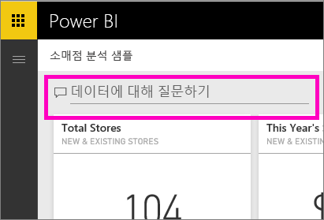
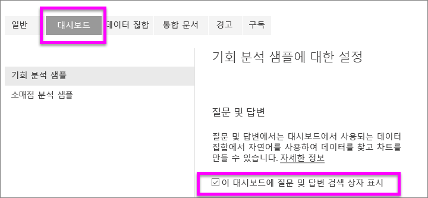
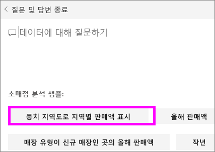

# Power BI **소비자**를 위한 질문 및 답변
## 질문 및 답변이란 무엇인가요?
경우에 따라 자연어를 사용하여 질문을 하면 가장 빠르게 사용자 데이터로 답변을 받을 수 있습니다. 예를 들어 “지난 해 총 매출은 얼마인가요?”와 같이 질문합니다.  
질문 및 답변을 사용하면 직관적인 자연어 기능을 사용하여 데이터를 탐색하고 차트 및 그래프 형식으로 답변을 받을 수 있습니다. 질문 및 답변은 검색 엔진과 다릅니다. 질문 및 답변은 Power BI에서 데이터에 대한 결과만 제공합니다.

**Power BI 질문 및 답변**은 영어로 요청된 자연어 쿼리에 응답하는 기능만 지원합니다. Power BI 관리자가 사용할 수 있는 스페인어로 된 미리 보기가 있습니다.

**Power BI 질문 및 답변**은 Pro 또는 Premium 라이선스로 제공됩니다. 
>

질문은 시작일 뿐입니다.  질문을 구체화 또는 확장하거나 신뢰할 수 있는 새로운 정보를 발견하거나 세부 사항에 집중하거나 한발 물러서서 넓은 관점에서 살펴보는 등 데이터를 다양하게 활용할 수 있습니다. 이를 통해 통찰력을 얻고 발견의 즐거움을 느낄 수 있게 됩니다.

이러한 모든 경험이 진정한 대화형으로 신속하게 이루어집니다! 메모리 내 저장소를 통해 응답이 거의 즉각적으로 이루어집니다.

## 질문 및 답변은 어디에서 볼 수 있나요?
Power BI 서비스의 대시보드, 즉 Power BI Mobile의 경우 대시보드 하단, Power BI Embedded의 경우 시각적 개체 위에서 질문 및 답변을 볼 수 있습니다. 설계자가 편집 권한을 부여하지 않는 한, 사용자는 질문 및 답변을 사용하여 데이터를 탐색할 수 있지만 질문 및 답변을 사용하여 만든 시각화를 저장할 수 없습니다.

## 질문 및 답변에서 질문에 답변하는 방법을 어떻게 알 수 있나요?
질문 및 답변은 대시보드와 연결된 모든 데이터 집합에서 답변을 찾습니다. 대시보드에 데이터 집합의 타일이 있는 경우 질문 및 답변이 해당 데이터 집합에서 답변을 찾습니다. 

## 어떻게 시작하나요?
먼저 콘텐츠를 눈에 익힙니다. 대시보드 및 보고서의 시각적 개체를 살펴보세요. 사용 가능한 데이터의 형식 및 범위에 대한 감을 잡으세요. 그런 다음, 대시보드로 다시 가서 질문하기 상자에 커서를 놓습니다. 그러면 질문 및 답변 화면이 열립니다.

 

* 시각화 축 레이블과 값에 "sales", "account", "month" 및 "opportunities"가 포함되는 경우 "Which *account* has the highest *opportunity* 또는 show *sales* by month as a bar chart"와 같은 질문을 자신 있게 할 수 있습니다.

* Google 분석의 웹 사이트 성능 데이터가 있는 경우 웹 페이지에 소요된 시간, 페이지 순 방문 수 및 사용자 참여율에 대한 질문 및 답변을 할 수 있습니다. 또는 인구 통계 데이터를 쿼리하는 경우 지역별 연령 및 가구 소득에 대한 질문을 할 수 있습니다.

화면 맨 아래에서 기타 유용한 항목을 볼 수 있습니다. 질문 및 답변은 각 데이터 집합에서 키워드를 보여주고, 샘플이나 제안 질문을 보여주기도 합니다. 이러한 항목 중 일부를 선택하여 질문하기 상자에 추가합니다. 

질문 및 답변은 프롬프트, 자동 완성 및 시각적 단서를 통해 질문을 쉽게 작성할 수 있게 해줍니다. 

 

### 질문 및 답변에서 사용하는 시각화는 무엇인가요?
질문 및 답변에서는 표시되는 데이터를 기반으로 최적의 시각화를 선택합니다. 경우에 따라 기본 데이터 집합의 데이터가 특정 형식 또는 범주로 정의되며 이렇게 하면 질문 및 답변에서 데이터를 표시하는 방법을 알리는 데 도움이 됩니다. 예를 들어 데이터가 날짜 형식으로 정의되는 경우 꺾은선형 차트로 표시될 가능성이 높습니다. 도시로 분류된 데이터는 지도로 표시될 가능성이 높습니다.

질문에 사용할 시각화를 추가하여 사용할 시각화를 알리는 방법도 있습니다. 하지만 질문 및 답변에서 항상 사용자가 요청한 시각화 유형으로 데이터를 표시할 수 있는 것은 아님을 유의해야 합니다. 질문 및 답변에서는 사용 가능한 시각화 유형 목록을 메시지로 표시합니다.

## 고려 사항 및 문제 해결
**질문**: 이 대시보드에서 질문 및 답변이 보이지 않습니다.    
**답변 1**: 질문하기 상자가 보이지 않으면 먼저 설정을 확인하세요. 그러려면 Power BI 도구 모음의 오른쪽 상단 모서리에서 톱니 모양 아이콘을 선택하세요.   

그런 다음, **설정** > **대시보드**를 선택합니다. **이 대시보드에 질문 및 답변 검색 상자 표시** 옆에 확인 표시가 있는지 확인합니다.
  

**답변 2**: 대시보드 *설계자* 또는 관리자가 질문 및 답변을 해제하는 경우도 있습니다. 대시보드 설계자 또는 관리자에게 질문 및 답변을 다시 설정해도 되는지 확인하세요.   

**질문**: 질문을 입력할 때 원하는 결과가 표시되지 않습니다.    
**답변**: 대시보드 *설계자*에게 문의합니다. 설계자는 다양한 방법으로 질문 및 답변 결과를 개선할 수 있습니다. 예를 들어 설계자는 데이터 집합 열의 이름을 쉽게 이해할 수 있는 이름으로 변경할 수 있습니다(`CustFN` 대신 `CustomerFirstName`). 설계자는 데이터 집합을 정말로 잘 알고 있기 때문에 도움이 되는 질문을 생각하여 Q&A 캔버스에 추가할 수도 있습니다.

## 다음 단계

