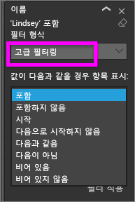
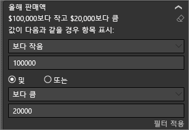
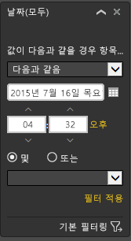

# 보고서 필터 창 둘러보기
이 문서는 Power BI 서비스에서 보고서 필터 창은 형태입니다. 필터를 사용 하 여 데이터에서 새로운 통찰력을 검색 합니다.

Power BI에서 데이터를 필터링하는 다양한 방법이 있으며, [필터 및 강조 표시 정보](../power-bi-reports-filters-and-highlighting.md)를 먼저 읽어보는 것이 좋습니다.

## 보고서 필터 창 작업
동료와 보고서를 공유할 때 **필터** 창을 찾습니다. 필터 창이 보고서의 오른쪽 가장자리를 따라 축소되는 경우가 있습니다. 축소된 창을 선택하여 확장합니다.   

필터 창에는 보고서 ‘디자이너’가 보고서에 추가한 필터가 포함되어 있습니다.  *소비자* 것에 변경 내용을 저장 하 고 기존 필터를 사용 하 여 조작할 수 있지만 보고서에 새 필터를 추가할 수 없습니다. 예를 들어 위의 스크린샷에서는 디자이너가 두 개의 페이지 수준 필터인 분할 및 연도 실행 합니다. 이들 필터를 조작하고 변경할 수 있지만 세 번째 페이지 수준 필터를 추가할 수는 없습니다.

Power BI 서비스에서 필터 창에서 수행한 모든 변경 내용을 유지 하 고 해당 변경 내용을 보고서의 모바일 버전에 적용 됩니다을 보고 합니다. 필터 창을 디자이너 기본값으로 다시 설정하려면 위의 메뉴 모음에서 **기본값으로 다시 설정**을 선택합니다.  

   

## 보고서 페이지에 대 한 모든 필터를 보려면
필터 창에서 보고서에 추가 하는 모든 필터를 표시 합니다 *디자이너*합니다. 필터 창의 필터에 대 한 정보를 확인 하 고 상호 작용할 수 있는 영역 이기도 합니다. 확인 또는 사용 하 여 변경 내용을 저장할 수 있습니다 **기본값으로** 원래 필터 설정으로 되돌릴 수 있습니다.

변경 내용을 저장 하려는 경우에 개인 책갈피를 만들 수 있습니다.  자세한 내용은 [보고서에 책갈피 추가](end-user-bookmarks.md)합니다.

시각적 개체, 보고서 페이지 및 전체 보고서에 적용 된 표시 및 필터 창에서 관리 되는 보고서 필터의 몇 가지 종류가 있습니다.

이 예제에서는 2 개의 필터가 있는 시각적 개체를 선택 했습니다. 보고서 페이지에는 역시 필터를 나열 합니다 **이 페이지에 대 한 필터** 제목입니다. 및 날짜에 대 한 전체 보고서에 필터가 있습니다.

일부 필터는 필터 옆에 **All**이라는 단어가 있으며 이는 모든 값이 필터에 포함되고 있는 것을 의미합니다.  예를 들어 **Segment(All)** 위의 스크린샷에 알려줍니다.이 보고서 페이지의 모든 제품 세그먼트에 대 한 데이터를 포함 합니다.  반면에 페이지 수준 필터에 대해 **지역은 서 부** 보고서 페이지에만 서 부 지역에 대 한 데이터 포함 여부를 알려줍니다.

이 보고서를 보는 모든 사용자가 이 필터와 상호 작용할 수 있습니다.

### 시각적 개체에 적용 하는 필터에만 보기
필터 아이콘을 표시 하려면 시각적 개체를 자세히 살펴보면 특정 시각적 개체에 적용 된 필터를 가져오려면 마우스로 합니다. 모든 필터, 슬라이서 및 등과 해당 시각적 개체에 영향을 주는 팝업이 표시 하는 필터 아이콘을 선택 합니다. 필터를 팝업에 표시 되는 동일한 필터는 합니다 **필터** 창입니다. 

 
이 보기를 표시할 수 있습니다 필터 종류는 다음과 같습니다.
- 기본 필터
- 슬라이서
- 교차 강조 표시
- 교차 필터링
- 고급 필터
- 상위 N 필터
- 상대 날짜 필터
- 슬라이서 동기화
- 포함/제외 필터
- URL을 통해 전달된 필터

예제에서는 아래:
1. 세로 막대형 차트를 교차 필터링 되었음을 볼 수 있습니다.
2. **포함 된** 에 대 한 교차 필터를 알려줍니다 **세그먼트**, 포함 되며 세 가지입니다. 
3. 슬라이서 적용 되었습니다 **Quarter**합니다.
4. **지역** 이 보고서 페이지에 적용 되는 필터 및
5. **isVanArsdel** 하 고 **연도** 필터가 적용이 시각적 개체에 있습니다.

### 필터에서 검색
경우에 따라 필터 값의 긴 목록이 있을 수 있습니다. 검색 상자를 사용 하 여 찾아서 원하는 값을 선택 합니다. 

### 필터 세부 정보를 표시
필터를 이해 하려면 사용 가능한 값 및 개수를 살펴보겠습니다를 수행 합니다.  마우스로 가리키고 필터 이름 옆의 화살표를 선택 하 여 필터의 세부 정보를 봅니다. 
  

### 필터 선택 변경
데이터 정보를 검색 하는 한 가지 방법은 필터와 상호 작용 하는 경우 필드 이름 옆의 드롭다운 화살표를 사용 하 여 필터 선택을 변경할 수 있습니다.  필터 및 필터링 된 데이터의 형식에 따라 옵션은 날짜 또는 숫자 범위를 식별 하는 목록에서 간단한 선택 항목에서 범위가 됩니다. 아래 고급 필터에서 필터를 변경 했습니다 **총 단위 YTD** 트리 맵에서 3,000 2,000 사이 여야 합니다. 트리 맵을에서 Prirum이 제거를 확인 합니다. 
  

> [!TIP]
> 한 번에 둘 이상의 필터 값을 선택 하려면 CTRL 키를 보유 합니다. 대부분의 필터에 다중 선택 지원합니다. 

### 기본 필터를 다시 설정
필터를 선택에 대 한 모든 변경 취소 하려는 경우 **기본값으로** 맨 위 메뉴 모음에서.  보고서에서 설정한 대로 필터를 원래 상태로 되돌립니다이 *디자이너*합니다. 

    
### 필터 지우기
하나의 필터를 설정 하려는 경우 **(All)** , 지우개 아이콘을 선택 하 여 확인란의 선택을 취소  필터 이름 옆에 있습니다.
  
<!--  too much detail for consumers

## Types of filters: text field filters
### List mode
Ticking a checkbox either selects or deselects the value. The **All** checkbox can be used to toggle the state of all checkboxes on or off. The checkboxes represent all the available values for that field.  As you adjust the filter, the restatement updates to reflect your choices. 

Note how the restatement now says "is Mar, Apr or May".

### Advanced mode
Select **Advanced Filtering** to switch to advanced mode. Use the dropdown controls and text boxes to identify which fields to include. By choosing between **And** and **Or**, you can build complex filter expressions. Select the **Apply Filter** button when you've set the values you want.  

## Types of filters: numeric field filters
### List mode
If the values are finite, selecting the field name displays a list.  See **Text field filters** &gt; **List mode** above for help using checkboxes.   

### Advanced mode
If the values are infinite or represent a range, selecting the field name opens the advanced filter mode. Use the dropdown and text boxes to specify a range of values that you want to see. 

By choosing between **And** and **Or**, you can build complex filter expressions. Select the **Apply Filter** button when you've set the values you want.

## Types of filters: date and time
### List mode
If the values are finite, selecting the field name displays a list.  See **Text field filters** &gt; **List mode** above for help using checkboxes.   

### Advanced mode
If the field values represent date or time, you can specify a start/end time when using Date/Time filters.  

-->

## 다음 단계
[보고서 페이지에서 시각적 개체가 서로 교차 필터링 및 교차 강조 표시되는 방식 및 이유 알아보기](end-user-interactions.md)