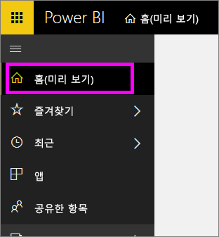
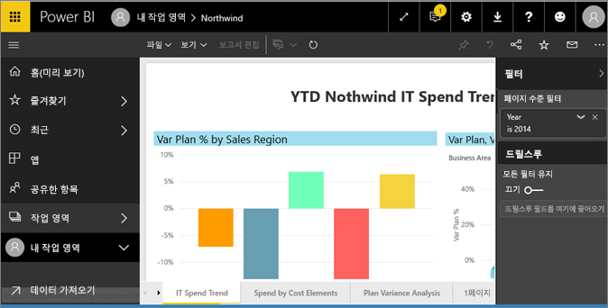
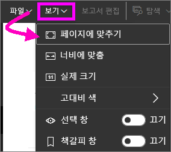
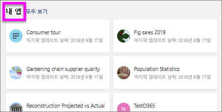
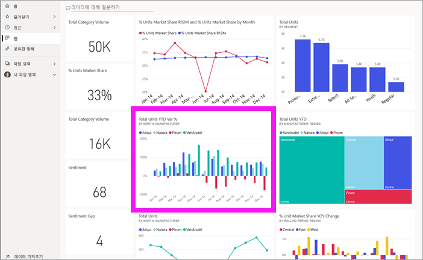
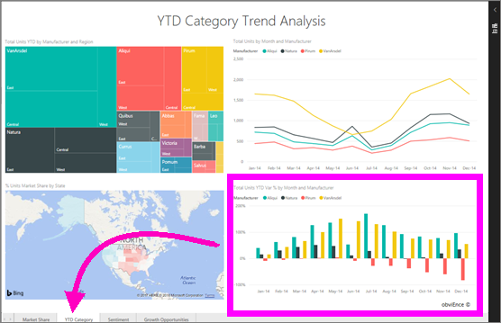

# *소비자*에 대한 Power BI 서비스의 보고서 보기
보고서는 하나 이상의 시각적 개체 페이지입니다. 보고서는 Power BI ‘보고서 디자이너’가 만들고 직접 또는 [앱](end-user-apps.md)의 일부로 [‘소비자’와 공유](end-user-shared-with-me.md)합니다. 

여러 가지 방법으로 보고서를 열 수 있으며, 여기서는 홈페이지 또는 대시보드에서 여는 방법을 보여줍니다. 

<!-- add art-->

## 홈페이지에서 보고서 열기
사용자와 직접 공유된 보고서를 연 다음 앱의 일부로 공유된 보고서를 열어 보겠습니다.

   

### 사용자와 공유된 보고서 열기
Power BI ‘디자이너’가 상단 메뉴 모음에 있는 **공유** 단추를 클릭하여 직접 보고서를 공유할 수 있습니다. 이 방식으로 공유된 콘텐츠는 왼쪽 탐색 모음에 있는 **공유한 항목** 컨테이너와 홈페이지의 **공유한 항목** 섹션에 표시됩니다.

1. Power BI 서비스(app.powerbi.com)를 엽니다.

2. 왼쪽 탐색 모음에서 **홈(미리 보기)** 을 선택하여 홈페이지를 엽니다.  

   
   
3. **공유한 항목**이 표시될 때까지 아래로 스크롤합니다. 보고서 아이콘 을 찾습니다. 이 스크린샷에는 *재무* 보고서와 *Northwind* 보고서가 있습니다. 
   
   

4. 보고서를 열려면 보고서 *카드* 중 하나를 선택하면 됩니다.

   

5. 맨 아래에 있는 탭을 확인합니다. 각 탭은 보고서 ‘페이지’를 나타냅니다. 현재 ‘IT 지출 추세’ 페이지가 열려 있습니다. 해당 보고서 페이지를 열려면 다른 탭을 선택합니다. 

   

6. 이제 보고서 페이지의 일부만 볼 수 있습니다. 페이지의 표시(확대/축소)를 변경하려면 **보기** > **페이지에 맞추기**를 선택합니다.

   

   

### 앱의 일부인 보고서 열기
동료 또는 AppSource에서 앱을 받은 경우 홈페이지와 왼쪽 탐색 모음의 **앱** 컨테이너에서 그러한 앱을 사용할 수 있습니다. [앱](end-user-apps.md)은 대시보드와 보고서의 번들입니다.

1. 왼쪽 탐색 모음에서 **홈(미리 보기)** 을 선택하여 홈페이지로 돌아갑니다.

7. **내 앱**이 표시될 때까지 아래로 스크롤합니다.

   

8. 앱 중 하나를 선택하여 엽니다. 앱 *디자이너*가 설정한 옵션에 따라 앱에서 대시보드, 보고서 또는 앱 콘텐츠 목록을 엽니다. 앱을 선택하는 경우:
    - 보고서를 열면 모두 설정됩니다.
    - 대시보드를 열고 아래의 [대시보드에서 보고서 열기](#Open-a-report-from-a-dashboard)를 참조하세요.
    - **보고서**에서 앱 콘텐츠 목록을 열고 보고서를 선택하여 엽니다.

## 대시보드에서 보고서 열기
대시보드에서 보고서를 열 수 있습니다. 대부분의 대시보드 타일은 보고서에서 ‘고정’됩니다. 타일을 선택하면 타일을 만드는 데 사용된 보고서가 열립니다. 

1. 대시보드에서 타일을 선택합니다. 이 예에서는 "총 단위 YTD..." 열 차트 타일을 선택했습니다.

    

2.  연결된 보고서가 열립니다. "YTD 범주" 페이지에 있는지 확인합니다. 이는 대시보드에서 선택한 열 차트가 포함된 보고서 페이지입니다.

    

> [!NOTE]
> 모든 타일이 보고서로 연결되는 것은 아닙니다. [질문 및 답변으로 작성한](end-user-q-and-a.md) 타일을 선택하면 질문 및 답변 화면이 열립니다. [대시보드 **타일 추가** 위젯을 사용하여 만든](../service-dashboard-add-widget.md) 타일을 선택하면 몇 가지 문제가 발생할 수 있습니다.  

##  보고서를 열 수 있는 기타 방법
Power BI 서비스를 보다 편리하게 탐색할 수 있기 때문에 자신에게 가장 적합한 워크플로를 찾을 수 있습니다. 보고서에 액세스하는 몇 가지 다른 방법:
- **즐겨찾기** 및 **최근 항목**을 사용하여 왼쪽 탐색 창에서    
- [관련 항목 보기](end-user-related.md) 사용    
- 누군가가 [사용자와 공유](../service-share-reports.md)하거나 [경고를 설정](end-user-alerts.md)할 때 메일을 통해    
- [알림 센터](end-user-notification-center.md)를 통해    
- 기타

## 다음 단계
[보고서와 상호 작용하는 여러 가지 방법](end-user-reading-view.md)이 있습니다.  보고서 캔버스의 맨 아래에 있는 각 탭을 선택하여 탐색을 시작합니다.

