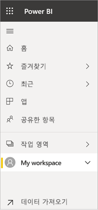
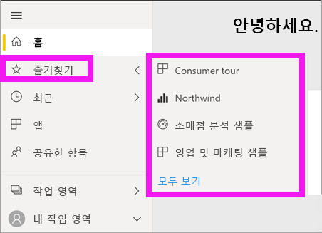

# 탐색: Power BI 서비스에서 콘텐츠 검색, 찾기 및 정렬
Power BI 서비스에서 콘텐츠로 이동하는 방법에는 여러 가지가 있습니다. 콘텐츠는 작업 영역 내에서 대시보드, 보고서 등의 유형별로 정리됩니다.  그리고 즐겨찾기, 최근, 공유한 항목, 주요와 같은 용도별로도 정리됩니다. 원스톱 탐색을 위해 Power BI ‘홈’에는 모든 콘텐츠가 한 페이지로 정리되어 있습니다.  이처럼 다양한 콘텐츠 경로를 통해 Power BI 서비스에서 필요한 내용을 빠르게 찾을 수 있습니다.  

## 작업 영역 내에서 탐색

일반적으로 Power BI 소비자는 작업 영역이  한 개(**내 작업 영역**)만 있습니다. Microsoft 샘플을 다운로드했거나 고유한 대시보드, 보고서 또는 앱을 만들거나 다운로드한 경우에만 **내 작업 영역**에 콘텐츠가 포함됩니다.  

**내 작업 영역** 내에서 Power BI 서비스는 대시보드, 보고서, 통합 문서, 데이터 세트 등의 유형별로 콘텐츠를 구분합니다. 작업 영역을 선택하면 이 조직이 표시됩니다. 이 예제의 **내 작업 영역**에는 대시보드 1개, 보고서 1개, 데이터 세트 1개가 포함되어 있고, 통합 문서는 없습니다.

________________________________________
## 검색 필드를 사용한 탐색
**내 작업 영역** 콘텐츠 뷰를 사용하여 콘텐츠를 검색, 필터링 및 정렬할 수 있습니다. 검색 필드에 대시보드, 보고서, 통합 문서 또는 소유자의 이름을 전부 또는 일부 입력합니다.  

콘텐츠가 몇 개뿐이면 검색 및 정렬이 필요하지 않습니다.  그러나 대시보드와 보고서가 많은 경우에는 검색 및 정렬이 매우 유용합니다. 예를 들어 아래 보고서 목록에는 83개의 항목이 있습니다. 

또한, 이름 또는 소유자별로 콘텐츠를 정렬할 수도 있습니다. **이름** 오른쪽의 위쪽 화살표를 보세요. 현재 83개 항목을 이름의 알파벳을 기준으로 오름차순으로 정렬하는 중입니다. 내림차순으로 정렬 순서를 변경하려면 **이름을** 선택하세요. 위쪽 화살표는 아래쪽 화살표로 변경됩니다.

모든 열을 정렬할 수 있는 것은 아닙니다. 열 제목을 가리켜 정렬 가능한 항목을 확인하세요.

___________________________________________________________________
## 왼쪽 탐색 모음을 사용한 탐색
왼쪽 탐색 모음은 필요한 내용을 빠르게 찾을 수 있는 방식으로 콘텐츠를 분류합니다.  

- 사용자와 공유된 콘텐츠는 **공유한 항목**에서 사용할 수 있습니다.
- 사용자가 마지막으로 본 콘텐츠는 **최근 항목**에서 사용할 수 있습니다. 
- **앱**을 선택하여 앱을 찾을 수 있습니다.
- **홈**은 가장 중요한 콘텐츠와 제안된 콘텐츠 및 학습 소스의 단일 페이지 보기입니다.

또한 콘텐츠에 [즐겨 찾기](end-user-favorite.md) 및 [주요](end-user-featured.md) 태그를 지정할 수 있습니다. 자주 볼 것으로 예상되는 대시보드 또는 보고서 1개를 선택하여 *주요* 콘텐츠로 설정합니다. Power BI 서비스를 열 때마다 주요 대시보드가 먼저 표시됩니다. 자주 방문하는 여러 대시보드 및 앱이 있나요? 즐겨찾기로 설정하면 왼쪽 탐색 모음에서 항상 사용할 수 있습니다.

## 고려 사항 및 문제 해결
* 데이터 세트의 경우 **정렬 기준**에서 소유자별 기준은 사용할 수 없습니다.

## 다음 단계
[보고서에서 시각적 개체 정렬](end-user-change-sort.md)

궁금한 점이 더 있나요? [Power BI 커뮤니티를 이용하세요.](http://community.powerbi.com/)
