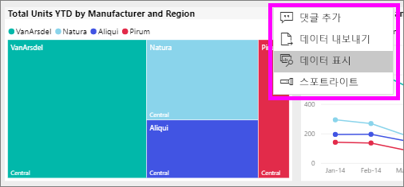
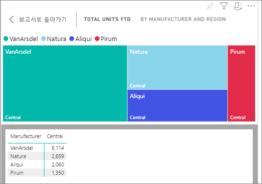
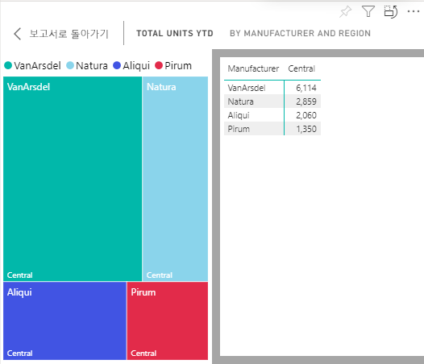

# 시각적 개체를 만드는 데 사용한 데이터 표시

Power BI 시각적 개체는 기본 데이터 집합의 데이터를 사용 하 여 생성 됩니다. 숨은 기능에 관심이 있는 경우 Power BI를 사용하면 시각적 개체를 만드는 데 사용되는 데이터를 *표시*할 수 있습니다. 선택 하면 **데이터 표시**, 아래 (또는 옆에) 데이터를 표시 하는 Power BI 시각적 개체입니다.

1. Power BI 서비스에서 [보고서를 열고](end-user-report-open.md) 시각적 개체를 선택 합니다.  
2. 시각적 개체 뒤의 데이터를 표시하려면 줄임표(...)를 선택하고 **데이터 표시**를 선택합니다.
   
   
3. 기본적으로 데이터는 시각적 개체 아래에 표시됩니다.
   
   

4. 방향을 변경하려면 시각화의 오른쪽 위에서 세로 레이아웃  을 선택합니다.
   
   

## 다음 단계
[Power BI 보고서의 시각적 개체](../visuals/power-bi-report-visualizations.md)    
[Power BI 보고서](end-user-reports.md)    
