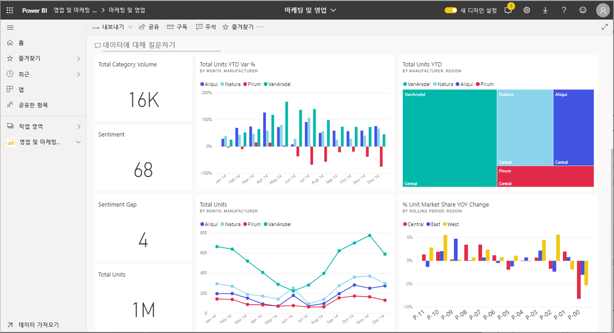
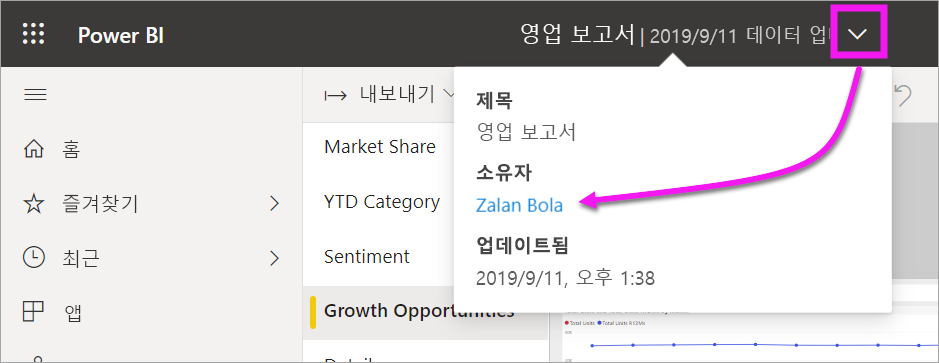

# 보고서, 대시보드 및 앱에서 시각적 개체 조작

가장 기본적으로 ***시각화***(또는 ‘시각적 개체’)는 보고서 및 데이터 세트의 데이터를 사용하여 Power BI ‘디자이너’에 의해 빌드된 차트 유형입니다.   

시각적 개체는 대시보드와 보고서에 있으며 Power BI 질문과 답변을 사용하여 즉시 만들 수 있습니다. 디자이너는 보고서에서 시각적 개체를 만들 때 시각적 개체를 대시보드에 *고정*할 수 있습니다. 대시보드의 [시각적 개체를 *타일*](end-user-tiles.md)이라고 합니다. 이 대시보드에는 8개의 타일이 있습니다. 

> [!TIP]
> 이러한 세부 콘텐츠를 읽기 전에 개요 항목인 ‘소비자’에 대한 [Power BI 기본 개념](end-user-basic-concepts.md)을 읽는 것이 좋습니다. 

## 시각적 개체로 수행할 수 있는 작업은 무엇인가요?

시각적 개체는 보고서 및 대시보드 ‘디자이너’에서 만들고, ‘소비자’와 공유합니다.   소비자는 시각적 개체를 조작하여 인사이트를 얻고 데이터 기반의 비즈니스 의사 결정을 내릴 수 있는 여러 가지 옵션을 사용할 수 있습니다. 대부분의 옵션은 아래 표에 단계별 지침에 대한 링크와 함께 나열되어 있습니다.

대부분의 옵션에서 관리자 또는 *디자이너*는 사용자가 이러한 기능을 보거나 사용하지 못하도록 설정할 수 있습니다. 이러한 기능 중 일부는 특정 시각적 개체에만 작동합니다.  질문이 있는 경우 관리자나 보고서 또는 대시보드 소유자에게 문의하세요. 소유자를 찾으려면 대시보드 또는 보고서 드롭다운을 선택합니다. 

> [!IMPORTANT]
> 그러나 먼저, Q&A에 대해 알아보겠습니다. Q&A는 Power BI의 자연어 검색 도구입니다. 자연어를 사용하여 질문을 입력하면 질문 및 답변이 시각적 개체 형식으로 질문에 답변합니다. 질문 및 답변은 소비자가 고유한 시각적 개체를 작성할 수 있는 한 방법입니다. 그러나 질문 및 답변을 사용하여 작성하는 시각적 개체는 저장할 수 없습니다. 하지만 데이터에서 학습하려는 특정한 것이 있지만 디자이너가 보고서나 대시보드에 포함하지 않은 경우에는 Q&A가 유용한 옵션입니다. Q&A에 대한 자세한 내용을 보려면 [소비자에 대한 Q&A](end-user-q-and-a.md)를 참조하세요.

|작업  |대시보드에서  |보고서에서  | Q&A에서
|---------|---------|---------|--------|
|[시각적 개체에 설명을 직접 추가하거나 시각적 개체에 대해 동료와 대화를 시작합니다](end-user-comment.md).     |  예       |   예      |  아니요  |
|[시각적 개체를 작성한 보고서를 열고 탐색합니다](end-user-tiles.md).     |    예     |   해당 없음      |  아니요 |
|[시각적 개체에 영향을 주는 필터 및 슬라이서 목록을 표시합니다](end-user-report-filter.md).     |    아니요     |   예      |  예 |
|[질문 및 답변에서 시각적 개체를 열고 검색합니다(*디자이너*가 질문 및 답변을 사용하여 시각적 개체를 만든 경우)](end-user-q-and-a.md).     |   예      |   해당 없음      |  해당 없음  |
|[질문 및 답변에서 시각적 개체를 만듭니다(검색을 위해 저장할 수 없음)](end-user-q-and-a.md).     |   예      |   디자이너가 보고서에 질문 및 답변을 추가한 경우      |  예  |
|[Power BI에 시각적 개체의 데이터에서 관심 있는 팩트나 추세를 찾도록 요청합니다](end-user-insights.md).  자동으로 생성되는 시각적 개체를 *인사이트*라고 합니다.     |    예     |  전체 보고서의 경우(시각적 개체 아님)       | 아니요   |
|[‘포커스’ 모드를 사용하여 한 번에 하나의 시각적 개체만 표시합니다](end-user-focus.md).      | 예        |   예      | 해당 없음  |
|[마지막으로 시각적 개체를 새로 고친 시간을 검색합니다](end-user-fresh.md).     |  예       |    예     | 해당 없음  |
|[*전체 화면* 또는 *포커스* 모드를 사용하여 테두리 또는 검색 모음 없이 한 번에 하나의 시각적 개체만 표시합니다](end-user-focus.md).     |   예      |  예       | 기본적으로  |
|[인쇄](end-user-print.md)합니다.     |  예       |   예      | 아니요  |
|[시각적 개체 필터를 추가하고 수정하여 시각적 개체에 자세히 살펴봅니다](end-user-report-filter.md).     |    아니요     |   예      | 아니요  |
|시각적 개체를 마우스로 가리키면 추가 세부 사항 및 도구 설명이 표시됩니다.     |    예     |   예      | 예  |
|[다른 시각적 개체를 페이지에 교차 필터링하고 강조 표시합니다](end-user-interactions.md).    |   아니요      |   예      | 해당 없음  |
|[시각적 개체를 만드는 데 사용된 데이터를 표시합니다](end-user-show-data.md).     |  아니요       |   예      | 아니요  |
| [시각적 개체가 정렬되는 방법을 변경합니다](end-user-change-sort.md). | 아니요  | 예  | 질문을 다시 표시하여 정렬을 변경할 수 있습니다.  |
| 시각적 개체에 추천을 추가합니다. | 아니요  | 예  |  아니요 |
| [Excel로 내보냅니다.](end-user-export.md) | 예 | 예 | 아니요|
| 값이 설정된 임계값을 초과하면 알려주도록 [경고를 만듭니다](end-user-alerts.md).  | 예  | 아니요  | 아니요 |
| [페이지에서 다른 시각적 개체를 교차 필터링하고 교차 강조 표시합니다](end-user-report-filter.md).  | 아니요      | 예  | 아니요  |
| [계층 구조를 포함하는 시각적 개체를 드릴합니다](end-user-drill.md).  | 아니요  | 예   | 아니요 |

## 다음 단계
[소비자에 대한 기본 개념](end-user-basic-concepts.md)으로 돌아가기    
[시각적 개체를 선택하여 보고서 열기](end-user-report-open.md)    
[Power BI에서 사용할 수 있는 시각적 개체 유형](end-user-visual-type.md)