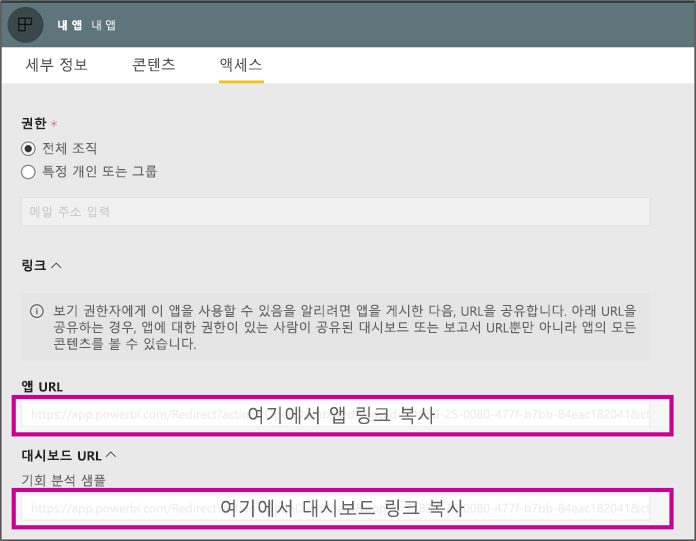

---
title: Power BI 모바일 앱의 특정 위치에 대한 링크 만들기
description: Power BI 모바일 앱에서 URI(Uniform Resource Identifier)를 사용하여 특정 대시보드, 타일 또는 보고서에 대한 딥 링크를 만드는 방법에 대해 알아봅니다.
author: mshenhav
manager: kfile
ms.reviewer: ''
ms.service: powerbi
ms.subservice: powerbi-mobile
ms.topic: conceptual
ms.date: 04/24/2019
ms.author: mshenhav
ms.openlocfilehash: 4e09b10e38b018f8e5572343b343a243ace3bf81
ms.sourcegitcommit: 60dad5aa0d85db790553e537bf8ac34ee3289ba3
ms.translationtype: HT
ms.contentlocale: ko-KR
ms.lasthandoff: 05/29/2019
ms.locfileid: "64906520"
---
# <a name="create-a-link-to-a-specific-location-in-the-power-bi-mobile-apps"></a>Power BI 모바일 앱의 특정 위치에 대한 링크 만들기
링크를 사용하여 Power BI의 특정 항목에 직접 액세스할 수 있습니다: 보고서, 대시보드 및 타일.

Power BI 모바일에서 링크를 사용하는 방법에는 주로 두 개의 시나리오가 있습니다. 

* **앱 외부에서** Power BI를 열고 특정 콘텐츠(앱/보고서/대시보드)를 방문합니다. 이것은 일반적으로 다른 앱에서 Power BI Mobile을 열려고 할 때의 통합 시나리오입니다. 
* Power BI 내부에서 **탐색**합니다. 이것은 일반적으로 Power BI에서 사용자 지정 탐색을 만들려는 경우입니다.
* Power BI 내부에서 **탐색**합니다. 이것은 일반적으로 Power BI에서 사용자 지정 탐색을 만들려는 경우입니다.


## <a name="use-links-from-outside-of-power-bi"></a>Power BI 외부에서 링크 사용
Power BI 앱 외부에서 링크를 사용하는 경우, 앱에서 링크를 열 것인지 확인하고, 앱이 장치에 설치되어 있지 않으면 사용자에게 링크를 설치하도록 제안합니다. 정확하게 지원하기 위해 특별 링크 형식을 만들었습니다. 이 링크 형식은 장치가 앱을 사용하여 링크를 열고 있는지 확인하고, 앱이 장치에 설치되어 있지 않으면 사용자에게 앱을 받기 위해 스토어로 이동하도록 제안합니다.

링크는 다음과 같이 시작되어야 합니다.  
```html
https://app.powerbi.com/Redirect?[**QUERYPARAMS**]
```

> [!IMPORTANT]
> 콘텐츠가 중국 정부 등과 같은 특수한 데이터 센터에서 호스팅되는 경우, 링크는 `app.powerbigov.us` 또는 `app.powerbi.cn`과 같은 올바른 Power BI 주소로 시작되어야 합니다.  


**쿼리 매개 변수**는 다음과 같습니다.
* **action**(필수) = OpenApp / OpenDashboard / OpenTile / OpenReport
* **appId** = 앱의 일부인 보고서 또는 대시보드를 열려는 경우 
* **groupObjectId** = 작업 영역(내 작업 영역은 아님)의 일부인 대시보드 또는 보고서를 열려는 경우
* **dashboardObjectId** = 대시보드 개체 ID (작업이 OpenDashboard 또는 OpenTile인 경우)
* **reportObjectId** = 보고서 개체 ID (작업이 OpenReport인 경우)
* **tileObjectId** = 타일 개체 ID (작업이 OpenTile인 경우)
* **reportPage** = 특정 보고서 섹션을 열려고 할 경우 (작업이 OpenReport인 경우)
* **ctid** = 항목 조직 ID (B2B 시나리오와 관련됩니다. 사용자의 조직에 속하는 항목인 경우 생략할 수 있습니다).

**예제:**

* 앱 열기 링크 
  ```html
  https://app.powerbi.com/Redirect?action=OpenApp&appId=appidguid&ctid=organizationid
  ```

* 앱의 일부인 대시보드 열기 
  ```html
  https://app.powerbi.com/Redirect?action=OpenDashboard&appId=**appidguid**&dashboardObjectId=**dashboardidguid**&ctid=**organizationid**
  ```

* 작업 영역에 포함된 보고서 열기
  ```html
  https://app.powerbi.com/Redirect?Action=OpenReport&reportObjectId=**reportidguid**&groupObjectId=**groupidguid**&reportPage=**ReportSectionName**
  ```

### <a name="how-to-get-the-right-link-format"></a>오른쪽 링크 형식을 가져오는 방법

#### <a name="links-of-apps-and-items-in-app"></a>앱 및 앱에서 항목의 링크

**앱의 일부인 보고서 및 대시보드와 앱**에 대한 링크를 가져오는 가장 쉬운 방법은 앱 작업 영역으로 이동하고 "앱 업데이트"를 선택하는 것입니다. "앱에 게시" 환경이 열리고 액세스 탭에서 **링크** 섹션을 찾을 수 있습니다. 해당 섹션을 확장하면 앱 목록과 콘텐츠에 직접 액세스하는 데 사용할 수 있는 모든 콘텐츠 링크를 확인할 수 있습니다.



#### <a name="links-of-items-not-in-app"></a>앱에 없는 항목의 링크 

앱의 일부분이 아닌 보고서 및 대시보드에 대해서는 항목 URL에서 ID를 추출해야 합니다.

예를 들어, 36자의 **대시보드** 개체 ID를 찾으려면, Power BI 서비스의 특정 대시보드로 이동합니다. 

```html
https://app.powerbi.com/groups/me/dashboards/**dashboard guid comes here**?ctid=**organization id comes here**`
```

36자의 **보고서** 개체 ID를 찾으려면, Power BI 서비스의 특정 보고서로 이동합니다.
다음은 "내 작업 영역"의 보고서 예제입니다.  

```html
https://app.powerbi.com/groups/me/reports/**report guid comes here**/ReportSection3?ctid=**organization id comes here**`
```
또한 위의 URL은 특정 보고서 페이지 **"ReportSection3"**를 포함합니다.

다음은 작업 영역(내 작업 영역 아님)의 보고서 예제입니다.

```html
https://app.powerbi.com/groups/**groupid comes here**/reports/**reportid comes here**/ReportSection1?ctid=**organizationid comes here**
```

## <a name="use-links-inside-power-bi"></a>Power BI 내부에서 링크 사용

Power BI 내부의 링크는 Power BI 서비스에서와 똑같이 모바일 앱에서 작동합니다.

다른 Power BI 항목을 가리키는 보고서에 링크를 추가하려는 경우, 브라우저 주소 표시줄에서 해당 항목 URL만 복사할 수 있습니다. [보고서에서 텍스트 상자에 하이퍼링크를 추가하는 방법](https://docs.microsoft.com/power-bi/service-add-hyperlink-to-text-box)에 대해 자세히 알아보세요.

## <a name="use-report-url-with-filter"></a>필터와 함께 보고서 URL 사용
Power BI 서비스와 동일하게, Power BI 모바일 앱도 필터 쿼리 매개 변수를 포함하는 보고서 URL을 지원합니다. Power BI 모바일 앱에서 보고서를 열 수 있으며 특정 상태로 필터링할 수 있습니다. 예를 들어, 이 URL은 판매 보고서를 열고 지역별로 필터링합니다.

## <a name="use-report-url-with-filter"></a>필터와 함께 보고서 URL 사용
Power BI 서비스와 동일 하지만, Power BI 모바일 앱도 필터 쿼리 매개 변수를 포함 하는 보고서 URL을 지원합니다. Power BI 모바일 앱에서 보고서를 열 수 있으며 특정 상태로 필터링할 수 있습니다. 예를 들어, 이 URL은 판매 보고서를 열고 지역별로 필터링합니다.
```html
https://app.powerbi.com/groups/me/reports/**report guid comes here**/ReportSection3?ctid=**organization id comes here**&filter=Store/Territory eq 'NC'
```

[보고서를 필터링하기 위해 쿼리 매개 변수 필터를 작성하는 방법](https://docs.microsoft.com/power-bi/service-url-filters)에 대해 자세히 알아보세요.

## <a name="next-steps"></a>다음 단계
사용자 의견은 나중에 구현할 사항을 결정하는 데 도움이 됩니다. 따라서 Power BI 모바일 앱에서 참조하고자 하는 다른 기능에 대해 꼭 투표해주세요. 

* [모바일 디바이스용 Power BI 앱](mobile-apps-for-mobile-devices.md)
* Twitter에서 @MSPowerBI 팔로우
* [Power BI 커뮤니티](http://community.powerbi.com/)에서 대화에 참여
* [Power BI란?](../../power-bi-overview.md)

