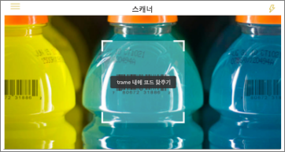
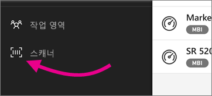

# Power BI 모바일 앱에서 디바이스로 바코드 스캔
실제 세계에서 바코드를 스캔하여 Power BI 모바일 앱에 있는 필터링된 BI 정보로 바로 이동합니다.

적용 대상:

|  |  | 
|:--- |:--- |
| iPhone | Android(휴대폰, 태블릿) | 

동료가 [보고서 Power BI Desktop에 바코드 필드의 태그를 지정](../../desktop-mobile-barcodes.md)하고 보고서를 공유했다고 가정합니다. 

디바이스의 Power BI 앱에서 스캐너를 사용하여 제품 바코드를 스캔할 때 해당 바코드가 있는 보고서(또는 보고서 목록)를 확인합니다. 해당 바코드로 필터링된 보고서를 열 수 있습니다.

## Power BI 스캐너를 사용하여 바코드 스캔
1. 탐색 모음에서 **추가 옵션**(...)을 탭한 다음, **스캐너**를 탭합니다.

    

2. 카메라를 사용하지 않도록 설정한 경우 Power BI 앱이 카메라를 사용할 수 있도록 승인해야 합니다. 한 번만 승인하면 됩니다. 
4. 제품에 대한 바코드에 스캐너를 가리킵니다. 해당 바코드와 연결된 보고서 목록이 표시됩니다.
5. 보고서 이름을 탭하여 해당 바코드에 따라 자동으로 필터링된 보고서를 디바이스에서 엽니다.

## 보고서에 있는 동안 다른 바코드로 필터링
디바이스에서 바코드로 필터링된 보고서를 보는 동안 다른 바코드로 동일한 보고서를 필터링하려고 할 수 있습니다.

* 바코드 아이콘에  필터가 있으면 필터가 활성화되고 보고서는 이미 바코드로 필터링됩니다. 
* 아이콘에  필터가 없으면 필터가 활성화되지 않고 보고서는 바코드로 필터링되지 않습니다. 

어느 방법을 사용해도 아이콘을 누르면 부동 스캐너와 함께 작은 메뉴가 열립니다.

* 다른 바코드 값으로 보고서의 필터를 변경하려는 새 항목에 스캐너를 집중합니다. 
* **바코드 필터 지우기**를 선택하여 필터링되지 않은 보고서로 돌아갑니다.
* **최근 바코드로 필터링**을 선택하여 현재 세션 내에서 스캔한 바코드 중 하나로 보고서 필터를 변경합니다.

## 바코드를 스캔하는 문제
제품에 대한 바코드를 스캔하는 경우 표시될 수 있는 메시지는 다음과 같습니다.

### "보고서를 필터링할 수 없습니다..."
필터링하도록 선택한 보고서는 이 바코드 값을 포함하지 않은 데이터 모델을 기반으로 합니다. 예를 들어 "미네랄 워터"라는 제품은 보고서에 포함되지 않습니다.  

### 보고서의 모든/일부 시각적 개체는 어떤 값도 포함하지 않습니다.
스캔한 바코드 값이 모델에 있지만 보고서의 모두/일부 시각적 개체는 이 값을 포함하지 않으며 따라서 필터링은 비어 있는 상태를 반환합니다. 다른 보고서 페이지를 살펴보거나 이 값을 포함한 Power BI Desktop에서 보고서를 편집합니다. 

### “바코드를 기준으로 필터링할 수 있는 보고서가 없는 것 같습니다.”
즉, 바코드를 활성화한 보고서가 없습니다. 바코드 스캐너는 **바코드**로 표시된 열이 있는 보고서만을 필터링할 수 있습니다.  

사용자 또는 보고서 소유자가 Power BI Desktop에서 열의 태그를 **바코드**로 지정하도록 합니다. [Power BI Desktop에서 바코드 필드 태그 지정](../../desktop-mobile-barcodes.md)에 대해 자세히 알아봅니다.

### "보고서를 필터링하지 못했습니다. - 이 바코드가 보고서 데이터에 존재하지 않는 것 같습니다."
필터링하도록 선택한 보고서는 이 바코드 값을 포함하지 않은 데이터 모델을 기반으로 합니다. 예를 들어 "미네랄 워터"라는 제품은 보고서에 포함되지 않습니다. 다른 제품을 검색하고 다른 보고서(둘 이상의 보고서를 사용할 수 있는 경우)를 선택하거나 필터링되지 않은 보고서를 볼 수 있습니다. 

## 다음 단계
* [Power BI Desktop에서 바코드 필드 태그 지정](../../desktop-mobile-barcodes.md)
* [Power BI의 대시보드 타일](../end-user-tiles.md)
* [Power BI의 대시보드](../end-user-dashboards.md)

