# Power BI 모바일 앱에서 대시보드 및 보고서 보기
적용 대상:

|  |  |  |  |  |
|:--- |:--- |:--- |:--- |:--- |
| [iPhone](mobile-apps-view-dashboard.md#view-dashboards-on-your-iphone) |[iPad](mobile-apps-view-dashboard.md#view-dashboards-on-your-ipad) |[Android 휴대폰](mobile-apps-view-dashboard.md#view-dashboards-on-your-android-phone) |[Android 태블릿](mobile-apps-view-dashboard.md#view-dashboards-on-your-android-tablet) |[Windows 10 장치](mobile-apps-view-dashboard.md#view-dashboards-on-your-windows-10-device) |

대시보드는 귀사의 수명 주기 및 프로세스로 통하는 포털입니다. 대시보드는 비즈니스의 현재 상태를 한 곳에서 모니터링하는 개요입니다.

## Power BI 서비스에서 대시보드 만들기(https://powerbi.com)
**모바일 앱에서 대시보드를 만들지 않습니다.** 

모바일 장치에서 대시보드 및 보고서를 보려면 웹 브라우저에서 대시보드를 만들거나 연결해야 합니다. 

1. Power BI 서비스([https://www.powerbi.com](https://www.powerbi.com))로 이동하여 [계정을 등록](../../service-self-service-signup-for-power-bi.md)합니다.
2. [자신의 Power BI 대시보드 및 보고서를 만들거나](../../service-get-started.md) [Microsoft Dynamics CRM](../../service-connect-to-microsoft-dynamics-crm.md) 및 [Adobe Analyics](../../service-connect-to-adobe-analytics.md)와 같은 다양한 서비스에 대해 기존 [Power BI 앱](../../service-connect-to-services.md)에 연결합니다.

Power BI 서비스의 Power BI 대시보드는 다음과 같습니다.

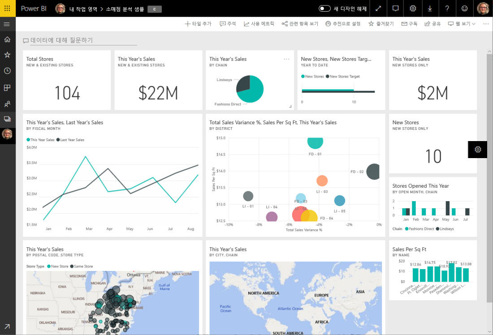

## iPhone에서 대시보드 보기
1. iPhone에서 Power BI 앱을 열고 로그인합니다.
   
   Apple 앱 스토어에서 iPhone 앱을 다운로드할 필요가 있나요? [iPhone 앱 다운로드](http://go.microsoft.com/fwlink/?LinkId=522062)
2. 대시보드를 열려면 누릅니다.  
   
    
   
   * 노란색 별  은 즐겨찾기 대시보드임을 나타냅니다. 
   * 각 대시보드 이름 아래의 표기(이 예의 경우 "MBI") 는 각 대시보드의 데이터를 분류하는 방법을 나타냅니다. 자세한 내용은 [Power BI 데이터 분류](../../service-data-classification.md)를 참조하세요.
   
   기본적으로 iPhone에서는 Power BI 대시보드가 약간 다르게 보입니다. 모든 타일이 동일한 크기로 나타나며, 위에서 아래로 하나씩 정렬됩니다.
   
    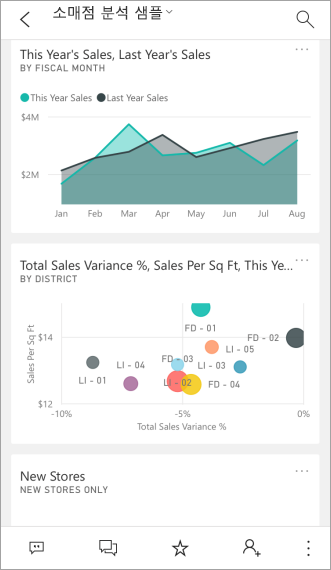
   
   > [!TIP]
   > 대시보드 소유자인 경우 [Power BI 서비스에서 세로 모드로 휴대폰에 맞게 대시보드 보기를 만들](../../service-create-dashboard-mobile-phone-view.md) 수 있습니다. 
   > 
   > 
   
    또는 휴대폰을 옆으로 돌려 휴대폰에서 대시보드를 가로 모드로 봅니다.
   
    
3. 대시보드에서 모든 타일을 보려면 위아래로 살짝 밉니다. 다음을 할 수 있습니다.
   
   * [타일을 탭하여](mobile-tiles-in-the-mobile-apps.md) 해당 타일을 열고 이와 상호 작용합니다.
   * 별 을 탭하여 [즐겨찾기를 만듭니다](mobile-apps-favorites.md).
   * **초대** 를 탭하여 대시보드를 볼 수 있도록 [동료를 초대](mobile-share-dashboard-from-the-mobile-apps.md)합니다.
   * [Apple Watch와 대시보드를 동기화합니다](mobile-apple-watch.md).
4. 대시보드 목록으로 돌아가려면 대시보드 제목 옆의 화살표를 탭한 다음 **내 작업 영역**을 탭합니다.
   
   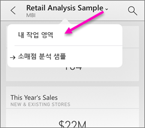

### iPhone에서 가로 모드로 대시보드 보기
휴대폰을 옆으로 돌려 대시보드를 가로 모드로 봅니다. 대시보드 레이아웃이 일련의 타일에서 전체 대시보드 보기로 변경됩니다. 대시보드의 모든 타일이 Power BI 서비스에 있는 것과 똑같이 표시됩니다.

“손가락 모으기” 제스처로 대시보드의 다른 영역을 확대/축소하고 이동하여 탐색할 수 있습니다. 그리고 여전히 [타일을 탭](mobile-tiles-in-the-mobile-apps.md)하여 타일을 포커스 모드로 열고 데이터를 조작할 수 있습니다.

## iPad에서 대시보드 보기
1. Power BI 앱을 엽니다.
   
   먼저 Apple 앱 스토어에서 [iPad 앱을 다운로드](http://go.microsoft.com/fwlink/?LinkId=522062)해야 합니까?
2. 앱의 위쪽에 있는 **대시보드**를 누릅니다.  
   
   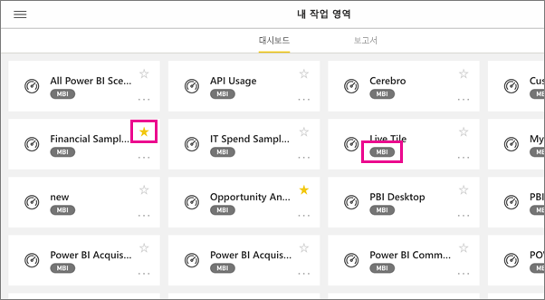
   
   * 노란색 별  은 즐겨찾기 대시보드임을 나타냅니다. 
   * 각 대시보드 이름 아래의 표기(이 예의 경우 "MBI") 는 각 대시보드의 데이터를 분류하는 방법을 나타냅니다. 자세한 내용은 [Power BI 데이터 분류](../../service-data-classification.md)를 참조하세요.
3. 작업 영역에서 대시보드를 공유할 수 있습니다. 대시보드 타일의 오른쪽 아래 모서리에서 줄임표(**...**)를 누르고 **다른 사람 초대**를 누릅니다.
   
   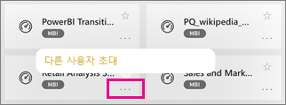
4. 또한 대시보드를 눌러서 열고 해당 대시보드에서 타일을 확인할 수 있습니다. 대시보드에서 다음과 같이 상호 작용할 수 있습니다.
   
   * 타일과 [상호작용하려면 해당 타일을 탭합니다](mobile-tiles-in-the-mobile-apps.md).
   * 타일 뒤의 [보고서 열기](mobile-reports-in-the-mobile-apps.md).
   * [다른 사람을 초대하여 대시보드를 봅니다](mobile-share-dashboard-from-the-mobile-apps.md).
   * 타일의 [스냅숏에 주석을 달고 공유합니다](mobile-annotate-and-share-a-tile-from-the-mobile-apps.md).
5. 내 작업 영역으로 돌아가려면 왼쪽 위 모서리의 대시보드 이름을 탭한 다음 **내 작업 영역**을 탭합니다.
   
   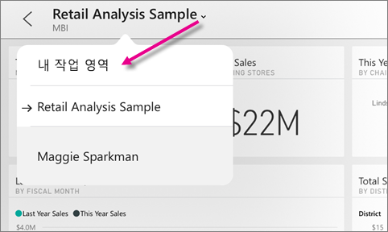

## Android 휴대폰에서 대시보드 보기
1. Android 휴대폰에서 Power BI 앱을 열고 로그인합니다.
   
   먼저 [Android 앱을 다운로드](http://go.microsoft.com/fwlink/?LinkID=544867)해야 하나요?
2. 대시보드를 열려면 누릅니다.   
   
   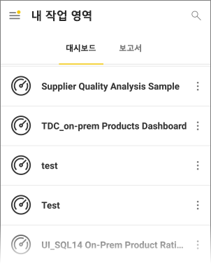

    노란색 별  은 즐겨찾기 대시보드임을 나타냅니다. 

    대시보드 이름 아래의 표기(이 예의 경우 "MBI") 는 각 대시보드의 데이터를 분류하는 방법을 나타냅니다. 자세한 내용은 [Power BI 데이터 분류](../../service-data-classification.md)를 참조하세요.

    Android 휴대폰에서는 Power BI 대시보드가 약간 다르게 보입니다. 모든 타일이 동일한 너비로 나타나며, 위에서 아래로 하나씩 정렬됩니다.

    

    대시보드 소유자인 경우 [Power BI 서비스에서 세로 모드로 휴대폰에 맞게 대시보드 보기를 만들](../../service-create-dashboard-mobile-phone-view.md) 수 있습니다. 

1. 대시보드에서는 이름 옆에 있는 세로 생략 부호(...)를 눌러 동료를 초대하거나 대시보드에 대한 정보를 새로 고치거나 가져올 수 있습니다.
   
   
2. [대시보드에서 모든 타일](mobile-tiles-in-the-mobile-apps.md)을 보려면 위아래로 살짝 밉니다. 
3. 대시보드 홈 페이지로 돌아가려면 대시보드 이름을 탭하여 이동 경로를 연 다음 **내 작업 영역**을 탭합니다.   

## Android 태블릿에서 대시보드 보기
1. Android 태블릿에서 Power BI 앱을 열고 로그인합니다.
   
   먼저 [Android 앱을 다운로드](http://go.microsoft.com/fwlink/?LinkID=544867)해야 하나요?
2. 대시보드를 열려면 누릅니다.   
   
   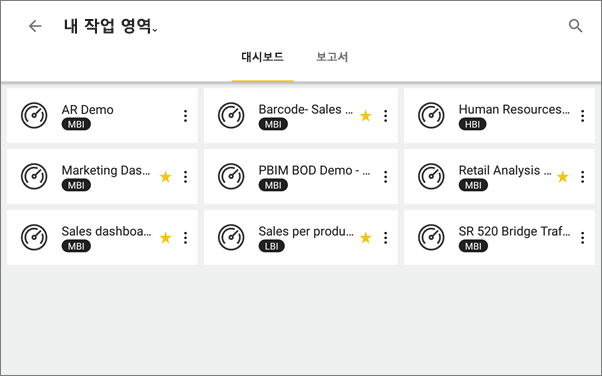
   
   * 노란색 별  은 즐겨찾기 대시보드임을 나타냅니다. 
   * 각 대시보드 이름 아래의 표기(이 예의 경우 "MBI") 는 각 대시보드의 데이터를 분류하는 방법을 나타냅니다. 자세한 내용은 [Power BI 데이터 분류](../../service-data-classification.md)를 참조하세요.
3. 대시보드에서는 이름 옆에 있는 세로 생략 부호(...)를 눌러 동료를 초대하거나 대시보드에 대한 정보를 새로 고치거나 가져올 수 있습니다.
   
   
4. [대시보드에서 모든 타일](mobile-tiles-in-the-mobile-apps.md)을 보려면 위아래로 살짝 밉니다. 
   
   “손가락 모으기” 제스처로 대시보드의 다른 영역을 확대/축소하고 이동하여 탐색할 수 있습니다. 그리고 여전히 [타일을 탭](mobile-tiles-in-the-mobile-apps.md)하여 타일을 포커스 모드로 열고 데이터를 조작할 수 있습니다.
5. 대시보드 홈 페이지로 돌아가려면 대시보드 이름을 탭하여 이동 경로를 연 다음 **내 작업 영역**을 탭합니다.
   
    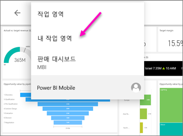

    “손가락 모으기” 제스처로 대시보드의 다른 영역을 확대/축소하고 이동하여 탐색할 수 있습니다. 그리고 여전히 [타일을 탭](mobile-tiles-in-the-mobile-apps.md)하여 타일을 포커스 모드로 열고 데이터를 조작할 수 있습니다.

## Windows 10 장치에서 대시보드 보기
1. Windows 10 장치에서 Power BI 앱을 열고 로그인합니다.
   
   먼저 [앱을 다운로드](http://go.microsoft.com/fwlink/?LinkID=526478)해야 하나요?
2. 대시보드를 열려면 누릅니다.   
   
   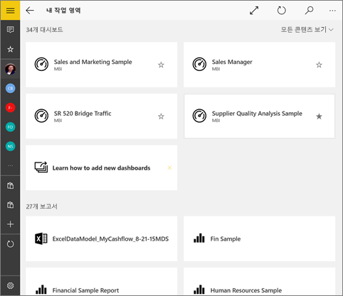
   
   * 검은색 별표는 즐겨찾기 대시보드임을 나타냅니다. 
   * 각 대시보드 이름 아래의 표기(이 예의 경우 **MBI**)는 각 대시보드의 데이터를 분류하는 방법을 나타냅니다. 자세한 내용은 [Power BI 데이터 분류](../../service-data-classification.md)를 참조하세요.
   
   Windows 10 Phone에서는 Power BI 대시보드가 약간 다르게 보입니다. 모든 타일이 동일한 너비로 나타나며, 위에서 아래로 하나씩 정렬됩니다.
   
   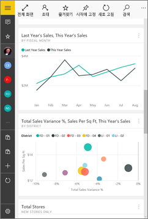
   
    휴대폰을 옆으로 설정하여 휴대폰에서 가로 모드로 볼 수도 있습니다.
   
   > [!TIP]
   > 대시보드 소유자인 경우 [Power BI 서비스에서 세로 모드로 휴대폰에 맞게 대시보드 보기를 만들](../../service-create-dashboard-mobile-phone-view.md) 수 있습니다. 
   > 
   > 
3. 대시보드에서 다음을 수행할 수 있습니다.
   
   * 타일을 열고 상호 작용하려면 [해당 타일을 누릅니다](mobile-tiles-in-the-mobile-apps.md).
   * **전체 화면** 아이콘 을 탭하여 PowerPoint의 **슬라이드 쇼** 보기와 같은 테두리 또는 메뉴 없이 Power BI 대시보드를 표시합니다.
   * **초대** 아이콘 을 탭하여 동료와 [대시보드를 공유](mobile-share-dashboard-from-the-mobile-apps.md)합니다.
   * 별 을 탭하여 [대시보드를 즐겨찾기로 만듭니다](mobile-apps-favorites.md).
   * **시작 화면에 고정** 아이콘을 탭하여 [대시보드를 Windows 시작 화면에 고정](mobile-pin-dashboard-start-screen-windows-10-phone-app.md)합니다. 
4. 대시보드 홈 페이지로 돌아가려면 대시보드 이름을 탭하여 이동 경로를 연 다음 **내 작업 영역**을 탭합니다.
   
    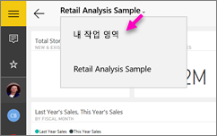

### Windows 10 휴대폰에서 가로 모드로 대시보드 보기
또한 바로 전화를 돌려서 대시보드를 가로 모드로 볼 수 있습니다. 대시보드 레이아웃이 일련의 타일에서 전체 대시보드 보기로 변경됩니다. 대시보드의 모든 타일이 Power BI 서비스에서 볼 때처럼 배치됩니다.

“손가락 모으기” 제스처로 대시보드의 다른 영역을 확대/축소하고 이동하여 탐색할 수 있습니다. 그리고 여전히 [타일을 탭](mobile-tiles-in-the-mobile-apps.md)하여 타일을 포커스 모드로 열고 데이터를 조작할 수 있습니다.

## Power BI 서비스에서 대시보드 휴대폰 보기 만들기
대시보드 소유자인 경우 *Power BI 서비스에서* 세로 모드로 휴대폰에 맞게 대시보드 보기를 만들 수 있습니다. 

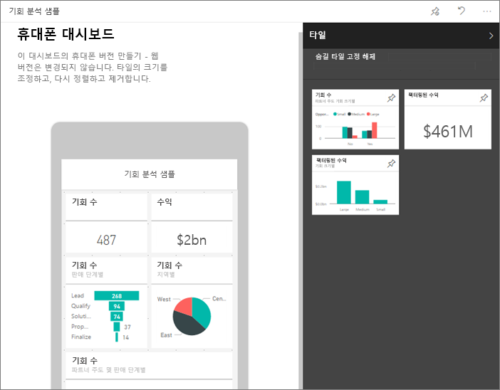

[대시보드의 휴대폰 보기를 만드는](../../service-create-dashboard-mobile-phone-view.md) 방법에 대해 알아봅니다.

## 다음 단계
* Google Play에서 [Android 앱 다운로드](http://go.microsoft.com/fwlink/?LinkID=544867)  
* [Power BI용 Android 앱 시작](mobile-android-app-get-started.md)  
* [Power BI란?](../../power-bi-overview.md)
* 궁금한 점이 더 있나요? [Power BI 커뮤니티에 질문합니다.](http://community.powerbi.com/)

