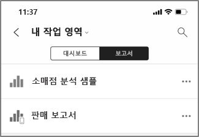
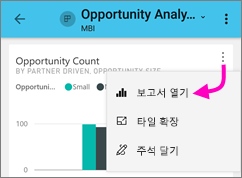
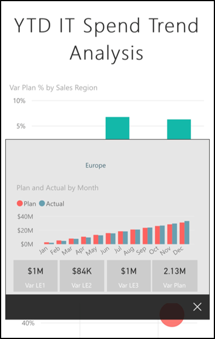
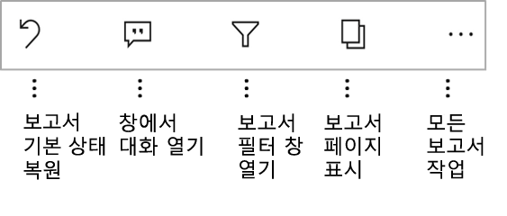

# Power BI 모바일 앱에서 보고서 탐색
적용 대상:

|  |  |  |  |  |
|:---: |:---: |:---: |:---: |:---: |
| iPhone |iPad |Android 휴대폰 |Android 태블릿 |Windows 10 디바이스 |

Power BI 보고서는 해당 데이터의 다양한 결과 및 인사이트를 나타내는 시각적 개체가 포함된 데이터의 대화형 뷰입니다. 3단계 프로세스 중 다음의 세 번째 단계는 Power BI 모바일 앱에서 보고서 보기입니다.

1. [Power BI Desktop에서 보고서를 만듭니다](../../desktop-report-view.md). Power BI Desktop에서도 [휴대폰용 보고서를 최적화](mobile-apps-view-phone-report.md)할 수 있습니다.
2. 이 보고서를 Power BI 서비스[(https://powerbi.com)](https://powerbi.com)) 또는 [Power BI Report Server](../../report-server/get-started.md)에 게시합니다.  
3. Power BI 모바일 앱에서 이 보고서를 조작할 수 있습니다.

## 모바일 앱에서 Power BI 보고서 열기
Power BI 보고서는 가져온 위치에 따라 모바일 앱의 다른 위치에 저장됩니다. 이는 앱, 공유한 항목, 작업 영역(내 작업 영역 포함) 또는 보고서 서버에 있을 수 있습니다. 관련 대시보드를 통해 보고서에 액세스하는 경우도 있고, 보고서가 나열되는 경우도 있습니다.

목록 및 메뉴에서 보고서 이름 옆의 아이콘을 누르면 해당 항목이 보고서인지 파악할 수 있습니다.

Power BI 모바일 앱의 보고서를 위한 두 가지 아이콘이 있습니다.

*  앱에서 가로 방향으로 표시되는 보고서를 나타냅니다. 브라우저에서 보이는 것과 동일하게 보입니다.

*  세로 방향으로 표시되는 하나 이상의 휴대폰에 최적화된 페이지로 구성된 보고서를 나타냅니다.

> [!NOTE]
> 휴대폰을 가로 방향으로 들면 보고서 페이지가 휴대폰 레이아웃으로 표시되더라도 항상 가로 레이아웃으로 볼 수 있습니다.

대시보드에서 보고서로 이동하려면 타일의 오른쪽 위에 있는 **추가 옵션**(...)을 탭한 다음, **보고서 열기**를 탭합니다.
  
  
  
  모든 타일을 보고서로 열 수 있는 것은 아닙니다. 예를 들어 질문 및 답변 상자에서 질문을 할 때 만든 타일을 탭해도 보고서가 열리지 않습니다.
  
## 보고서 조작
앱에서 보고서를 연 후 보고서 작업을 시작할 수 있습니다. 보고서와 데이터를 사용하여 다양한 작업을 수행할 수 있습니다. 보고서 바닥글에서 보고서에 대해 수행할 수 있는 작업을 찾을 수 있습니다. 보고서에 표시된 데이터를 탭하거나 길게 탭하면 데이터를 조각화하고 분석할 수도 있습니다.

### 단일 탭 및 두 번 탭 상호 작용
Power BI 모바일 앱을 다운로드하면 단일 탭 상호 작용이 설정됩니다. 즉, 시각적 개체를 탭하여 슬라이서 항목 선택, 상호 강조 표시, 링크 또는 단추 클릭 등의 작업을 수행하는 경우 두 탭 모두 시각적 개체를 선택하고 원하는 작업을 수행합니다.

원하는 경우 두 번 탭 상호 작용으로 전환할 수 있습니다. 두 번 탭 상호 작용을 사용하면 먼저 시각적 개체를 탭하여 선택한 다음 시각적 개체에서 다시 탭하여 원하는 작업을 수행합니다.

두 번 탭 상호 작용으로 전환하거나 단일 탭으로 다시 전환하려면 [앱 상호 작용 설정](./mobile-app-interaction-settings.md)으로 이동합니다.

### 탭 및 길게 탭 사용
탭은 마우스 클릭과 동일한 동작입니다. 따라서 데이터 요소에 따라 보고서를 교차 강조 표시하려는 경우 해당 데이터 요소를 탭하면 됩니다.
슬라이서 값을 탭하면 값이 선택되고 나머지 보고서는 해당 값으로 슬라이스 됩니다.
링크, 단추 또는 책갈피를 탭하면 보고서 작성자에 의해 정의된 작업이 수행됩니다.

시각적 개체를 탭하면 테두리가 표시되는 것을 알 수 있습니다. 테두리의 오른쪽 위에 **추가 옵션**(...)이 표시됩니다. 줄임표를 탭하면 해당 시각적 개체에 대해 수행할 수 있는 작업 메뉴가 표시됩니다.

### 도구 설명 및 드릴 작업
데이터 요소를 길게 탭(탭하고 유지)하면 이 데이터 요소가 나타내는 값을 제공하는 도구 설명이 표시됩니다.

보고서 작성자가 보고서 페이지 도구 설명을 구성한 경우 기본 도구 설명이 보고서 페이지 도구 설명으로 바뀝니다.

> [!NOTE]
> 보고서 도구 설명은 최소 640픽셀 및 320픽셀 뷰포트의 디바이스에 대해 지원됩니다. 디바이스가 더 작은 경우 앱은 기본 도구 설명을 표시합니다.

보고서 작성자는 데이터의 계층 구조 및 보고서 페이지 간 관계를 정의할 수 있습니다. 계층 구조를 사용하여 시각적 개체 및 값에서 다른 보고서 페이지를 드릴다운, 드릴업 및 드릴스루할 수 있습니다. 따라서 도구 설명 외에도 값을 길게 탭하면 관련 드릴 옵션이 바닥글에 표시됩니다.

시각적 개체의 특정 부분을 탭한 다음 *드릴스루* 옵션을 탭하면 Power BI는 보고서의 다른 페이지로 이동하고 탭한 값으로 필터링합니다. 보고서 작성자는 하나 이상의 드릴스루 옵션을 정의할 수 있으며 각각 다른 페이지로 이동합니다. 이 경우에는 드릴스루하려는 옵션을 선택할 수 있습니다. [뒤로] 단추를 누르면 다시 이전 페이지로 이동합니다.

자세한 내용은 [Power BI Desktop에서 드릴스루를 추가](../../desktop-drillthrough.md)하는 방법을 읽어보세요.
   
   > [!IMPORTANT]
   > Power BI 모바일 앱에서 행렬 및 테이블 시각적 개체의 드릴 동작은 열이나 행 머리글이 아닌 셀 값만을 통해 사용하도록 설정됩니다.
   
   
   
### 보고서 바닥글에서 작업 사용
보고서 바닥글에서 현재 보고서 페이지나 전체 보고서에서 수행할 수 있는 몇 가지 작업을 수행할 수 있습니다. 바닥글은 가장 일반적으로 사용되는 작업에 빠르게 액세스할 수 있도록 합니다. **추가 옵션**(...) 단추를 탭하여 다른 작업에 액세스할 수 있습니다.

바닥글의 이러한 작업에서 다음을 수행할 수 있습니다.
* 보고서 필터를 다시 설정하고 선택 항목을 원래 상태로 다시 교차 강조 표시합니다.
* 대화 창을 열어 설명을 보거나 보고서에 대한 설명을 추가합니다.
* 필터 창을 열어 보고서에 현재 적용된 필터를 보거나 수정합니다.
* 보고서의 모든 페이지를 나열합니다. 페이지 이름을 탭하면 해당 페이지가 로드되고 표시됩니다.
화면 가장자리에서 가운데로 살짝 밀면 보고서 페이지 간에 이동할 수 있습니다.
* 모든 보고서 작업을 봅니다.

#### 모든 보고서 작업
보고서 바닥글에 있는 **추가 옵션**(...) 단추를 탭하면 보고서에서 수행할 수 있는 모든 작업이 표시됩니다.

일부 작업은 특정 보고서 기능에 종속되므로 사용하지 않도록 설정될 수 있습니다.
예:

**책갈피**는 보고서에 [책갈피](mobile-reports-in-the-mobile-apps.md#bookmarks)가 설정된 경우에만 표시됩니다. Power BI 서비스에서 정의할 수 있는 개인 책갈피와 보고서 작성자가 정의한 책갈피가 모두 표시됩니다. 책갈피 중 하나가 기본 책갈피로 정의된 경우에는 보고서가 로드 시 해당 뷰로 열립니다.

Power BI 모바일 앱의 공유를 금지하는 [Intune 보호 정책](https://docs.microsoft.com/intune/app-protection-policies)을 조직에서 적용 중인 경우 **주석 달기 및 공유**를 끄도록 설정할 수 있습니다.

다른 사용자와 보고서를 공유할 권한이 있는 경우에만 **초대**가 사용하도록 설정됩니다. 보고서 소유자이거나 소유자가 다시 공유 권한을 부여한 경우에만 권한이 있습니다.

보고서 작성자가 보고서를 지리 데이터로 분류한 경우 **현재 위치로 필터링**이 사용하도록 설정됩니다. 자세한 내용은 [보고서에서 지리 데이터 식별](https://docs.microsoft.com/power-bi/desktop-mobile-geofiltering)을 참조하세요.

보고서의 데이터 세트에 **바코드** 태그가 지정된 경우 **바코드로 보고서를 필터링하려면 검사**가 사용하도록 설정됩니다. 자세한 내용은 [Power BI Desktop의 바코드 태깅](https://docs.microsoft.com/power-bi/desktop-mobile-barcodes)을 참조하세요.

### 책갈피

Power BI 모바일 앱은 보고서 작성자가 정의한 보고서 책갈피와 Power BI 서비스에서 정의할 수 있는 개인 책갈피를 모두 지원합니다. [보고서 작업 도구 모음](mobile-reports-in-the-mobile-apps.md#all-report-actions)의 **기타 옵션**(...)에서 책갈피 메뉴를 찾을 수 있습니다.

기본 책갈피는 특수 아이콘으로 표시됩니다. 개인 책갈피의 경우 변경할 책갈피 옆에 있는 **추가 옵션(...)** 을 탭하고 **기본값으로** 또는 **기본값 지우기**를 선택하여 기본 설정을 지정하거나, 설정하거나, 해제할 수 있습니다.

보고서의 책갈피 뷰를 열면 책갈피 이름이 보고서 맨 위에 표시됩니다.

[Power BI 서비스의 책갈피에 대해 자세히 알아보세요](https://docs.microsoft.com/power-bi/consumer/end-user-bookmarks).

## 보고서를 사용하여 환경 구성
Power BI 모바일 앱에는 보고서 환경을 제어할 수 있는 다양한 설정이 있습니다. 현재 다음을 구성할 수 있습니다.
* **보고서 시각적 개체와의 상호 작용**: 단일 탭 또는 두 번 탭하기 상호 작용 중 하나를 사용하도록 선택할 수 있습니다.
* **데이터 새로 고침 방법**: 보고서 데이터를 새로 고치기 위해 새로 고침 단추나 아래로 당기는 조치를 선택할 수 있습니다.
* **보고서 바닥글 표시 유형**: 항상 표시되는 고정 바닥글을 선택하거나 동작에 따라(예: 스크롤) 숨거나 다시 나타나는 동적 바닥글을 선택할 수 있습니다.

이러한 설정을 변경하는 방법에 대한 자세한 내용은 [앱 상호 작용 설정](./mobile-app-interaction-settings.md)을 참조하세요.

## 다음 단계
* [휴대폰에 최적화된 Power BI 보고서 보기 및 상호 작용](mobile-apps-view-phone-report.md)
* [휴대폰에 최적화된 보고서 버전 만들기](../../desktop-create-phone-report.md)
* 궁금한 점이 더 있나요? [Power BI 커뮤니티에 질문합니다.](https://community.powerbi.com/)

