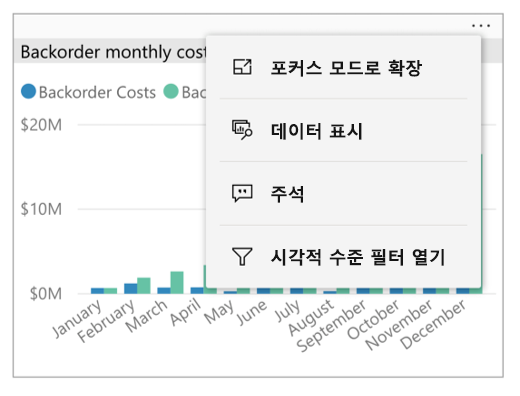
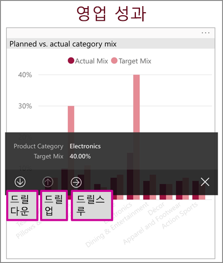
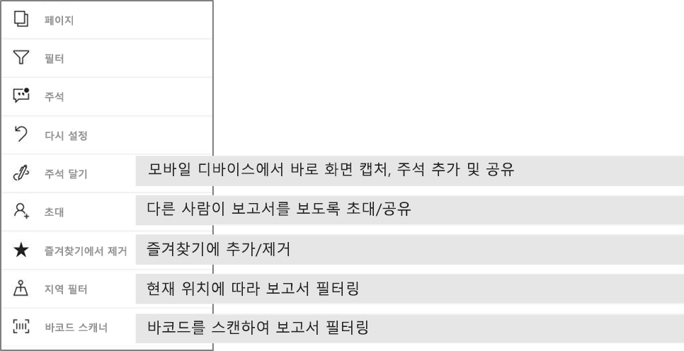

# Power BI 모바일 앱에서 보고서 탐색
적용 대상:

|  |  |  |  |  |
|:--- |:--- |:--- |:--- |:--- |
| iPhone |iPad |Android 휴대폰 |Android 태블릿 |Windows 10 디바이스 |

Power BI 보고서는 해당 데이터의 다양한 결과 및 통찰력을 나타내는 시각적 개체가 포함된 데이터의 상호작용형 보기입니다. 3단계 프로세스의 세 번째 단계는 Power BI 모바일 앱에서 보고서 보기입니다.

1. [Power BI Desktop에서 보고서를 만듭니다](../../desktop-report-view.md). Power BI Desktop에서도 [휴대폰용 보고서를 최적화](mobile-apps-view-phone-report.md)할 수 있습니다. 
2. 이 보고서를 Power BI 서비스[(https://powerbi.com)](https://powerbi.com)) 또는 [Power BI Report Server](../../report-server/get-started.md)에 게시합니다.  
3. 그런 다음 Power BI 모바일 앱에서 이 보고서를 조작할 수 있습니다.

## 모바일 앱에서 Power BI 보고서 열기
Power BI 보고서는 가져온 위치에 따라 모바일 앱의 다른 위치에 저장됩니다. 이는 앱, 공유한 항목, 작업 영역(내 작업 영역 포함) 또는 보고서 서버에 있을 수 있습니다. 보고서로 가져오려는 관련 대시보드를 거치거나 나열되기도 합니다.

목록 및 메뉴에서이 항목은 보고서를 이해할 수 있도록 보고서 이름 옆의 아이콘을 찾을 수 있습니다. 

 

Power BI 모바일 앱에서 보고서 아이콘 두 가지가 있습니다.

*  앱에서 가로 방향으로 제시 하 고 브라우저의 모양은 다음과 동일한 모양을 유지 됩니다 하는 보고서를 나타냅니다.

*  세로 방향의 나타납니다는 하나 이상의 전화 최적화 된 보고서 페이지에 있는 보고서를 나타냅니다. 

참고: 휴대폰에서 가로 누른 채로 항상 받아볼 수 가로 레이아웃으로 보고서 페이지에 전화 레이아웃이 있을 경우에 있습니다. 

대시보드에서 보고서를 이동 하려면 타일의 오른쪽 위 모서리에서 줄임표 (...)를 탭 > **보고서를 열고**합니다.
  
  
  
  모든 타일에 보고서에서 열 수 있는 옵션이 있는 것은 아닙니다. 예를 들어, 질문 및 답변 상자에서 질문하여 만든 타일을 탭해도 보고서가 열리지 않습니다. 
  
## 보고서와 상호 작용
앱에서 열린 보고서를 만든 후 작업을 시작할 수 있습니다. 여러 가지 방법으로 보고서 및 해당 데이터를 사용 하 여 수행할 수 있습니다. 보고서 바닥글에 보고서에 탭 및 긴를 수 또한 조각화 및 분석 데이터를 보고서에 표시 되는 데이터 탭에서 수행할 수 있는 작업을 찾을 수 있습니다.

### 누르고 탭 오래 사용 하 여
탭과 동일한 마우스를 클릭합니다. 따라서 간 데이터 요소를 기준으로 보고서를 강조 표시 하려는 경우 해당 데이터 요소에 대해 탭 합니다.
선택한 값 및 해당 값으로 보고서의 나머지를 조각화 하면 슬라이서 값을 탭 합니다. 링크를 탭 하거나, 단추 또는 책갈피는 활성화 작성자가 정의 된 동작을 기준으로 합니다.

시각적 개체를 누르면 테두리가 표시 되는지 않았습니다. 테두리의 오른쪽 위 모퉁이에서 줄임표 (...) 있습니다. 탭에는 해당 시각적 개체에서 수행할 수 있는 작업 메뉴를 표시 됩니다.

### 도구 설명 및 드릴 작업

긴 탭 (누르고) 데이터 요소를 도구 설명이 표시 됩니다이 데이터 요소를 나타내는 값을 제공 합니다. 

보고서 작성자가 보고서 페이지 간에 관계를 데이터 계층을 정의할 수 있습니다. 계층 구조를 드릴 다운 드릴 수 있습니다 및 시각적 개체 및 값에서 다른 보고서 페이지로 드릴스루 합니다. 따라서 긴 도구 설명 외에도 값을 탭 하면 관련 드릴 옵션이 바닥글에 표시 됩니다. 

*드릴스루*에서 시각적 개체의 특정 부분을 누를 때 Power BI는 보고서의 다른 페이지로 이동하고 누른 값으로 필터링합니다.  보고서 작성자는 하나 이상의 드릴스루 옵션을 정의할 수 있으며 각각 다른 페이지로 이동합니다. 이 경우에는 드릴스루하려는 항목을 선택할 수 있습니다. 뒤로 단추 이동 다시 이전 보고서 페이지.

[Power BI Desktop에서 드릴스루를 추가](../../desktop-drillthrough.md)하는 방법에 대해 알아봅니다.
   
   > [!IMPORTANT]
   > Power BI 모바일 앱, 행렬 및 테이블 시각적 개체에 드릴 열 및 행 머리글 아니라에 셀 값만을 통해 사용 됩니다.
   
   
   
### 보고서 바닥글에는 작업을 사용 하 여
보고서 바닥글에서는 현재 보고서 페이지 또는 전체 보고서에서 작업을 수행할 수 있습니다. 바닥글 유용한 작업에 빠르게 액세스할 수 있으며 모든 작업에는 줄임표 (...)에서 액세스할 수 있습니다.

바닥글에서 수행할 수 있는 작업은:
1) 보고서 필터를 다시 설정 하 고 교차 강조를 원래 상태로 다시 선택 합니다.
2) 확인 하거나이 보고서에 주석을 추가할 대화 창을 엽니다.
3) 보기 및 보고서에 현재 적용 된 필터를 수정 하려면 필터 창을 엽니다.
4) 이 보고서의 모든 페이지를 나열 합니다. 페이지 이름을 탭은 로드 하 고 해당 페이지를 제공 합니다.
보고서 페이지 사이 이동할 센터로 화면 가장자리에서 살짝 밀어 수행할 수 있습니다.
5) 모든 보고서 작업을 봅니다.

#### 모든 보고서 작업
탭 합니다... 보고서 바닥글 옵션, 보고서에서 수행할 수 있는 모든 작업 표시 됩니다. 

일부 작업을 사용할 수는 특정 보고서 기능에 종속 되어 있으므로.
예:
1) **현재 위치에 따라 필터링** 지리적 데이터를 사용 하 여 작성자가 보고서의 데이터를 분류 하는 경우 활성화 됩니다. [보고서에서 지리적 데이터 식별 하는 방법을 알아봅니다](https://docs.microsoft.com/power-bi/desktop-mobile-geofiltering)합니다.
2) **보고서를 바코드로 필터링 하려면 검색** 보고서에서 데이터 집합 바코드로 태그가 지정 된 경우에 사용 합니다. [Power BI Desktop에서 바코드를 태그 하는 방법을](https://docs.microsoft.com/power-bi/desktop-mobile-barcodes)합니다. 
3) **초대** 이 보고서를 다른 사용자와 공유할 수 있는 권한이 있는 경우에 사용 합니다. 다시 공유 권한 소유자가 제공 된 경우 또는 보고서의 소유자 인 경우에 권한이 됩니다.
4) **주석 달기 및 공유** 는 사용 하지 않도록 설정 될 수 있습니다는 [Intune 보호 정책](https://docs.microsoft.com/intune/app-protection-policies) 조직에서 Power BI 모바일 앱에서 공유를 금지 하 합니다. 

## 다음 단계
* [휴대폰에 최적화된 Power BI 보고서 보기 및 상호 작용](mobile-apps-view-phone-report.md)
* [휴대폰에 최적화된 보고서 버전 만들기](../../desktop-create-phone-report.md)
* 궁금한 점이 더 있나요? [Power BI 커뮤니티에 질문합니다.](http://community.powerbi.com/)

