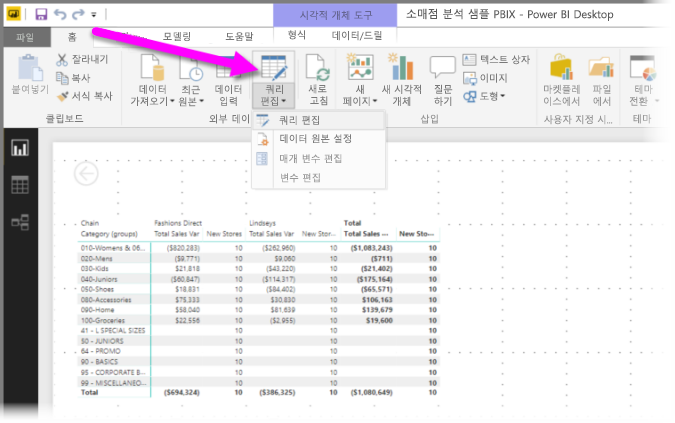
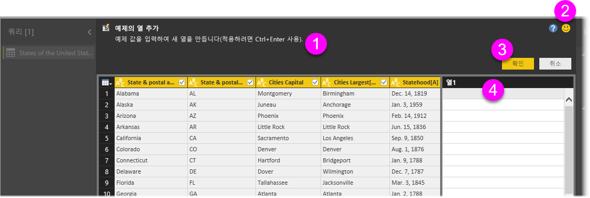

# Power BI Desktop에서 예제의 열 추가
**Power BI Desktop**의 2017년 4월 릴리스부터 **쿼리 편집기**를 사용하고 새 열에 대한 샘플 값을 하나 이상 제공하여 데이터의 새 열을 모델에 추가할 수 있습니다. 현재 선택 항목에서 새 열 예제를 만들거나 지정된 테이블의 모든(또는 선택한) 열을 기반으로 하여 입력을 제공할 수 있습니다.

이 방법을 통해 새 열을 빠르고 쉽게 만들 수 있으며 다음과 같은 경우에 유용합니다.

* 새 열에서 원하는 데이터 결과는 알고 있지만 어떤 변환(또는 변환 모음)을 사용할지는 모릅니다.
* 어떤 변환이 필요한지는 이미 알고 있지만 변환을 위해 UI에서 클릭 또는 선택할 위치를 모릅니다.
* **M**에서 *사용자 지정 열* 식을 사용하여 필요한 변환은 모두 알고 있지만 UI에서 클릭 또는 추가하는 데 이러한 식 중 하나 이상을 사용할 수 없습니다.

**예제의 열 추가** 기능을 사용하는 것은 쉽고 간편합니다. 다음 몇 개 섹션에서는 이 기능이 얼마나 쉬운지 알아봅니다.

## 쿼리 편집기를 사용하여 예제의 새 열 추가
예제의 새 열을 만들려면 **쿼리 편집기**를 시작합니다. **Power BI Desktop**의 **홈** 리본에서 **쿼리 편집**을 선택하여 이 작업을 수행할 수 있습니다.

웹 페이지에서 데이터를 가져오려면 **홈** 탭으로 이동하고, **데이터 가져오기 > 웹**을 차례로 클릭한 다음, 표시되는 대화 상자에 URL을 붙여넣습니다. 이 문서에서는 Wikipedia 문서의 데이터를 사용합니다. 다음 링크를 클릭하여 데이터를 가져와서 따라 해 보세요.

* [**미국의 주/지역 목록**](https://wikipedia.org/wiki/List_of_states_and_territories_of_the_United_States)

**쿼리 편집기**가 시작되고 일부 데이터가 로드되었으면 예제의 열 추가를 시작할 수 있습니다. 새 열을 추가하려면 **쿼리 편집기**에서 리본 메뉴의 **열 추가** 탭을 선택하고 **예제의 열**을 선택합니다. 드롭다운을 선택하면 **모든 열에서**(기본값, 드롭다운 대신 단추를 선택한 경우) 또는 **선택 항목에서**를 선택할 수 있습니다. 이 문서에서는 **모든 열에서**를 선택하는 과정을 안내합니다.

## 예제의 열 추가 창
예제의 새 열을 추가하도록 선택하면 현재 테이블의 열을 표시하는 새 창이 표시됩니다(모두 보려면 스크롤해야 할 수도 있음). 새 **Column1**도 오른쪽에 표시됩니다. 이는 **Power BI Desktop**에서 사용자 예제를 기반으로 하여 만드는 열입니다. 새 **Column1** 헤더 아래에는 Power BI에서 예제와 일치하는 규칙과 변환을 만드는 데 사용하는 예제를 입력할 수 있는 빈 셀이 있습니다.

**쿼리 설정** 창의 **적용된 단계**와도 동일함을 확인하세요. 언제나처럼, **쿼리 편집기**는 변환 단계를 기록하고 순서대로 쿼리에 적용합니다.

이를 **예제의 열 추가** 창이라고 하며 네 가지 기본 영역으로 구성됩니다.

1. **명령 모음**에는 기능 또는 변환에 대한 간략한 설명이 포함되어 있습니다.
2. **피드백 보내기** 옵션은 Power BI에서 해당 기능을 개선하는 데 도움이 됩니다.
3. **확인** 및 **취소** 단추를 통해 변환을 커밋하고 열을 추가하거나 취소할 수 있습니다.
4. 새 열 영역에서는 해당 행의 다른 열과 관련하여 모든 행의 샘플 값(Power BI에 예제 제공)을 입력할 수 있습니다.

새 열에 예제를 입력하면 Power BI에서 검색된 변환에 따라 작성 중인 열이 표시되는 모양을 미리 볼 수 있습니다. 예를 들어 첫 번째 행에 *Alabama*를 입력하면 테이블의 첫 번째 열에 있는 *Alabama* 값에 해당합니다. *Enter* 키를 누르는 즉시 Power BI에서 해당 값을 기반으로 하여 열을 채웁니다.

그러나 *Massachusetts[E]* 가 포함된 행으로 이동하고, 더 이상 필요하지 않기 때문에 마지막 *[E]* 부분을 삭제한다고 가정해 보겠습니다. Power BI에서 이 변경을 검색하고 예제를 사용하여 변환을 만듭니다. 맨 위 중간 창에서 변환에 대한 설명을 확인하세요.

예제를 계속 제공함에 따라 **쿼리 편집기**가 변환을 추가합니다. 결과가 만족스러우면 **확인**을 선택하여 변경 내용을 커밋할 수 있습니다.

## 실제 예제의 열 추가 창 보기
어떻게 작동하는지 보고 싶으신가요? 다음 비디오는 이 예제의 앞부분에서 제공된 데이터 원본을 사용하여 이 기능을 사용하는 모습을 보여줍니다. 비디오를 살펴보고 직접 따라 해 보세요!

<iframe width="560" height="315" src="https://www.youtube.com/embed/-ykbVW9wQfw" frameborder="0" allowfullscreen></iframe>

## 고려 사항 및 제한 사항
**예제의 열 추가**를 사용할 때 사용할 수 있는 다양한 변환이 있지만 일부 변환만 포함했습니다. 다음 목록에는 지원되는 모든 변환이 나와 있습니다.

* **참조**
  
  * 특정 열에 대한 참조(자르기, 정리 및 대소문자 변환 포함)

* **텍스트 변환**
  
  * 결합(리터럴 문자열 및 전체 열 값 조합 지원)
  * 바꾸기
  * 길이
  * 추출   
    * 첫 번째 문자
    * 마지막 문자
    * 범위
    * 구분 기호 앞 텍스트
    * 구분 기호 뒤 텍스트
    * 구분 기호 사이 텍스트
    * 길이

* **Power BI Desktop** 2017년 11월 릴리스부터는 다음 **텍스트 변환**이 지원됩니다.
    
  * 문자 제거
  * 문자 유지

> [!NOTE]
> 모든 *Text* 변환에서는 열 값으로 자르거나 정리하거나 대소문자 변환을 적용해야 하는 잠재성을 고려합니다.
> 
> 

* **날짜 변환**
  
  * 일
  * 요일
  * 요일 이름
  * 연간 일자
  * 월
  * 월 이름
  * 연간 사분기
  * 월간 주
  * 연간 주
  * 연도
  * 보존 기간
  * 연초
  * 연말
  * 월초
  * 월말
  * 분기초
  * 월의 일수
  * 분기말
  * 주초
  * 주말
  * 월간 일자
  * 하루 시작
  * 하루 끝

* **시간 변환**
  
  * 시간
  * 분
  * 초  
  * 현지 시간으로

> [!NOTE]
> 모든 *Date* 및 *Time* 변환에서는 열 값을 *Date*, *Time* 또는 *DateTime*으로 변환해야 하는 잠재성을 고려합니다.
> 
> 

* **숫자 변환** 

  * 절대값
  * 아크코사인
  * 아크사인
  * 아크탄젠트
  * 숫자로 변환
  * 코사인
  * 큐브
  * 나누기
  * 지수
  * 계승
  * 정수 나누기
  * 짝수
  * 홀수
  * Ln
  * 상용 로그
  * 모듈로
  * 곱하기
  * 내림
  * 올림
  * 부호
  * 사인
  * 제곱근
  * 제곱
  * 빼기
  * 합계
  * 탄젠트

* **Power BI Desktop** 2017년 11월 릴리스부터는 다음 **숫자 변환**이 지원됩니다.

  * 버킷팅/범위

* **일반**
  
  * 조건부 열