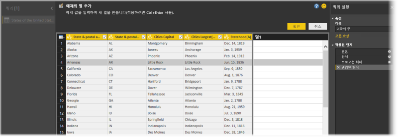
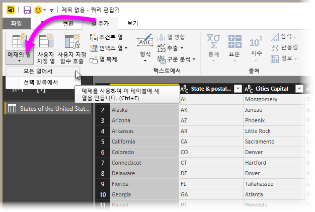
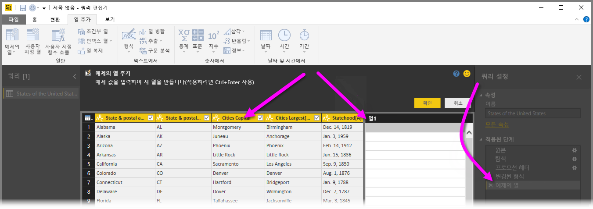
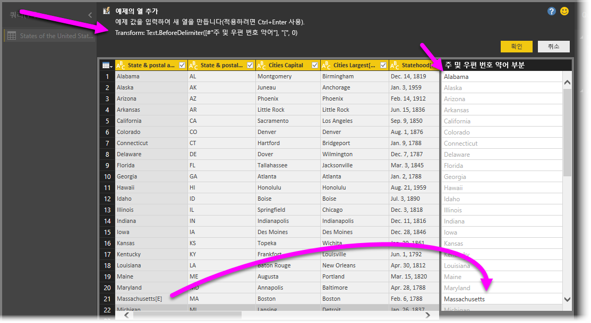

# Power BI Desktop의 예제에서 열 추가
Power Query 편집기에서 ‘예제에서 열 추가’를 사용하면 새 열에 하나 이상의 예제 값을 제공하여 데이터 모델에 새 열을 추가할 수 있습니다. 선택 영역에서 새 열 예제를 만들거나 테이블의 모든 기존 열을 기반으로 입력을 제공할 수 있습니다.

‘예제에서 열 추가’를 사용하면 빠르고 쉽게 새 열을 만들 수 있으며 다음과 같은 상황에서 유용합니다.

- 새 열에서 원하는 데이터는 알고 있지만 어떤 변환(또는 변환 컬렉션)을 사용할지는 모릅니다.
- 어떤 변환이 필요한지는 이미 알고 있지만 변환을 수행하기 위해 UI에서 무엇을 선택해야 할지 모릅니다.
- ‘M’에서 ‘사용자 지정 열’ 식을 사용하여 필요한 변환은 모두 알고 있지만 UI에서 이러한 식 중 하나 이상을 사용할 수 없습니다.

예제에서 열을 추가하는 것은 쉽고 간단합니다. 다음 섹션에서는 이 작업이 얼마나 쉬운지 보여줍니다.

## 예제에서 새 열 추가

위키백과에서 샘플 데이터를 가져오려면 Power BI Desktop 리본의 **홈** 탭에서 **데이터 가져오기** > **웹**을 선택합니다. 

표시되는 대화 상자에 다음 URL을 붙여넣고 **확인**을 선택합니다. 

*https:\///wikipedia.org/wiki/List_of_states_and_territories_of_the_United_States*

**탐색기** 대화 상자에서 **미국의 주** 테이블을 선택한 다음 **데이터 변환**을 선택합니다. Power Query 편집기에서 테이블이 열립니다.

또는 Power BI Desktop에서 이미 로드된 데이터를 열려면 리본의 **홈** 탭에서 **쿼리 편집**을 선택합니다. Power Query 편집기에서 데이터가 열립니다. 

샘플 데이터가 Power Query 편집기에서 열리면 리본에서 **열 추가** 탭을 선택한 다음 **예제에서 열**을 선택합니다. **예제의 열** 아이콘 자체를 선택하여 모든 기존 열에서 열을 만들거나 드롭다운 화살표를 선택하여 **모든 열에서** 또는 **선택 항목에서** 하나를 선택합니다. 이 연습에서는 **모든 열에서**를 사용합니다.

## 예제 창에서 열 추가
**예제에서** **열 추가** > 를 선택하면 테이블 맨 위에 **예제에서 열 추가** 창이 열립니다. 새 **열 1**이 기존 열의 오른쪽에 표시됩니다(모두 보려면 스크롤해야 할 수 있습니다). **열 1**의 빈 셀에 예제 값을 입력하면 Power BI에서 예제와 일치하는 규칙과 변환을 만들어 나머지 열을 채우는 데 사용할 수 있습니다.

**예제의 열**은 **쿼리 설정** 창의 **적용된 단계**로도 나타납니다. 언제나처럼, Power Query 편집기는 변환 단계를 기록하고 순서대로 쿼리에 적용합니다.

새 열에 예제를 입력하면 Power BI에서 만든 변환을 기반으로 나머지 열이 어떤 모양으로 표시되는지 미리 볼 수 있습니다. 예를 들어 첫 번째 행에 *Alabama*를 입력하면 테이블의 첫 번째 열에 있는 **Alabama** 값에 해당합니다. Enter 키를 누르면 Power BI는 첫 번째 열 값을 기준으로 새 열의 나머지 부분을 채우고 열 이름을 **이름 & 우편 약자[12] - 복사**로 지정합니다.

이제 새 열의 **Massachusetts[E]** 행으로 이동하여 문자열의 **[E]** 부분을 삭제합니다. Power BI에서 이 변경을 검색하고 예제를 사용하여 변환을 만듭니다. Power BI는 **예제에서 열 추가** 창에서 변환을 설명하고 열 이름을 **구분 기호 전 텍스트**로 바꿉니다. 

예제를 계속 제공함에 따라 Power Query 편집기가 변환을 추가합니다. 결과가 만족스러우면 **확인**을 선택하여 변경 내용을 커밋합니다. 

열 제목을 두 번 클릭하거나 마우스 오른쪽 단추를 클릭하고 **이름 바꾸기**를 선택하여 새 열 이름을 원하는 대로 바꿀 수 있습니다. 

샘플 데이터 원본을 사용하여 작업에서 **예제에서 열 추가**를 보려면 이 비디오를 시청하세요. 

[Power BI Desktop: 예제에서 열 추가](https://www.youtube.com/watch?v=-ykbVW9wQfw) 

## 지원되는 변환 목록
**예제에서 열 추가**를 사용할 때 대부분의 변환을 사용할 수 있습니다. 다음 목록에서는 지원되는 변환을 보여줍니다.

**일반**

- 조건부 열

**참조**
  
- 특정 열에 대한 참조(자르기, 정리 및 대소문자 변환 포함)

**텍스트 변환**

- 결합(리터럴 문자열 및 전체 열 값 조합 지원)
- 바꾸기
- 길이
- 추출   
  - 첫 번째 문자
  - 마지막 문자
  - 범위
  - 구분 기호 앞 텍스트
  - 구분 기호 뒤 텍스트
  - 구분 기호 사이 텍스트
  - 길이
  - 문자 제거
  - 문자 유지

> [!NOTE]
> 모든 *Text* 변환에서는 열 값으로 자르거나 정리하거나 대소문자 변환을 적용해야 하는 잠재성을 고려합니다.

**날짜 변환**

- Day
- 요일
- 요일 이름
- 연간 일자
- 월
- 월 이름
- 연간 사분기
- 월간 주
- 연간 주
- 년
- 연령
- 연초
- 연말
- 월의 시작
- 월말
- 분기 시작
- 월의 일수
- 분기의 마지막 날짜
- 주초
- 주말
- 월간 일자
- 하루 시작
- 하루 끝

**시간 변환**

- Hour
- 분
- Second  
- 현지 시간으로

> [!NOTE]
> 모든 *Date* 및 *Time* 변환에서는 열 값을 *Date*, *Time* 또는 *DateTime*으로 변환해야 하는 잠재성을 고려합니다.

**숫자 변환** 

- 절대값
- 아크코사인
- 아크사인
- 아크탄젠트
- 숫자로 변환
- 코사인
- 큐브
- 나누기
- 지수
- 계승
- 정수 나누기
- 짝수
- 홀수
- Ln
- 상용 로그
- 모듈로
- 곱하기
- 내림
- 올림
- 부호
- 사인
- 제곱근
- 제곱
- 빼기
- 합계
- 탄젠트
- 버킷팅/범위

