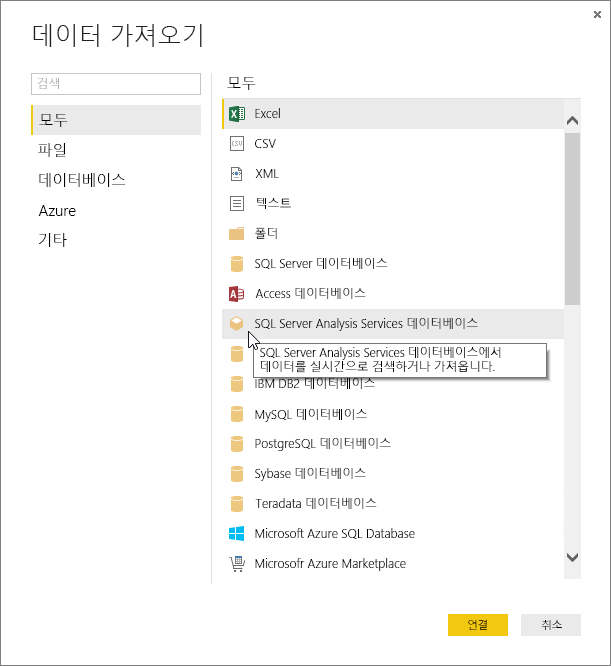
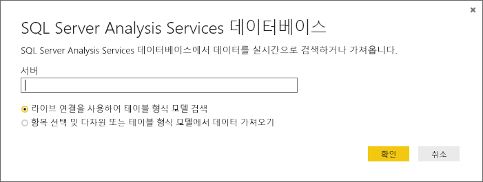
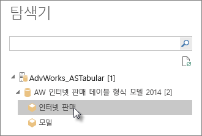
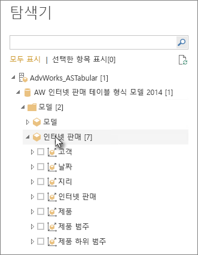
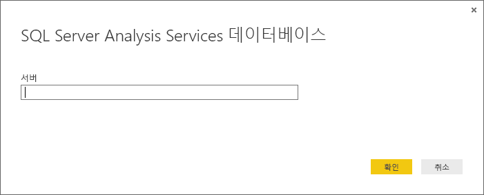

# Power BI Desktop의 Analysis Services 테이블 형식 데이터 사용
Power BI Desktop에서는 라이브 연결을 통한 탐색이나, 항목 선택 후 Power BI Desktop에 가져오기 등, 두 가지 방법으로 SQL Server Analysis Services 테이블 형식 모델에 연결하고 데이터를 가져올 수 있습니다. 

측정값에 대해 좀 더 자세히 살펴보겠습니다.

**라이브 연결을 사용한 탐색** – 라이브 연결을 사용할 때는 테이블, 열, 측정치와 마찬가지로, 테이블 형식 모델이나 큐브 뷰의 항목이 Power BI Desktop 필드 목록에 표시됩니다. Power BI Desktop의 고급 시각화 및 보고 도구를 사용하여 테이블 형식 모델을 상호 작용성 높은 새로운 방식으로 탐색할 수 있습니다.

라이브 연결에서는 테이블 형식 모델의 데이터를 Power BI Desktop으로 가져오지 않습니다. 시각화와 상호 작용할 때마다 Power BI Desktop이 테이블 형식 모델을 쿼리하고 사용자에게 제시할 결과를 산출합니다. 사용자에게는 항상 최신 데이터가 표시됩니다. 테이블 형식 모델은 매우 안전합니다. Power BI Desktop에 표시되는 항목은 연결한 테이블 형식 모델에 대한 사용자의 권한에 따라 달라집니다.

Power BI Desktop에 동적 보고서를 만들 경우 Power BI 사이트에 게시하여 공유할 수 있습니다. 테이블 형식 모델에 대한 라이브 연결이 있는 Power BI Desktop 파일을 Power BI 사이트에 게시할 때는 관리자가 온-프레미스 데이터 게이트웨이를 설치하여 구성해야 합니다. 자세한 내용은 [온-프레미스 데이터 게이트웨이](service-gateway-onprem.md)를 참조하세요.

**항목을 선택하고 Power BI Desktop에 가져오기** – 이 옵션으로 연결할 때는 테이블 형식 모델이나 큐브 뷰의 테이블, 열, 측정치 등과 같은 항목을 선택하여 Power BI Desktop 모델에 로드할 수 있습니다. Power BI Desktop의 고급 쿼리 편집기를 사용하여 추가적인 조정을 수행할 수 있습니다. Power BI Desktop의 모델링 기능을 사용하여 데이터의 추가적인 모델링이 가능합니다. Power BI Desktop과 테이블 형식 모델 간의 라이브 연결은 유지되지 않습니다. 때문에 Power BI Desktop 모델을 오프라인으로 탐색하거나 Power BI 사이트에 게시할 수 있습니다.

## 테이블 형식 모델에 연결하려면
1. Power BI 데스크톱에서 **홈** 탭을 클릭하고 **데이터 가져오기**를 클릭합니다.
   
   
2. **SQL Server Analysis Services 데이터베이스**를 클릭하고 **연결**을 클릭합니다.
   
   
3. 서버 이름을 입력하고 연결 모드를 선택합니다. 
   
   
4. 이 단계는 선택한 연결 모드에 따라 달라집니다.

* 탐색기에서 라이브로 연결한 경우 테이블 형식 모델 또는 큐브 뷰를 선택합니다.
  
  
* 탐색기에서 항목을 선택하고 데이터를 가져온 경우 테이블 형식 모델 또는 큐브 뷰를 선택합니다. 특정 테이블 또는 열만 로드하도록 선택할 수도 있습니다. 로드하기 전에 데이터를 구체화하려면 편집을 클릭하여 쿼리 편집기를 엽니다. 준비가 되면 로드를 클릭하여 Power BI Desktop에 데이터를 가져옵니다.

## 질문과 대답
**질문:** 온-프레미스 데이터 게이트웨이가 필요한가요?

**응답:** 경우에 따라 다릅니다. Power BI Desktop을 사용하여 테이블 형식 모델에 라이브로 연결하나 Power BI 사이트에 게시하지는 않으려는 경우 게이트웨이가 필요하지 않습니다. 반면에 Power BI 사이트에 게시하려는 경우, Power BI 서비스와 온-프레미스 Analysis Services 서버 간의 안전한 통신을 위해 데이터 게이트웨이가 필요합니다. 데이터 게이트웨이를 설치하기 전에 Analysis Services 서버 관리자에게 문의해야 합니다.

항목을 선택하고 데이터를 가져올 경우 Power BI Desktop 파일에 테이블 형식 모델 데이터를 직접 가져오는 것이므로 게이트웨이가 필요하지 않습니다.

**질문:** Power BI 서비스에서 테이블 형식 모델에 라이브로 연결하는 것과, Power BI Desktop에서 라이브로 연결하는 것에는 어떤 차이가 있나요?

**응답:** Power BI 서비스 사이트에서 회사의 온-프레미스 Analysis Services 데이터베이스로 가는 테이블 형식 모델에 라이브로 연결할 때는 둘 사이의 안전한 통신을 위해 온-프레미스 데이터 게이트웨이가 필요합니다. Power BI Desktop에서 테이블 형식 모델에 라이브로 연결할 때는 연결하려는 Power BI Desktop과 Analysis Services 서버가 모두 회사에서 온-프레미스로 실행 중이기 때문에 게이트웨이가 필요하지 않습니다. 그러나 Power BI Desktop 파일을 Power BI 사이트에 게시할 경우 게이트웨이가 필요합니다.

**질문:** 라이브 연결을 만든 경우 동일한 Power BI Desktop 파일에서 다른 데이터 원본에 연결할 수 있나요?

**응답:** 아니요. 같은 파일에서 라이브 데이터를 탐색하고 다른 유형의 데이터 원본에 연결할 수 없습니다. 이미 데이터를 가져왔거나 Power BI Desktop 파일의 다른 데이터 원본에 연결한 경우 라이브 탐색을 위해 새 파일을 만들어야 합니다.

**질문:** 라이브 연결을 만든 경우 Power BI Desktop에서 모델 또는 쿼리를 편집할 수 있나요?

**답변:** Power BI Desktop에서 보고서 수준 측정값을 만들 수 있지만 다른 모든 쿼리 및 모델링 기능은 라이브 데이터 탐색 시 사용할 수 없습니다.

**질문:** 만든 라이브 연결은 안전한가요?

**답변:** 예. 현재 Windows 자격 증명을 사용하여 Analysis Services 서버에 연결합니다. 라이브 탐색 중에는 Power BI 서비스 또는 Power BI Desktop에서 기본 또는 저장된 자격 증명을 사용할 수 없습니다.

**질문:** 탐색기에서 모델 및 큐브 뷰가 보입니다. 차이점은 무엇인가요?

**응답:** 큐브 뷰는 테이블 형식 모델의 특정 뷰입니다. 여기에는 고유의 데이터 분석 필요에 따라 특정 테이블, 열 또는 측정치만 포함될 수 있습니다. 테이블 형식 모델에는 하나 이상의 큐브 뷰가 포함되어 모델에 모든 것을 담을 수 있습니다. 무엇을 선택할지 확실히 모르겠으면 관리자에게 확인합니다.

## 최초 연결 후 서버 이름을 변경하려면
탐색 라이브 연결이 있는 Power BI Desktop 파일을 만든 후 다른 서버로의 연결 전환이 필요한 상황이 발생할 수 있습니다. 예를 들어, 개발 서버에 연결할 때 Power BI Desktop 파일을 만들었으며 Power BI 서비스에 게시하기 전에 프러덕션 서버로 연결을 전환하려는 경우가 있습니다.

1. 리본 메뉴에서 **쿼리 편집**을 선택합니다.
   
   
2. 새 서버 이름을 입력합니다.
   
   

