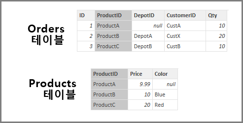
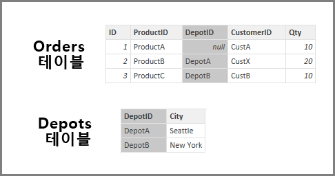
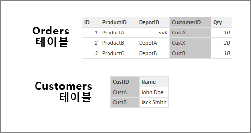

# Power BI Desktop의 참조 무결성 설정 가정
**DirectQuery**를 사용하여 데이터 원본에 연결할 때 **참조 무결성 가정** 선택 항목을 사용하여 데이터 원본에 대해 더 효율적인 쿼리를 실행할 수 있습니다. 이 기능에는 기본 데이터의 몇 가지 요구 사항이 있으며 **DirectQuery**를 사용하는 경우에만 사용 가능합니다.

**참조 무결성 가정** 설정을 통해 데이터 원본에 대한 쿼리가 **OUTER JOIN** 대신 쿼리 효율을 개선하는 **INNER JOIN** 문을 사용하도록 합니다.

## 참조 무결성 가정 사용에 대한 요구 사항
이는 고급 설정이며 **DirectQuery**를 사용하여 데이터에 연결할 때만 사용할 수 있습니다. **참조 무결성 가정**이 제대로 작동하려면 다음과 같은 요구 사항이 필요합니다.

* 관계에서 **From** 열의 데이터는 *Null* 또는 *공백* 이 아닙니다.
* **From** 열의 각 값의 경우 **To** 열에 해당 값이 있습니다.

이 컨텍스트에서 **From** 열은 *일 대 다* 관계에서 *다* 이거나 *일 대 일* 관계에서 첫 번째 테이블의 열입니다.

## 참조 무결성 가정 사용의 예
다음 예제에서는 데이터 연결에 사용될 때 **참조 무결성 가정**이 동작하는 방식을 설명합니다. 예제는 **Orders** 테이블, **Products** 테이블 및 **Depots** 테이블을 포함하는 데이터 원본에 연결합니다.

1. **Orders** 테이블 및 **Products** 테이블을 보여 주는 다음 그림에서 **Orders[ProductID]** 및 **Products[ProductID]** 사이에 참조 무결성이 있습니다. **Orders** 테이블의 **[ProductID]** 열은 *Null* 이 아니며 모든 값은 **Products** 테이블에도 나타납니다. 따라서 **참조 무결성 가정**은 더 효율적인 쿼리를 가져오도록 설정되어야 합니다(이 설정 사용으로 시각적 개체에 표시되는 값이 변경되지 않음).
   
   
2. 다음 이미지에서 **DepotID**가 일부 *Orders*에 대해 *Null*이므로 **Orders[DepotID]** 및 **Depots[DepotID]** 사이에 참조 무결성이 없습니다. 따라서 **참조 무결성 가정**은 설정되지 *않아야* 합니다.
   
   
3. 마지막으로 다음 테이블에서 **Orders[CustomerID]** 및 **Customers[CustID]** 사이에 참조 무결성이 없습니다. **CustomerID**는 *Customers* 테이블에 존재하지 않는 일부 값(이 경우 *CustX*)을 포함합니다. 따라서 **참조 무결성 가정**은 설정되지 *않아야* 합니다.
   
   

## 참조 무결성 가정 설정
이 기능을 사용하려면 다음 그림에 나와 있는 것처럼 **참조 무결성 가정** 옆의 확인란을 선택합니다.

선택하면 *Null* 또는 일치하지 않는 행이 없는 것을 확인하도록 데이터에 대한 설정의 유효성이 검사됩니다. *그러나* 매우 큰 숫자의 값인 경우 유효성 검사는 참조 무결성 문제가 없다는 것을 보장하지 않습니다.

또한 유효성 검사는 관계 편집 시 발생하고 데이터에 대해 후속 변경 내용을 반영하지 *않습니다* .

## 참조 무결성 가정을 올바르게 설정하지 않는 경우 어떻게 됩니까?
데이터에 참조 무결성 문제가 있을 때 **참조 무결성 가정**을 설정하는 경우 오류가 발생하지 않습니다. 그러나 데이터에 명백한 불일치가 발생합니다. 예를 들어 위에서 설명한 **Depots** 테이블에 대한 관계의 경우 다음과 같은 결과가 발생합니다.

* 총 *Order Qty*를 보여 주는 시각적 개체는 40의 값을 표시
* 총 *Order Qty by Depot City*를 보여 주는 시각적 개체는 **DepotID**가 *Null*인 Order ID 1을 포함하지 않으므로 *30*의 총 값만을 표시합니다.

## 다음 단계
[DirectQuery](desktop-use-directquery.md)에 대해 자세히 알아보기

[Power BI의 관계](desktop-create-and-manage-relationships.md)에 대한 자세한 내용 알아보기

[Power BI Desktop의 관계 보기](desktop-relationship-view.md)에 대해 자세히 알아봅니다.

