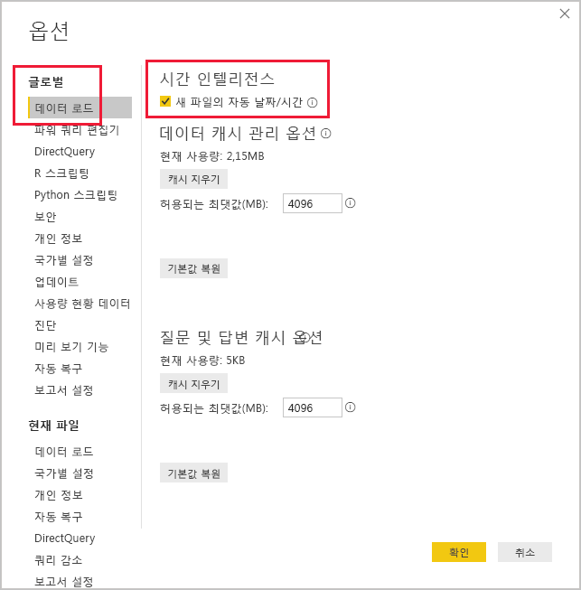

# <a name="apply-auto-datetime-in-power-bi-desktop"></a>Power BI Desktop의 자동 날짜/시간 적용

이 문서에서는 Power BI Desktop에서 가져오기 또는 복합 모델을 개발하는 데이터 모델러를 대상으로 합니다. _자동 날짜/시간_ 옵션을 소개하고 설명합니다.

자동 날짜/시간은 Power BI Desktop의 데이터 로드 옵션입니다. 이 옵션은 모델에 로드된 날짜 열을 기준으로 편리한 시간 인텔리전스 보고를 지원하기 위한 것입니다. 특히, 데이터 모델을 사용하는 보고서 작성자는 달력 기간(년, 분기, 월, 일)을 사용하여 필터링, 그룹화 및 드릴다운할 수 있습니다. 중요한 점은 시간 인텔리전스 기능을 명시적으로 개발할 필요가 없다는 것입니다.

이 옵션을 사용하도록 설정되면 다음 조건에 모두 해당하는 경우 Power BI Desktop에서 각 날짜 열에 대해 숨겨진 자동 날짜/시간 테이블을 만듭니다.

- 테이블 스토리지 모드가 가져오기입니다.
- 열은 계산된 열이 아닙니다.
- 열 데이터 형식이 날짜 또는 날짜/시간입니다.
- 열이 모델 관계의 "다" 쪽이 아닙니다.

## <a name="how-it-works"></a>작동 방법

각 자동 날짜/시간 테이블은 실제로 DAX [CALENDAR](/dax/calendar-function-dax) 함수를 사용하여 데이터 행을 생성하는 [계산 테이블](desktop-calculated-tables.md)입니다. 또한 각 테이블에는 **Day**, **MonthNo**, **Month**, **QuarterNo**, **Quarter** 및 **Year**의 6개 계산 열이 포함되어 있습니다.

> [!NOTE]
> Power BI는 [모델 언어](supported-languages-countries-regions.md#choose-the-language-for-the-model-in-power-bi-desktop)에 따라 열 이름과 값을 변환하고 서식을 지정합니다.

Power BI Desktop에서 자동 날짜/시간 테이블의 **Date** 열과 모델 날짜 열 사이의 관계를 만듭니다.

자동 날짜/시간 테이블에는 모델 날짜 열에 저장된 모든 날짜 값을 포함하는 전체 달력 연도가 포함됩니다. 예를 들어 날짜 열의 가장 이른 값이 2016년 3월 20일이고, 최신 값이 2019년 10월 23일이면 테이블에 1,461개의 행이 포함됩니다. 2016년부터 2019년까지 4년 동안 각 날짜에 대해 한 행씩 나타냅니다. Power BI가 모델을 새로 고치면 각 자동 날짜/시간 테이블도 새로 고쳐집니다. 이러한 방식으로 모델에는 항상 날짜 열 값을 포함하는 날짜가 포함됩니다.

자동 날짜/시간 테이블의 행을 볼 수 있으면 다음과 같이 표시될 수 있습니다.


> [!NOTE]
> 자동 날짜/시간 테이블은 모델러에서도 영구적으로 숨겨집니다. 이러한 테이블은 **필드** 창 또는 모델 보기 다이어그램에서 볼 수 없으며, 데이터 보기에서 해당 행을 볼 수 없습니다. 또한 DAX 식에서도 테이블과 해당 열을 직접 참조할 수 없습니다.
>
> 또한 [Excel에서 분석](service-analyze-in-excel.md)을 사용하거나 Power BI가 아닌 보고서 디자이너를 사용하는 모델에 연결하는 경우에도 사용할 수 없습니다.

이 테이블은 계층 구조를 정의하여 연도, 분기, 월 및 일 수준까지의 드릴다운 경로도 시각적 개체에 제공합니다.

모델 보기 다이어그램에서 자동 날짜/시간 테이블을 볼 수 있으면 다음과 같이 표시될 수 있습니다(관계 열이 강조 표시됨).

![숨겨진 자동 날짜/시간 테이블의 예는 다음과 같습니다. 두 테이블, 즉 Sales 및 LocalDateTime 테이블을 표시하고 있습니다. 이러한 테이블의 관계는 Sales 테이블의 OrderDate 열과 LocalDateTime 테이블의 Date 열을 기반으로 합니다. LocalDateTime은 7개 열, 즉 Date, Day, Month, MonthNo, Quarter, QuarterNo, Year 열과 단일 계층을 정의하고 있습니다. 이 계층은 명명된 [날짜 계층]이며, Year, Quarter, Month 및 Day의 네 가지 수준으로 구성되어 있습니다.](media/desktop-auto-date-time/auto-date-time-hidden-table-example-diagram.png)

## <a name="work-with-auto-datetime"></a>자동 날짜/시간 작업

날짜 열에 대한 자동 날짜/시간 테이블이 있고 해당 열이 표시되는 경우 보고서 작성자는 **필드** 창에서 해당 열을 필드로 찾지 않습니다. 대신 날짜 열의 이름을 사용하는 확장 가능한 개체를 찾습니다. 달력 아이콘으로 표시되어 있으므로 쉽게 식별할 수 있습니다. 보고서 작성자가 달력 개체를 확장하면 **날짜 계층**이라는 계층이 검색됩니다. 이 계층을 확장하면 **Year**, **Quarter**, **Month** 및 **Day**의 네 가지 수준을 확인할 수 있습니다.

![확장된 Sales 테이블이 열려 있는 필드 창의 예입니다. 달력 아이콘으로 표시된 OrderDate 필드가 있습니다. 이 필드는 확장된 상태로 열려 있으며, [날짜 계층]이라는 계층이 있습니다. 이 계층도 확장되며, Year, Quarter, Month 및 Day의 네 가지 수준이 있습니다.](media/desktop-auto-date-time/auto-date-time-fields-pane-example.png)

자동 날짜/시간에서 생성한 계층을 사용하여 일반 계층을 사용할 수 있는 것과 똑같은 방법으로 시각적 개체를 구성할 수 있습니다. 시각적 개체는 전체 **날짜 계층** 계층 구조 또는 계층의 특정 수준을 사용하여 구성할 수 있습니다.

그러나 일반 계층에서 지원하지 않는 하나의 추가 기능이 있습니다. 자동 날짜/시간 계층(또는 계층의 수준)이 시각적 웰에 추가되면 보고서 작성자가 계층 또는 날짜 열의 사용 간에 전환할 수 있습니다. 이 방법은 계층과 해당 수준이 아니라, 날짜 열만 필요한 경우 일부 시각적 개체에 적합합니다. 먼저 시각적 필드를 구성한(마우스 오른쪽 단추로 시각적 필드를 클릭하거나 아래쪽 화살표를 클릭함) 다음, 상황에 맞는 메뉴를 사용하여 날짜 열 또는 날짜 계층 간에 전환하여 시작합니다.

![OrderDate 계층에 대한 시각적 필드 구성의 예입니다. 열린 상황에 맞는 메뉴에는 설정/해제를 통해 OrderDate 열 또는 [날짜 계층]을 사용할 수 있는 두 가지 옵션이 표시됩니다.](media/desktop-auto-date-time/auto-date-time-configure-visuals-fields.png)

마지막으로 DAX로 작성된 모델 계산에서는 날짜 열을 _직접_ 참조하거나 숨겨진 자동 날짜/시간 테이블 열을 _간접적으로_ 참조할 수 있습니다.

Power BI Desktop에서 작성된 수식은 일반적인 방법으로 날짜 열을 참조할 수 있습니다. 그러나 자동 날짜/시간 테이블 열은 특수 확장 구문을 사용하여 참조해야 합니다. 먼저 날짜 열을 참조한 다음, 마침표(.)가 뒤에 나옵니다. 그러면 수식 입력줄 자동 완성을 통해 자동 날짜/시간 테이블에서 열을 선택할 수 있습니다.

![수식 입력줄에 DAX 측정값 식을 입력하는 경우의 예입니다. 지금까지의 수식은 Date Count = COUNT(Sales[OrderDate]입니다. 그리고 자동 완성 목록에서는 숨겨진 자동 날짜/시간 테이블의 7개 열을 모두 표시하고 있습니다. 이러한 열은 Date, Day, Month, MonthNo, Quarter, QuarterNo 및 Year입니다.](media/desktop-auto-date-time/auto-date-time-dax-auto-complete.png)

Power BI Desktop에서 유효한 측정값 식은 다음과 같이 읽을 수 있습니다.

```dax
Date Count = COUNT(Sales[OrderDate].[Date])
```

> [!NOTE]
> 이 측정값 식은 Power BI Desktop에서 유효하지만 DAX 구문이 올바르지 않습니다. Power BI Desktop은 실제(숨겨진) 자동 날짜/시간 테이블 열을 참조하도록 내부적으로 식을 치환합니다.

## <a name="configure-auto-datetime-option"></a>자동 날짜/시간 옵션 구성

자동 날짜/시간은 _전역적으로_ 또는 _현재 파일_에 대해 구성할 수 있습니다. 글로벌 옵션은 새 Power BI Desktop 파일에 적용되며, 언제든지 설정하거나 해제할 수 있습니다. Power BI Desktop을 새로 설치하는 경우 두 옵션이 모두 기본적으로 설정되어 있습니다.

현재 파일 옵션도 언제든지 설정하거나 해제할 수 있습니다. 설정되면 자동 날짜/시간 테이블이 만들어집니다. 해제되면 자동 날짜/시간 테이블이 모델에서 제거됩니다.

> [!CAUTION]
> 현재 파일 옵션을 해제하는 경우 자동 날짜/시간 테이블이 제거되므로 주의해야 합니다. 손상된 보고서 필터 또는 이를 사용하도록 구성된 시각적 개체를 수정해야 합니다.

Power BI Desktop에서 _파일 > 옵션 및 설정 > 옵션_을 차례로 선택한 다음, **글로벌** 또는 **현재 파일** 페이지를 선택합니다. 둘 중 한 페이지에서, 이 옵션은 **시간 인텔리전스** 섹션 아래에 있습니다.



## <a name="next-steps"></a>다음 단계

이 문서와 관련된 보다 자세한 내용을 알아보려면 다음 리소스를 참조하세요.

- [Power BI Desktop의 자동 날짜/시간 지침](guidance/auto-date-time.md)
- [Power BI Desktop에서 날짜 테이블 설정 및 사용](desktop-date-tables.md)
- 궁금한 점이 더 있나요? [Power BI 커뮤니티에 질문합니다.](https://community.powerbi.com/)
- 제안? [Power BI 개선을 위한 아이디어 제공](https://ideas.powerbi.com/)
