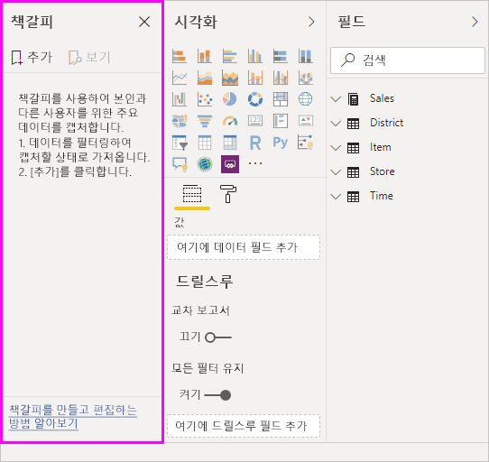
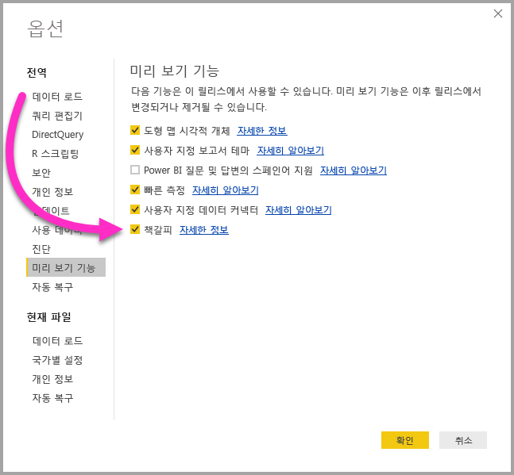
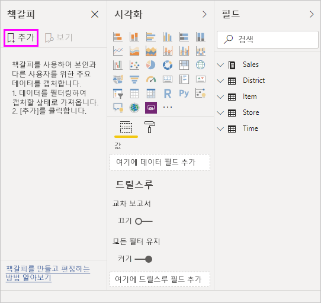
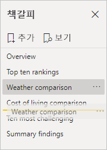
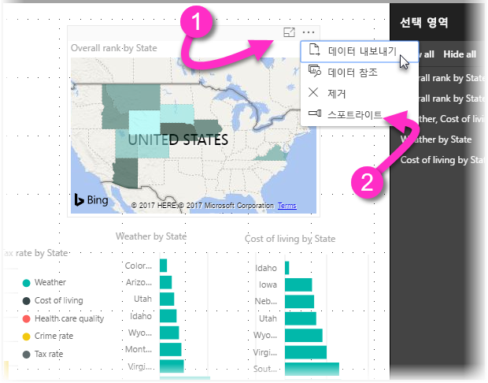

# 책갈피를 사용하여 Power BI에서 정보 공유 및 스토리 빌드 
Power BI에서 **책갈피**를 사용하여 시각적 개체의 상태를 비롯한 보고서 페이지의 현재 구성된 보기를 캡처하고 저장된 해당 책갈피를 선택하여 나중에 해당 상태로 돌아갈 수 있습니다. 

책갈피의 컬렉션을 만들고, 원하는 순서로 정렬하고, 이후에 프레젠테이션에서 각 책갈피를 자세히 알아보아서 일련의 정보 및 시각적 개체와 보고서에서 원하는 스토리를 강조 표시할 수도 있습니다. 

책갈피에는 다양한 용도가 있습니다. 책갈피를 사용하여 보고서를 만드는 고유한 과정을 추적하고(책갈피는 쉽게 추가, 삭제, 이름 바꾸기 가능) 책갈피를 만들어서 순서대로 책갈피를 알아보는 PowerPoint 같은 프레젠테이션을 빌드할 수 있습니다. 이렇게 보고서에서 스토리를 만들 수 있습니다. 책갈피를 가장 잘 사용할 수 있는 방법에 따라 다른 용도로 사용될 수 있습니다.

### 책갈피 미리 보기(2018년 3월 이전 버전) 사용
Power BI Desktop 2018년 3월 버전부터 책갈피가 일반 공급됩니다. 

항상 가장 최근 릴리스로 업그레이드하는 것이 좋습니다. 그러나 Power BI Desktop의 버전이 이 릴리스보다 이전 버전인 경우 **Power BI Desktop**의 **2017년 10월** 릴리스 및 **Power BI 서비스**의 책갈피 사용 가능 보고서에서부터는 **책갈피** 기능을 사용할 수 있습니다. 미리 보기 기능을 사용하려면 **파일 > 옵션 및 설정 > 옵션 > 미리 보기 기능**을 선택한 다음, **책갈피** 옆에 있는 확인란을 선택합니다. 

책갈피의 미리 보기 버전을 사용하도록 선택한 후 **Power BI Desktop**을 다시 시작해야 합니다.

## 책갈피 사용
책갈피를 사용하려면 **보기** 리본을 선택한 다음 **책갈피 창**의 확인란을 선택합니다. 

책갈피를 만들 때 책갈피에서 다음과 같은 요소가 저장됩니다.

* 현재 페이지
* 필터
* 슬라이서 유형(예: 드롭다운 또는 목록) 및 슬라이서 상태를 포함한 슬라이서
* 시각적 개체 선택 상태(예: 필터 상호 강조 표시)
* 정렬 순서
* 드릴 위치
* 표시 유형(**선택** 창을 사용하는 개체)
* 표시 되는 개체의 포커스 또는 **스포트라이트** 모드

책갈피에 표시하려는 대로 보고서 페이지를 구성합니다. 보고서 페이지 및 시각적 개체가 원하는 대로 정렬되면 **책갈피** 창에서 **추가**를 선택하여 책갈피를 추가합니다. 

**Power BI Desktop**은 책갈피를 만들고 일반 이름을 제공합니다. 책갈피 이름 옆에 있는 줄임표를 선택한 다음, 나타나는 메뉴에서 작업을 선택하여 쉽게 책갈피의 *이름을 바꾸*거나 책갈피를 *삭제* 또는 *업데이트*할 수 있습니다.

책갈피를 만들면 **책갈피** 창에서 책갈피를 클릭하여 표시할 수 있습니다. 

각 책갈피가 ‘데이터’ 속성(예: 필터 및 슬라이서), ‘표시’ 속성(예: 추천 및 표시 유형) 및 책갈피를 추가할 때 표시된 페이지를 나타내는 페이지 변경 내용을 적용할지 여부도 선택할 수 있습니다. 이러한 기능은 책갈피를 사용하여 시각적 개체 유형 간에 전환하는 경우 유용합니다. 이 경우 데이터 속성을 끄려고 하므로 사용자가 시각적 개체 유형을 변경할 때 필터가 다시 설정되지 않습니다. 

이렇게 변경하려면 이전 이미지에 표시된 대로 책갈피 이름 옆에 있는 줄임표를 선택하거나, *데이터*, *표시* 및 기타 컨트롤 옆에 있는 확인 표시를 선택 취소합니다. 

## 책갈피 정렬
책갈피를 만드는 경우 만드는 순서는 대상 그룹에 표시하는 것과 반드시 동일한 순서는 아닐 수 있습니다. 걱정하지 마세요. 책갈피의 순서를 쉽게 재정렬할 수 있습니다.

**책갈피** 창에서 해당 순서를 변경하려면 다음 이미지에 나와 있는 대로 책갈피를 끌어서 놓기만 하면 됩니다. 책갈피 사이의 노란색 표시줄은 끌어온 책갈피를 배치할 위치를 지정합니다.

책갈피 순서는 다음 섹션에 설명된 대로 책갈피의 **보기** 기능을 사용하는 경우에 중요해집니다.

## 슬라이드 쇼로 책갈피
표시하려는 책갈피의 컬렉션이 있는 경우 순서에서 **책갈피** 창의 **보기**를 선택하여 슬라이드 쇼를 시작할 수 있습니다.

**보기** 모드인 경우 알아야 할 몇 가지 기능은 다음과 같습니다.

1. 책갈피의 이름은 캔버스 맨 아래에 표시되는 책갈피 제목 표시줄에 나타납니다.
2. 책갈피 제목 표시줄에는 다음 또는 이전 책갈피로 이동할 수 있도록 화살표가 있습니다.
3. **책갈피** 창에서 **종료**를 선택하거나 책갈피 제목 표시줄에서 **X**를 선택하여 **보기** 모드를 종료할 수 있습니다. 

**보기** 모드인 경우 (해당 창에 있는 X를 클릭하여) **책갈피** 창을 닫고 프레젠테이션을 위해 추가 공간을 제공할 수 있습니다. 또한 시각적 개체를 조작하는 경우와 마찬가지로 **보기** 모드인 모든 시각적 개체는 대화형이고 교차 강조 표시에 사용할 수 있습니다. 

## 표시 유형 - 선택 창 사용
책갈피의 릴리스에서 새 **선택 영역** 창도 도입되었습니다. **선택** 창은 현재 페이지에서 모든 개체의 목록을 제공하고 해당 창을 통해 개체를 선택하고 지정된 개체의 표시 여부를 지정할 수 있습니다. 

**선택** 창을 사용하여 개체를 선택할 수 있습니다. 또한, 시각적 개체의 오른쪽에 눈 모양 아이콘을 클릭하여 개체를 현재 표시하는지 여부를 전환할 수 있습니다. 

책갈피를 추가하는 경우 각 개체의 표시 상태도 **선택** 창에 있는 해당 설정에 따라 저장됩니다. 

표시 여부에 관계 없이 **슬라이서**가 계속 보고서 페이지를 필터링한다는 점도 중요합니다. 이렇게 다른 슬라이서 설정을 사용하여 여러 다른 책갈피를 만들고, 다양한 책갈피에서 아주 다른 단일 보고서를 만들(고 다른 정보를 강조 표시할) 수 있습니다.

## 셰이프 및 이미지의 책갈피
셰이프 및 이미지를 책갈피에 연결할 수도 있습니다. 이 기능을 사용하면 개체를 클릭할 때 해당 개체와 연결된 책갈피가 표시됩니다. 이는 특히 단추를 사용할 경우 유용할 수 있습니다. 자세한 내용은 [Power BI의 단추 사용](desktop-buttons.md) 문서를 참조하세요. 

개체에 책갈피를 할당하려면 다음 이미지에 표시된 대로 개체를 선택하고 **셰이프 서식 지정** 창에서 **작업** 섹션을 확장합니다.

**작업** 슬라이더를 **켜기**로 설정하면 개체가 뒤로 단추, 책갈피 또는 Q&A 명령인지를 선택할 수 있습니다. 책갈피를 선택하는 경우 개체가 연결된 책갈피를 선택할 수 있습니다.

개체가 연결된 책갈피를 사용하여 다양한 작업을 수행할 수 있습니다. 개체를 클릭하여 보고서 페이지에서 콘텐츠의 시각적 테이블을 만들거나 동일한 정보의 다양한 보기(시각적 개체 형식과 같은)를 제공할 수 있습니다.

편집 모드인 경우 ctrl 키를 사용하고 링크를 따르면 됩니다. 편집 모드가 아닌 경우 링크를 클릭하여 링크를 따르기만 하면 합니다. 

## 책갈피 그룹

**Power BI Desktop**의 2018년 8월 릴리스부터는 책갈피 그룹을 만들고 사용할 수 있습니다. 책갈피 그룹은 그룹으로 표시하고 구성할 수 있는 사용자가 지정한 책갈피의 컬렉션입니다. 

책갈피 그룹을 만들려면 CTRL 키를 누른 채로 그룹에 포함할 책갈피를 선택한 다음, 선택한 책갈피 옆에 있는 줄임표를 클릭하고, 나타나는 메뉴에서 **그룹**을 선택합니다.

**Power BI Desktop**에서는 자동으로 그룹의 이름을 *그룹 1*로 지정합니다. 다행스럽게도 이름을 두 번 클릭하기만 하면 원하는 대로 이름을 바꿀 수 있습니다.

책갈피 그룹에서 책갈피 그룹의 이름을 클릭하면 책갈피 그룹을 확장하거나 축소하기만 하고 자체적으로 책갈피를 나타내지 않습니다. 

책갈피의 **보기** 기능을 사용하는 경우 다음이 적용됩니다.

* 책갈피에서 **보기**를 선택하면 선택한 책갈피가 그룹인 경우 *해당 그룹의* 책갈피만이 보기 세션에 표시됩니다. 

* 선택한 책갈피가 그룹이 아니거나 최상위 수준(예: 책갈피 그룹의 이름)인 경우 모든 그룹의 책갈피를 비롯한 전체 보고서에 대한 모든 책갈피가 재생됩니다. 

책갈피의 그룹을 해제하려면 그룹의 모든 책갈피를 선택하고, 줄임표를 클릭한 다음, 나타나는 메뉴에서 **그룹 해제**를 선택하기만 하면 됩니다. 

그룹에서 책갈피에 **그룹 해제**를 선택하면 모든 책갈피를 그룹에서 빼옵니다(그룹을 삭제하지만 책갈피 자체는 삭제하지 않음). 따라서 그룹에서 단일 책갈피를 제거하려면 해당 그룹에서 모든 멤버의 **그룹 해제**가 필요합니다. 그러면 그룹화를 삭제한 다음, CTRL을 사용하고 각 책갈피를 클릭하여 새 그룹에서 원하는 멤버를 선택하고, **그룹**을 다시 선택합니다. 

## 스포트라이트 사용
책갈피에서 릴리스된 또 다른 기능은 **스포트라이트**입니다. 예를 들어 **스포트라이트**에서는 **보기** 모드에서 책갈피를 표시할 때 특정 차트에 주의를 집중할 수 있습니다.

**스포트라이트**를 **포커스** 모드와 비교하여 차이점을 알아보겠습니다.

1. **포커스** 모드에서는 **포커스 모드** 아이콘을 선택하여 전체 캔버스를 하나의 시각적 개체로 채울 수 있습니다.
2. **스포트라이트**를 사용하면 페이지의 다른 모든 시각적 개체를 투명하게 페이드하여 원래 크기인 하나의 시각적 개체를 강조 표시할 수 있습니다. 

이전 이미지에서 시각적 개체의 **포커스** 아이콘을 클릭하면 페이지는 다음과 같습니다.

반면, **스포트라이트**를 시각적 개체의 줄임표 메뉴에서 선택하면 페이지는 다음과 비슷해집니다.

책갈피를 추가할 때 두 모드 중 하나를 선택하는 경우 해당 모드(포커스 또는 스포트라이트)는 책갈피에 유지됩니다.

## Power BI 서비스의 책갈피
하나 이상 책갈피를 포함한 **Power BI 서비스**에 보고서를 게시하는 경우 **Power BI 서비스**에서 해당 책갈피를 보고 상호 작용할 수 있습니다. 책갈피를 보고서에 사용할 수 있는 경우 **보기 > 선택 창** 또는 **보기 > 책갈피 창**을 선택하여 해당 창을 각각 표시할 수 있습니다.

**Power BI 서비스**에서 **책갈피 창**은 슬라이드 쇼와 같은 순서로 책갈피를 표시하기 위해 **보기**를 선택할 수 있는 기능을 포함하여 **Power BI Desktop**과 마찬가지로 작동합니다.

검은색 화살표가 아닌 회색 책갈피 제목 표시줄을 사용하여 책갈피를 탐색해야 합니다(검은색 화살표는 책갈피가 아닌 보고서 페이지를 탐색함).

## 제한 사항 및 고려 사항
**책갈피**의 이 릴리스에서는 몇 가지 제한 사항 및 고려 사항을 기억해야 합니다.

* 대부분의 사용자 지정 시각적 개체는 책갈피에서 잘 작동합니다. 책갈피 및 사용자 지정 시각적 개체 관련 문제가 발생하면 해당 사용자 지정 시각적 개체의 작성자에게 문의하여 시각적 개체에 책갈피 지원을 추가하도록 요청합니다. 
* 책갈피를 만든 후 보고서 페이지에서 시각적 개체를 추가하는 경우 시각적 개체는 기본 상태로 표시됩니다. 즉, 이전에 책갈피를 만든 페이지에 슬라이서를 도입하는 경우 슬라이서가 해당 기본 상태로 작동합니다.
* 책갈피를 만든 후에 시각적 개체를 이동하면 책갈피에 반영됩니다. 

## 다음 단계
책갈피와 유사하거나 상호 작용하는 기능에 대한 자세한 내용은 다음 문서를 살펴보겠습니다.

* [Power BI Desktop에서 드릴스루 사용](desktop-drillthrough.md)
* [포커스 모드에서 대시보드 타일 또는 보고서 시각적 개체 표시](consumer/end-user-focus.md)

