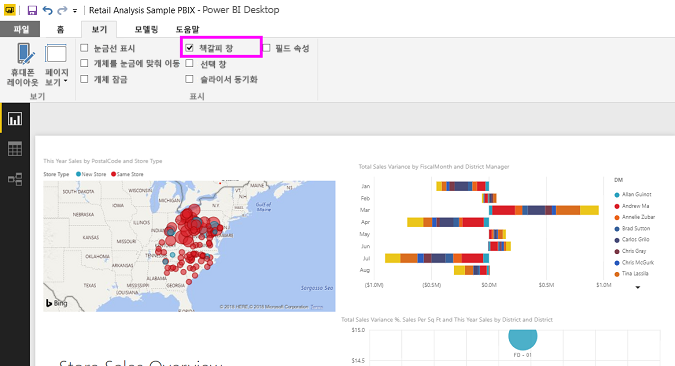
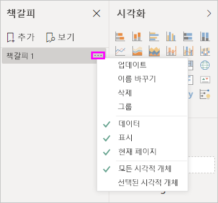
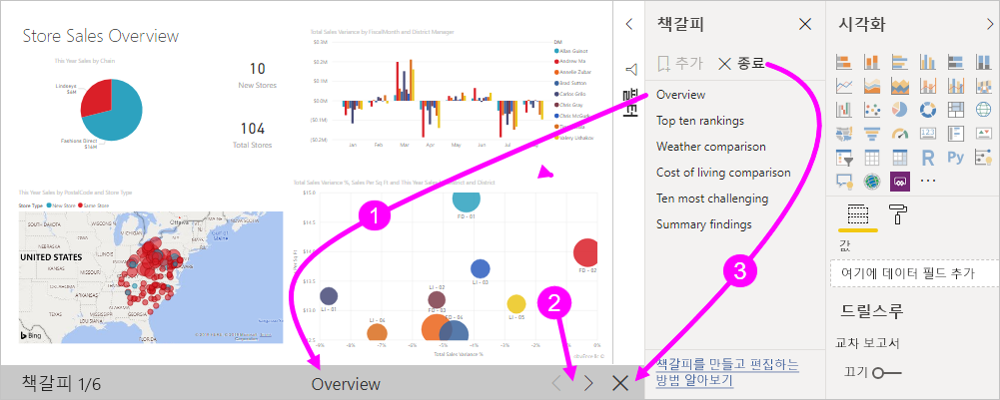
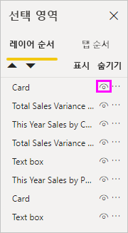
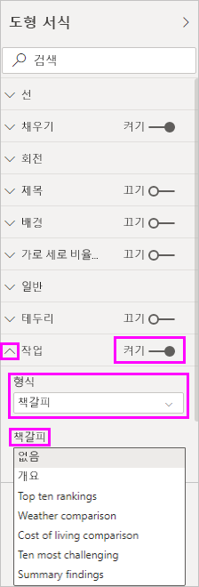
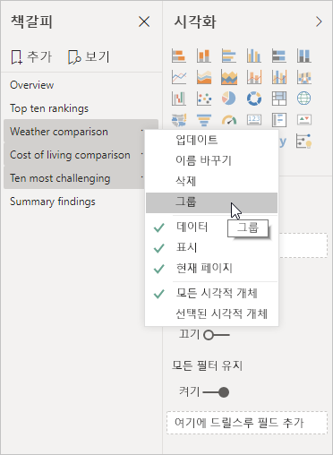
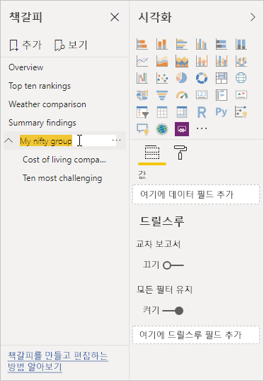
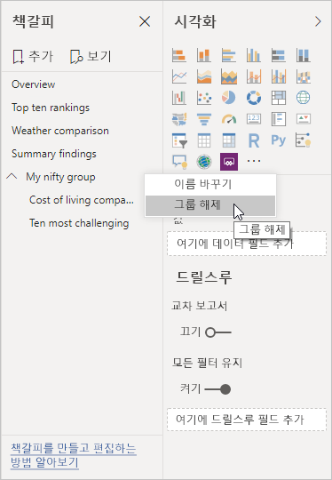
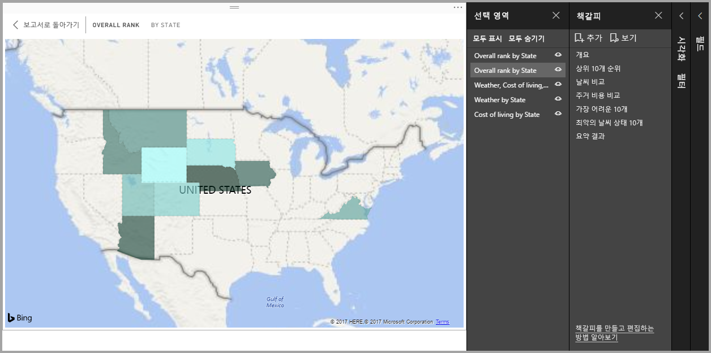
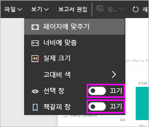

# Power BI Desktop에서 책갈피를 만들어 인사이트 공유 및 스토리 작성
Power BI Desktop에서 ‘책갈피’를 사용하면 시각적 개체의 상태 및 필터링을 비롯하여 현재 구성된 보고서 페이지 보기를 캡처할 수 있습니다.  나중에 저장된 책갈피를 선택하여 해당 상태로 돌아갈 수 있습니다. 

책갈피 컬렉션을 만들고 원하는 순서로 정렬한 다음, 프레젠테이션에서 각 책갈피를 단계별로 실행하여 일련의 인사이트를 강조 표시하거나 시각적 개체 및 보고서에서 말하려는 스토리를 강조 표시할 수도 있습니다. 

책갈피에는 다양한 용도가 있습니다. 예를 들어 책갈피를 사용하여 보고서를 만들 때 고유한 진행 상황을 추적(책갈피는 쉽게 추가하거나 삭제하고 이름을 바꿀 수 있음)할 수 있으며, 책갈피를 만들어 순서대로 책갈피를 실행하는 PowerPoint 같은 프레젠테이션을 작성함으로써 보고서에서 스토리를 말할 수도 있습니다. 

> [!TIP]
> Power BI 서비스에서 개인 책갈피 사용에 대한 자세한 내용은 [Announcing personal bookmarks in the Power BI Service](https://powerbi.microsoft.com/blog/announcing-personal-bookmarks-in-the-power-bi-service/)(Power BI 서비스에서 개인 책갈피 발표)를 참조하세요. 

## 책갈피 사용
책갈피를 사용하려면 Power BI Desktop 리본에서 **보기** 탭을 선택한 다음, **책갈피 창**을 선택합니다. 

책갈피를 만들 때 책갈피에서 다음과 같은 요소가 저장됩니다.

* 현재 페이지
* 필터
* 슬라이서 유형(예: 드롭다운 또는 목록) 및 슬라이서 상태를 포함한 슬라이서
* 시각적 개체 선택 상태(예: 필터 상호 강조 표시)
* 정렬 순서
* 드릴 위치
* 개체의 표시 유형(**선택** 창 사용)
* 표시 되는 개체의 포커스 또는 **스포트라이트** 모드

책갈피에 표시하려는 보고서 페이지를 구성합니다. 보고서 페이지와 시각적 개체가 원하는 대로 정렬되면 **책갈피** 창에서 **추가**를 선택하여 책갈피를 추가합니다. 

Power BI Desktop에서 책갈피를 만들고 일반 이름을 지정합니다. 책갈피 이름 옆의 줄임표를 선택한 다음, 메뉴가 표시되면 작업을 선택하여 쉽게 책갈피의 **이름을 바꾸거나**, 책갈피를 **삭제**하거나 **업데이트**할 수 있습니다.

책갈피를 만들었으면 **책갈피** 창에서 선택하여 표시합니다. 

또한 각 책갈피에 필터 및 슬라이서와 같은 **데이터** 속성을 적용할지, 스포트라이트 및 표시 유형과 같은 **표시** 속성을 적용할지, 책갈피를 추가할 때 표시된 페이지를 나타내는 **현재 페이지** 변경 내용을 적용할지도 선택할 수 있습니다. 이러한 기능은 책갈피를 사용하여 보고서 보기나 시각적 개체 선택을 전환할 때 유용합니다. 이런 경우 데이터 속성을 끄려고 하므로 사용자가 책갈피를 선택하여 보기를 전환할 때 필터가 다시 설정되지 않습니다. 

이렇게 변경하려면 책갈피 이름 옆에 있는 줄임표를 선택한 다음, **데이터**, **표시** 및 다른 컨트롤 옆에 있는 확인 표시를 선택하거나 선택 취소합니다. 

## 책갈피 정렬
책갈피를 만들 때 책갈피를 만드는 순서가 대상 그룹에게 제공하려는 순서와 다를 수 있습니다. 걱정하지 마세요. 책갈피의 순서를 쉽게 재정렬할 수 있습니다.

- **책갈피** 창에서 책갈피를 끌어서 놓아 순서를 변경합니다. 

   책갈피 사이의 노란색 표시줄은 끌어온 책갈피를 배치할 위치를 지정합니다.

   

다음 섹션에 설명된 대로 책갈피 순서는 책갈피의 **보기** 기능을 사용할 때 중요할 수 있습니다.

## 슬라이드 쇼로 책갈피
표시하려는 책갈피의 컬렉션이 있는 경우 순서에서 **책갈피** 창의 **보기**를 선택하여 슬라이드 쇼를 시작할 수 있습니다.

**보기** 모드에서는 몇 가지 기능을 기억해 두어야 합니다.

   

1. 책갈피의 이름은 캔버스 맨 아래에 표시되는 책갈피 제목 표시줄에 나타납니다.

2. 책갈피 제목 표시줄에는 다음 또는 이전 책갈피로 이동할 수 있도록 화살표가 있습니다.

3. **책갈피** 창에서 **종료**를 선택하거나 책갈피 제목 표시줄에서 **X**를 선택하여 **보기** 모드를 종료할 수 있습니다. 

**보기** 모드에서는 **책갈피** 창에 있는 **X**를 선택하여 책갈피 창을 닫고 프레젠테이션을 위해 더 많은 공간을 제공할 수 있습니다. 모든 시각적 개체는 사용자가 직접 조작할 때와 마찬가지로 **보기** 모드에서 대화형이며 교차 강조 표시에 사용할 수 있습니다. 

## 표시 유형: 선택 창 사용
**책갈피** 창과 관련된 **선택** 창은 현재 페이지에 있는 모든 개체 목록을 제공하며 이 창을 통해 개체를 선택하고 표시 여부를 지정할 수 있습니다. 

**선택** 창에서 개체를 선택하고 개체 오른쪽의 눈 모양 아이콘을 선택하여 개체가 현재 표시되는지 여부를 전환합니다. 

책갈피를 추가하면 **선택** 창의 설정에 따라 각 개체의 표시 유형 상태도 저장됩니다. 

표시 여부와 관계없이 슬라이서가 계속 보고서 페이지를 필터링합니다. 이렇게 슬라이서 설정에 따라 여러 가지 다른 책갈피를 만들 수 있으며, 단일 보고서 페이지가 다양한 책갈피에서 다르게 표시되고 다른 인사이트를 강조 표시하도록 할 수 있습니다.

## 셰이프 및 이미지의 책갈피
셰이프 및 이미지를 책갈피에 연결할 수도 있습니다. 이 기능을 사용하면 개체를 선택할 때 해당 개체와 연결된 책갈피가 표시됩니다. 이 기능은 단추를 사용할 때 특히 유용할 수 있습니다. 자세한 내용은 [Power BI에서 단추 사용](desktop-buttons.md)을 참조하세요. 

개체에 책갈피를 지정하려면 다음을 수행합니다. 

1. 보고서 캔버스에서 개체를 선택합니다. 그런 다음, **도형 서식** 창이 나타나면 **작업** 슬라이더를 **켜기**로 전환합니다.

2. **작업** 섹션을 확장합니다. **형식**에서 **책갈피**를 선택합니다.

3. **책갈피**에서 책갈피를 선택합니다.

   

개체가 연결된 책갈피를 사용하여 다양한 작업을 수행할 수 있습니다. 보고서 페이지에 시각적인 목차를 만들거나, 동일한 정보의 다른 보기(예: 시각적 개체 형식)를 제공할 수 있습니다.

편집 모드에서는 **Ctrl** 키를 누른 상태에서 링크를 선택하여 이동합니다. 편집 모드가 아닌 경우에는 개체를 선택하여 링크를 따라 이동합니다. 

## 책갈피 그룹

Power BI Desktop의 2018년 8월 릴리스부터는 책갈피 그룹을 만들고 사용할 수 있습니다. 책갈피 그룹은 그룹으로 표시하고 구성할 수 있는 사용자가 지정한 책갈피의 컬렉션입니다. 

책갈피 그룹을 만들려면 다음을 수행합니다. 
1. **Ctrl** 키를 누른 상태에서 그룹에 포함할 책갈피를 선택합니다. 

2. 선택한 책갈피 옆에 있는 줄임표를 선택한 다음, 메뉴가 표시되면 **그룹**을 선택합니다.

   

Power BI Desktop에서 그룹의 이름을 *Group 1*로 자동으로 지정합니다. 이 이름 옆에 있는 줄임표를 선택하고 **이름 바꾸기**를 선택한 다음, 원하는 대로 이름을 바꿀 수 있습니다.

책갈피 그룹과 마찬가지로 책갈피 그룹의 이름을 확장하면 책갈피 그룹이 확장되거나 축소되기만 하고 자체적으로 책갈피를 나타내지는 않습니다. 

책갈피의 **보기** 기능을 사용할 때 다음 세부 정보를 참조하세요.

* 책갈피에서 **보기**를 선택하면 선택한 책갈피가 그룹인 경우 *해당 그룹의* 책갈피만이 보기 세션에 표시됩니다. 

* 선택한 책갈피가 그룹에 포함되지 않거나 최상위 수준(예: 책갈피 그룹의 이름)인 경우 그룹의 책갈피를 포함하여 전체 보고서의 모든 책갈피가 재생됩니다. 

책갈피의 그룹을 해제하려면 다음을 수행합니다. 
1. 그룹에서 책갈피를 선택하고 줄임표를 선택합니다. 

2. 메뉴가 표시되면 **그룹 해제**를 선택합니다.

   

   그룹의 책갈피에 대해 **그룹 해제**를 선택하면 모든 책갈피가 그룹에서 제거되며, 그룹은 삭제되지만 책갈피 자체는 삭제되지 않습니다. 

그룹에서 단일 책갈피를 제거하려면 다음을 수행합니다. 
1. 해당 그룹에서 멤버를 **그룹 해제**하면 전체 그룹화가 삭제됩니다. 

2. 새 그룹에서 **Ctrl** 키를 누른 상태로 각 책갈피를 선택하여 원하는 멤버를 선택한 다음, **그룹**을 다시 선택합니다. 

## 스포트라이트 사용
책갈피와 함께 릴리스된 또 다른 기능은 *‘스포트라이트’* 입니다. **보기** 모드에 책갈피를 표시하는 경우처럼 스포트라이트를 사용하면 특정 차트에 대한 주의를 끌 수 있습니다.

스포트라이트와 포커스 모드를 비교하여 그 차이점을 알아보겠습니다.

1. 포커스 모드에서는 시각적 개체의 **포커스 모드** 아이콘을 선택하면 시각적 개체가 전체 캔버스를 채우게 됩니다.

2. 스포트라이트에서는 시각적 개체의 줄임표에서 **스포트라이트**를 선택하여 한 시각적 개체를 원래 크기로 강조 표시하면 해당 페이지의 다른 모든 시각적 개체가 거의 투명하게 페이드됩니다. 

이전 이미지에서 시각적 개체의 **포커스 모드** 아이콘을 선택하면 페이지가 다음과 같이 표시됩니다.

반면 시각적 개체의 줄임표 메뉴에서 **스포트라이트**를 선택하면 페이지가 다음과 같이 표시됩니다.

책갈피를 추가할 때 포커스 모드나 스포트라이트 모드를 선택하면 해당 모드가 책갈피에 유지됩니다.

## Power BI 서비스의 책갈피
책갈피가 하나 이상 포함된 보고서를 Power BI 서비스에 게시하면 Power BI 서비스에서 해당 책갈피를 보고 조작할 수 있습니다. 보고서에서 책갈피를 사용할 수 있으면 **보기** > **선택 창** 또는 **보기** > **책갈피 창**을 선택하여 **선택** 및 **책갈피** 창을 표시합니다. 

Power BI 서비스에서 **책갈피** 창은 Power BI Desktop에서처럼 작동하며, 슬라이드 쇼와 같이 순서대로 책갈피를 표시하도록 **보기**를 선택할 수 있는 기능을 포함합니다.

검정 화살표 대신 회색 책갈피 제목 표시줄을 사용하여 책갈피를 탐색합니다. 검정 화살표는 책갈피가 아닌 보고서 페이지를 탐색합니다.

## 책갈피 미리 보기(2018년 3월 이전 버전) 사용
Power BI Desktop 2018년 3월 버전부터 책갈피가 일반 공급됩니다. 

항상 가장 최근 릴리스로 업그레이드하는 것이 좋습니다. 그러나 Power BI Desktop의 버전이 이 릴리스보다 이전인 경우 책갈피 기능은 Power BI Desktop의 2017년 10월 릴리스부터 사용할 수 있으며 Power BI 서비스의 책갈피 지원 보고서에서도 사용할 수 있습니다. 

책갈피 미리 보기 기능을 사용하려면 다음을 수행합니다. 

1. **파일** > **옵션 및 설정** > **옵션** > **미리 보기 기능**을 선택한 다음, **책갈피**를 선택합니다. 

   

2. Power BI Desktop을 다시 시작하여 책갈피의 미리 보기 버전을 사용합니다.

## 제한 사항 및 고려 사항
책갈피 능의 이 릴리스에서는 몇 가지 제한 사항 및 고려 사항을 기억해야 합니다.

* 대부분의 사용자 지정 시각적 개체는 책갈피에서 잘 작동합니다. 그러나 책갈피 및 사용자 지정 시각적 개체에 문제가 발생하면 해당 사용자 지정 시각적 개체 작성자에게 문의하여 시각적 개체에 책갈피 지원을 추가하도록 요청합니다. 
* 책갈피를 만든 후 보고서 페이지에서 시각적 개체를 추가하면 시각적 개체는 기본 상태로 표시됩니다. 즉, 이전에 책갈피를 만든 페이지에 슬라이서를 도입하는 경우 슬라이서는 기본 상태로 작동합니다.
* 책갈피를 만든 후 시각적 개체를 이동하면 책갈피에 자동으로 반영됩니다. 

## 다음 단계
책갈피와 유사하거나 상호 작용하는 기능에 대한 자세한 내용은 다음 문서를 참조하세요.

* [Power BI Desktop에서 드릴스루 사용](desktop-drillthrough.md)
* [포커스 모드에서 대시보드 타일 또는 보고서 시각적 개체 표시](consumer/end-user-focus.md)

