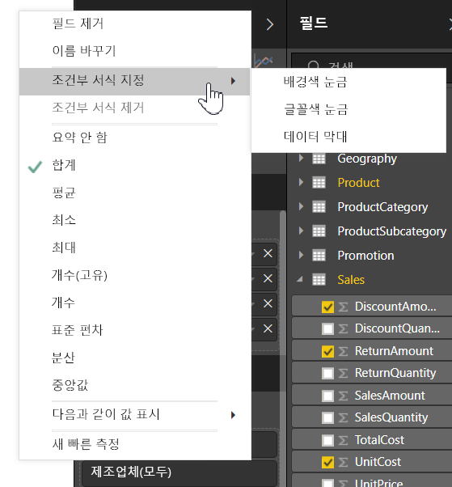
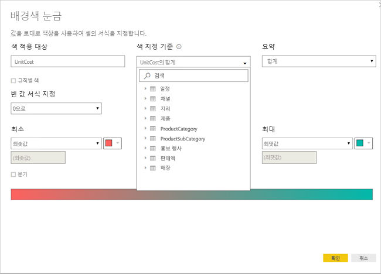
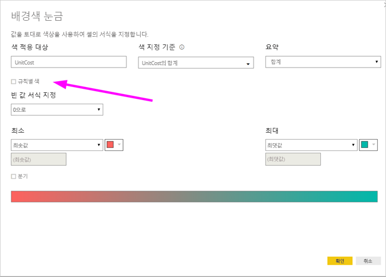
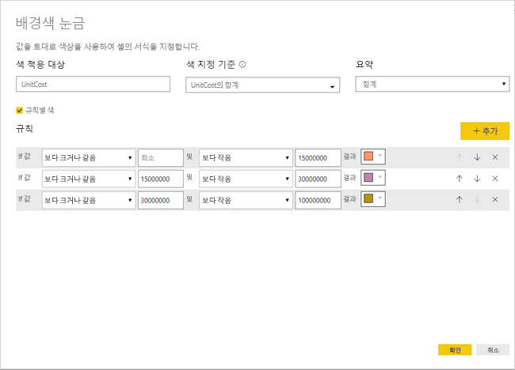
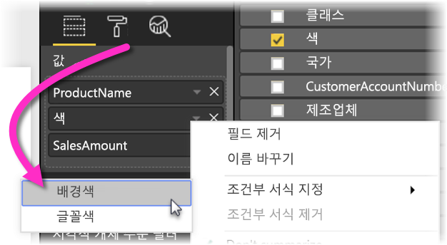
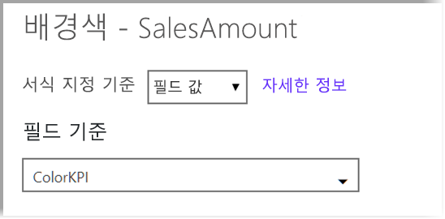

# 테이블에서 조건부 서식 지정 
테이블에 조건부 서식을 사용하면 셀 값을 기반으로 하거나 다른 값 또는 필드를 기반으로 하여 그라데이션 색을 사용하는 등 사용자 지정된 셀 색을 지정할 수 있습니다. 데이터 막대를 사용하여 셀 값을 표시할 수도 있습니다. 

조건부 서식 지정에 액세스하려면 Power BI Desktop에서 **시각화** 창의 **필드**에서 서식을 지정하려는 **값**의 값 옆에 있는 아래쪽 화살표를 선택합니다(또는 필드를 마우스 오른쪽 단추로 클릭). 필드에 대한 조건부 서식은 **필드**의 **값** 영역에서만 관리할 수 있습니다.

다음 섹션에서는 이러한 조건부 서식 지정 옵션을 각각 설명합니다. 단일 테이블 열에 하나 이상의 옵션을 결합할 수 있습니다.

> [!NOTE]
> 테이블에 적용되는 경우 조건부 서식 지정은 조건에 따라 서식 지정된 셀에 적용된 사용자 지정 테이블 스타일을 재정의합니다.

시각화에서 조건부 서식 지정을 제거하려면 필드를 다시 마우스 오른쪽 단추로 클릭하고, **조건부 서식 제거**를 선택한 다음, 제거할 서식 지정 형식을 선택합니다.

## 배경색 색조

**조건부 서식** 및 **배경색**을 차례로 선택하면 다음과 같은 대화 상자가 나타납니다.

해당 필드에 **기준 색**을 설정하여 색을 기준으로 할 데이터 모델의 필드를 선택할 수 있습니다. 또한 **요약** 값을 포함한 선택된 필드의 집계 형식을 지정할 수 있습니다. **색 적용 대상** 필드에서 색이 지정된 필드를 지정하므로 일관성을 유지할 수 있습니다. 숫자 값을 서식 지정 기준으로 선택하면 텍스트 및 날짜 필드에 조건부 서식 지정을 적용할 수 있습니다.

지정된 값 범위에 불연속 색상 값을 사용하려면 **규칙별 색**을 선택합니다. 색 스펙트럼을 사용하려면 **규칙별 색**을 선택하지 않은 채로 둡니다. 

### 규칙별 색

**규칙별 색**을 선택하는 경우 설정된 색에서 각각 하나 이상의 값 범위를 입력할 수 있습니다.  각 값 범위는 *If 값* 조건, *and* 값 조건 및 색으로 시작합니다.

각 범위의 값이 있는 테이블 셀은 지정된 색으로 채워집니다. 다음 그림에는 세 가지 규칙이 있습니다.

이제 예제 테이블은 다음과 같습니다.

### 색 최소값에서 최대값

*최소* 및 *최대* 값 및 해당 색을 구성할 수 있습니다. **분기** 상자를 선택하면 선택적인 *가운데* 값도 구성할 수 있습니다.

이제 예제 테이블은 다음과 같습니다.

## 글꼴색 색조

**조건부 서식** 및 **글꼴색**을 차례로 선택하면 다음과 같은 대화 상자가 나타납니다. 이 대화 상자는 **배경색** 대화 상자와 비슷하지만 셀 배경색이 아니라 글꼴 색을 변경합니다.

이제 예제 테이블은 다음과 같습니다.

## 데이터 막대

**조건부 서식** 및 **데이터 막대**를 차례로 선택하면 다음과 같은 대화 상자가 나타납니다. 

기본적으로 **막대만 표시** 옵션을 선택하지 않으므로 테이블 셀은 막대 및 실제 값을 모두 보여줍니다.

**막대만 표시** 옵션이 선택되어 있으면 테이블 셀은 막대만을 표시합니다.

## 필드 값으로 색 서식 지정

테이블 또는 행렬 시각적 개체의 글꼴 색 배경에 해당 색을 적용하기 위해 텍스트 값 또는 16 진수 코드를 사용하여 색을 지정하는 측정값 또는 열을 사용할 수 있습니다. 지정된 필드에 대한 사용자 지정 논리를 만들고, 글꼴 또는 배경에 원하는 색을 적용하는 논리가 있을 수도 있습니다.

예를 들어 다음 표에는 각 제품 모델과 연결된 색이 있습니다. 

해당 필드 값을 기준으로 해당 셀의 서식을 지정하려면 해당 시각적 개체에 대한 *색*을 마우스 오른쪽 단추로 클릭하여 **조건부 서식** 대화 상자를 선택하고 이 경우에는 **배경색**을 선택합니다. 

나타나는 대화 상자에서 다음 이미지와 같이 **서식 지정 기준** 드롭다운 영역에서 **필드 값**을 선택합니다.

글꼴 색에 해당 프로세스를 반복할 수 있습니다. 시각적 개체의 결과는 다음 화면에 표시된 대로 **색** 열에서 단색입니다.

선호하는 조건에 따라 다양한 16 진수 코드를 출력하는 비즈니스 논리에 기반한 DAX 계산을 만들 수도 있습니다. 일반적으로 조건부 서식 지정 대화 상자에서 여러 규칙을 만드는 것보다 쉽습니다. 다음 샘플 이미지에서 *ColorKPI* 필드를 사용합니다.

다음과 같은 방식으로 **배경색**의 필드 값을 설정할 수 있습니다.

또한 다음 매트릭스와 같은 결과를 얻을 수 있습니다.

상상력 및 DAX를 사용하여 더 다양한 변형을 만들 수 있습니다.

[https://www.w3.org/TR/css-color-3/](https://www.w3.org/TR/css-color-3/)의 CSS 색 사양에 나열된 값 중 하나를 사용하여 시각적 개체의 색을 지정할 수 있습니다.
* 3자리, 6자리 또는 8자리 16진수 코드(예: #3E4AFF). 코드의 시작 부분에 # 기호를 포함해야 합니다. “3E4AFF”는 허용되지 않습니다. 
* RGB 또는 RGBA 값(예: RGBA(234, 234, 234, 0.5))
* HSL 또는 HSLA 값(예: HSLA(123, 75%, 75%, 0.5))
* 색 이름(예: Green, SkyBlue, PeachPuff) 

## 고려 사항 및 제한 사항
조건부 테이블 형식으로 작업하는 경우 유의해야 하는 몇 가지 고려 사항이 있습니다.

* 조건부 서식은 **행렬** 시각적 개체의 값에만 적용되고, 소계 또는 총합계에는 적용되지 않습니다. 
* 조건부 서식은 **요약** 행에 적용되지 않습니다.
* 그룹화가 없는 테이블은 조건부 서식을 지원하지 않는 단일 행으로 표시됩니다.
* 자동 최대/최소 값 또는 백분율 규칙의 규칙 기반 서식 지정에 그라데이션 형식을 사용하는 경우, 데이터가 NaN 값을 포함하면 조건부 서식을 적용할 수 없습니다. NaN은 ‘Not a number(숫자가 아님)’라는 의미이며, 나누기 오류에 의해 가장 흔히 발생합니다. 이 오류를 피하기 위해 [DIVIDE() DAX 함수](https://docs.microsoft.com/dax/divide-function-dax)를 사용할 수 있습니다.

## 다음 단계
자세한 내용은 다음 아티클을 참조하세요.  

* [Power BI의 색 서식을 위한 팁과 힌트](visuals/service-tips-and-tricks-for-color-formatting.md)  

