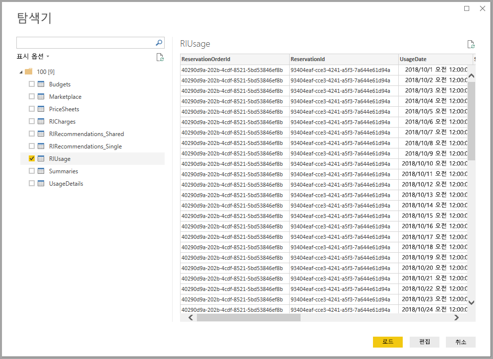
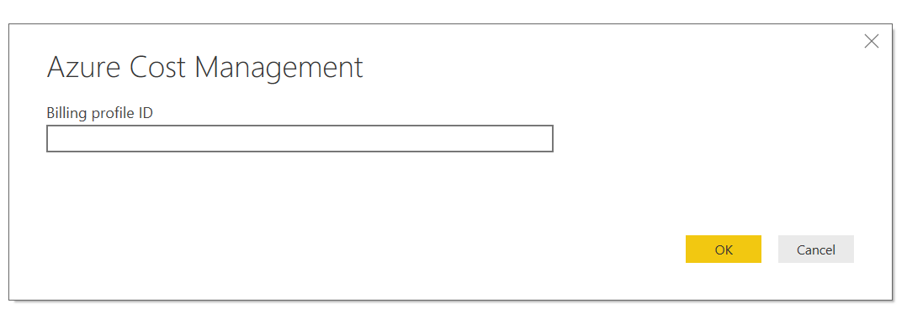
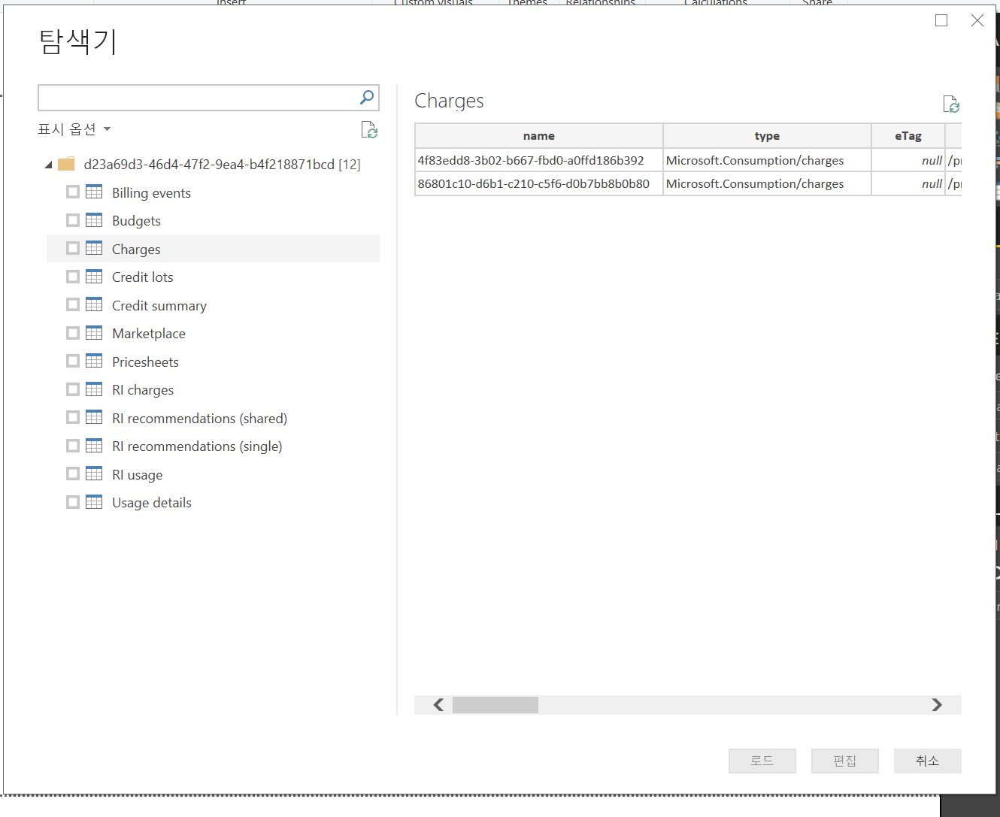
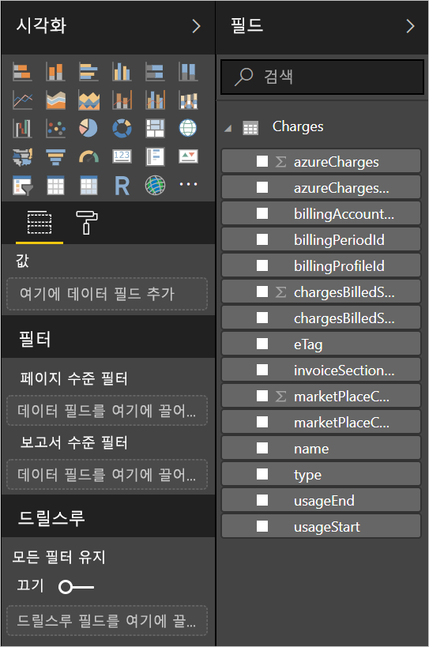

# <a name="analyze-azure-cost-and-usage-data-in-power-bi-desktop"></a>Power BI Desktop에서 Azure 비용 및 사용량 데이터 분석

Power BI Desktop을 사용하여 Azure에 연결하고, 조직의 Azure 서비스 사용량에 대한 자세한 데이터를 가져올 수 있습니다. 이 데이터를 통해 사용자 지정 보고서 및 측정값을 만들어 Azure 지출을 더 잘 이해하고 분석할 수 있습니다.

Power BI는 현재 기업 계약 및 고객 계약 청구 계정에 대한 연결을 지원합니다.

* **기업계약** 사용자는 **Azure Consumption Insights 커넥터**(아래)를 사용해서 연결해야 합니다.

* **고객 계약** 사용자는 [**Azure Cost Management 커넥터**](#connect-with-azure-cost-management)를 사용해서 연결해야 합니다.

> [!NOTE]
> Azure Cost Management 커넥터를 사용하는 기업계약 고객이며 Cost Management 블레이드에  ‘청구 프로필 ID’가 표시되지 않으면 최신 상거래 플랫폼에 있지 않은 것입니다. 이러한 경우  ‘청구 프로필’ ID 대신 EA 등록 번호를 요청하는 Azure Consumption Insights 커넥터를 사용합니다.


## <a name="connect-with-azure-consumption-insights"></a>Azure Consumption Insights에 연결

Azure Consumption Insights를 사용하면 Azure Enterprise Agreement 청구 계정에 연결할 수 있습니다.

이 섹션에서는 Azure 엔터프라이즈 커넥터를 사용해서 마이그레이션해야 하는 데이터를 가져오는 방법을 알아봅니다. **ACI**(Azure Consumption Insights) API에서 사용할 수 있는 ‘사용량 세부 정보 열’ 매핑도 있습니다. 

**Azure Consumption Insights** 커넥터를 사용하려면 Azure Portal의 엔터프라이즈 기능에 액세스해야 합니다.

**Power BI Desktop**에서 **Azure Consumption Insights** 커넥터를 사용하려면 다음을 수행합니다. 

1. **홈** 리본에서 **데이터 가져오기**를 선택합니다.

1. 왼쪽 범주에서 **온라인 서비스**를 선택합니다.  

1. **Microsoft Azure Consumption Insights(베타)** 를 선택합니다. 

1. **연결**을 선택합니다.

   

   표시되는 대화 상자에서 **Azure 등록 번호**를 입력합니다.

   

   * 다음 이미지에 표시된 위치에서 [Azure Enterprise Portal](https://ea.azure.com)의 등록 번호를 가져올 수 있습니다.

  

   이 커넥터 버전은 https://ea.azure.com 에서 엔터프라이즈 등록을 지원합니다. 중국 등록은 현재 지원되지 않습니다.

   다음으로 연결할 *선택키*를 제공합니다.

   

   * [Azure Enterprise Portal](https://ea.azure.com)에서 등록을 위한 선택키를 찾을 수 있습니다.

  

‘액세스 키’를 제공하고 **연결**을 선택하면 **탐색기** 창이 나타나고, 사용 가능한 9개 테이블이 표시됩니다. 

| 테이블        | 설명 |
|------------- | -------------------------------------------------------------|
| **Budgets** | 기존 예산 목표 대비 실제 비용 또는 사용량을 보기 위한 예산 정보입니다. |
| **MarketPlace** | 사용량 기반 Azure Marketplace 요금입니다. |
| **PriceSheets** | 등록에 적용되는 미터별 요금입니다. |
| **RICharges** | 지난 24개월 동안 예약 인스턴스와 관련된 요금입니다. |
| **RIRecommendations_Single** | 지난 7일, 30일 또는 60일 동안의 단일 구독 사용량 추세를 기반으로 하는 예약 인스턴스 구매 권장 사항입니다. |
| **RIRecommendations_Shared** | 지난 7일, 30일 또는 60일 동안의 모든 구독 사용량 추세를 기반으로 하는 예약 인스턴스 구매 권장 사항입니다. |
| **RIUsage** | 지난 한 달 동안의 기존 예약 인스턴스 소비 정보입니다. |
| **Summaries** | 잔액, 새 구매, Azure Marketplace 서비스 요금, 조정, 초과분 요금의 월별 요약입니다. |
| **UsageDetails** | 소비된 수량 분석 및 예상 등록 요금입니다. |

테이블 옆에 있는 확인란을 선택하여 미리 보기를 확인할 수 있습니다. 해당 이름 옆에 있는 확인란을 선택하여 하나 이상의 테이블을 선택한 다음 **로드**를 선택할 수 있습니다.



> [!NOTE]
> *요약* 및 *가격표* 테이블은 등록 수준 API 키에 사용할 수 있습니다. 또한 이러한 테이블의 데이터에는 기본적으로 *사용량* 및 *PriceSheet*의 현재 달의 데이터가 있습니다. *요약* 및 *MarketPlace* 테이블은 현재 월에 제한되지 않습니다.
>
>

**로드**를 선택하면, 데이터가 **Power BI Desktop**에 로드됩니다.


선택한 데이터가 로드되면 선택한 테이블 및 필드를 **필드** 창에서 볼 수 있습니다.


## <a name="using-azure-consumption-insights"></a>Azure Consumption Insights 사용
**Azure Consumption Insights** 커넥터를 사용하려면 Azure Portal의 엔터프라이즈 기능에 액세스합니다.

**Azure Consumption Insights** 커넥터를 사용하여 데이터를 성공적으로 로드하면 **쿼리 편집기**를 사용하여 고유한 사용자 지정 측정값 및 열을 만들 수 있습니다. **Power BI 서비스**에서 공유할 시각적 개체, 보고서 및 대시보드를 만들 수도 있습니다.

빈 쿼리를 사용하여 샘플 Azure 사용자 지정 쿼리 컬렉션을 검색할 수 있습니다. 이 검색을 수행하는 방법에는 다음 두 가지가 있습니다. 

**Power BI Desktop**에서 다음을 수행합니다. 

1. **홈** 리본을 선택합니다. 
2. **데이터 가져오기** > **빈 쿼리**를 선택합니다. 

또는 **쿼리 편집기**에서 다음을 수행합니다. 

1. 왼쪽 **쿼리** 창에서 마우스 오른쪽 단추를 클릭합니다. 
2. 표시되는 메뉴에서 **새 쿼리 > 빈 쿼리**를 선택합니다.

**수식 입력줄**에 다음을 입력합니다.

    = MicrosoftAzureConsumptionInsights.Contents

다음 그림은 표시되는 샘플 컬렉션을 보여 줍니다.


보고서를 사용하고 쿼리를 만들 때, 다음을 수행할 수 있습니다.

* 현재 날짜부터 시작하여 개월 수를 정의하려면 *numberOfMonth*를 사용합니다.
  * 1에서 36 사이의 값을 사용합니다. 현재 날짜에서 가져오려는 개월 수를 나타냅니다. 12개월 이하의 데이터를 가져오는 것이 좋습니다. 이 한도는 Power BI 쿼리 가져오기 제약 조건 및 데이터 볼륨 임계값을 방지합니다.
* 기록 시간 창에서 일정 기간을 정의하려면 *startBillingDataWindow* 및 *endBillingDataWindow*를 사용합니다.
* ‘startBillingDataWindow’ 또는 ‘endBillingDataWindow’와 함께 ‘numberOfMonth’를 사용하지 않습니다.   

## <a name="migrate-from-the-azure-enterprise-connector"></a>Azure 엔터프라이즈 커넥터에서 마이그레이션

일부 고객이 ‘Azure 엔터프라이즈 커넥터(베타)’를 사용하여 시각적 개체를 만들었습니다.  결국, **Azure Consumption Insights** 커넥터로 바뀔 예정입니다. 새 커넥터에는 다음과 같은 기능과 개선 사항이 있습니다.

* *균형 요약* 및 *Marketplace 구매*에 사용할 수 있는 추가 데이터 원본
* *startBillingDataWindow* 및 *endBillingDataWindow*와 같은 새 고급 매개 변수
* 성능 및 응답성 향상

다음 단계에서는 **Azure Consumption Insights** 커넥터로 전환하는 방법을 보여 줍니다. 이러한 단계는 사용자 지정 대시보드 또는 보고서를 만들 때 이미 수행한 작업을 유지합니다.

### <a name="step-1-connect-to-azure-using-the-new-connector"></a>1단계: 새 커넥터를 사용하여 Azure에 연결
첫 번째 단계는 이 문서의 앞부분에서 자세히 설명한 **Azure Consumption Insights** 커넥터를 사용하는 것입니다. 이 단계에서 **Power BI Desktop**의 **홈** 리본에서 **데이터 가져오기 > 빈 쿼리**를 선택합니다.

### <a name="step-2-create-a-query-in-advanced-editor"></a>2단계: 고급 편집기에서 쿼리 만들기
**쿼리 편집기**에서 **홈** 리본의 **쿼리** 섹션에 있는 **고급 편집기**를 선택합니다. **고급 편집기** 창이 나타나면 다음 쿼리를 입력합니다.

    let    
        enrollmentNumber = "100",
        optionalParameters = [ numberOfMonth = 6, dataType="DetailCharges" ],
        data = MicrosoftAzureConsumptionInsights.Contents(enrollmentNumber, optionalParameters)   
    in     
        data


*enrollmentNumber* 값을 해당 등록 번호로 바꾸어야 합니다. [Azure Enterprise Portal](https://ea.azure.com)에서 번호를 확인할 수 있습니다. *numberOfMonth* 매개 변수는 현재 데이터에서 돌아가려는 데이터 개월 수입니다. 이번 달에 0을 사용합니다.

**고급 편집기** 창에서 **완료**를 선택하면, 미리 보기가 새로 고쳐지고 지정된 월 범위의 데이터가 테이블에 표시됩니다. **닫기 및 적용**을 선택하고 반환합니다.

### <a name="step-3-move-measures-and-custom-columns-to-the-new-report"></a>3단계: 새 보고서에 측정값 및 사용자 지정 열 이동
다음으로, 직접 만든 사용자 지정 열이나 측정값을 새로운 세부 정보 테이블로 이동해야 합니다. 단계는 다음과 같습니다.

1. 메모장(또는 다른 텍스트 편집기)을 엽니다.
2. 이동하려는 측정값을 선택하고 *수식* 필드에서 텍스트를 복사하고 메모장에 붙여넣습니다.

   
3. *Query1*을 원래 세부 정보 테이블 이름으로 바꿉니다.
4. 새 테이블 측정값과 사용자 지정 열을 만들려면 테이블을 마우스 오른쪽 단추로 클릭하고 **새 측정값**을 선택합니다. 그런 다음, 모두 완료될 때까지 저장된 측정값과 열을 잘라내어 붙여넣습니다.

### <a name="step-4-relink-tables-that-had-relationships"></a>4단계: 관계가 있는 테이블 다시 연결
여러 대시보드에는 날짜 테이블 또는 사용자 지정 프로젝트에 사용되는 테이블과 같이 조회나 필터링에 사용되는 추가 테이블이 있습니다. 이러한 관계를 다시 설정하면 대부분의 나머지 문제가 해결됩니다. 방법은 다음과 같습니다.

- **Power BI Desktop**의 **모델링** 탭에서 **관계 관리**를 선택하면 모델 내에서 관계를 관리할 수 있는 창이 표시됩니다. 필요에 따라 테이블을 다시 연결합니다.

    

### <a name="step-5-verify-your-visuals-and-adjust-field-formatting-as-needed"></a>5단계: 시각적 개체 확인 및 필요에 따라 필드 서식 조정
이 시점에는 대부분의 원본 시각적 개체, 테이블 및 드릴다운이 예상대로 작동해야 합니다. 그러나 모양과 느낌을 정확하게 지정하려면 몇 가지 사소한 조정 작업이 필요할 수 있습니다. 각 대시보드 및 시각적 개체를 원하는 모양으로 표시하려면 조회하는 데 잠시 시간이 걸립니다.

## <a name="using-the-azure-consumption-and-insights-aci-api-to-get-consumption-data"></a>ACI(Azure 소비 및 정보) API를 사용하여 소비 데이터 가져오기
또한 Azure는 [**ACI(Azure 소비 및 정보) API**](https://azure.microsoft.com/blog/announcing-general-availability-of-consumption-and-charge-apis-for-enterprise-azure-customers/)를 제공합니다. ACI API를 사용하여 Azure 사용량 정보를 수집, 보고 및 시각화하도록 고유한 사용자 지정 솔루션을 만들 수 있습니다.

### <a name="mapping-names-and-usage-details-between-the-portal-the-connector-and-the-api"></a>포털, 커넥터 및 API 간에 이름 및 사용 세부 정보 매핑
Azure Portal의 열 및 세부 정보 이름은 API와 커넥터에서 비슷하지만 항상 동일하지는 않습니다. 다음 표에서는 명확한 설명을 위해 매핑을 제공합니다. 또한 열이 사용되지 않았는지 여부를 표시합니다. 자세한 내용과 용어 정의는 [Azure 청구 데이터 사전](https://docs.microsoft.com/azure/billing/billing-enterprise-api-usage-detail)을 참조하세요.

| ACI 커넥터/ContentPack ColumnName | ACI API 열 이름 | EA 열 이름 | 사용되지 않음/이전 버전과의 호환성 표시 |
| --- | --- | --- | --- |
| AccountName |accountName |계정 이름 |아니요 |
| AccountId |accountId | |예 |
| AcccountOwnerId |accountOwnerEmail |AccountOwnerId |아니요 |
| AdditionalInfo |additionalInfo |AdditionalInfo |아니요 |
| AdditionalInfold | | |예 |

| Consumed Quantity |consumedQuantity |사용한 수량 |아니요 |
| Consumed Service |consumedService |사용한 서비스 |아니요 |
| ConsumedServiceId |consumedServiceId | |예 |
| Cost |cost |ExtendedCost |아니요 |
| Cost Center |costCenter |비용 센터 |아니요 |
| Date |date |날짜 |아니요 |
| Day | |일 |아니요 |

| DepartmentName |departmentName |부서 이름 |아니요 |
| DepartmentID |departmentId | |예 |
| Instance ID | | |예 |
| InstanceId |instanceId |Instance ID |아니요 |
| Location | | |예 |

| Meter Category |meterCategory |미터 범주 |아니요 |
| Meter ID | | |예 |
| Meter Name |meterName |미터 이름 |아니요 |
| Meter Region |meterRegion |미터 지역 |아니요 |
| Meter Sub-Category |meterSubCategory |미터 하위 범주 |아니요 |
| MeterId |meterId |미터 ID |아니요 |
| Month | |월 |아니요 |
| Product |product |제품 |아니요 |
| ProductId |productId | |예 |
| Resource Group |resourceGroup |리소스 그룹 |아니요 |
| Resource Location |resourceLocation |리소스 위치 |아니요 |

| ResourceGroupId | | |예 |
| ResourceLocationId |resourceLocationId | |예 |
| ResourceRate |resourceRate |ResourceRate |아니요 |
| ServiceAdministratorId |serviceAdministratorId |ServiceAdministratorId |아니요 |
| ServiceInfo1 |serviceInfo1 |ServiceInfo1 |아니요 |
| ServiceInfo1Id | | |예 |
| ServiceInfo2 |serviceInfo2 |ServiceInfo2 |아니요 |
| ServiceInfo2Id | | |예 |

| Store Service Identifier |storeServiceIdentifier |저장소 서비스 식별자 |아니요 |
| StoreServiceIdentifierId | | |예 |
| Subscription Name |subscriptionName |구독 이름 |아니요 |
| Tags |tags |태그 |아니요 |

| TagsId | | |예 |
| Unit Of Measure |unitOfMeasure |측정 단위 |아니요 |
| Year | |연도 |아니요 |
| SubscriptionId |subscriptionId |SubscriptionId |예 |
| SubscriptionGuid |subscriptionGuid |SubscriptionGuid |아니요 |

## <a name="connect-with-azure-cost-management"></a>Azure Cost Management에 연결

이 섹션에서는 고객 계약 청구 계정에 연결하는 방법을 알아봅니다.

> [!NOTE]
> Azure Cost Management 커넥터는 현재 **고객 계약**에서 고객을 지원합니다.  **기업 계약** 고객은 Microsoft Azure Consumption Insights 커넥터를 사용해야 합니다.
>
>

**Power BI Desktop**에서 **Azure Cost Management** 커넥터를 사용하려면 다음을 수행합니다.

1. **홈** 리본에서 **데이터 가져오기**를 선택합니다.

1. 왼쪽 범주에서 **Azure**를 선택합니다.

1. 오른쪽에서 **Azure Cost Management(베타)** 를 선택합니다.

1. **연결**을 선택합니다.


   

   표시되는 대화 상자에서 **청구 프로필 ID**를 입력합니다.

   

[Azure Portal](https://portal.azure.com)에서 ID를 확인할 수 있습니다.

1. **Cost Management + 청구**로 이동합니다.

1. 청구 계정을 선택합니다.

1. 사이드바에서 **청구 프로필**을 선택합니다.

1. 청구 프로필을 선택합니다.

1. 사이드바에서 **속성**을 선택합니다.

1. 청구 프로필 ID를 복사합니다.

   

   Azure 메일 및 암호를 사용하여 로그인하라는 메시지가 표시됩니다.  인증에 성공하면 사용 가능한 12개 테이블이 포함된 **탐색기** 창이 표시됩니다.

| 테이블        | 설명 |
|-------------------- | -------------------------------------------------------------|
| **청구 이벤트** | 새 송장, 크레딧 구매 등의 이벤트 로그입니다. |
| **Budgets** | 기존 예산 목표 대비 실제 비용 또는 사용량을 보기 위한 예산 정보입니다. |
| **요금** | Azure 사용량, 마켓플레이스 요금 및 개별 청구 요금의 월별 요약입니다. |
| **크레딧 로트** | 제공된 청구 프로필에 대한 Azure 크레딧 로트 구매 정보입니다. |
| **크레딧 요약** | 제공된 청구 프로필에 대한 크레딧 요약입니다. |
| **마켓플레이스** | 사용량 기반 Azure Marketplace 요금입니다. |
| **Pricesheets** | 제공된 청구 프로필에 적용 가능한 미터 요율입니다. |
| **RI 요금** | 지난 24개월 동안 예약 인스턴스와 관련된 요금입니다. |
| **RI 권장 사항(단일)** | 지난 7일, 30일 또는 60일 동안의 단일 구독 사용량 추세를 기반으로 하는 예약 인스턴스 구매 권장 사항입니다. |
| **RI 권장 사항(공유)** | 지난 7일, 30일 또는 60일 동안의 모든 구독 사용량 추세를 기반으로 하는 예약 인스턴스 구매 권장 사항입니다. |
| **RI 사용량** | 지난 한 달 동안의 기존 예약 인스턴스 소비 정보입니다. |
| **사용량 세부 정보** | 지정된 청구 프로필 ID에 대해 사용한 수량 및 예상 요금 내역입니다. |

테이블 확인란을 선택하여 미리 보기를 확인할 수 있습니다.  해당 이름 옆에 있는 확인란을 선택하고 **로드**를 선택하면 하나 이상의 테이블을 선택할 수 있습니다.



**로드**를 선택하면, 데이터가 **Power BI Desktop**에 로드됩니다.


선택한 데이터가 로드되면 선택한 테이블 및 필드를 **필드** 창에서 볼 수 있습니다.



[Azure Consumption Insights를 사용하여 Power BI의 지출을 분석하는 방법](https://www.youtube.com/watch?v=QKBMXXrlpEk)을 시청하세요. 이 동영상은 Azure Consumption Insights 커넥터를 사용하여 Power BI Desktop의 비용 데이터를 검토하는 방법을 설명합니다.

## <a name="writing-custom-queries"></a>사용자 지정 쿼리 작성

사용자 지정 [M 쿼리](/powerquery-m/power-query-m-reference)를 만들어 개월 수를 사용자 지정하거나, API 버전을 변경하거나, 반환된 데이터에 대해 고급 논리를 수행할 수 있습니다.

**Power BI Desktop**에서 다음을 수행합니다.

1. **홈** 리본을 선택합니다.
2. **데이터 가져오기** > **빈 쿼리**를 선택합니다.

또는 **쿼리 편집기**에서 다음을 수행합니다.

1. 왼쪽 **쿼리** 창에서 마우스 오른쪽 단추를 클릭합니다.
2. 표시되는 메뉴에서 **새 쿼리 > 빈 메뉴**를 선택합니다.

**수식 입력줄**에서 다음을 입력합니다. `billingProfileId`를 실제 ID로 바꾸고, “charges”를 유효한 테이블 이름(위에서 나열)으로 바꾸어 입력합니다.

```
let
    Source = AzureCostManagement.Tables(billingProfileId, [ numberOfMonths = 3 ]),
    charges = Source{[Key="charges"]}[Data]
in
    charges
```

`numberOfMonths`를 1과 36 사이의 값으로 수정하는 것 외에도 다음을 입력할 수 있습니다.

* `apiVersion`을 입력하여 쿼리가 호출하는 API 버전을 사용자 지정합니다.
* RI 권장 사항(단일 또는 공유)에 대한 `lookbackWindow`를 입력하여 권장 사항을 생성하는 창을 수정합니다(유효한 옵션: 7일, 30일 또는 60일).

## <a name="next-steps"></a>다음 단계

Power BI Desktop을 사용하여 다양한 데이터 원본에 연결할 수 있습니다. 자세한 내용은 다음 아티클을 참조하세요.

* [Power BI Desktop이란?](desktop-what-is-desktop.md)
* [Power BI Desktop의 데이터 원본](desktop-data-sources.md)
* [Power BI Desktop에서 데이터 셰이핑 및 결합](desktop-shape-and-combine-data.md)
* [Power BI Desktop에서 Excel 통합 문서에 연결](desktop-connect-excel.md)   
* [Power BI Desktop에 데이터 직접 연결](desktop-enter-data-directly-into-desktop.md)   
