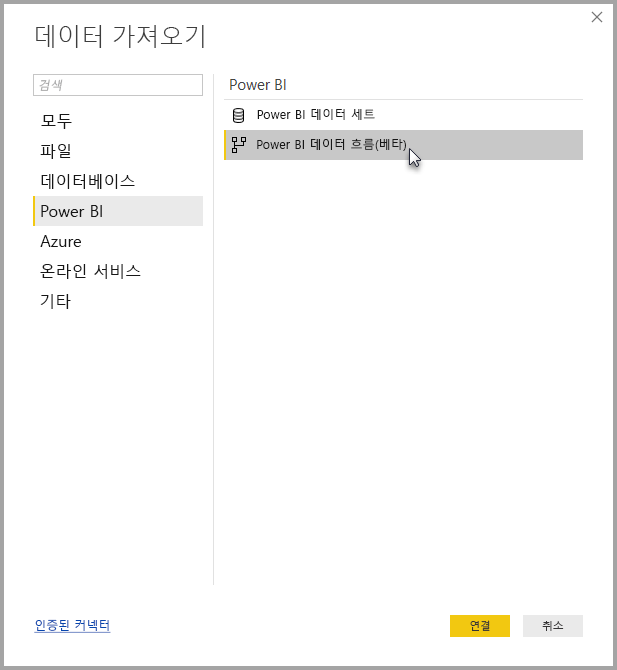
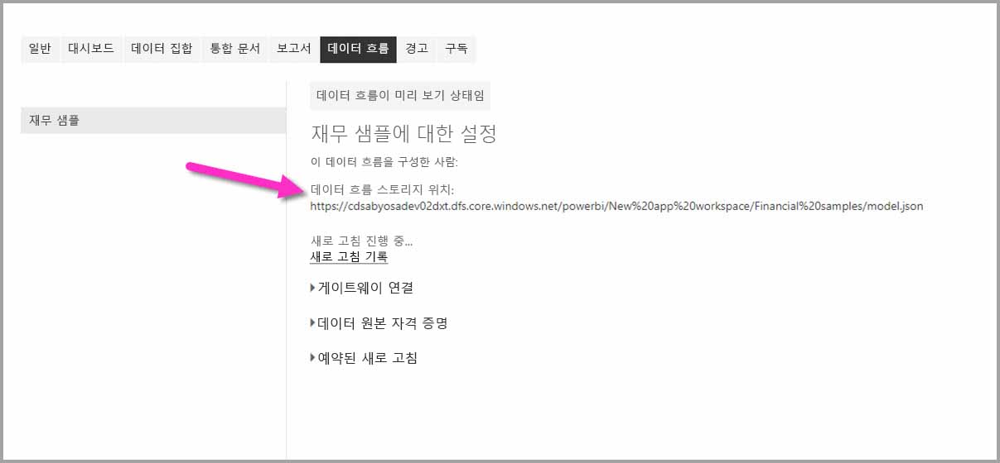

# Power BI Desktop에서 Power BI 데이터 흐름을 통해 만든 데이터에 연결(베타)
**Power BI Desktop**에서 Power BI Desktop의 다른 데이터 원본처럼 **Power BI 데이터 흐름**에서 만든 데이터에 연결할 수 있습니다.

**Power BI 데이터 흐름(베타)** 커넥터를 사용하면 Power BI 서비스의 데이터 흐름을 통해 만든 엔터티에 연결할 수 있습니다. 

## 고려 사항 및 제한 사항

이 베타 버전의 **Power BI 데이터 흐름 커넥터**를 사용하려면 최신 버전의 **Power BI Desktop**을 실행해야 합니다. [Power BI Desktop](desktop-get-the-desktop.md)은 언제든지 다운로드하고 컴퓨터에 설치하여 가장 최신 버전인지 확인할 수 있습니다.  

> [!NOTE]
> 이전 버전의 Power BI 데이터 흐름 커넥터에서는 .MEZ 파일을 다운로드하여 폴더에 저장해야 했습니다. 현재 버전의 **Power BI Desktop**에는 Power BI 데이터 흐름 커넥터가 포함되어 있으므로 해당 파일이 더 이상 필요하지 않으며 커넥터에 포함된 버전과 충돌을 일으킬 수 있습니다. .MEZ 파일을 폴더에 수동으로 저장한 경우 충돌을 방지하도록 **문서 > Power BI Desktop > 사용자 지정 커넥터** 폴더에서 다운로드한 .MEZ 파일을 삭제*해야* 합니다. 

## Desktop 성능
**Power BI Desktop**은 설치되어 있는 컴퓨터에서 로컬로 실행됩니다. 데이터 흐름의 수집 성능은 다양한 요소에 따라 결정됩니다. 이러한 요소로는 데이터 크기, 컴퓨터 CPU와 RAM, 네트워크 대역폭, 데이터 센터에서의 거리 및 기타 요소가 있습니다.

데이터 흐름의 데이터 수집 성능을 향상할 수 있습니다. 예를 들어 수집된 데이터 크기가 **Power BI Desktop**이 컴퓨터에서 관리하기에 너무 큰 경우 데이터 흐름의 연결된 엔터티와 계산된 엔터티를 사용하여 데이터 흐름 내 데이터를 집계한 후 미리 준비되고 집계된 데이터만 수집할 수 있습니다. 이러한 방식의 대량 데이터 처리는 실행 중인 **Power BI Desktop** 인스턴스에서 로컬로 수행되지 않고 데이터 흐름에서 온라인으로 수행됩니다. 이 접근 방식을 사용하면 Power BI Desktop이 더 적은 양의 데이터를 수집하며 데이터 흐름 사용 환경의 뛰어난 응답성과 속도를 유지할 수 있습니다.

## 고려 사항 및 제한 사항

대부분 데이터 흐름은 Power BI 서비스 테넌트에 있습니다. 그러나 데이터 흐름의 소유자가 아니거나 데이터 흐름의 CDM 폴더 권한이 명시적으로 부여되지 않은 경우 **Power BI Desktop** 사용자는 Azure Data Lake Storage Gen2 계정에 저장된 데이터 흐름에 액세스할 수 없습니다. 다음 상황을 고려하세요.

1.  Anna는 새 앱 작업 영역을 만들고 조직의 Data Lake에 데이터 흐름을 저장하도록 구성합니다.
2.  Anna가 만든 작업 영역의 구성원인 Ben은 Power BI Desktop 및 데이터 흐름 커넥터를 사용하여 Anna가 만든 데이터 흐름에서 데이터를 가져오려고 합니다.
3.  Ben은 Data Lake에서 데이터 흐름 CDM 폴더의 권한 있는 사용자로 추가되지 않았으므로 오류가 발생합니다.

    

이 문제를 해결하려면 Ben에게 CDM 폴더 및 해당 파일의 독자 권한이 부여되어야 합니다. [이 문서](https://go.microsoft.com/fwlink/?linkid=2029121)에서 CDM 폴더의 액세스 권한을 부여하는 방법을 자세히 알아볼 수 있습니다.

## 다음 단계
Power BI 데이터 흐름을 사용하여 모든 종류의 흥미로운 작업을 수행할 수 있습니다. 자세한 내용은 다음 리소스를 확인하세요.

* [데이터 흐름을 사용하여 셀프 서비스 데이터 준비](service-dataflows-overview.md)
* [Power BI에서 데이터 흐름 만들기 및 사용](service-dataflows-create-use.md)
* [Power BI Premium의 계산된 엔터티 사용(미리 보기)](service-dataflows-computed-entities-premium.md)
* [온-프레미스 데이터 원본으로 만든 데이터 흐름 사용(미리 보기)](service-dataflows-on-premises-gateways.md)
* [Power BI 데이터 흐름에 사용할 수 있는 개발자 리소스(미리 보기)](service-dataflows-developer-resources.md)

Azure Data Lake Storage Gen2와 통합에 대한 자세한 내용은 다음 문서를 참조하세요.

* [데이터 흐름 및 Azure Data Lake 통합(미리 보기)](service-dataflows-azure-data-lake-integration.md)
* [작업 영역 데이터 흐름 설정 구성(미리 보기)](service-dataflows-configure-workspace-storage-settings.md)
* [CDM 폴더를 Power BI에 데이터 흐름으로 추가(미리 보기)](service-dataflows-add-cdm-folder.md)
* [데이터 흐름 스토리지를 위해 Azure Data Lake Storage Gen2 연결(미리 보기)](service-dataflows-connect-azure-data-lake-storage-gen2.md)

다음과 같은 **Power BI Desktop**에 대한 문서도 유용할 수 있습니다.

* [Power BI Desktop의 데이터 원본](desktop-data-sources.md)
* [Power BI Desktop에서 데이터 셰이핑 및 결합](desktop-shape-and-combine-data.md)
* [Power BI Desktop에 데이터 직접 연결](desktop-enter-data-directly-into-desktop.md)   

