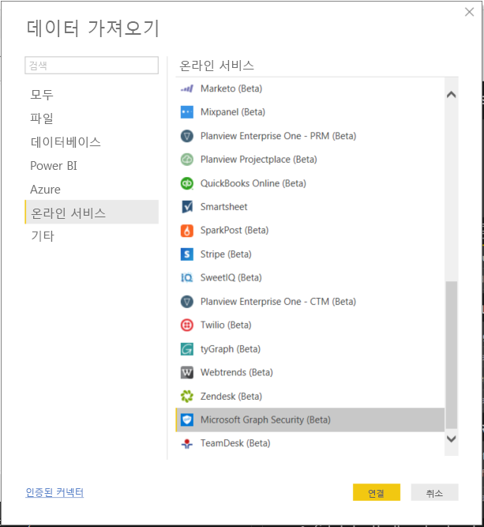
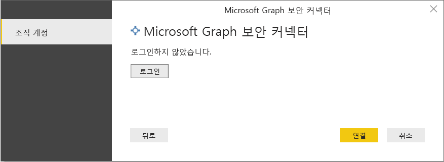
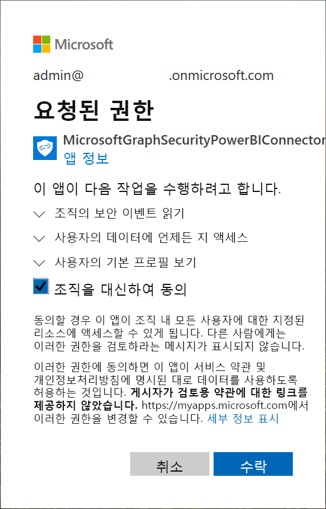
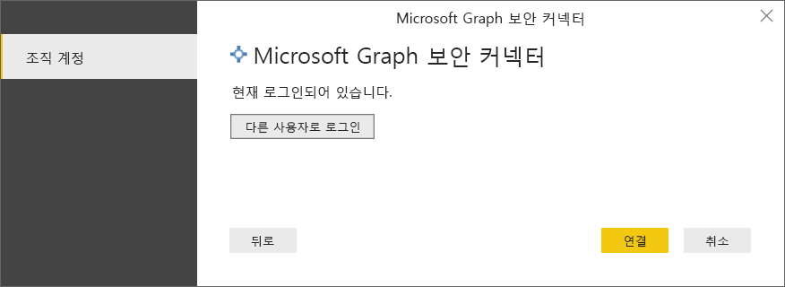
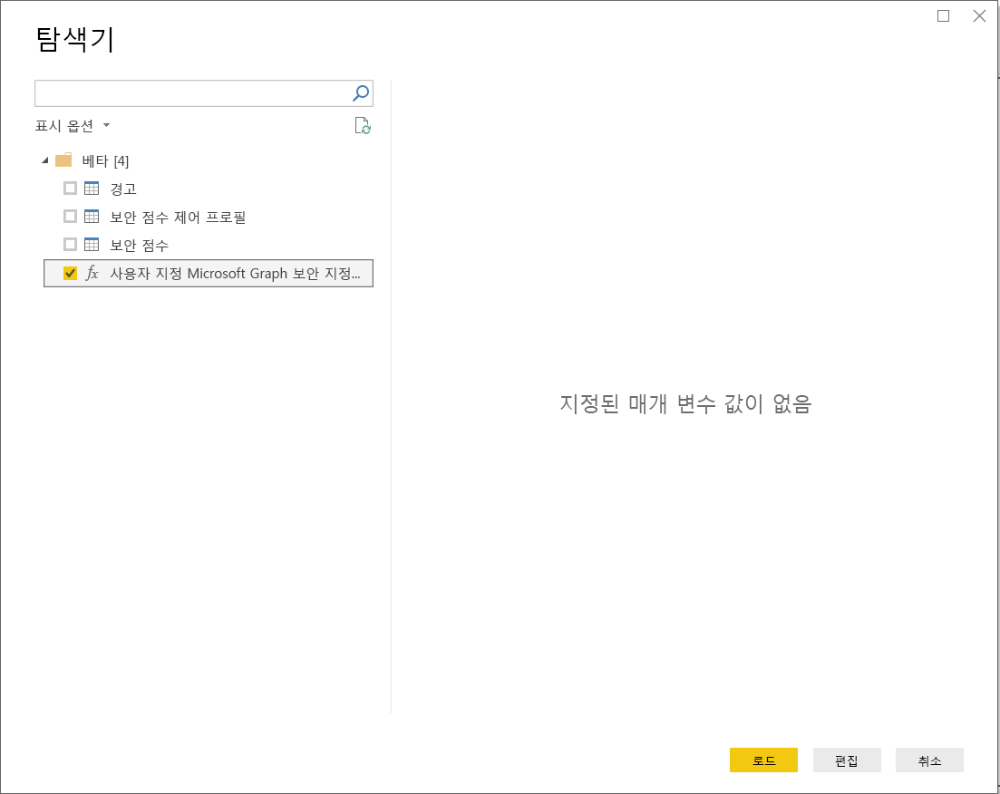
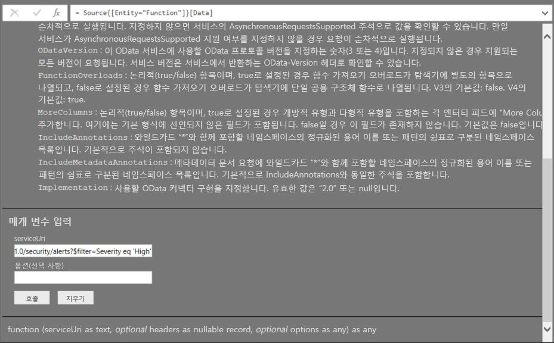
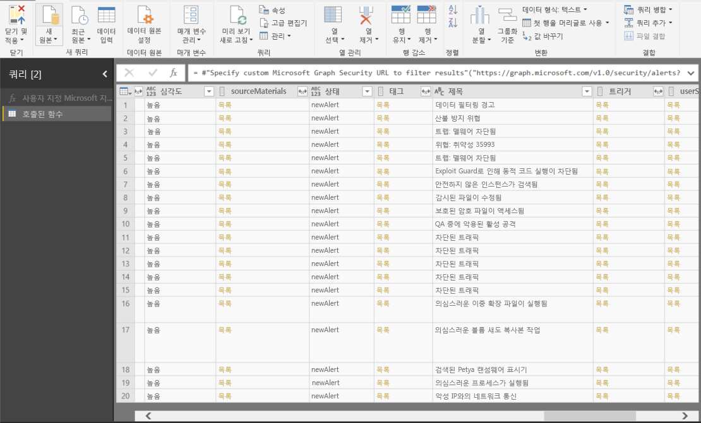

# Power BI Desktop에서 Microsoft Graph 보안에 연결

Power BI Desktop을 통해 Microsoft Graph Security Power BI 커넥터를 사용하여 Microsoft Graph Security API에 연결할 수 있습니다. 이렇게 하면 대시보드 및 관련 보고서를 빌드하여 보안 관련 [경고](https://docs.microsoft.com/graph/api/resources/alert?view=graph-rest-1.0) 및 [보안 점수](https://docs.microsoft.com/graph/api/resources/securescores?view=graph-rest-beta)에 대한 인사이트를 얻을 수 있습니다. [Microsoft Graph Security API](https://aka.ms/graphsecuritydocs)는 Microsoft 및 에코시스템 파트너의 [여러 보안 솔루션](https://aka.ms/graphsecurityalerts)을 연결하여 경고의 상관 관계를 쉽게 하고 다양한 컨텍스트 정보에 액세스 권한을 제공하고 자동화를 간소화합니다. 이를 통해 조직은 신속하게 인사이트를 얻고 보안 제품 전반에 걸쳐 조치를 취하는 동시에 여러 통합을 빌드하고 유지 관리하는 데 드는 비용과 복잡성을 줄일 수 있습니다.

## Microsoft Graph 보안 커넥터에 연결하기 위한 필수 구성 요소

* Microsoft Graph 보안 커넥터를 사용하려면 [Microsoft Graph 보안 인증 요구 사항](https://aka.ms/graphsecurityauth)의 일부인 Azure AD(Active Directory) 테넌트 관리자 동의가 *명시적으로 제공*되어야 합니다. 이 동의에는 Microsoft Graph Security Power BI 커넥터의 애플리케이션 ID와 이름이 필요합니다. 이는 [Azure Portal](https://portal.azure.com)에서도 찾을 수 있습니다.

   | 속성 | 값 |
   |----------|-------|
   | **애플리케이션 이름** | `MicrosoftGraphSecurityPowerBIConnector` |
   | **애플리케이션 ID** | `cab163b7-247d-4cb9-be32-39b6056d4189` |
   |||

   커넥터에 대한 동의를 얻으려면 Azure AD 테넌트 관리자는 다음 단계 중 하나를 따릅니다.

   * [Azure AD 애플리케이션에 대한 테넌트 관리자 동의를 부여합니다](https://docs.microsoft.com/azure/active-directory/develop/v2-permissions-and-consent).

   * 논리 앱의 첫 번째 실행 동안 앱은 [애플리케이션 동의 환경](https://docs.microsoft.com/azure/active-directory/develop/application-consent-experience)을 통해 Azure AD 테넌트 관리자에게 동의를 요청할 수 있습니다.
   
* Microsoft Graph Security Power BI 커넥터에 연결하기 위해 로그인하는 데 사용되는 사용자 계정은 Azure AD(Security Reader 또는 보안 관리자)에서 Security Reader Limited Admin 역할의 멤버여야 합니다. [사용자에게 Azure AD 역할 할당](https://docs.microsoft.com/graph/security-authorization#assign-azure-ad-roles-to-users) 섹션의 단계를 수행합니다. 

## Microsoft Graph 보안 커넥터 사용

**Microsoft Graph 보안** 커넥터를 사용하려면 다음 단계를 따릅니다.

1. **데이터 가져오기 -> 추가...** 를 Power BI Desktop의 **홈** 리본에서 선택합니다.
2. 왼쪽 범주에서 **온라인 서비스**를 선택하고,
3. **Microsoft Graph 보안(베타)** 를 클릭합니다.

    
    
4. 나타나는 **Microsoft Graph 보안** 창에서 쿼리할 Microsoft Graph API 버전을 선택합니다. 옵션은 v1.0 및 베타입니다.

    
    
5. 메시지가 표시되면 Azure Active Directory 계정에 로그인합니다. 이 계정은 위의 필수 구성 요소 섹션에서 언급한 대로 **Security Reader** 역할을 가져야 합니다.

    
    
6. 테넌트 관리자**이고** 필수 구성 요소에 따라 Microsoft Graph Security Power BI 커넥터(애플리케이션)에 아직 동의하지 않은 경우, 다음 대화 상자가 표시됩니다. "**조직을 대신하여 동의**"를 선택해야 합니다.

    
    
7. 로그인하면 인증되었음을 나타내는 다음 창이 표시됩니다. **연결**을 선택합니다.

    
    
8. 성공적으로 연결되면 **탐색기** 창이 다음과 같이 나타나고 이전 단계에서 선택한 버전의 [Microsoft Graph Security API](https://aka.ms/graphsecuritydocs)에서 사용할 수 있는 경고 등과 같은 엔터티가 표시됩니다. **Power BI Desktop**에서 가져오고 사용할 하나 이상의 엔터티를 선택합니다. **로드**를 클릭하여 10단계에서 요약된 결과 보기를 가져옵니다.

   
    
9. Microsoft Graph Security API에 대한 고급 쿼리를 만들려면 **사용자 지정 Microsoft Graph Security URL을 지정하여 결과 필터링** 함수를 선택합니다. 이렇게 하면 API에 액세스하는 데 필요한 권한이 있는 Microsoft Graph Security API에 [OData.Feed](https://docs.microsoft.com/power-bi/desktop-connect-odata) 쿼리를 만들 수 있습니다.

   > [!NOTE]
   > 아래에서 사용하는 serviceUri 예제는 `https://graph.microsoft.com/v1.0/security/alerts?$filter=Severity eq 'High'`입니다. 최근 대부분의 결과를 필터링, 정렬 또는 검색할 쿼리를 빌드하려면 [그래프 지원 ODATA 쿼리 매개 변수](https://docs.microsoft.com/graph/query-parameters)를 참조하세요.

   
    
   **Invoke**를 선택하면 OData.Feed 함수는 쿼리 편집기를 여는 API를 호출하여 사용할 데이터 세트를 필터링하고 구체화한 다음, 구체화된 데이터 세트를 Power BI Desktop으로 로드할 수 있습니다.

10. 다음 그림은 쿼리한 Microsoft Graph 보안 엔터티에 대한 결과 창을 보여줍니다.

   
    

이제 Power BI Desktop의 Microsoft Graph 보안 커넥터에서 가져온 데이터를 사용하여 시각적 개체, 보고서를 만들거나 기타 Excel 통합 문서, 데이터베이스 또는 기타 데이터 원본과 같이 연결 및 가져오려는 다른 모든 데이터와 상호 작용할 준비가 되었습니다.

## 다음 단계
* [Microsoft Graph Security GitHub Power BI 샘플 리포지토리](https://aka.ms/graphsecuritypowerbiconnectorsamples)에서 이 커넥터를 사용하여 Power BI 샘플 및 템플릿을 확인합니다.

* [Microsoft Graph Security Power BI 커넥터 블로그 게시물](https://aka.ms/graphsecuritypowerbiconnectorblogpost)에서 일부 사용자 시나리오 및 추가 정보를 확인합니다.

* Power BI Desktop을 사용하여 연결할 수 있는 모든 종류의 데이터가 있습니다. 데이터 원본에 대한 자세한 내용은 다음 리소스를 확인하세요.

    * [Power BI Desktop이란?](desktop-what-is-desktop.md)
    * [Power BI Desktop의 데이터 원본](desktop-data-sources.md)
    * [Power BI Desktop에서 데이터 셰이핑 및 결합](desktop-shape-and-combine-data.md)
    * [Power BI Desktop에서 Excel 통합 문서에 연결](desktop-connect-excel.md)
    * [Power BI Desktop에 데이터 직접 연결](desktop-enter-data-directly-into-desktop.md)
