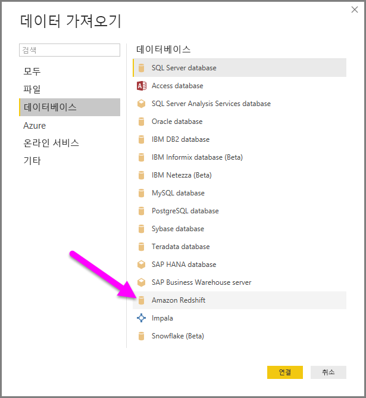
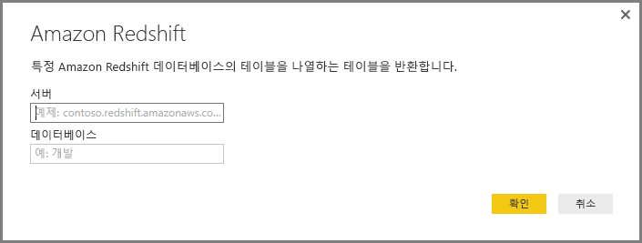
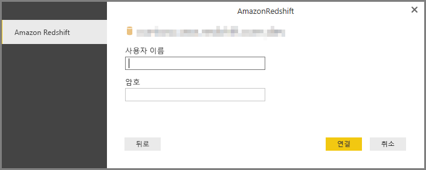
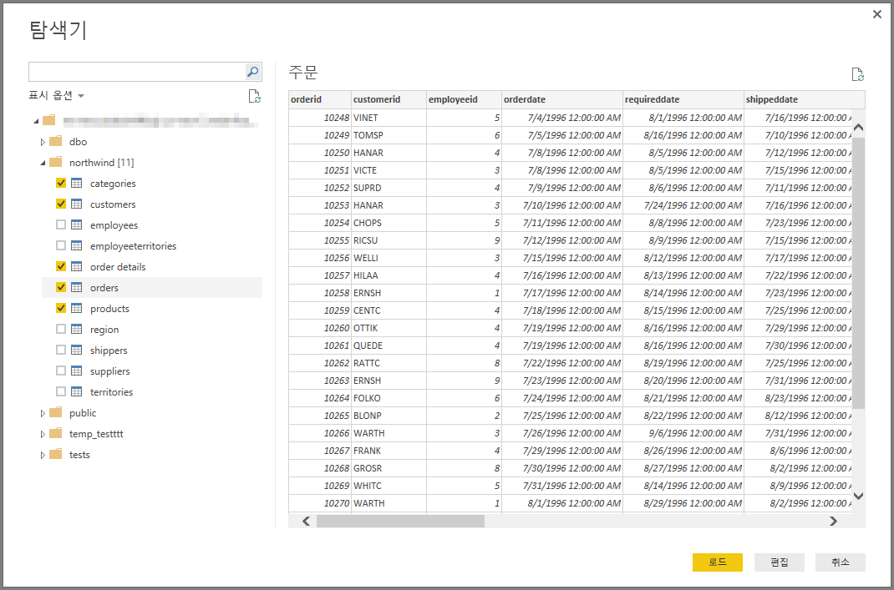

# Power BI Desktop에서 Amazon Redshift에 연결
**Power BI Desktop**에서 **Amazon Redshift** 데이터베이스에 연결하고 Power BI Desktop의 다른 데이터 원본처럼 기본 데이터를 사용할 수 있습니다.

## Amazon Redshift 데이터베이스에 연결
**Amazon Redshift** 데이터베이스에 연결하려면 Power BI Desktop의 리본 메뉴 **홈** 탭에서 **데이터 가져오기**를 선택합니다. 왼쪽에 있는 범주에서 **데이터베이스**를 선택하면 **Amazon Redshift**가 표시됩니다.

**Amazon Redshift** 창이 나타나면 **Amazon Redshift** 서버 및 데이터베이스 이름을 상자에 입력하거나 붙여 넣습니다. *Server* 필드의 일부로, 사용자는 다음 형식으로 포트를 지정할 수 있습니다. *ServerURL:Port*

메시지가 표시되면 사용자 이름 및 암호를 입력합니다. 오류를 피하려면 SSL 인증서와 정확하게 일치하는 서버 이름을 사용해야 합니다. 

성공적으로 연결되면 **탐색기** 창이 나타나고 서버에 사용 가능한 데이터를 표시합니다. 여기서 하나 이상의 요소를 선택하여 **Power BI Desktop**에 가져오고 사용할 수 있습니다.

**탐색기** 창에서 선택하면 데이터를 **로드** 또는 **편집**할 수 있습니다.

* 데이터를 **로드**하기로 선택한 경우 *가져오기* 또는 *DirectQuery* 모드를 사용하여 데이터를 로드하라는 메시지가 표시됩니다. 자세한 정보는 [DirectQuery를 설명하는 문서](desktop-use-directquery.md)를 확인합니다.
* 데이터 **편집**을 선택하면 **쿼리 편집기**가 나타나고 여기서 데이터에 대한 모든 종류의 변환 및 필터를 적용할 수 있습니다. 이 중 대부분은 기본 **Amazon Redshift**(지원하는 경우) 데이터베이스 자체에 적용됩니다.

## 다음 단계
Power BI Desktop을 사용하여 연결할 수 있는 모든 종류의 데이터가 있습니다. 데이터 원본에 대한 자세한 내용은 다음 리소스를 확인하세요.

* [Power BI Desktop이란?](desktop-what-is-desktop.md)
* [Power BI Desktop의 데이터 원본](desktop-data-sources.md)
* [Power BI Desktop에서 데이터 셰이핑 및 결합](desktop-shape-and-combine-data.md)
* [Power BI Desktop에서 Excel 통합 문서에 연결](desktop-connect-excel.md)   
* [Power BI Desktop에 데이터 직접 연결](desktop-enter-data-directly-into-desktop.md)   

