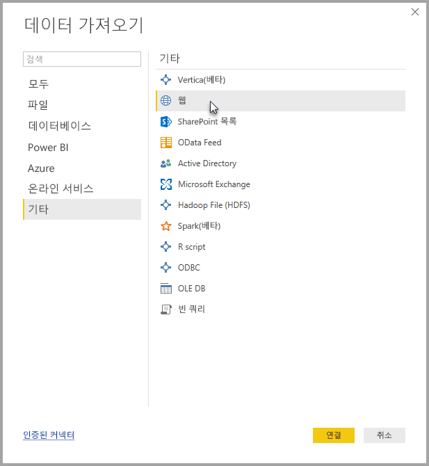
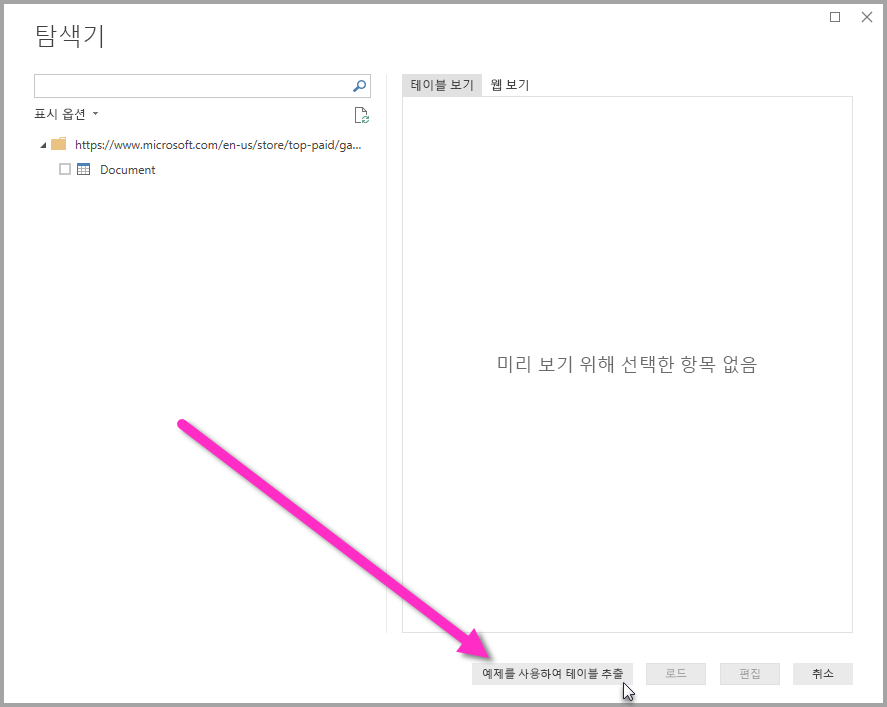
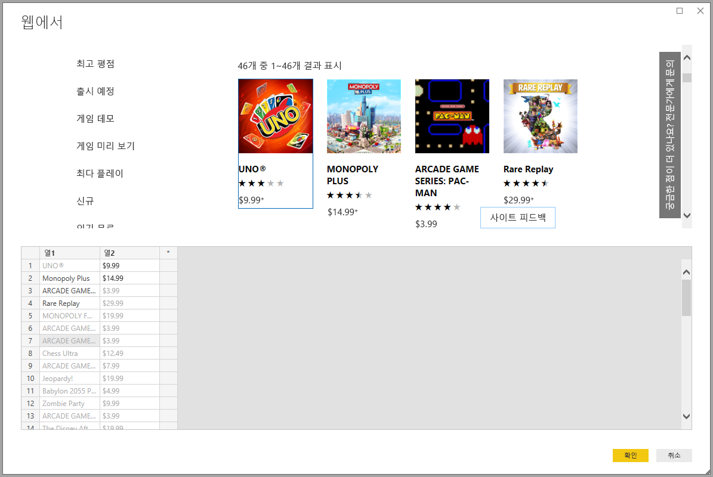
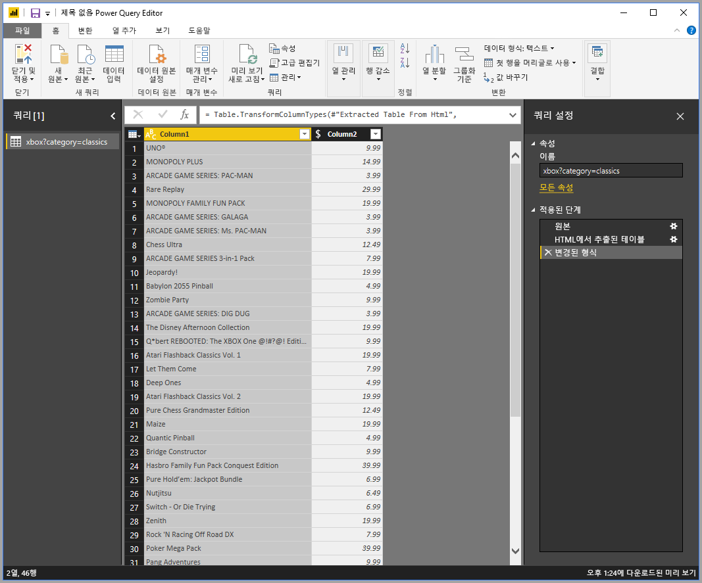

# 예제를 제공하여 웹 페이지에서 데이터 가져오기

웹 페이지에서 데이터를 가져오면 사용자가 간편하게 웹 페이지에서 데이터를 추출하고 해당 데이터를 **Power BI Desktop**으로 가져올 수 있습니다. 그러나 대부분의 경우 웹 페이지의 데이터는 쉽게 추출할 수 있는 정돈된 테이블에 포함되지 않으므로 데이터가 구조화되고 일관성이 있더라도 해당 페이지의 데이터를 가져오는 것은 어려울 수 있습니다. 

이에 대한 솔루션이 있습니다. 예를 들어 **예제를 통해 웹에서 데이터 가져오기** 기능으로 커넥터 대화 상자 내에 하나 이상의 예제를 제공하여 기본적으로 추출할 데이터를 **Power BI Desktop**에 알려줄 수 있고 Power BI Desktop이 예제와 일치하는 페이지에서 다른 데이터를 수집합니다. 이 솔루션을 사용하면 테이블에 있는 데이터 ‘및’ 기타 테이블 이외의 데이터를 포함하여 웹 페이지에서 모든 종류의 데이터를 추출할 수 있습니다.  

## 예제를 통해 웹에서 데이터 가져오기 사용

**예제를 통해 웹에서 데이터 가져오기**를 사용하려면 **홈** 리본 메뉴에서 **데이터 가져오기**를 선택합니다. 표시되는 창에서, 왼쪽 창의 범주에서 **기타**를 선택한 다음, **웹**을 선택합니다.

여기서 데이터를 추출할 원본 웹 페이지의 URL을 입력합니다. 이 문서에서는 Microsoft Store 웹 페이지를 사용하여 이 커넥터의 작동 방식을 보여줍니다. 

따라 하려는 경우 이 문서에서 사용하는 [Microsoft Store URL](https://www.microsoft.com/store/top-paid/games/xbox?category=classics)을 사용하면 됩니다.

    https://www.microsoft.com/store/top-paid/games/xbox?category=classics

**확인**을 선택하면 웹 페이지에서 자동 검색된 테이블이 표시되는 **탐색기** 대화 상자로 이동됩니다. 아래 이미지에 표시된 경우에는 테이블을 찾을 수 없지만 페이지 아래쪽에 있는 **예를 사용하여 테이블 추출**이라는 단추를 사용하여 예제를 제공할 수 있습니다.

**예제를 사용하여 테이블 추출**을 선택하면 웹 페이지의 콘텐츠를 미리 보고 추출할 데이터의 샘플 값을 입력할 수 있는 대화형 창이 표시됩니다. 

이 예제에서는 페이지의 각 게임에 대한 ‘이름’ 및 ‘가격’을 추출합니다.   다음 이미지와 같이 각 열에 대해 페이지에서 두 개 정도의 예제를 지정하여 작업을 수행할 수 있습니다. 이러한 예제가 입력되면 **파워 쿼리**(웹 페이지에서 데이터를 추출하는 기본 기술)는 스마트 데이터 추출 알고리즘을 사용하여 예제 항목의 패턴에 맞는 데이터를 추출할 수 있습니다.

> 참고: 값 제안에는 길이가 128자보다 작거나 같은 값만 포함됩니다.

웹 페이지에서 추출한 데이터에 만족하면 **확인**을 선택하여 **쿼리 편집기**로 이동하고, 여기서 이 데이터를 다른 데이터 원본과 결합하는 것과 같이 데이터를 셰이핑하거나 더 많은 변환을 적용할 수 있습니다.

여기서 시각적 개체를 만들거나 **Power BI Desktop** 보고서를 만들 때 웹 페이지 데이터를 사용할 수 있습니다.

## 다음 단계
**Power BI Desktop**을 사용하여 모든 종류의 데이터를 연결할 수 있습니다. 데이터 원본에 대한 자세한 내용은 다음 리소스를 확인하세요.

* [예제로 열 추가](desktop-add-column-from-example.md)
* [웹 페이지에 연결](desktop-connect-to-web.md)
* [Power BI Desktop의 데이터 원본](desktop-data-sources.md)
* [Power BI Desktop에서 데이터 셰이핑 및 결합](desktop-shape-and-combine-data.md)
* [Power BI Desktop에서 Excel 통합 문서에 연결](desktop-connect-excel.md)   
* [Power BI Desktop에서 CSV 파일에 연결](desktop-connect-csv.md)   
* [Power BI Desktop에 데이터 직접 연결](desktop-enter-data-directly-into-desktop.md)   

