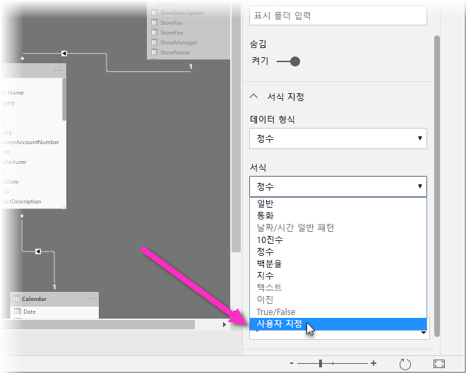
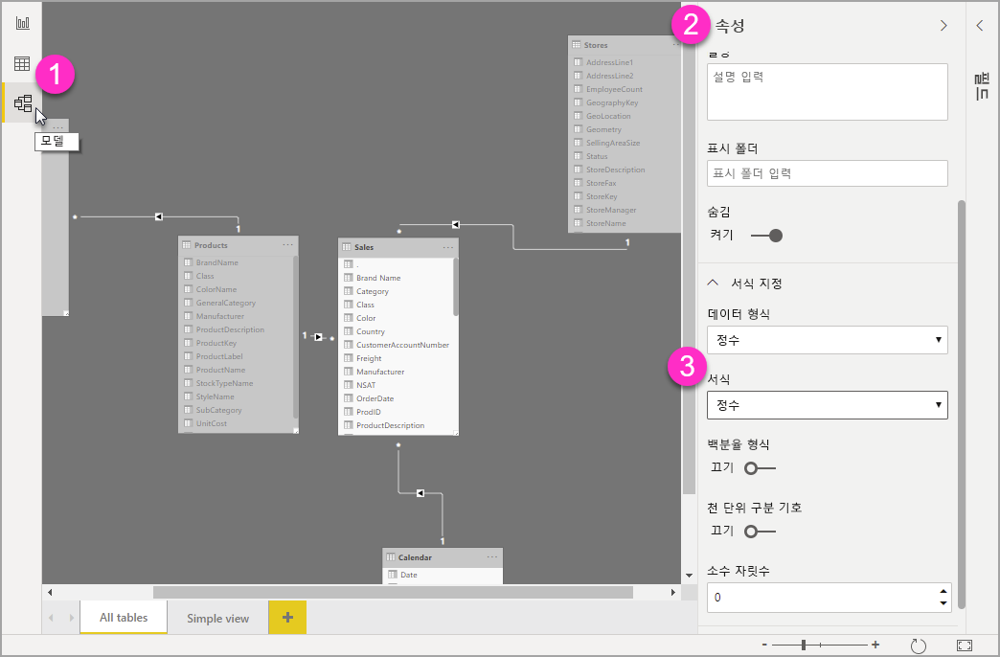

# Power BI Desktop에서 사용자 지정 형식 문자열 사용

**Power BI Desktop**에서 사용자 지정 형식 문자열을 사용하여 시각적 개체에서 필드가 표시되는 방식을 사용자 지정하고 보고서가 원하는 모양으로 표시되도록 할 수 있습니다.

## 사용자 지정 형식 문자열을 사용하는 방법

사용자 지정 형식 문자열을 만들려면 **모델링** 보기에서 필드를 선택한 다음, **속성** 창에서 **형식**을 선택합니다.

**형식** 드롭다운에서 **사용자 지정**을 선택하면 일반적으로 사용되는 형식 문자열 목록 중에서 선택할 수 있습니다. 

## 지원되는 사용자 지정 형식 구문

사용자 지정 형식 문자열은 Excel 및 기타 Microsoft 제품에 공통적으로 적용되는 VBA 스타일 구문을 따르지만, 다른 제품에서 사용되는 구문을 모두 지원하지는 않습니다. 

다음 표에서는 Power BI에서 지원되는 구문을 정의합니다.

다음 표에서는 지원되는 **날짜 기호**를 보여 줍니다.

| **기호** | **범위** |
| --- | --- |
| _d_ | 1-31(월간 일자, 선행 0 없음) |
| _dd_ | 01-31(월간 일자, 선행 0 있음) |
| _m_ | 1-12(연간 월, 선행 0 없음, 1월 = 1부터 시작) |
| _mm_ | 01-12(연간 월, 선행 0 있음, 1월 = 01부터 시작) |
| _mmm_ | 약어 월 이름을 표시합니다(회교식 월 이름에는 약어가 없음). |
| _mmmm_ | 전체 월 이름을 표시합니다. |
| _yy_ | 00-99(연도의 마지막 두 자리) |
| _yyyy_ | 100-9999(3자리 또는 4자리 연도) |

다음 표에서는 지원되는 **시간 기호**를 보여 줍니다.

| **기호** | **범위** |
| --- | --- |
| _h_ | 0-23(&quot;AM&quot; 또는 &quot;PM&quot;이 추가된 1-12)(일별 시간, 선행 0 없음) |
| _hh_ | 00-23(&quot;AM&quot; 또는 &quot;PM&quot;이 추가된 01-12)(일별 시간, 선행 0 있음) |
| _n_ | 0-59(시간별 분, 선행 0 없음) |
| _nn_ | 00-59(시간별 분, 선행 0 있음) |
| _m_ | 0-59(시간별 분, 선행 0 없음) 앞에 _h_ 또는 _hh_가 있는 경우만 해당 |
| _mm_ | 00-59(시간별 분, 선행 0 있음). 앞에 _h_ 또는 _hh_가 있는 경우만 해당 |
| _s_ | 0-59(분별 초, 선행 0 없음) |
| _ss_ | 00-59(분별 초, 선행 0 있음) |

사용자 지정 값 문자열의 형식 지정 방법 [예제](https://docs.microsoft.com/office/vba/language/reference/user-interface-help/format-function-visual-basic-for-applications#example)를 참조할 수 있습니다.

숫자에 대한 사용자 정의 형식 식은 세미콜론으로 구분된 1~3개 섹션을 포함할 수 있습니다. 세미콜론 사이에 아무 것도 포함하지 않으면 누락된 섹션이 표시되지 않습니다(&quot;&quot;). 세미콜론을 지정하지 않으면 긍정 형식이 사용됩니다.

다른 값 문자열에 대한 다양한 형식의 예는 다음과 같습니다.

|   | **형식 문자열** |   |   |   |
| --- | --- | --- | --- | --- |
| **값** | **0.00;-0.0;&quot;Zero&quot;** | **0.00;;** | **0.00;-0.0;** | **0.00;** |
| **-1.234** | -1.2 | &quot;&quot; | -1.2 | &quot;&quot; |
| **0** | &quot;Zero&quot; | &quot;&quot; | &quot;&quot; | 0.00 |
| **1.234** | 1.23 | 1.23 | 1.23 | 1.23 |

다음 표에서는 미리 정의된 **명명된 날짜 및 시간 형식**을 보여 줍니다.

| **형식 이름** | **설명** |
| --- | --- |
| **일반 날짜** | 날짜 및/또는 시간을 표시합니다(예: 4/3/93 05:34 PM). 소수 부분이 없으면 날짜만 표시합니다(예: 4/3/93). 정수 부분이 없으면 시간만 표시합니다(예: 05:34 PM). 날짜 표시는 시스템 설정에 따라 결정됩니다. |
| **긴 날짜** | 시스템의 긴 날짜 형식에 따라 날짜를 표시합니다. |
| **짧은 날짜** | 시스템의 짧은 날짜 형식을 사용하여 날짜를 표시합니다. |
| **긴 시간** | 시간, 분, 초를 포함하는 시스템의 긴 시간 형식을 사용하여 시간을 표시합니다. |
| **짧은 시간** | 24시간 형식(예: 17:45)을 사용하여 시간을 표시합니다. |

명명된 숫자 형식

다음 표에서는 미리 정의된 **명명된 숫자 형식**을 보여 줍니다.

| **형식 이름** | **설명** |
| --- | --- |
| **일반 숫자** | 천 단위 구분 기호 없이 숫자를 표시합니다. |
| **통화** | 천 단위 구분 기호를 사용하여 숫자를 표시합니다. 해당하는 경우 소수 구분 기호 오른쪽에 두 자릿수를 표시합니다. 출력은 시스템 로캘 설정에 따라 달라집니다. |
| **고정** | 소수점 구분 기호 왼쪽에는 한 자릿수 이상, 오른쪽에는 두 자릿수 이상을 표시합니다. |
| **표준** | 천 단위 구분 기호를 사용하여 숫자를 표시하고 소수점 구분 기호 왼쪽에는 한 자릿수 이상, 오른쪽에는 두 자릿수 이상을 표시합니다. |
| **퍼센트** | 숫자에 100을 곱하고 오른쪽에 퍼센트 기호( **%** )를 추가하여 표시합니다. 소수 구분 기호 오른쪽에는 항상 두 자릿수를 표시합니다. |
| **지수** | 표준 지수 표기법을 사용합니다. |

다음 표에서는 **사용자 정의 날짜/시간 형식**을 만드는 데 사용할 수 있는 문자를 보여 줍니다.

| **문자** | **설명** |
| --- | --- |
| ( **:** ) | 시간 구분 기호. 일부 로캘에서는 다른 문자를 사용하여 시간 구분 기호를 나타낼 수 있습니다. 시간 구분 기호는 시간 값의 형식을 지정할 때 시간, 분 및 초를 구분합니다. 형식이 지정된 출력에서 시간 구분 기호로 사용되는 실제 문자는 시스템 설정에 따라 결정됩니다. |
| ( **/** ) | 날짜 구분 기호. 일부 로캘에서는 다른 문자를 사용하여 날짜 구분 기호를 나타낼 수 있습니다. 날짜 구분 기호는 날짜 값의 형식을 지정할 때 일, 월 및 년을 구분합니다. 형식이 지정된 출력에서 날짜 구분 기호로 사용되는 실제 문자는 시스템 설정에 따라 결정됩니다. |
| d | 일을 선행 0 없는 숫자로 표시합니다(1-31). |
| dd | 일을 선행 0 있는 숫자로 표시합니다(01-31). |
| ddd | 약어로 요일을 표시합니다(Sun-Sat). 지역화됨. |
| dddd | 요일을 전체 이름으로 표시합니다(Sunday-Saturday). 지역화됨. |
| 남성 | 월을 선행 0 없는 숫자로 표시합니다(1-12). m 바로 뒤에 h 또는 hh가 나오면 월이 아닌 분이 표시됩니다. |
| mm | 월을 선행 0 있는 숫자로 표시합니다(01-12). m 바로 뒤에 h 또는 hh가 나오면 월이 아닌 분이 표시됩니다. |
| mmm | 약어로 월을 표시합니다(Jan-Dec). 지역화됨. |
| mmmm | 월을 전체 월 이름으로 표시합니다(1월–12월). 지역화됨. |
| yy | 연도를 2자리 숫자로 표시합니다(00-99). |
| yyyy | 연도를 4자리 숫자로 표시합니다(100-9999). |
| h | 시간을 선행 0 없는 숫자로 표시합니다(0-23). |
| hh | 시간을 선행 0 있는 숫자로 표시합니다(00-23). |
| n | 분을 선행 0 없는 숫자로 표시합니다(0-59). |
| nn | 분을 선행 0 있는 숫자로 표시합니다(00-59). |
| s | 초를 선행 0 없는 숫자로 표시합니다(0-59). |
| ss | 초를 선행 0 있는 숫자로 표시합니다(00-59). |
| AM/PM | 12시간 시계를 사용하고 정오 이전의 모든 시간에 대문자 AM을 표시하고, 정오와 오후 11시 59분 사이의 모든 시간에 대문자 PM을 표시합니다. |

다음 표에서는 **사용자 정의 숫자 형식**을 만드는 데 사용할 수 있는 문자를 나타냅니다.

| **문자** | **설명** |
| --- | --- |
| 없음 | 형식을 지정하지 않고 숫자를 표시합니다. |
| ( **0** ) | 숫자 자리 표시자. 숫자 또는 0을 표시합니다. 형식 문자열에서 0이 나타나는 식의 위치에 숫자가 있으면 해당 숫자를 표시하고, 그렇지 않으면 해당 위치에 0을 표시합니다. 숫자의 자릿수가 형식 식에 있는 0의 개수(소수점의 한쪽에 있는)보다 적은 경우이 선행 또는 후행 0을 표시합니다. 소수 구분 기호 오른쪽에 있는 숫자의 자릿수가 형식 문자열에서 소수 구분 기호 오른쪽에 있는 0의 개수보다 많으면 소수 자릿수가 0 개수가 되도록 숫자를 반올림합니다. 소수 구분 기호 왼쪽에 있는 숫자의 자릿수가 형식 문자열에서 소수 구분 기호 왼쪽에 있는 0의 개수보다 많으면 수정하지 않고 남는 자릿수를 표시합니다. |
| ( **#** ) | 숫자 자리 표시자. 숫자를 표시하거나 아무 것도 표시하지 않습니다. 형식 문자열에서 #이 나타나는 식의 위치에 숫자가 있으면 해당 숫자를 표시하고, 그렇지 않으면 해당 위치에 아무 것도 표시하지 않습니다. 이 기호는 0 숫자 자리 표시자와 동일하게 작동합니다. 단, 숫자의 자릿수가 형식 식의 소수 구분 기호 양쪽에 있는 # 문자 수보다 작거나 같을 때 선행 및 후행 0이 표시되지 않습니다. |
| ( **.** ) | 소수 자리 표시자입니다. 일부 로캘에서는 소수 구분 기호로 쉼표를 사용합니다. 소수 자리 표시자는 소수 구분 기호 왼쪽 및 오른쪽에 표시되는 자릿수를 결정합니다. 형식 식에 이 기호 왼쪽에 있는 숫자 기호만 포함된 경우 1보다 작은 숫자는 소수 구분 기호로 시작합니다. 소수를 사용하여 선행 0을 표시하려면 소수 구분 기호 왼쪽의 첫 번째 숫자 자리 표시자로 0을 사용합니다. 형식이 지정된 출력에서 소수 자리 표시자로 사용되는 실제 문자는 시스템에서 인식하는 숫자 형식에 따라 다릅니다. |
| ( **%)** | 백분율 자리 표시자. 식에 100을 곱합니다. 퍼센트 문자( **%** )가 형식 문자열에 표시되는 위치에 삽입됩니다. |
| ( **,** ) | 천 단위 구분 기호. 일부 로캘에서는 천 단위 구분 기호로 마침표를 사용합니다. 천 단위 구분 기호는 소수 구분 기호 왼쪽에 네 개 이상의 자릿수가 있는 숫자 내에서 천 단위를 구분합니다. 형식이 숫자 자리 표시자(**0** 또는 **#** )로 둘러싸인 천 단위 구분 기호를 포함하는 경우 천 단위 구분 기호의 표준 사용이 지정됩니다. 소수 구분 기호 바로 왼쪽에 있는 2개의 인접한 천 단위 구분 기호나 천 단위 구분 기호(소수 구분 기호 지정 여부에 관계 없음)는 &quot;숫자를 1000으로 나눈 후 필요에 따라 반올림하는 것&quot;을 의미합니다. 예를 들어, 형식 문자열 &quot;##0,,&quot;를 사용하여 1억을 100으로 나타낼 수 있습니다. 100만보다 작은 숫자는 0으로 표시됩니다. 소수 구분 기호 바로 왼쪽이 아닌 위치에 있는 두 개의 인접한 천 단위 구분 기호는 천 단위 구분 기호 사용을 지정하여 간단히 처리됩니다. 형식이 지정된 출력에서 천 단위 구분 기호로 사용되는 실제 문자는 시스템에서 인식하는 숫자 형식에 따라 다릅니다. |
| ( **:** ) | 시간 구분 기호. 일부 로캘에서는 다른 문자를 사용하여 시간 구분 기호를 나타낼 수 있습니다. 시간 구분 기호는 시간 값의 형식을 지정할 때 시간, 분 및 초를 구분합니다. 형식이 지정된 출력에서 시간 구분 기호로 사용되는 실제 문자는 시스템 설정에 따라 결정됩니다. |
| ( **/** ) | 날짜 구분 기호. 일부 로캘에서는 다른 문자를 사용하여 날짜 구분 기호를 나타낼 수 있습니다. 날짜 구분 기호는 날짜 값의 형식을 지정할 때 일, 월 및 년을 구분합니다. 형식이 지정된 출력에서 날짜 구분 기호로 사용되는 실제 문자는 시스템 설정에 따라 결정됩니다. |
| ( **E- E+ e- e+** ) | 지수 형식. 형식 식에서 E-, E+, e- 또는 e+ 오른쪽에 한 자리 이상의 자리 표시자(**0** 또는 **#** )가 포함되어 있으면 숫자는 지수 형식으로 표시되고 E 또는 e가 숫자와 지수 사이에 삽입됩니다. 오른쪽의 숫자 자리 표시자의 수는 지수의 자릿수를 결정합니다. 음수 지수 옆에 빼기 기호를 추가하려면 E- 또는 e-를 사용합니다. 음수 지수 옆에 빼기 기호를, 양수 지수 옆에 더하기 기호를 추가하려면 E+ 또는 e+를 사용합니다. |
| **- + $**  ( ) | 리터럴 문자를 표시합니다. 나열된 문자 이외의 문자를 표시하려면 앞에 백슬래시(\))를 사용하거나 큰따옴표(&quot; &quot;)로 묶습니다. |
| ( * *\** ) | 형식 문자열에서 다음 문자를 표시합니다. 리터럴 문자와 같이 특별한 의미가 있는 문자를 표시하려면 앞에 백슬래시(\)를 사용합니다. 백슬래시 자체는 표시되지 않습니다. 백슬래시를 사용하는 것은 다음 문자를 큰따옴표로 묶는 것과 같습니다. 백슬래시를 표시하려면 백슬래시를 두 개(\\) 사용합니다. 리터럴 문자로 표시될 수 있는 문자의 예는 날짜 형식 및 시간 형식 문자(a, c, d, h, m, n, p, q, s, t, w, /, :), 숫자 형식 문자(#, 0, %, E, e, 쉼표, 마침표), 문자열 형식 문자(@, &amp;, \&lt;, \&gt;, !)입니다. |
| (&quot;ABC&quot;) | 문자열을 큰따옴표(&quot; &quot;)로 묶어 표시합니다. |

## 다음 단계
다음 문서에도 관심이 있을 수 있습니다.

* [VBA 형식 문자열](https://docs.microsoft.com/office/vba/language/reference/user-interface-help/format-function-visual-basic-for-applications#example)
* [Power BI Desktop의 측정값](desktop-measures.md)
* [Power BI Desktop의 데이터 형식](desktop-data-types.md)
* [테이블에서 조건부 서식 지정](desktop-conditional-table-formatting.md)

