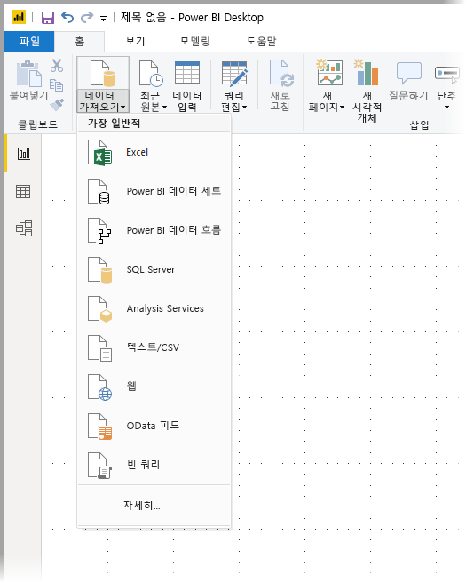
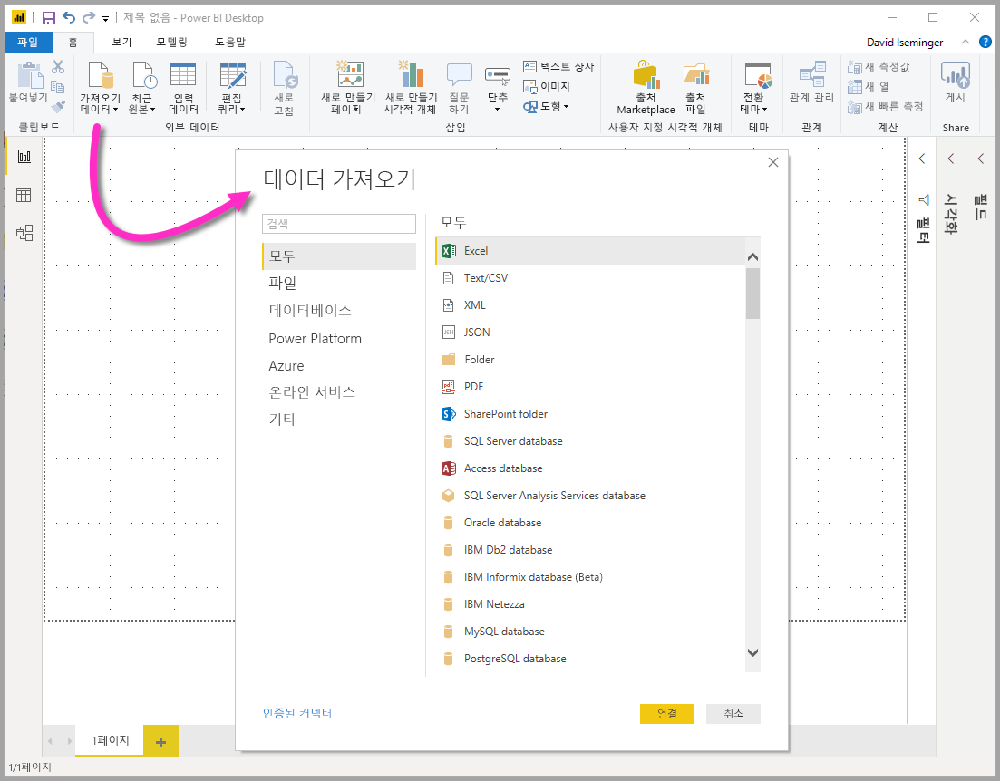
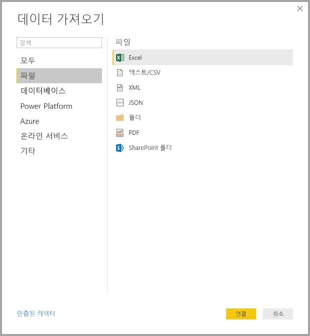
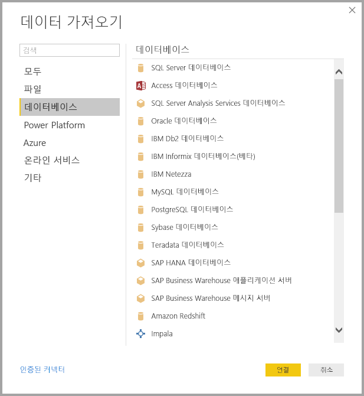
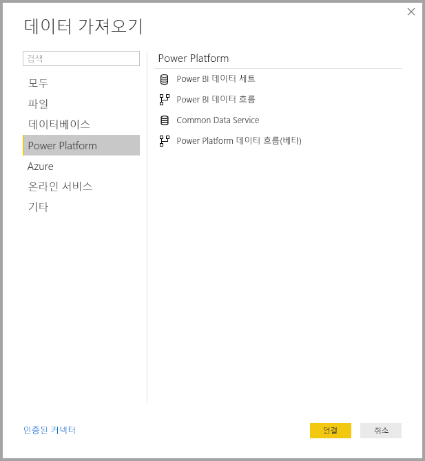
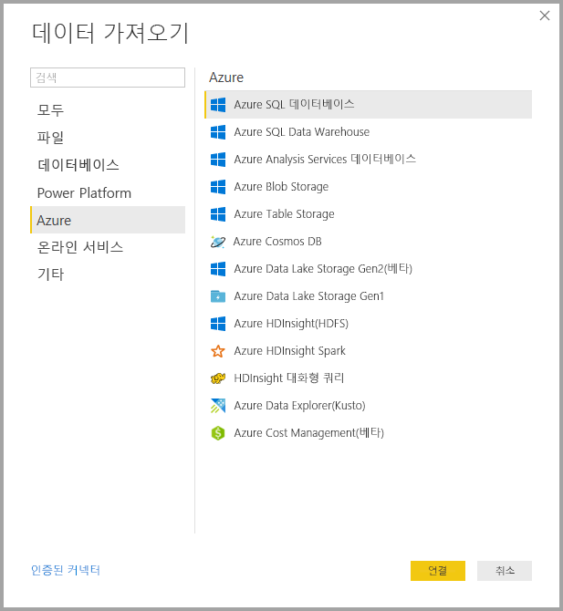
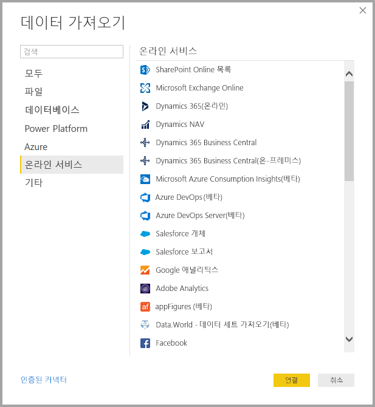
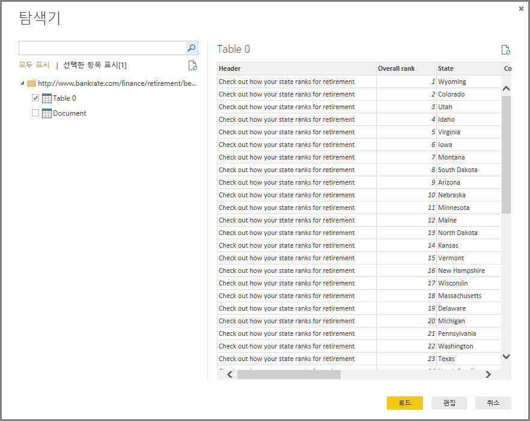

# Power BI Desktop의 데이터 원본
Power BI Desktop을 사용하면 다양한 원본의 데이터에 연결할 수 있습니다. 이 페이지의 맨 아래에는 사용 가능한 데이터 원본의 전체 목록이 있습니다.

데이터에 연결하려면 리본 메뉴의 **홈**  탭에서 **데이터 가져오기** 를 선택합니다. 아래쪽 화살표 또는 단추의 **데이터 가져오기** 텍스트를 선택하면 다음 이미지의 **가장 일반적** 데이터 형식 메뉴가 표시됩니다.

**자세히…** 선택 **가장 일반적** 메뉴에서 자세히...를 선택하면**데이터 가져오기** 창이 표시됩니다. **데이터 가져오기** **아이콘 단추**를 직접 선택하여 **데이터 가져오기** 창을 표시할 수도 있습니다(**가장 일반적** 메뉴 무시).

> [!NOTE]
> Power BI 팀은 **Power BI Desktop** 및 **Power BI 서비스**에 사용할 수 있는 데이터 원본을 지속적으로 확장합니다. 따라서 *베타* 또는 *미리 보기*로 표시된 작업 진행 데이터 원본의 초기 버전을 자주 볼 수 있습니다. *베타* 또는 *미리 보기*로 표시된 모든 데이터 원본은 제한된 지원 및 기능을 가지며 프로덕션 환경에서는 사용할 수 없습니다. 

> 또한 **Power BI Desktop**에서 ‘베타’ 또는 ‘미리 보기’로 표시된 데이터 원본은 데이터 원본이 GA(일반 공급) 상태가 될 때까지 **Power BI 서비스** 또는 기타 Microsoft 서비스에서 사용하지 못할 수 있습니다.  

## 데이터 원본
데이터 유형은 다음 범주로 구성됩니다.

* 모두
* 파일
* 데이터베이스
* Power BI
* Azure
* 온라인 서비스
* 기타

**모두** 범주에는 모든 범주의 모든 데이터 연결 유형이 포함됩니다.

**파일** 범주는 다음과 같은 데이터 연결을 제공합니다.

* Excel
* 텍스트/CSV
* XML
* JSON
* 폴더
* PDF
* SharePoint 폴더

다음 그림은 **파일**에 대한 **데이터 가져오기** 창을 보여 줍니다.

**데이터베이스** 범주는 다음과 같은 데이터 연결을 제공합니다.

* SQL Server 데이터베이스
* Access 데이터베이스
* SQL Server Analysis Services 데이터베이스
* Oracle 데이터베이스
* IBM DB2 데이터베이스
* IBM Informix 데이터베이스(베타)
* IBM Netezza
* MySQL 데이터베이스
* PostgreSQL 데이터베이스
* Sybase 데이터베이스
* Teradata 데이터베이스
* SAP HANA 데이터베이스
* SAP Business Warehouse 애플리케이션 서버
* SAP Business Warehouse 메시지 서버
* Amazon Redshift
* Impala
* Google BigQuery
* Vertica
* Snowflake
* Essbase
* AtScale 큐브(베타)
* BI 커넥터
* Dremio
* Exasol
* Indexima(베타)
* InterSystems IRIS(베타)
* Jethro(베타)
* Kyligence 엔터프라이즈(베타)
* MarkLogic(베타)

> [!NOTE]
> 일부 데이터베이스 커넥터는 **파일 > 옵션 및 설정 > 옵션**을 선택한 다음 **미리 보기 기능**을 선택하고 커넥터를 사용하도록 설정하여 사용해야 합니다. 위에서 언급한 커넥터 중 일부를 표시하지 않고 사용하지 않으려는 경우 **미리 보기 기능** 설정을 확인합니다. *베타* 또는 *미리 보기*로 표시된 모든 데이터 원본은 제한된 지원 및 기능을 가지며 프로덕션 환경에서는 사용할 수 없습니다.

다음 그림은 **데이터베이스**에 대한 **데이터 가져오기** 창을 보여 줍니다.

**Power Platform** 범주는 다음과 같은 데이터 연결을 제공합니다.

* Power BI 데이터 세트
* Power BI 데이터 흐름
* Common Data Service
* Power Platform 데이터 흐름(베타)

다음 그림은 **Power Platform**에 대한 **데이터 가져오기** 창을 보여 줍니다.

**Azure** 범주는 다음과 같은 데이터 연결을 제공합니다.

* Azure SQL Database
* Azure SQL Data Warehouse
* Azure Analysis Services 데이터베이스
* Azure Blob Storage
* Azure Table Storage
* Azure Cosmos DB
* Azure Data Lake Storage Gen2(베타)
* Azure Data Lake Storage Gen1
* Azure HDInsight(HDFS)
* Azure HDInsight Spark
* HDInsight 대화형 쿼리
* Azure Data Explorer(Kusto)
* Azure Cost Management(베타)

다음 그림은 **Azure** 에 대한 **데이터 가져오기** 창을 보여 줍니다.

**온라인 서비스** 범주는 다음과 같은 데이터 연결을 제공합니다.

* SharePoint Online 목록
* Microsoft Exchange Online
* Dynamics 365(온라인)
* Dynamics NAV
* Dynamics 365 Business Central
* Dynamics 365 Business Central(온-프레미스)
* Microsoft Azure Consumption Insights(베타)
* Azure DevOps(베타)
* Azure DevOps Server(베타)
* Salesforce 개체
* Salesforce 보고서
* Google 애널리틱스
* Adobe Analytics
* appFigures(베타)
* Data.World - 데이터 세트 가져오기(베타)
* Facebook
* GitHub(베타)
* MailChimp(베타)
* Marketo(베타)
* Mixpanel(베타)
* Planview Enterprise One - PRM(베타)
* Planview Projectplace(베타)
* QuickBooks Online(베타)
* Smartsheet
* SparkPost(베타)
* Stripe(베타)
* SweetIQ(베타)
* Planview Enterprise One - CMT(베타)
* Twilio(베타)
* tyGraph(베타)
* Webtrends(베타)
* Zendesk(베타)
* Dynamics 365 Customer Insights(베타)
* Emigo 데이터 원본(베타)
* Entersoft Business Suite(베타)
* 산업 앱 스토어
* Intune Data Warehouse(베타)
* Microsoft Graph 보안(베타)
* 빠른 자료
* TeamDesk(베타)

다음 그림은 **온라인 서비스**에 대한 **데이터 가져오기** 창을 보여 줍니다.

**기타** 범주는 다음과 같은 데이터 연결을 제공합니다.

* 웹
* SharePoint 목록
* OData 피드
* Active Directory
* Microsoft Exchange
* HDFS(Hadoop 파일)
* Spark
* R 스크립트
* Python 스크립트
* ODBC
* OLE DB
* BI360 - 예산 및 재무 보고(베타)
* Denado
* 정보 표(베타)
* Paxata 
* QubolePresto(베타)
* Roamler(베타)
* SurveyMonkey(베타)
* Tenforce(스마트) 목록(베타)
* 직원 차원(베타)
* 빈 쿼리

다음 그림은 **기타**에 대한 **데이터 가져오기** 창을 보여 줍니다.

> [!NOTE]
> 지금은 Azure Active Directory를 사용하여 보호되는 사용자 지정 데이터 원본에 연결할 수 없습니다.

## 데이터 원본에 연결
데이터 원본에 연결하려면 **데이터 가져오기** 창에서 데이터 원본을 선택한 다음 **연결**을 선택합니다. 다음 그림에서는 **기타** 데이터 연결 범주에서 **웹**이 선택됩니다.

데이터 연결 형식과 관련된 연결 창이 표시됩니다. 자격 증명이 필요한 경우 제공하라는 메시지가 표시됩니다. 다음 그림은 웹 데이터 소스에 연결하기 위해 입력되는 URL을 보여 줍니다.

URL 또는 리소스 연결 정보를 입력한 경우 **확인**을 선택합니다. Power BI Desktop이 데이터 소스에 연결하고 **탐색기**에 사용 가능한 데이터 소스를 제공합니다.

**탐색기** 창의 맨 아래에 있는 **로드** 단추를 선택하여 데이터를 로드하거나 **편집** 단추를 선택하여 데이터를 로드하기 전에 쿼리를 편집할 수 있습니다.

Power BI Desktop에서 데이터 소스에 연결하는 데 필요한 작업을 마쳤습니다. 데이터 원본의 성장 목록에서 데이터에 연결을 시도하고 자주 확인하세요. 항상 이 목록에 계속해서 추가합니다.

## 다음 단계
Power BI Desktop에서 모든 종류의 작업을 수행할 수 있습니다. 해당 기능에 대한 자세한 내용은 다음 리소스를 확인하세요.

* [Power BI Desktop이란?](desktop-what-is-desktop.md)
* [Power BI Desktop을 사용한 쿼리 개요](desktop-query-overview.md)
* [Power BI Desktop의 데이터 형식](desktop-data-types.md)
* [Power BI Desktop에서 데이터 셰이핑 및 결합](desktop-shape-and-combine-data.md)
* [Power BI Desktop의 일반적인 쿼리 작업](desktop-common-query-tasks.md)    
