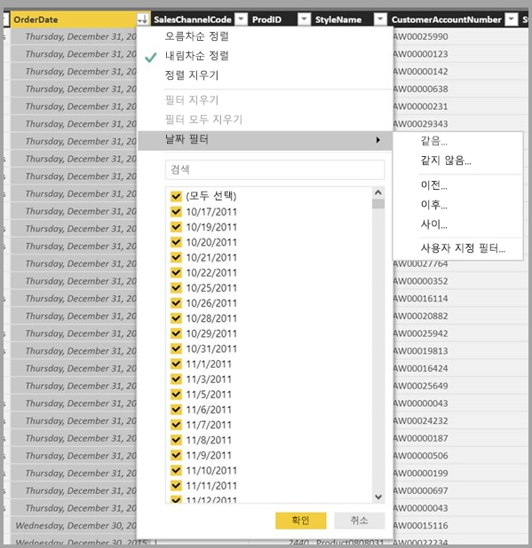

# Power BI Desktop의 데이터 뷰 사용
**데이터 보기**는 **Power BI Desktop** 모델의 데이터를 검사, 탐색 및 이해하는 데 도움이 됩니다. **쿼리 편집기**에서 테이블, 열 및 데이터를 보는 것과는 차이가 있습니다. 데이터 뷰에서는 모델에 데이터를 로드한 *후의* 데이터를 보게 됩니다.

데이터를 모델링할 때 종종 열에서 행 수준까지, 보고서 캔버스에서 시각 효과 없이 테이블 또는 열의 실제 모습을 보려는 경우가 있습니다. 특히 측정치와 계산된 열을 만들거나, 데이터 형식 또는 데이터 범주를 파악해야 하는 경우 유용합니다.

**데이터보기**에 있는 일부 요소를 자세히 살펴 보겠습니다.

1. **데이터 보기 아이콘** – 이 아이콘을 선택하여 데이터 보기로 들어갑니다.

2. **데이터 표** - 선택한 테이블과 그 안의 모든 열 및 행을 표시합니다. **보고서 보기**에서 숨겨진 열은 옅은 회색으로 표시됩니다. 열을 마우스 오른쪽 단추로 클릭하면 옵션이 표시됩니다.

3. **모델링 리본** – 여기에서 관계를 관리하고, 계산을 만들며, 열의 데이터 형식/포맷/데이터 범주를 변경할 수 있습니다.

4. **수식 입력줄** – 측정값과 계산된 열에 대한 DAX 수식을 입력합니다.

5. **검색** - 모델에서 테이블 또는 열을 검색합니다.

6. **필드 목록** - 데이터 표 형식으로 보려는 테이블이나 열을 선택합니다.

## 데이터 보기에서 필터링

**데이터 보기**에서 데이터를 필터링하고 정렬할 수도 있습니다. 각 열은 정렬 방향(적용된 경우)을 나타내는 아이콘을 표시합니다.

개별 값을 필터링하거나 열의 데이터를 기반으로 고급 필터링을 사용할 수 있습니다. 

> [!NOTE]
> 현재 사용자 인터페이스와는 다른 문화에서 Power BI 모델을 만든 경우(예: 모델을 미국 영어로 만들었지만 스페인어로 보고 있는 경우) 텍스트 필드 이외 항목에 대해서는 데이터 보기 사용자 인터페이스에 검색 상자가 나타나지 않습니다.
