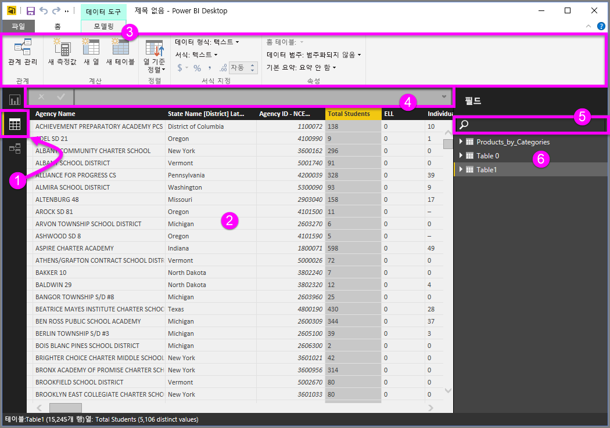

# Power BI Desktop의 데이터 보기
**데이터 뷰**는 Power BI Desktop 모델의 데이터를 검사, 탐색 및 이해하는 데 도움이 됩니다. **쿼리 편집기**에서 테이블, 열 및 데이터를 보는 것과는 차이가 있습니다. 데이터 뷰에서는 모델에 데이터를 로드한 *후의* 데이터를 보게 됩니다.

데이터를 모델링할 때 종종 열에서 행 수준까지, 보고서 캔버스에서 시각 효과 없이 테이블 또는 열의 실제 모습을 보려는 경우가 있습니다. 특히 측정치와 계산된 열을 만들거나, 데이터 형식 또는 데이터 범주를 파악해야 하는 경우가 여기에 해당합니다.

측정값에 대해 좀 더 자세히 살펴보겠습니다.

**1.** 데이터 뷰 아이콘 – 클릭하여 데이터 뷰를 입력합니다.

**2.** 데이터 표 형식 - 선택한 테이블과, 그 안의 모든 열 및 행을 표시합니다. 보고서 뷰에서 숨겨진 열은 옅은 회색으로 표시됩니다. 열을 마우스 오른쪽 단추로 클릭하면 옵션이 표시됩니다.

**3.** 모델링 리본 – 관계를 관리하고, 계산을 만들며, 열의 데이터 형식/포맷/데이터 범주를 변경합니다.

**4.** 수식 입력줄 – 측정값과 계산된 열에 대한 DAX 수식을 입력합니다.

**5.** Search - 모델에서 테이블 또는 열을 검색합니다.

**6.** 필드 목록 - 데이터 표 형식으로 보려는 테이블이나 열을 선택합니다.

