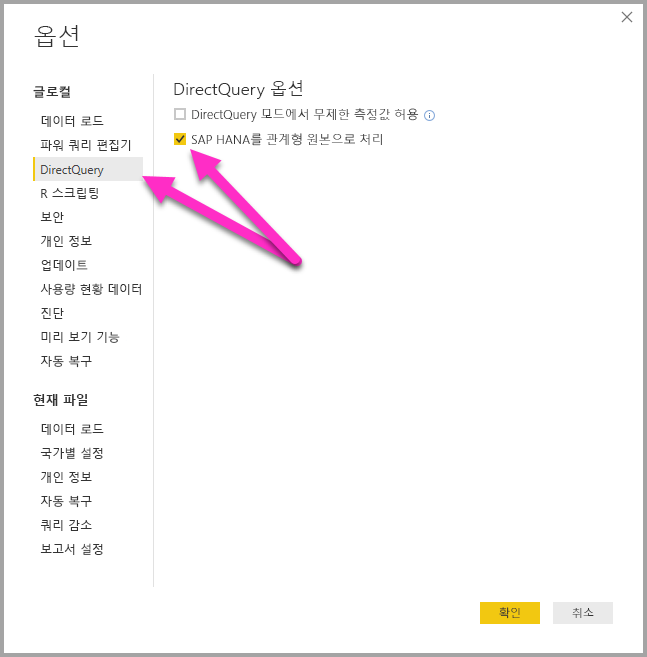
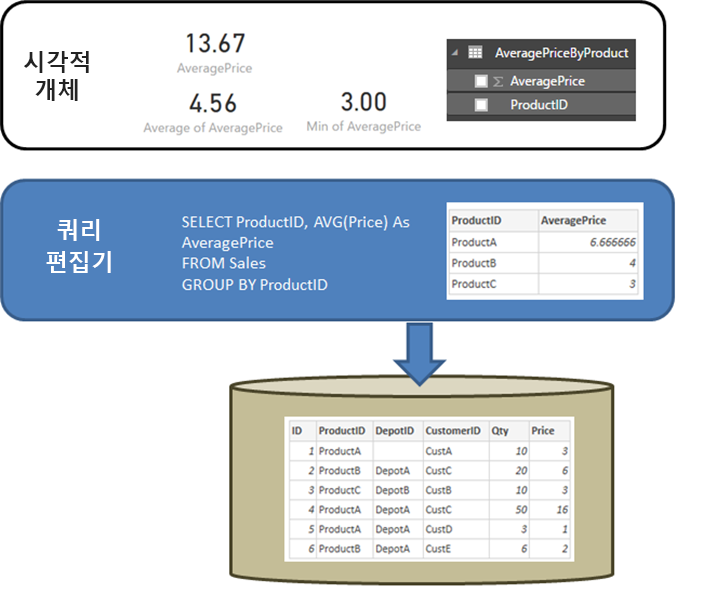

# DirectQuery 및 SAP HANA
**DirectQuery**를 사용하여 **SAP HANA** 데이터 원본에 직접 연결할 수 있습니다. SAP HANA에 연결할 때에는 두 가지 옵션이 있습니다.

* **SAP HANA를 다차원 원본으로 처리(기본값):**  이 경우 Power BI를 SAP Business Warehouse 또는 Analysis Services처럼 다른 다차원 원본에 연결할 때와 동작이 비슷합니다. 이 설정을 사용하여 SAP HANA에 연결할 때, 단일 분석 또는 계산 보기가 선택되고 모든 측정값, 계층 및 해당 뷰의 속성을 필드 목록에서 사용할 수 있습니다. 시각적 개체가 생성될 때 집계 데이터는 항상 SAP HANA에서 검색됩니다. 이것이 권장되는 방법이며 SAP HANA에 대한 새로운 DirectQuery 보고서의 기본값입니다.

* **SAP HANA를 관계형 원본으로 처리:** 이 경우 Power BI에서 SAP HANA를 관계형 원본으로 처리합니다. 이것은 더 큰 유연성을 제공합니다. 이 접근 방식을 사용하는 경우, 측정값이 예상대로 집계되었는지 확인하고 성능 문제를 방지하도록 주의해야 합니다.

연결 방법을 선택 하 여 설정 된 전역 도구 옵션에 의해 결정 됩니다 **파일 > 옵션 및 설정** 차례로 **옵션 > DirectQuery**를 선택한 다음 옵션을 선택 **SAP HANA를 관계형 원본으로 처리**다음 그림에 나와 있는 것 처럼 합니다. 

SAP HANA를 관계형 원본으로 처리하는 옵션은 SAP HANA를 통해 DirectQuery를 사용하는 *새* 보고서에 사용되는 방법을 제어합니다. 이 옵션은 현재 보고서의 기존 SAP HANA 연결 또는 열려 있는 다른 보고서의 연결에 아무런 영향을 미치지 않습니다. 그러므로 이 옵션이 현재 선택되어 있지 않은 경우, **데이터 가져오기**를 사용하여 SAP HANA에 새 연결을 추가하면 해당 연결은 SAP HANA를 다차원 원본으로 처리하게 됩니다. 그러나 SAP HANA에 연결되는 다른 보고서가 열리는 경우, 해당 보고서가 *생성된 시점* 설정된 옵션에 따라 계속 동작하게 되며, 2018년 2월 이전에 생성된 SAP HANA에 연결된 모든 보고서가 계속해서 SAP HANA를 관계형 원본으로 취급한다는 것을 의미합니다. 

두 가지 접근 방식은 서로 다른 동작을 구성하고, 기존 보고서를 다른 방법 중 하나로 전환할 수는 없습니다. 

이러한 두 가지 방법에 대해 자세히 살펴보겠습니다.

## SAP HANA를 다차원 원본으로 처리(기본값)

SAP HANA에 대한 모든 새 연결은 기본적으로 SAP HANA를 다차원 원본으로 처리하는 이 연결 방법을 사용합니다. SAP HANA에 대한 연결을 관계형 원본으로 처리하려면 **파일 > 옵션 및 설정 > 옵션**을 선택한 다음, **직접 쿼리 > SAP HANA를 관계형 원본으로 처리** 아래의 상자를 선택해야 합니다. 이 기능이 **미리 보기**로 제공되는 동안 다차원 방법을 사용하여 생성된 보고서를 Power BI 서비스에 게시할 수 ‘없으며’, 그렇게 하면 Power BI 서비스에서 보고서를 열 때 오류가 발생합니다.  

SAP HANA를 다차원 원본에 연결할 때 다음 사항을 고려해야 합니다.

* **데이터 가져오기 탐색기**에서 단일 SAP HANA 보기를 선택할 수 있습니다. 개별 측정값 또는 특성을 선택할 수 없습니다. 연결 시 정의된 쿼리가 없습니다. SAP HANA를 관계형 원본으로 처리하는 동안 데이터 가져오기나 DirectQuery 사용과 다릅니다. 즉,이 연결 방법을 선택 하면 SAP HANA SQL 쿼리를 직접 사용할 수는 있습니다.

* 선택한 보기의 모든 측정값, 계층 구조 및 특성이 필드 목록에 표시됩니다. 

* 측정값은 시각적 개체에서 사용되므로 SAP HANA는 시각적 개체에 필요한 집계 수준에서 측정값을 검색하도록 쿼리합니다. 그러므로 비가산적 측정값(카운터, 비율 등)을 처리할 때 모든 집계는 SAP HANA에서 수행되며, 추가 집계가 Power BI에서 수행되지 않습니다. 

* SAP HANA에서 항상 올바른 집계 값을 얻기 위해 특정 제한 사항을 적용해야 합니다. 예를 들어 계산된 열을 추가하거나 동일한 보고서 내에서 여러 SAP HANA 보기의 데이터를 결합할 수 없습니다. 

SAP HANA를 다차원 원본으로 처리하면 *관계형* 원본으로 처리하는 방법보다 더 많은 유연성을 제공하지는 않지만 이 방법이 더 간단하며, 더 복잡한 SAP HANA 측정값을 처리할 때 올바른 집계 값을 얻을 수 있고 일반적으로 성능이 더 뛰어납니다. 

**필드** 목록에는 SAP HANA 보기의 모든 측정값, 특성 및 계층 구조가 포함됩니다. 이 연결 방법을 사용하면 다음 동작이 적용됩니다.

* 하나 이상의 계층 구조에 포함되는 특성은 기본적으로 숨겨집니다. 그러나 필요한 경우 필드 목록의 상황에 맞는 메뉴에서 **숨겨진 항목 표시**를 선택하여 표시할 수 있습니다. 필요한 경우, 동일한 상황에 맞는 메뉴에서 표시되도록 설정할 수 있습니다.

* SAP HANA에서 다른 특성을 레이블로 사용하도록 특성을 정의할 수 있습니다. 예를 들어 **제품**(1,2,3 등 값)은 **ProductName**(자전거, 셔츠, 장갑 등 값)을 레이블로 사용할 수 있습니다. 이 경우, 값이 자전거, 셔츠, 장갑 등의 레이블인 단일 필드 **Product**가 필드 목록에 표시됩니다. 그러나 키 값 1,2,3으로 정렬되고 고유성이 확인됩니다. 숨겨진 열 **Product.Key**도 생성되어 필요한 경우 기본 키 값에 액세스할 수 있습니다. 

기본 SAP HANA 보기에 정의된 모든 변수는 연결 시 표시되며, 필요한 값을 입력할 수 있습니다. 이러한 값은 나중에 리본에서 **쿼리 편집**을 선택한 다음 표시되는 드롭다운 메뉴에서 **매개 변수 관리**를 선택하여 변경할 수 있습니다. 

SAP HANA로부터 항상 올바른 집계 데이터를 얻을 수 있도록 확인해야 하므로, DirectQuery를 사용할 때 허용되는 모델링 작업은 일반적인 경우보다 더 제한적입니다. 그러나 측정값 정의, 필드 이름 바꾸기 및 숨기기, 표시 형식 정의 등 많은 추가 및 변경이 가능합니다. 이러한 모든 변경 내용은 새로 고칠 때 보존되며, SAP HANA 보기에 대해 충돌되는 변경 내용은 적용되지 않습니다. 

### 추가 모델링 제한 사항

DirectQuery를 사용하여 SAP HANA에 연결할 때(다차원 원본으로 처리) 기본적인 추가 모델링 제한 사항은 다음과 같습니다. 

* **계산 열 지원 안 함:** 계산 열을 만드는 기능을 사용할 수 없습니다. 즉 계산 열을 만드는 그룹화 및 클러스터링을 사용할 수 없습니다.
* **측정값에 대한 추가 제한 사항:** SAP HANA에서 제공하는 지원 수준을 반영하기 위해 측정값에서 사용할 수 있는 DAX 식에 추가로 적용되는 제한 사항이 있습니다.
* **관계 정의 지원 안 함:** 보고서 내에서 단일 보기만 쿼리할 수 있으며, 관계 정의에 대한 지원이 없습니다.
* **데이터 보기 없음:** **데이터 보기**는 일반적으로 테이블의 세부 수준 데이터를 표시합니다. SAP HANA와 같은 OLAP 원본의 특성을 고려할 때 이 보기는 SAP HANA를 통해 사용할 수 없습니다.
* **열 및 측정값 세부 정보 고정:** 필드 목록에 표시되는 열 및 측정값의 목록은 기본 원본에 따라 고정되며 수정할 수 없습니다. 예를 들어 열을 삭제하거나 데이터 형식을 변경할 수 없지만 이름은 변경할 수 있습니다.
* **DAX의 추가 제한 사항:** 원본의 제한 사항을 반영하기 위해 측정값 정의에 사용할 수 있는 DAX에 대한 추가 제한 사항이 있습니다. 예를 들어 테이블에 대해 집계 함수를 사용할 수 없습니다.

### 추가 시각화 제한 사항

DirectQuery를 사용하여 SAP HANA에 연결할 때(다차원 원본으로 처리) 시각적 개체에 대한 제한 사항은 다음과 같습니다. 
* **열 집계 없음:** 시각적 개체에 대한 열 집계를 변경할 수 없으며, 항상 ‘요약 안 함’입니다.

## SAP HANA를 관계형 원본으로 처리 

관계형 원본으로 SAP HANA에 연결하도록 선택하면 유연성이 추가로 제공됩니다. 예를 들어 계산 열을 만들고, 여러 SAP HANA 보기의 데이터를 포함하고, 결과 테이블 간에 관계를 만들 수 있습니다. 그러나 이러한 방식으로 SAP HANA를 사용할 때에는 연결 처리 방법의 특정 측면을 이해하여 다음을 확인해야 합니다. 

* SAP HANA 보기에 비가산적 측정값(예: 단순한 합계가 아닌 고유 카운트 또는 평균)이 포함된 경우 결과가 예상대로 나와야 합니다.
* 결과 쿼리가 효율적이어야 합니다.

**데이터 가져오기** 또는 **쿼리 편집기**에 정의된 쿼리에서 집계를 수행할 때는 SQL Server와 같은 관계형 원본의 동작을 명확히 하고 시작하는 것이 좋습니다. 다음에 나오는 예에서 **쿼리 편집기**에 정의된 쿼리는 ‘ProductID’별 평균 가격을 반환합니다.  

데이터를 Power BI(및 DirectQuery 사용)로 가져오는 경우 결과는 다음과 같습니다.

* **쿼리 편집기**에서 작성한 쿼리에 정의된 집계 수준에서 데이터를 가져옵니다. 예를 들어, 제품별 평균 가격입니다. 그 결과, 시각적 개체에 사용할 수 있는 *ProductID* 및 *AveragePrice*라는 두 열이 있는 테이블이 생성됩니다.
* 시각적 개체에서 모든 후속 집계(예: *Sum*, *평균*, *Average* 등)는 가져온 데이터에 대해 수행됩니다. 예를 들어, 시각적 개체에 ‘AveragePrice’를 포함하면 기본적으로 ‘Sum’ 집계를 사용하고 각 ‘ProductID’에 대한 ‘AveragePrice’ 합계를 반환합니다(이 예에서는 13.67). 시각적 개체에 사용된 다른 대체 집계 함수(예: *Min*, *Average* 등)도 마찬가지입니다. 예를 들어 *AveragePrice*의 *평균*은 6.66, 4, 3의 평균를 반환하며 이는 4.56과 동일하며, 기본 테이블의 6개 레코드의 평균 *가격*은 5.17로 동일하지 않습니다.
  
가져오기 대신 **DirectQuery**(동일한 관계형 원본에 대해)를 사용하면 동일한 의미 체계가 적용되고 결과는 정확히 동일합니다.  

* 동일한 쿼리가 제공되면, 데이터를 실제로 가져오지 않더라도 논리적으로 정확히 동일한 데이터가 보고 계층에 표시됩니다.

* 시각적 개체에서 모든 후속 집계(*Sum*, *Average*, *Min* 등)는 쿼리에서 해당 논리 테이블을 통해 다시 수행됩니다. 마찬가지로 *AveragePrice*의 *Average*를 포함하는 시각적 개체는 동일한 4.56을 반환합니다.
  
연결이 관계형 원본으로 처리되는 경우 SAP HANA에 대해 생각해 보겠습니다. Power BI는 SAP HANA에서, 둘 다 측정값을 포함할 수 있는 *분석 뷰* 및 *계산 뷰* 모두로 작동할 수 있습니다. 그러나 현재 SAP HANA에 대한 접근 방식은 이전 섹션에서 설명한 것과 동일한 원칙을 따릅니다. **데이터 가져오기** 또는 **쿼리 편집기**에 정의된 쿼리에 따라 사용 가능한 데이터가 결정되고 시각적 개체의 모든 후속 집계가 데이터에 대해 수행되며 가져오기 및 DirectQuery 모두에 동일하게 적용됩니다.  
그러나 SAP HANA의 특성에 따라, 초기 **데이터 가져오기** 대화 상자 또는 **쿼리 편집기**에 정의된 쿼리는 항상 집계 쿼리이며, 일반적으로 사용되는 실제 집계가 SAP HANA 보기로 정의된 측정값을 포함합니다.

위의 SQL Server 예제와 동등한 것으로, *ID*, *ProductID*, *DepotID*를 포함하고, 보기에서 *Average of Price*로 정의된 *AveragePrice*가 있는 측정값을 포함하는 SAP HANA 보기가 있습니다.  
    
**데이터 가져오기** 환경에서 **ProductID**와 **AveragePrice** 측정값을 선택한 경우, 이는 뷰를 통해 쿼리를 정의하고 집계 데이터를 요청하는 것입니다(이전 예제에서는, 편의상 SAP HANA SQL 구문과 정확하게 일치하지 않는 의사 SQL이 사용됨). 그런 다음 시각적 개체에 정의된 추가 집계는 이러한 쿼리의 결과를 추가로 집계합니다. 다시, SQL Server에 대해 위에서 설명한 것처럼, 이 내용은 가져오기 및 DirectQuery 경우 모두에 적용됩니다. DirectQuery의 경우 **데이터 가져오기**나 **쿼리 편집기**의 쿼리는 SAP HANA로 전송된 단일 쿼리 내에서 하위 select에 사용되므로, 더 이상 집계하기 전에 모든 데이터를 읽을 수 있는 경우는 아닙니다.  

SAP HANA에서 DirectQuery를 사용하는 경우 이러한 고려 사항 및 동작은 모두 다음과 같은 사항을 중요하게 고려해야 합니다.  

* SAP HANA의 측정값이 비가산적(예: 단순한 *Sum*, *Min*, *Max*가 아님)일 때는 항상 시각적 개체에서 수행되는 추가 집계에 주의를 기울여야 합니다.

* **데이터 가져오기** 또는 **쿼리 편집기**에서는, 결과가 SAP HANA로 보낼 수 있는 적절한 쿼리여야 한다는 사실을 유념하여 필요한 데이터를 검색하는 데 필요한 열만 포함해야 합니다. 예를 들어, 수십 개의 열을 선택한 경우, 이후 시각적 개체에 필요할 수 있다는 생각으로 사용한 간단한 시각적 개체는 DirectQuery에 대해서도 하위 select에 사용되는 집계 쿼리가 수십 개의 열을 포함한다는 것을 의미하며, 일반적으로 성능이 저하됩니다.
  
예를 살펴보겠습니다. 다음 예제에서는 **데이터 가져오기** 대화 상자에서 5개의 열(**CalendarQuarter**, **Color**, **LastName**, **ProductLine**, **SalesOrderNumber**)과 *OrderQuantity* 측정값을 선택하면, 나중에 Min OrderQuantity가 포함된 간단한 시각적 개체가 생성되고 그 결과 SAP HANA에 다음 SQL 쿼리가 발생합니다. 음영 처리된 부분은 하위 SELECT로, **데이터 가져오기** / **쿼리 편집기**의 쿼리를 포함합니다. 이 하위 select가 높은 카디널리티 결과를 제공하면, 결과적으로 SAP HANA 성능이 저하될 가능성이 높게 됩니다.  

   
이러한 동작 때문에 **데이터 가져오기** 또는 **쿼리 편집기**에서 선택한 항목은 SAP HANA에 적당한 쿼리이면서 필요한 항목으로 제한하는 것이 좋습니다.  

## 모범 사례 

SAP HANA에 연결하는 두 가지 방법의 경우, 특히 우수한 성능과 관련해서 DirectQuery 사용에 대한 권장 사항이 SAP HANA에도 적용됩니다. 이러한 권장 사항은 [Power BI의 DirectQuery 사용](desktop-directquery-about.md) 문서에 자세히 설명되어 있습니다.
   
## 제한 사항

다음 목록에서는 Power BI를 사용할 때 완전히 지원되지 않는 SAP HANA 기능 또는 다르게 작동하는 기능을 모두 설명합니다. 

* **부모 자식 계층 구조** - 부모 자식 계층 구조는 Power BI에서 표시되지 않습니다.
Power BI가 SQL 인터페이스를 사용하여 SAP HANA에 액세스하고 SQL을 통해 부모 자식 계층 구조에 완전히 액세스할 수 없기 때문입니다.
* **기타 계층 구조 메타데이터** - 계층 구조의 기본 구조는 Power BI에 표시되지만 비정형 계층 구조의 동작 제어처럼 일부 계층 구조 메타데이터에는 영향을 미치지 않습니다.
이는 SQL 인터페이스로 인한 제한 사항 때문입니다.
* **SSL을 사용하여 연결** - SSL을 통한 다차원 및 가져오기를 사용하여 연결할 수 있으며, 관계형 커넥터에 대한 SSL을 사용하도록 구성된 SAP HANA 인스턴스에는 연결할 수 없습니다.
* **특성 보기에 대한 지원** - Power BI는 분석 및 계산 보기에 연결할 수 있지만 특성 보기에는 바로 연결할 수 없습니다.
* **카탈로그 개체 지원** - Power BI는 카탈로그 개체에 연결할 수 없습니다.
* **게시 후 변수 변경** - 보고서를 게시한 후 Power BI 서비스에서 바로 SAP HANA 변수에 대한 값을 변경할 수 없습니다. 
 
## 알려진 문제 
다음 목록에서는 Power BI를 사용하여 SAP HANA(DirectQuery)에 연결할 때 알려진 모든 문제를 설명합니다. 

* **카운터 및 기타 측정값에 대해 쿼리할 때 SAP HANA 문제** - 분석 보기에 연결하고 카운터 측정값 및 기타 비율 측정값이 동일한 시각적 개체에 포함되는 경우 SAP HANA에서 잘못된 데이터가 반환됩니다. 이 문제는 SAP 참고 2128928(계산 열 및 카운터를 쿼리할 때 예상치 못한 결과)에서 다룹니다. 이 경우 비율 측정값이 올바르지 않습니다. 

* **단일 SAP HANA 열의 여러 Power BI 열** - 둘 이상의 계층 구조에서 SAP HANA 열이 사용되는 일부 계산 보기의 경우, SAP HANA는 이 열을 두 개의 별도 특성으로 표시합니다. 그 결과 Power BI에 두 개의 열이 생성됩니다.  이러한 열은 기본적으로 숨겨져 있지만, 계층 구조와 관련된 모든 쿼리 또는 열이 올바르게 동작합니다. 
 
## 다음 단계

DirectQuery에 대한 자세한 내용은 다음 리소스를 참조하세요.

* [Power BI의 DirectQuery](desktop-directquery-about.md)
* [DirectQuery에서 지원하는 데이터 원본](desktop-directquery-data-sources.md)
* [DirectQuery 및 SAP BW](desktop-directquery-sap-bw.md)
* [온-프레미스 데이터 게이트웨이](service-gateway-onprem.md)

