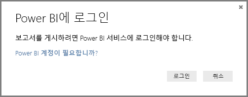
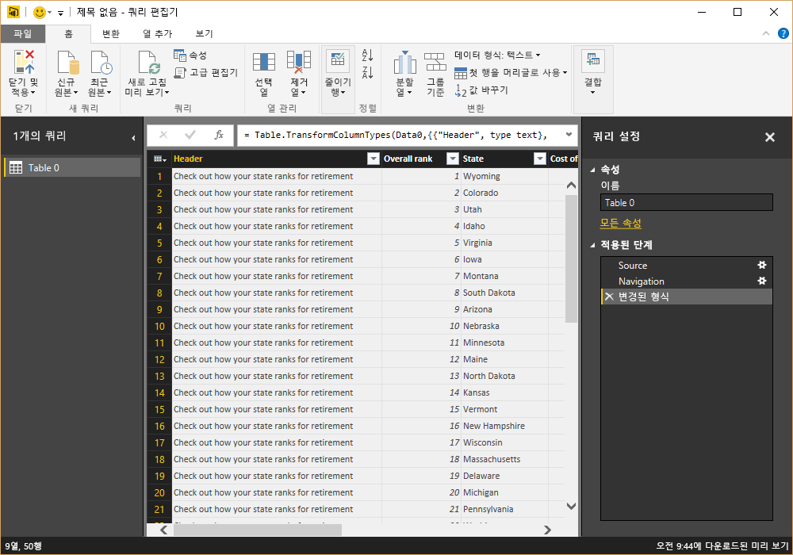
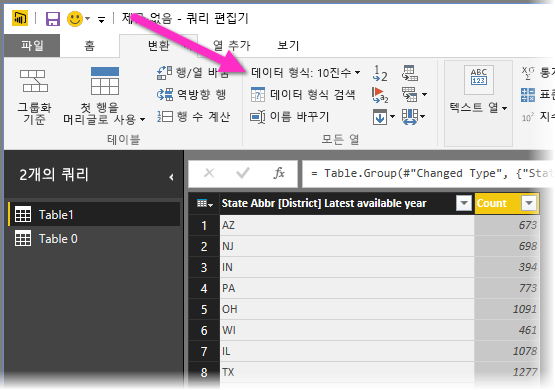
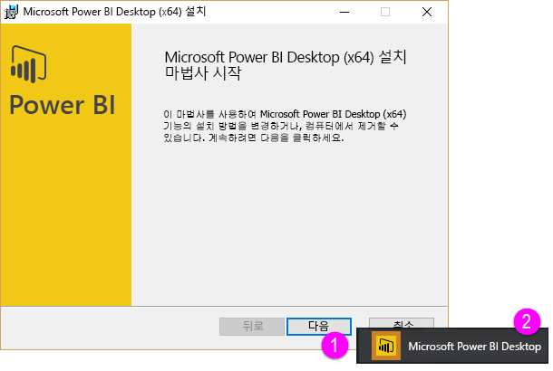

# Power BI Desktop 시작
Power BI Desktop 시작 가이드를 시작합니다. 이 둘러보기에서는 Power BI Desktop의 작동 방식, 수행할 수 있는 작업, 강력한 데이터 모델 및 놀라운 보고서를 작성하여 비즈니스 인텔리전스를 강화하는 방법을 보여 줍니다.

Power BI Desktop의 작동 방식과 사용 방법의 간략한 개요는 이 가이드의 화면을 몇 분만 살펴보면 파악할 수 있습니다. 자세히 알아보려면 각 섹션의 내용을 읽고 단계를 수행한 다음, [Power BI 서비스](https://app.powerbi.com/)에 게시하고 다른 사용자와 공유할 Power BI Desktop 파일을 직접 만들어 보시기 바랍니다.

[Power BI Desktop 시작](https://www.youtube.com/watch?v=Qgam9M8I0xA) 동영상를 보고 [재무 샘플](https://go.microsoft.com/fwlink/?LinkID=521962) Excel 통합 문서를 다운로드하여 동영상 내용에 따라 작업을 수행할 수도 있습니다.

## Power BI Desktop의 작동 방식
Power BI Desktop을 사용하면 다음과 같은 작업을 수행할 수 있습니다.
1. 여러 데이터 원본을 포함하여 데이터에 연결합니다.
1. 인사이트 있는 매력적인 데이터 모델을 작성하는 쿼리를 사용하여 데이터를 셰이핑합니다.
1. 데이터 모델을 사용하여 시각화와 보고서를 만듭니다. 
1. 다른 사용자가 활용, 빌드, 공유할 수 있도록 보고서 파일을 공유합니다. 다른 파일과 마찬가지로 Power BI Desktop *.pbix* 파일을 공유할 수 있지만, 가장 매력적인 방법은 [Power BI 서비스](https://preview.powerbi.com/)에 업로드하는 것입니다. 

Power BI Desktop은 검증된 Microsoft 쿼리 엔진, 데이터 모델링 및 시각화 기술을 통합합니다. 데이터 분석가와 기타 사용자는 쿼리, 데이터 연결, 모델, 보고서 컬렉션을 만들고 다른 사용자와 쉽게 공유할 수 있습니다. Power BI Desktop과 Power BI 서비스를 결합함으로써 데이터 영역의 새로운 인사이트를 쉽게 모델링, 빌드, 공유, 확장할 수 있습니다.

Power BI Desktop은 비즈니스 인텔리전스 리포지토리 및 보고서의 분산되고 단절된 까다로운 디자인 및 작성 프로세스를 중앙 집중화, 단순화 및 간소화합니다.
이제 본격적으로 Power BI Desktop을 이제 시작하겠습니다.

> [!NOTE]
> 온-프레미스에 유지해야 하는 데이터 및 보고를 위해 [Power BI Report Server](report-server/get-started.md)라는 별도의 특수 Power BI 버전이 있습니다. Power BI Report Server는 Report Server 버전의 Power BI에서만 작동하는 Power BI Desktop for Power BI Report Server라는 별도의 특수 Power BI Desktop 버전을 사용합니다. 이 문서에서는 표준 Power BI Desktop에 대해 설명합니다.

## Power BI Desktop 설치 및 실행
Power BI Desktop을 다운로드하려면 [Power BI Desktop 다운로드 페이지](https://powerbi.microsoft.com/desktop)로 이동한 다음, **무료 다운로드**를 선택합니다. 또는 다운로드 옵션을 확인하기 위해 [다운로드 또는 언어 옵션 표시](https://www.microsoft.com/download/details.aspx?id=58494)를 선택합니다. 

Power BI 서비스에서 Power BI Desktop을 다운로드할 수도 있습니다. 상단 메뉴 모음에서 **다운로드** 아이콘을 선택한 다음, **Power BI Desktop**을 선택합니다.

Microsoft Store 페이지에서 **가져오기**를 선택하고 프롬프트에 따라 컴퓨터에 Power BI Desktop을 설치합니다. Windows **시작** 메뉴 또는 Windows 작업 표시줄의 아이콘을 통해 Power BI Desktop을 시작합니다.

Power BI Desktop을 처음 시작하면 **시작** 화면이 표시됩니다.

**시작** 화면에서 **데이터 가져오기**를 선택하거나, **최근 원본**을 확인하거나, 최근 보고서를 열거나, **다른 보고서 열기**를 선택하거나, 다른 링크를 선택할 수 있습니다. 시작할 때 **시작** 화면을 항상 표시할지 여부를 선택할 수도 있습니다. 닫기 아이콘을 선택하여 **시작** 화면을 닫습니다.

Power BI Desktop 왼쪽에는 세 가지 Power BI Desktop 뷰의 아이콘이 있습니다. **보고서**, **데이터** 및 **관계**. 현재 뷰는 왼쪽에 있는 노란색 막대로 표시되며, 아이콘 중 하나를 선택하여 뷰를 변경할 수 있습니다. 

기본 뷰는 **보고서** 뷰입니다. 

Power BI Desktop에는 새 창에서 열리는 **Power Query 편집기**도 포함되어 있습니다. **Power Query 편집기**에서 쿼리를 작성하고 데이터를 변환한 다음, 구체화된 데이터 모델을 Power BI Desktop에 로드하여 보고서를 만들 수 있습니다.

## 데이터에 연결
Power BI Desktop이 설치되면 계속 확장되는 데이터 영역에 연결할 수 있습니다. 사용 가능한 여러 유형의 데이터 원본을 확인하려면 Power BI Desktop **홈** 탭에서 **데이터 가져오기** > **자세히**를 선택한 다음, **데이터 가져오기** 창에서 **모든** 데이터 원본 목록을 스크롤 합니다. 이 둘러보기에서는 두 가지 **웹** 데이터 원본에 연결합니다.

선글라스 소매점의 데이터 분석가라고 가정해 보세요. 클라이언트가 일조량이 가장 많은 지역의 선글라스 판매량을 목표를 설정하도록 지원하려고 합니다. Bankrate.com의 [Best and worst states for retirement](https://www.bankrate.com/retirement/best-and-worst-states-for-retirement/)(은퇴자에게 최상 및 최악의 주) 페이지에는 이 주제와 관련된 흥미로운 데이터가 있습니다.

Power BI Desktop **홈** 탭에서 **데이터 가져오기** > **웹**을 선택하여 웹 데이터 원본에 연결합니다. 

**웹** 대화 상자의 **URL** 필드에 *https:\//www.bankrate.com/retirement/best-and-worst-states-for-retirement/* 주소를 붙여넣고 **확인**을 선택합니다. 

메시지가 표시되면 **웹 콘텐츠 액세스** 화면에서 **연결**을 선택하여 익명 액세스를 사용합니다. 

Power BI Desktop의 쿼리 기능이 실행되고 웹 리소스에 연결합니다. **탐색기** 창에 웹 페이지에서 찾은 내용이 반환됩니다. 이 예제에서는 **은퇴자에게 최상 및 최악의 주 순위**라는 테이블과 문서가 반환됩니다. 테이블에 관심이 있으므로 테이블을 선택하여 미리 보기를 표시합니다.

이 시점에서 **로드**를 선택하여 테이블을 로드하거나, **테이블 변환**을 선택하여 로드하기 전에 테이블을 변경할 수 있습니다.

**데이터 변환**을 선택하면 Power Query 편집기가 시작되고 기본 테이블 뷰가 표시됩니다. **쿼리 설정** 창이 오른쪽에 있거나, 언제든지 Power Query 편집기의 **보기** 탭에서 **쿼리 설정**을 선택하여 표시할 수 있습니다. 

데이터에 연결하는 방법에 대한 자세한 내용은 [Power BI Desktop에서 데이터에 연결](desktop-connect-to-data.md)을 참조하세요.

## 데이터 모양 지정
이제 데이터 원본에 연결되었으므로 요구 사항에 맞게 데이터를 조정할 수 있습니다. 데이터를 ‘셰이핑’하려면 데이터를 로드하고 표시하는 동안 데이터를 조정하는 단계별 지침을 Power Query 편집기에 제공합니다.  셰이핑은 원래 데이터 원본에는 영향을 주지 않고 특정 데이터 뷰에만 적용됩니다. 

> [!NOTE]
> 이 가이드에 사용된 테이블 데이터는 시간이 지남에 따라 변경될 수 있습니다. 따라서 수행해야 하는 단계도 달라질 수 있으므로 단계 또는 결과를 조정하는 방법에 독창성이 요구되며, 이 모든 것이 학습의 즐거움입니다. 

셰이핑은 열 또는 테이블 이름 바꾸기, 행 또는 열 제거, 데이터 형식 변경 등 데이터를 ‘변환’하는 과정을 의미할 수 있습니다.  Power Query 편집기는 **쿼리 설정** 창의 **적용된 단계** 아래에 이러한 단계를 차례로 캡처합니다. 이 쿼리가 데이터 원본에 연결할 때마다 해당 단계가 수행되므로 데이터가 항상 지정된 방식으로 셰이핑됩니다. 이 프로세스는 Power BI Desktop에서 쿼리를 사용하거나 누구든지 Power BI 서비스 등에서 공유 쿼리를 사용할 때 발생합니다. 

**쿼리 설정**의 **적용된 단계**에는 이미 몇 단계가 포함되어 있습니다. 각 단계를 선택하여 Power Query 편집기에서 효과를 확인할 수 있습니다. 먼저 웹 원본을 지정한 다음, **탐색기** 창에서 테이블 미리 보기를 실행했습니다. 세 번째 단계인 **형식 변경됨**에서 Power BI가 데이터를 가져올 때 정수 데이터를 인식하고 원래 웹 **텍스트** ‘데이터 형식’을 **정수**로 자동 변경했습니다.  

데이터 형식을 변경해야 하는 경우 변경할 열을 선택합니다. **Shift** 키를 누른 채 인접한 여러 열을 선택하거나 **Ctrl** 키를 누른 채 인접하지 않은 열을 선택합니다. 열 헤더를 마우스 오른쪽 단추로 클릭하고 **형식 변경**을 선택한 다음, 메뉴에서 새 데이터 형식을 선택하거나 **홈** 탭의 **변환** 그룹에서 **데이터 형식** 옆에 있는 목록을 드롭다운하고 새 데이터 형식을 선택합니다.

> [!NOTE]
> Power BI Desktop의 Power Query 편집기는 사용 가능한 작업에 리본 또는 오른쪽 클릭 메뉴를 사용합니다. 리본의 **홈** 또는 **변환** 탭에서 선택할 수 있는 대부분의 작업은 항목을 마우스 오른쪽 단추로 클릭하고 표시되는 메뉴에서 선택하여 사용할 수도 있습니다.

이제 데이터에 고유한 변경 내용과 변환을 적용하고 **적용된 단계**에서 확인할 수 있습니다. 

예를 들어 선글라스 판매량의 경우 날씨 순위에 가장 관심이 있으므로 **전체 순위** 대신 **날씨** 열을 기준으로 테이블을 정렬하기로 결정합니다. **날씨** 헤더 옆에 있는 화살표를 드롭다운하고 **오름차순 정렬**을 선택합니다. 이제 데이터가 날씨 순위를 기준으로 정렬되고 **행 정렬됨** 단계가 **적용된 단계**에 표시됩니다. 

최악의 날씨 주에 선글라스를 판매하는 것에는 별로 관심이 없으므로 테이블에서 해당 주를 제거하기로 결정합니다. **홈** 탭의 **행 감소** 그룹에서 **행 제거** > **하위 행 제거**를 선택합니다. **하위 행 제거** 대화 상자에서 *10*을 입력하고 **확인**을 선택합니다. 

하위 10개 행이 테이블에서 제거되고 **하위 행 제거됨** 단계가 **적용된 단계**에 표시됩니다.

테이블에 요구 사항보다 너무 많은 정보가 있어서 **물가**, **범죄**, **문화**, **웰니스** 열을 제거하기로 결정합니다. 제거하려는 각 열의 헤더를 선택합니다. **Shift** 키를 누른 채 인접한 여러 열을 선택하거나 **Ctrl** 키를 누른 채 인접하지 않은 열을 선택합니다. 

그런 다음, **홈** 탭의 **열 관리** 그룹에서 **열 제거**를 선택합니다. 선택한 열 헤더 중 하나를 마우스 오른쪽 단추로 클릭하고 메뉴에서 **열 제거**를 선택할 수도 있습니다. 선택한 열이 제거되고 **열 제거됨** 단계가 **적용된 단계**에 표시됩니다.

다시 생각해보니 **물가**도 선글라스 판매량과 관련이 있을 수 있어서, 해당 열을 다시 가져오려고 합니다. 단계 옆에 있는 **X** 삭제 아이콘을 선택하면 **적용된 단계** 창의 마지막 단계를 쉽게 실행 취소할 수 있습니다. 이제 삭제하려는 열만 선택하여 단계를 다시 실행합니다. 유연성 향상을 위해 각 열을 개별 단계로 삭제할 수 있습니다. 

**적용된 단계** 창에서 단계를 마우스 오른쪽 단추로 클릭하고 삭제하거나, 이름을 바꾸거나, 시퀀스에서 위 또는 아래로 이동하거나, 그 뒤에 단계를 추가 또는 삭제할 수 있습니다. 중간 단계에서는 변경 내용이 후속 단계에 영향을 주고 쿼리를 중단할 수 있는 경우 Power BI Desktop에서 경고를 표시합니다.  

예를 들어 더 이상 **날씨**를 기준으로 테이블을 정렬하지 않으려는 경우 **행 정렬됨** 단계를 삭제할 수 있습니다. Power BI Desktop에서 이 단계를 삭제하면 쿼리가 중단될 수 있다는 경고를 표시합니다. 날씨를 기준으로 정렬한 후 하위 10개 행을 제거했으므로 정렬을 제거하면 다른 행이 제거됩니다. **행 정렬됨** 단계를 선택하고 해당 지점에 새 중간 단계를 추가하는 경우에도 경고가 표시됩니다.  

마지막으로, 테이블 제목을 은퇴가 아닌 선글라스 판매량과 관련된 내용으로 변경합니다. **쿼리 설정** 창의 **속성**에서 이전 제목을 ‘선글라스 판매에 최상의 주’로 바꿉니다. 

셰이핑된 데이터의 완성된 쿼리는 다음과 같습니다.

데이터 셰이핑 방법에 대한 자세한 내용은 [Power BI Desktop에서 데이터 셰이핑 및 결합](desktop-shape-and-combine-data.md)을 참조하세요.

## 데이터 결합
다양한 주와 관련된 데이터는 흥미로우며, 추가적인 분석 활동과 쿼리 작성에 유용합니다. 그러나 한 가지 문제가 있습니다. 대부분의 데이터는 주의 전체 이름이 아니라 주 코드를 나타내는 2자로 된 약어를 사용합니다. 해당 데이터를 사용하려면 주 이름을 해당 약어와 연결하는 방법이 필요합니다.

다행히 해결 방법이 있습니다. 또 다른 공용 데이터 원본에서 이 작업을 수행하지만, 이 데이터 원본을 선글라스 테이블과 ‘결합’하려면 상당한 양의 데이터 셰이핑이 필요합니다. 

주 약어 데이터를 Power Query 편집기로 가져오려면 리본의 **홈** 탭에 있는 **새 쿼리** 그룹에서 **새 원본** > **웹**을 선택합니다. 

**웹** 대화 상자에서 주 약어 사이트의 URL로 *https:\//en.wikipedia.org/wiki/List_of_U.S._state_abbreviations*를 입력합니다.

**탐색기** 창에서 **미국 주, 연방 구역, 영역 및 기타 지역의 코드와 약어** 테이블을 선택하고 **확인**을 선택합니다. Power Query 편집기에서 테이블이 열립니다.

**지역의 이름 및 상태**, **지역의 이름 및 상태2**, **ANSI**를 제외한 모든 열을 제거합니다. 해당 열만 유지하려면 **Ctrl** 키를 누른 채 열을 선택합니다. 그런 다음, 열 헤더 중 하나를 마우스 오른쪽 단추로 클릭하고 **다른 열 제거**를 선택하거나 **홈** 탭의 **열 관리** 그룹에서 **다른 열 제거**를 선택합니다. 

**지역의 이름 및 상태2** 열 헤더 옆에 있는 화살표를 드롭다운하고 **필터** > **같음**을 선택합니다. **행 필터링** 대화 상자에서 **같음** 옆에 있는 **값 입력 또는 선택** 필드를 드롭다운하고 **주**를 선택합니다. 

**또는**을 선택하고 두 번째 **같음** 필드 옆에 있는 **주(“Commonwealth”)** 를 선택합니다. **확인**을 선택합니다. 

**연방 구역**, **섬** 등의 기타 값을 제거하면 이제 50개 주와 2자로 된 공식 약어 목록이 표시됩니다. 열 헤더를 마우스 오른쪽 단추로 클릭하고 **이름 바꾸기**를 선택하여 열 이름을 **주 이름**, **상태**, **약어** 등으로 더 적합하게 바꿀 수 있습니다.

이러한 모든 단계는 **쿼리 설정** 창의 **적용된 단계** 아래에 기록됩니다.

이제 셰이핑된 테이블이 다음과 같이 표시됩니다.

**쿼리 설정**의 **속성** 필드에서 테이블 제목을 ‘주 코드’로 바꿉니다.  

**주 코드** 테이블이 셰이핑되면 두 테이블을 하나로 ‘결합’할 수 있습니다.  이제 테이블이 데이터에 적용한 쿼리의 결과이기 때문에 ‘쿼리’라고도 합니다.  쿼리를 결합하는 두 가지 주요 방법은 ‘병합’과 ‘추가’입니다.   

다른 쿼리에 추가하려는 열이 하나 이상 있을 경우 쿼리를 ‘병합’합니다.  기존 쿼리에 추가하려는 데이터 행이 더 있을 경우 쿼리를 ‘추가’합니다. 

이 예제에서는 **주 코드** 쿼리를 **선글라스에 최상의 주** 쿼리에 ‘병합’하려고 합니다.  쿼리를 병합하려면 Power Query 편집기의 왼쪽에 있는 **쿼리** 창에서 **선글라스에 최상의 주** 쿼리를 선택하여 전환합니다. 그런 다음, 리본의 **홈** 탭에 있는 **결합** 그룹에서 **쿼리 병합**을 선택합니다.

**병합** 창에서 필드를 드롭다운하여 사용 가능한 다른 쿼리에서 **주 코드**를 선택합니다. 각 테이블에서 일치시킬 열을 선택합니다. 이 예제에서는 **선글라스에 최상의 주** 쿼리의 **주**와 **주 코드** 쿼리의 **주 이름**을 선택합니다. 

**개인 정보 수준** 대화 상자가 표시되면 **이 파일에 대한 개인 정보 수준 검사 무시**를 선택한 다음, **저장**을 선택합니다. **확인**을 선택합니다. 

**선글라스 판매에 최상의 주** 테이블의 오른쪽에 **주 코드**라는 새 열이 표시됩니다. 이 열에는 선글라스 판매에 최상의 주 쿼리와 병합한 주 코드 쿼리가 포함되어 있습니다. 병합된 테이블의 모든 열이 **주 코드** 열에 압축됩니다. 병합된 테이블을 ‘확장’하고 필요한 열만 포함할 수 있습니다.  

병합된 테이블을 확장하고 포함할 열을 선택하려면 열 헤더에서 **확장** 아이콘을 선택합니다. **확장** 대화 상자에서 **약어** 열만 선택합니다. **원래 열 이름을 접두사로 사용**의 선택을 취소하고 **확인**을 선택합니다. 

> [!NOTE]
> **주 코드** 테이블을 가져오는 방법을 변경할 수 있습니다. 몇 가지를 실험한 후 결과가 만족스럽지 않으면 **쿼리 설정** 창의 **적용된 단계** 목록에서 해당 단계를 삭제합니다. 확장 프로세스가 원하는 방식으로 표시될 때까지 원하는 횟수만큼 수행할 수 있는 무료 반복 서비스입니다.

데이터 셰이핑 및 결합 단계에 대한 자세한 내용은 [Power BI Desktop에서 데이터 셰이핑 및 결합](desktop-shape-and-combine-data.md)을 참조하세요.

이제 각각 요구 사항에 맞게 셰이핑된 두 개의 데이터 원본을 결합하는 단일 쿼리 테이블이 있습니다. 이 쿼리는 주의 인구 통계, 부유한 정도 또는 레크리에이션 기회와 같은 여러 흥미로운 데이터 연결의 기초로 사용될 수 있습니다.

이제 Power BI Desktop에서 흥미로운 보고서를 만들기에 충분한 데이터가 확보되었습니다. 마일스톤이기 때문에 **Power Query 편집기**에서 변경 내용을 적용한 다음, 리본의 **홈** 탭에서 **닫기 및 적용**을 선택하여 Power BI Desktop에 로드합니다. **적용**을 선택하면 Power BI Desktop에서 작업하는 동안 쿼리를 Power Query 편집기에 계속 열어 둘 수도 있습니다. 

테이블이 Power BI Desktop에 로드된 후에 테이블을 더 변경하고 모델을 다시 로드하여 변경 내용을 적용할 수 있습니다. Power BI Desktop에서 **Power Query 편집기**를 다시 열려면 Power BI Desktop 리본의 **홈** 탭에서 **쿼리 편집**을 선택합니다. 

## 보고서 작성
Power BI Desktop **보고서** 뷰에서 시각화와 보고서를 작성할 수 있습니다. **보고서** 뷰에는 다음 6개의 기본 영역이 있습니다.

1. 맨 위 리본 - 보고서 및 시각화와 관련된 일반적인 작업이 표시됩니다.
2. 가운데 캔버스 영역 - 시각화를 만들고 정렬합니다.
3. 맨 아래 페이지 탭 영역 - 보고서 페이지를 선택하거나 추가할 수 있습니다.
4. **필터** 창 - 데이터 시각화를 필터링할 수 있습니다.
5. **시각화** 창 - 시각화를 추가, 변경 또는 사용자 지정하고 드릴스루를 적용할 수 있습니다.
6. **필드** 창 - 쿼리에 사용할 수 있는 필드가 표시됩니다. 이러한 필드를 캔버스, **필터** 창 또는 **시각화** 창으로 끌어 시각화를 만들거나 수정할 수 있습니다.

창의 맨 위에 있는 화살표를 선택하여 **필터**, **시각화** 및 **필드** 창을 확장하고 축소할 수 있습니다. 창을 접으면 더 넓은 캔버스 공간에서 멋진 시각화를 작성할 수 있습니다. 

간단한 시각화를 만들려면 필드 목록에서 필드를 선택하거나 **필드** 목록에서 캔버스로 필드를 끌어다 놓습니다. 예를 들어 **선글라스 판매에 최상의 주**에서 캔버스로 **주** 필드를 끌어다 놓고 결과를 확인합니다.

결과를 살펴보세요. Power BI Desktop이 **주** 필드에 지리적 위치 데이터가 포함된 것을 인식하고 지도 기반 시각화를 자동으로 만들었습니다. 시각화는 데이터 모델에 있는 40개 주의 데이터 요소를 보여 줍니다. 

**시각화** 창에 시각화 정보가 표시되고 수정할 수 있습니다. 

1. 아이콘은 생성된 시각화 유형을 표시합니다. 다른 아이콘을 선택하여 선택한 시각화의 유형을 변경하거나, 기존 시각화를 선택하지 않고 아이콘을 선택하여 새 시각화를 만들 수 있습니다. 
2. **시각화** 창의 **필드** 옵션을 사용하면 데이터 필드를 **범례** 및 창의 다른 필드로 끌어올 수 있습니다. 
3. **형식** 옵션을 사용하면 서식 및 기타 컨트롤을 시각화에 적용할 수 있습니다. 

**필드** 및 **형식** 영역에서 사용할 수 있는 옵션은 시각화 유형 및 보유한 데이터에 따라 달라집니다.

지도 시각화에서 상위 10개 날씨 주만 표시하려고 합니다. 상위 10개 주만 표시하려면 **필터** 창에서 **주가 (모두)입니다.** 를 가리킨 다음, 표시되는 화살표를 확장합니다. **필터 형식**에서 드롭다운하고 **상위 N개**를 선택합니다. **항목 표시**에서 가장 낮은 숫자 순위 항목을 표시하려고 하므로 **하위**를 선택하고 다음 필드에 *10*을 입력합니다.

**필드** 창에서 **값 기준** 필드로 **날씨** 필드를 끌어다 놓고 **필터 적용**을 선택합니다. 

이제 지도 시각화에 상위 10개 날씨 주만 표시됩니다. 

**시각화** 창에서 **형식** 아이콘을 선택하고 **제목**을 선택한 다음, **제목 텍스트** 아래에 ‘상위 10개 날씨 주’를 입력하여 시각화 제목을 바꿉니다.  

상위 10개 날씨 주의 이름과 1에서 10 사이의 순위를 표시하는 시각화를 추가하려면 캔버스의 빈 영역을 선택한 다음, **시각화** 창에서 **세로 막대형 차트** 아이콘을 선택합니다. **필드** 창에서 **주**와 **날씨**를 선택합니다. 세로 막대형 차트는 쿼리의 40개 주를 가장 높은 숫자 순위에서 가장 낮은 숫자 순위로 또는 최악의 날씨에서 최상의 날씨 순으로 표시합니다. 

숫자 1이 먼저 표시되도록 순위 순서를 전환하려면 시각화의 오른쪽 위에 있는 **추가 옵션** 줄임표를 선택한 다음, 메뉴에서 **오름차순 정렬**을 선택합니다. 

테이블을 상위 10개 주로 제한하려면 지도 시각화에 수행한 것과 동일한 하위 10개 필터를 적용합니다. 

지도 시각화와 동일한 방식으로 시각화의 제목을 바꿉니다. 또한 **시각화** 창의 **형식** 섹션에서 **Y축** > **축 제목**을 **날씨**에서 *날씨 순위*로 변경하여 이해하기 쉽게 만듭니다. 그런 다음, **Y축** 선택기를 **끄기**로 전환하고 **데이터 레이블**을 **켜기**로 전환합니다. 

이제 상위 10개 날씨 주가 숫자 순위와 함께 순위 순서로 표시됩니다. 

**경제성** 및 **전체 순위** 필드에 대해 비슷하거나 다른 시각화를 만들거나 여러 필드를 하나의 시각화로 결합할 수 있습니다. 모든 종류의 흥미로운 보고서 및 시각화를 만들 수 있습니다. 이러한 **테이블**과 **꺾은선형 및 묶은 세로 막대형 차트** 시각화는 경제성 및 전체 순위와 함께 상위 10개 날씨 주를 보여 줍니다.

보고서 페이지마다 다른 시각화를 표시할 수 있습니다. 새 페이지를 추가하려면 페이지 모음에서 기존 페이지 옆에 있는 **+** 기호를 선택하거나 리본의 **홈** 탭에서 **삽입** > **새 페이지**를 선택합니다. 페이지의 이름을 바꾸려면 페이지 모음에서 페이지 이름을 두 번 클릭하거나 페이지를 마우스 오른쪽 단추로 클릭하고 **페이지 이름 바꾸기**를 선택한 다음, 새 이름을 입력합니다. 보고서의 다른 페이지로 이동하려면 페이지 모음에서 페이지를 선택합니다. 

**홈** 탭의 **삽입** 그룹에서 보고서 페이지에 텍스트 상자, 이미지, 단추를 추가할 수 있습니다. 시각화의 서식 옵션을 설정하려면 시각화를 선택한 다음, **시각화** 창에서 **서식** 아이콘을 선택합니다. 페이지 크기, 배경, 기타 페이지 정보를 구성하려면 시각화를 선택하지 않고 **서식** 아이콘을 선택합니다.

페이지 및 시각화 만들기를 마쳤으면 **파일** > **저장**을 선택하고 보고서를 저장합니다. 

보고서에 대한 자세한 내용은 [Power BI Desktop의 보고서 보기](desktop-report-view.md)를 참조하세요.

## 작업 공유
이제 Power BI Desktop 보고서를 만들었으므로 다른 사용자와 공유할 수 있습니다. 작업을 공유하는 방법에는 몇 가지가 있습니다. 다른 파일과 마찬가지로 보고서 *.pbix* 파일을 배포하거나, Power BI 서비스에서 *.pbix* 파일을 업로드하거나, Power BI Desktop에서 Power BI 서비스로 직접 게시할 수 있습니다. Power BI 서비스에 보고서를 게시하거나 업로드하려면 Power BI 계정이 있어야 합니다. 

Power BI Desktop에서 **Power BI** 서비스에 게시하려면 리본의 **홈** 탭에서 **게시**를 선택합니다.

Power BI에 로그인하거나 대상을 선택하라는 메시지가 표시될 수 있습니다.

게시 프로세스가 완료되면 다음과 같은 대화 상자가 표시됩니다.

링크를 선택하여 Power BI에서 보고서를 열면 Power BI 사이트의 **내 작업 영역** > **보고서** 아래에 보고서가 열립니다. 

작업 내용을 공유하는 또 다른 방법은 **Power BI** 서비스에서 작업 내용을 로드하는 것입니다. *https:\//app.powerbi.com*으로 이동하여 브라우저에서 Power BI를 엽니다. Power BI **홈** 페이지에서 왼쪽 아래에 있는 **데이터 가져오기**를 선택하여 Power BI Desktop 보고서 로드 프로세스를 시작합니다.

다음 페이지의 **파일** 섹션에서 **가져오기**를 선택합니다.

다음 페이지에서 **로컬 파일**을 선택합니다. Power BI Desktop *.pbix* 파일을 찾아서 선택한 다음, **열기**를 선택합니다. 

파일 가져오기가 완료되면 Power BI 서비스의 왼쪽 창에서 **내 작업 영역** > **보고서** 아래에 나열되는 것을 확인할 수 있습니다.

파일을 선택하면 보고서의 첫 페이지가 표시됩니다. 보고서의 왼쪽에 있는 탭에서 다른 페이지를 선택할 수 있습니다. 

**Power BI** 서비스에서 보고서 캔버스의 맨 위에 있는 **추가 옵션** > **편집**을 선택하여 보고서를 변경할 수 있습니다. 변경 내용을 저장하려면 **복사본 저장**을 선택합니다.

**Power BI** 서비스에서 보고서를 통해 모든 종류의 흥미로운 시각적 개체를 만들고 ‘대시보드’에 고정할 수 있습니다.  **Power BI** 서비스의 대시보드에 대한 자세한 내용은 [멋진 대시보드를 디자인하기 위한 팁](service-dashboards-design-tips.md)을 참조하세요. 대시보드를 만들고 공유하고 수정하는 방법에 대한 자세한 내용은 [대시보드 공유](service-share-dashboards.md)를 참조하세요.

보고서 또는 대시보드를 공유하려면 보고서 또는 대시보드 열기 페이지의 맨 위에 있는 **공유**를 선택하거나 **내 작업 영역** > **보고서** 또는 **내 작업 영역** > **대시보드** 목록에서 보고서 또는 대시보드 이름 옆에 있는 **공유** 아이콘을 선택합니다.

**보고서 공유** 또는 **대시보드 공유** 화면을 작성하여 보고서 또는 대시보드를 다른 사용자와 공유할 수 있는 메일을 보내거나 링크를 가져옵니다. 

Power BI Desktop 및 Power BI 서비스를 사용하여 여러 매력적인 데이터 관련 매시업 및 시각화를 수행할 수 있습니다. 

## 다음 단계
Power BI Desktop은 진단 포트에 연결하는 기능을 지원합니다. 다른 도구가 진단 포트에 연결하여 진단을 위해 추적 작업을 수행할 수 있습니다. 진단 포트를 사용할 때는 모델을 변경할 수 없습니다. 모델을 변경하면 손상 및 데이터 손실로 이어질 수 있습니다.

Power BI Desktop의 다양한 기능에 대한 자세한 내용은 다음 리소스를 확인하세요.

* [Power BI Desktop을 사용한 쿼리 개요](desktop-query-overview.md)
* [Power BI Desktop의 데이터 원본](desktop-data-sources.md)
* [Power BI Desktop에서 데이터에 연결](desktop-connect-to-data.md)
* [자습서: Power BI Desktop에서 데이터 셰이핑 및 결합](desktop-shape-and-combine-data.md)
* [Power BI Desktop의 일반적인 쿼리 작업](desktop-common-query-tasks.md)   