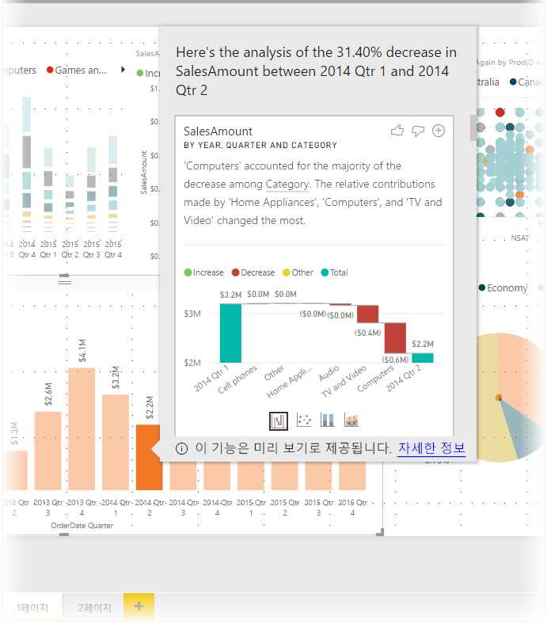
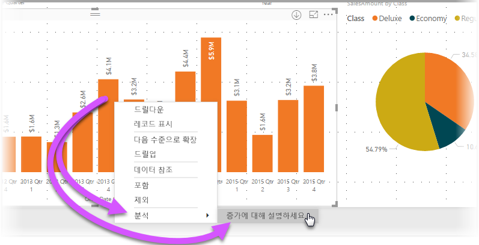
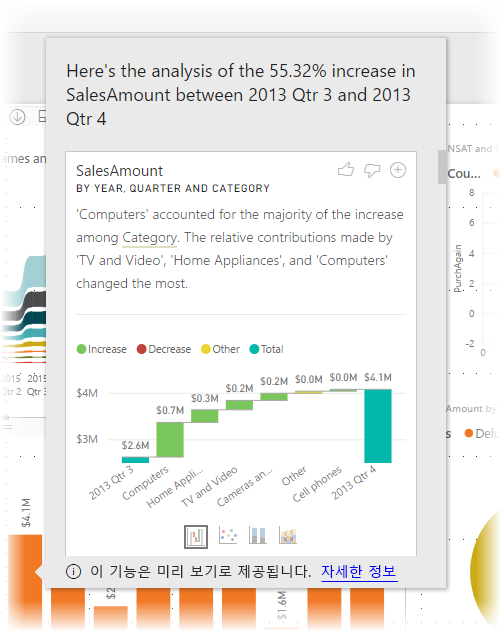
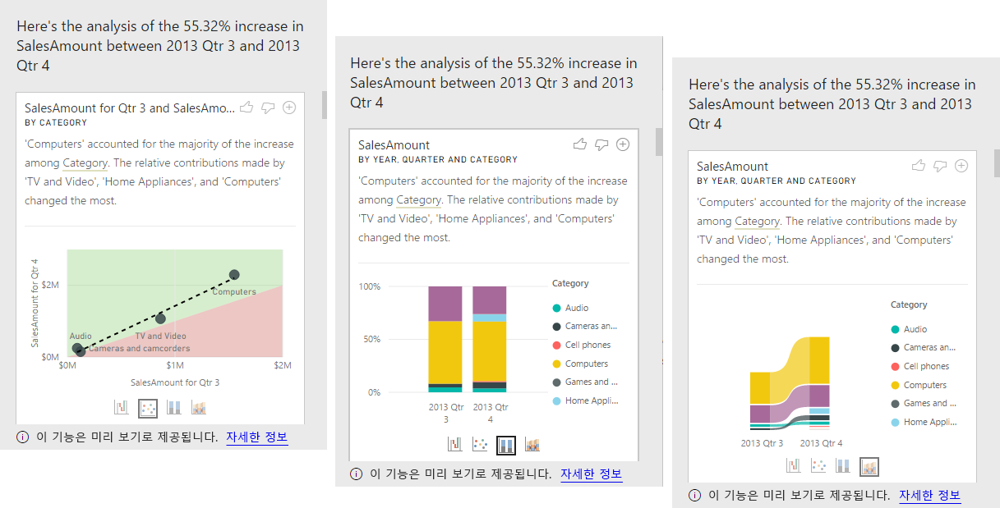

# Power BI Desktop에서 정보 사용(미리 보기)
**Power BI Desktop**을 통헤 차트에서 증가 및 감소를 설명하고 데이터에 대한 빠르고 자동화된 통찰력 있는 분석을 가져옵니다. 단순히 데이터 요소를 마우스 오른쪽 단추로 클릭하고 **분석 > 축소 설명**(또는 이전 표시줄이 낮은 경우 증가)를 선택하고 정보를 사용하기 쉬운 창에 제공합니다.

정보 기능은 상황에 따라 다르고 이전 막대 또는 열과 같은 바로 이전의 데이터 요소에 기반합니다.

> [!NOTE]
> 이 기능은 미리 보기 상태이며 변경될 대상입니다. **Power BI Desktop**의 2017년 9월 버전부터 기본적으로 정보 기능을 사용할 수 있습니다(사용하기 위해 미리 보기 상자 확인란을 선택하지 않아도 됩니다).
> 
> 

## 정보 사용
정보를 사용하려면 막대 또는 줄 시각적 개체에서 데이터 요소를 마우스 오른쪽 단추로 클릭하고 **분석 > 증가 설명**(또는 모든 정보가 이전 데이터 요소의 변경 내용에 기반하므로 *감소 설명*)을 선택합니다.

그러면 **Power BI Desktop**이 데이터에 대한 해당 기계 학습 알고리즘을 실행하고 증가 또는 감소에 가장 영향을 주는 범주를 설명하는 시각적 개체 및 설명이 있는 창을 채웁니다. 기본적으로 정보는 다음 이미지에 나와 있는 대로 *폭포* 시각적 개체로 제공됩니다.

폭포 시각적 개체의 맨 아래에 있는 작은 아이콘을 선택하여 정보를 분산형 차트, 누적 세로 막대형 차트 또는 리본 차트로 표시하도록 선택할 수 있습니다.

시각적 개체 및 기능에 대한 피드백을 제공할 수 있도록 페이지 맨 위에 있는 *좋아요* 및 *싫어요* 아이콘이 제공됩니다.

무엇보다도 시각적 개체의 위쪽에 있는 **+** 단추를 통해 시각적 개체를 수동으로 만든 경우처럼 보고서에 선택한 시각적 개체를 추가할 수 있습니다. 다음 서식을 지정하거나 그렇지 않은 경우 보고서에서 다른 시각적 개체를 조정한 경우처럼 추가된 시각적 개체를 조정할 수 있습니다. **Power BI Desktop**에서 보고서를 편집하는 경우 선택한 정보 시각적 개체를 추가할 수 있습니다.

보고서가 읽는 또는 편집 모드인 경우 정보를 사용할 수 있습니다. 그러면 데이터를 분석하고 보고서에 쉽게 추가할 수는 시각적 개체 만드는 데 유연하게 사용할 수 있습니다.

## 고려 사항 및 제한 사항
정보는 이전 데이터 요소에서의 변경 내용을 기반으로 하므로 시각적 개체에서 첫 번째 데이터 요소를 선택하는 경우에는 사용할 수 없습니다. 

다음 목록은 **정보**에 현재 지원되지 않는 시나리오의 컬렉션입니다.

* TopN 필터
* 포함/제외 필터
* 측정값 필터
* 비가산적 측정값 및 집계
* 다음과 같이 값 표시
* 필터링된 측정값(정보에서 분산형 차트에 사용하는 새로운 기능임)
* 스칼라인 열 기준 정렬을 정의하지 않으면 X-축의 범주 열입니다. 계층 구조를 사용하는 경우 활성 계층 구조의 모든 열은 이 조건에 맞아야 합니다.
* 숫자가 아닌 측정값

또한 다음 모델 유형 및 데이터 소스는 현재 정보에 지원되지 않습니다.

* DirectQuery
* 라이브 연결
* 온-프레미스 Reporting Services
* 포함

## 다음 단계
**Power BI Desktop**에 대한 자세한 내용 및 시작하는 방법은 다음 문서를 확인하세요.

* [Power BI Desktop 시작](desktop-getting-started.md)
* [Power BI Desktop을 사용한 쿼리 개요](desktop-query-overview.md)
* [Power BI Desktop의 데이터 원본](desktop-data-sources.md)
* [Power BI Desktop에서 데이터에 연결](desktop-connect-to-data.md)
* [Power BI Desktop에서 데이터 셰이핑 및 결합](desktop-shape-and-combine-data.md)
* [Power BI Desktop의 일반적인 쿼리 작업](desktop-common-query-tasks.md)   

