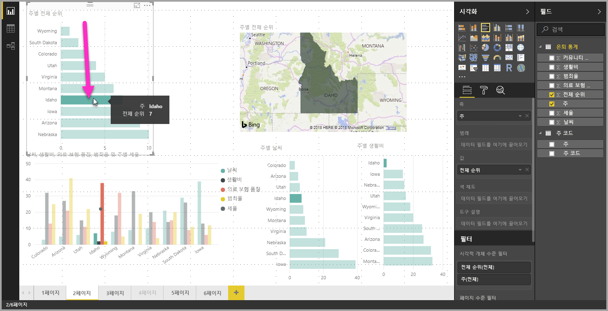
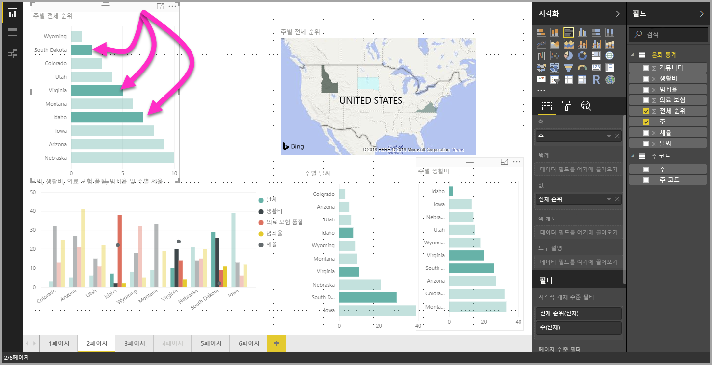

# Power BI Desktop을 사용하여 시각적 개체의 데이터 요소 다중 선택

Power BI Desktop에서 시각적 개체의 데이터 요소를 클릭하여 제공된 시각적 개체의 데이터 요소를 강조 표시할 수 있습니다. 예를 들어 중요한 막대 또는 차트 요소가 있는데 보고서 페이지의 다른 시각적 개체가 선택 영역을 기준으로 데이터를 강조 표시하도록 하려면 한 시각적 개체의 데이터 요소를 클릭하고 페이지에서 다른 시각적 개체에 반영된 결과를 확인하면 됩니다. 이는 기본 또는 단일 선택 강조 표시입니다. 다음 이미지는 기본 강조 표시를 보여줍니다. 

다중 선택을 사용하여 이제 **Power BI Desktop** 보고서 페이지에서 데이터 요소를 두 개 이상 선택할 수 있으며, 해당 페이지의 시각적 개체에서 결과를 강조 표시할 수 있습니다. 이는 “Idaho **and** Virginia에 대한 결과 강조 표시”처럼 **and** 문 또는 기능과 동일합니다. 시각적 개체의 데이터 요소를 다중 선택하려면 **Ctrl+클릭**을 사용하여 여러 데이터 요소를 선택하세요. 다음 이미지는 선택된 **여러 데이터 요소**를 보여줍니다.

간단한 기능처럼 보이지만, 보고서를 작성하고 공유하고 조작할 때 모든 종류의 기회를 제공합니다. 

## 다음 단계

다음 문서에도 관심이 있을 수 있습니다.

* [Power BI Desktop 보고서에서 눈금선 및 눈금에 맞춤 사용](desktop-gridlines-snap-to-grid.md)
* [필터 및 Power BI 보고서에서 강조 표시 정보](power-bi-reports-filters-and-highlighting.md)

