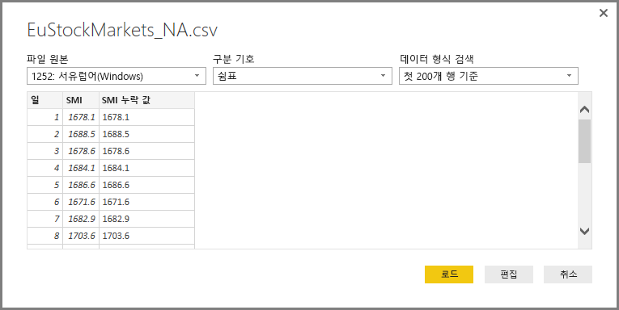
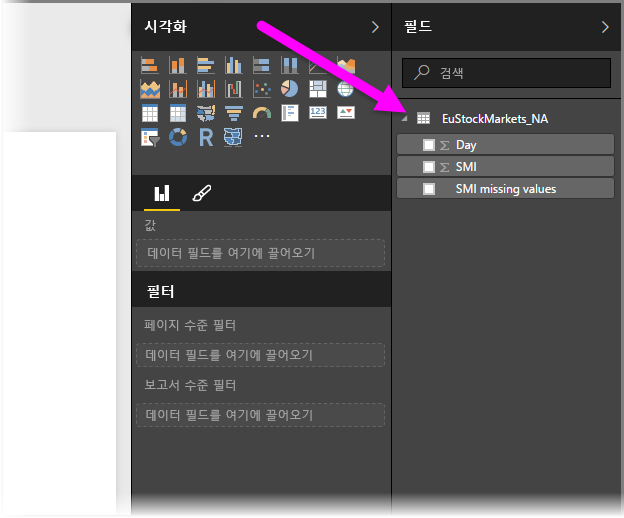
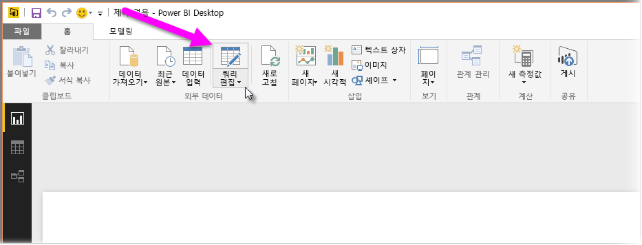
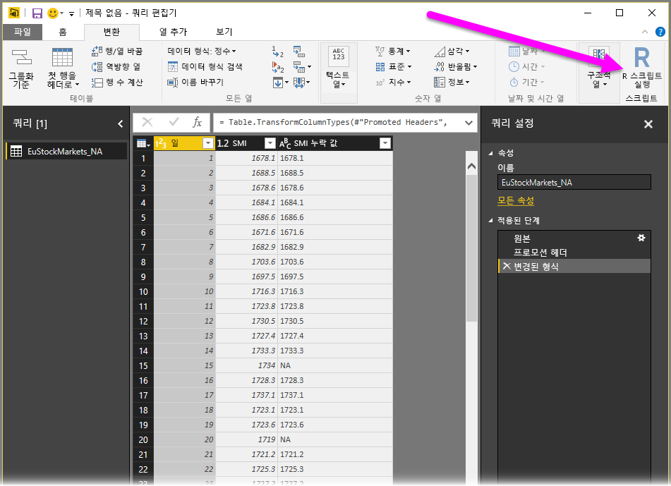
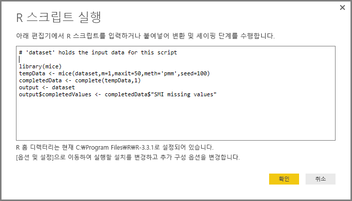
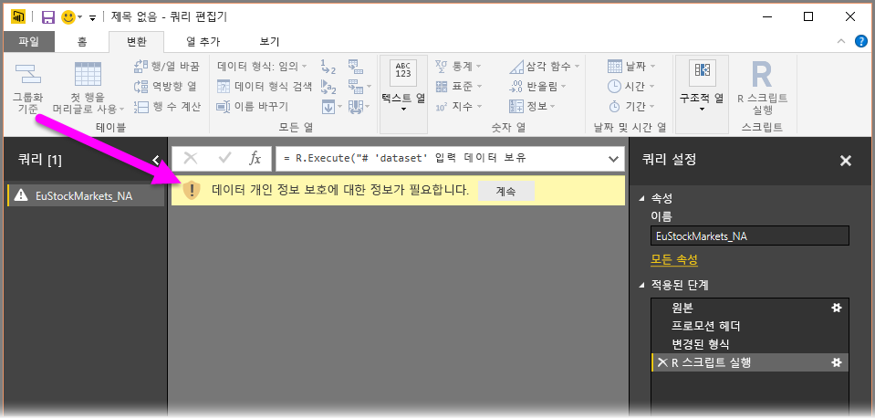

# 쿼리 편집기에서 R 사용
Power BI Desktop **쿼리 편집기**에서 통계학자, 데이터 과학자 및 데이터 분석에 의해 널리 사용되는 프로그래밍 언어인 **R**을 사용할 수 있습니다. R을 **쿼리 편집기**에 통합하면 R을 사용하여 데이터 정리를 수행하고 누락된 데이터, 예측, 클러스터링을 완성하는 작업을 포함하여 데이터 집합에서 고급 데이터 셰이핑 및 분석을 수행할 수 있습니다. **R**은 강력한 언어이며 **쿼리 편집기**에서 사용하여 데이터 모델을 준비하고 보고서를 만들 수 있습니다.

## R 설치
Power BI Desktop의 **쿼리 편집기**에서 **R**을 사용하려면 로컬 컴퓨터에 **R**을 설치해야 합니다. 여러 위치에서 무료로 [Revolution Open 다운로드 페이지](https://mran.revolutionanalytics.com/download/) 및 [CRAN 리포지토리](https://cran.r-project.org/bin/windows/base/)를 포함하는 **R**을 다운로드 및 설치할 수 있습니다.

## 쿼리 편집기에서 R 사용
**쿼리 편집기**에서 **R**을 사용하는 방법을 보여주려면 .CSV 파일 형식의 주식 시장 데이터 집합 예제를 가져오세요. [여기에서 다운로드](http://download.microsoft.com/download/F/8/A/F8AA9DC9-8545-4AAE-9305-27AD1D01DC03/EuStockMarkets_NA.csv)하여 진행할 수 있습니다. 이 예제에 대한 단계는 다음과 같습니다.

1. 먼저 데이터를 **Power BI Desktop**으로 로드합니다. 이 예제에서는 *EuStockMarkets_NA.csv* 파일을 로드하고, **Power BI Desktop**의 **홈** 리본에서 **데이터 가져오기 > CSV**를 선택합니다.

   
2. 파일을 선택하고 **열기**를 선택하면 CSV는 **CSV 파일** 대화 상자에 표시됩니다.

   
3. 데이터가 로드되면 Power BI Desktop의 **필드** 창에 표시됩니다.

   
4. **Power BI Desktop**의 **홈** 탭에서 **쿼리 편집**을 선택하여 **쿼리 편집기**를 엽니다.

   
5. **변환** 탭에서 **R 스크립트 실행**을 선택하면 **R 스크립트 실행** 편집기가 나타납니다(다음 단계에 표시됨). 다음 이미지에서 볼 수 없는 다른 행과 마찬가지로 15, 20행은 누락된 데이터가 발생합니다. 아래 단계는 R이 해당 행을 완성할 수 있(고 완성하)는 방법을 보여 줍니다.

   
6. 이 예제에서는 다음 스크립트 코드를 입력합니다.

       library(mice)
       tempData <- mice(dataset,m=1,maxit=50,meth='pmm',seed=100)
       completedData <- complete(tempData,1)
       output <- dataset
       output$completedValues <- completedData$"SMI missing values"

   > [!NOTE]
   > 이전의 스크립트 코드가 제대로 작동하려면 R 환경에 설치된 *mice* 라이브러리가 있어야 합니다. mice를 설치하려면 R 설치에서 다음 명령을 실행 합니다. |      > install.packages('mice')
   > 
   > 

   **R 스크립트 실행** 대화 상자에 삽입했을 때 코드는 다음과 같습니다.

   
7. **확인**을 선택하면 **쿼리 편집기**에서 데이터 개인 정보 보호에 대한 경고를 표시합니다.

   
8. R 스크립트가 Power BI 서비스에서 제대로 작동하려면 모든 데이터 원본은 *공용*으로 설정되어야 합니다. 개인 정보 설정 및 해당 구현에 대한 자세한 내용은 [개인 정보 수준](desktop-privacy-levels.md)을 참조하세요.

   

   **필드** 창에서 *completedValues*라는 새 열을 확인할 수 있습니다. 행 15, 18에서와 같은 몇 가지 누락된 데이터 요소가 있습니다. 다음 섹션에서는 R이 이를 처리하는 방법을 살펴봅니다.

**쿼리 편집기**는 R 스크립트 다섯 줄을 사용하여 예측 모델을 포함한 누락된 값을 입력했습니다.

## R 스크립트 데이터의 시각적 개체 만들기
시각적 개체를 만들어서 다음 이미지에 보이는 것처럼 R 스크립트 코드가 *mice* 라이브러리를 사용하여 누락된 값을 완성하는 방법을 확인할 수 있습니다.

해당 시각적 개체 또는 **Power BI Desktop**을 사용하여 만들려는 다른 시각적 개체가 완성되면 **Power BI Desktop** 파일을 저장(.pbix 파일로 저장)한 다음, Power BI 서비스에서 해당 파일의 일부인 R 스크립트를 포함하여 데이터 모델을 사용할 수 있습니다.

> [!NOTE]
> 이러한 단계를 완료한 .pbix 파일을 보시겠습니까? 간단한 방법이 있습니다. 이 예제에서 사용한 완료된 **Power BI Desktop** 파일을 [지금 바로](http://download.microsoft.com/download/F/8/A/F8AA9DC9-8545-4AAE-9305-27AD1D01DC03/Complete%20Values%20with%20R%20in%20PQ.pbix) 다운로드할 수 있습니다.

.pbix 파일을 Power BI 서비스에 업로드했으므로 (서비스에서) 데이터 새로 고침을 사용하도록 설정하고 서비스에서 업데이트할 시각적 개체를 사용하도록 설정(데이터를 업데이트하려면 시각적 개체에 대한 R에 액세스해야 함)하는 데 필요한 몇 가지 추가 단계가 있습니다. 추가 단계는 다음과 같습니다.

* **데이터 집합에 대한 예정된 새로 고침 사용하도록 설정** - R 스크립트를 사용하여 데이터 집합을 포함하는 통합 문서에 대한 예정된 새로 고침을 사용하려면 [예정된 새로 고침 구성](refresh-scheduled-refresh.md)을 참조하세요. 여기에는 **개인 게이트웨이**에 대한 정보가 포함됩니다.
* **개인 게이트웨이 설치** - 파일이 위치하고 R이 설치되어 있는 컴퓨터에 **개인 게이트웨이**를 설치해야 합니다. Power BI 서비스는 해당 통합 문서에 액세스하고 업데이트된 시각적 개체를 다시 렌더링해야 합니다. [개인 게이트웨이를 설치하고 구성](service-gateway-personal-mode.md)하는 방법에 대한 자세한 정보를 얻을 수 있습니다.

## 제한 사항
**쿼리 편집기**에서 만든 R 스크립트를 포함하는 쿼리에 몇 가지 제한 사항이 있습니다.

* 모든 R 데이터 원본은 *공용*으로 설정되어야 하고 **쿼리 편집기**에서 만든 쿼리의 다른 모든 단계도 공용이어야 합니다. 데이터 원본 설정으로 이동하려면 **Power BI Desktop**에서 **파일 > 옵션 및 설정 > 데이터 원본 설정**을 선택합니다.

  

  **데이터 원본 설정** 대화 상자에서는 데이터 원본을 선택한 다음, **사용 권한 편집...** 을 선택하고 **개인 정보 수준**이 *공용*으로 설정되었는지 확인합니다.

      
* R 시각적 개체 또는 데이터 집합의 예정된 새로 고침을 사용하도록 설정하려면 **예약된 새로 고침**을 확성화해야 하고 통합 문서 및 R 설치를 저장하는 컴퓨터에 **개인 게이트웨이**를 설치해야 합니다. 둘 다에 대한 자세한 내용은 이 문서의 이전 섹션을 참조하며 여기서 각각에 대한 자세한 내용을 알아보는 링크를 제공합니다.

R 및 사용자 지정 쿼리를 사용하여 수행할 수 있는 모든 것이 있으므로 데이터 모양을 지정하여 데이터를 탐색하고 모양을 지정합니다.

