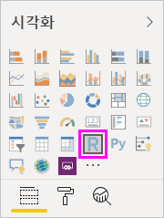
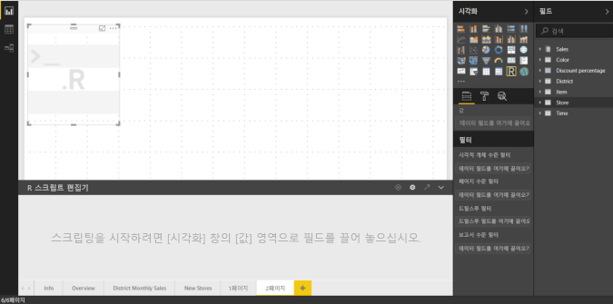
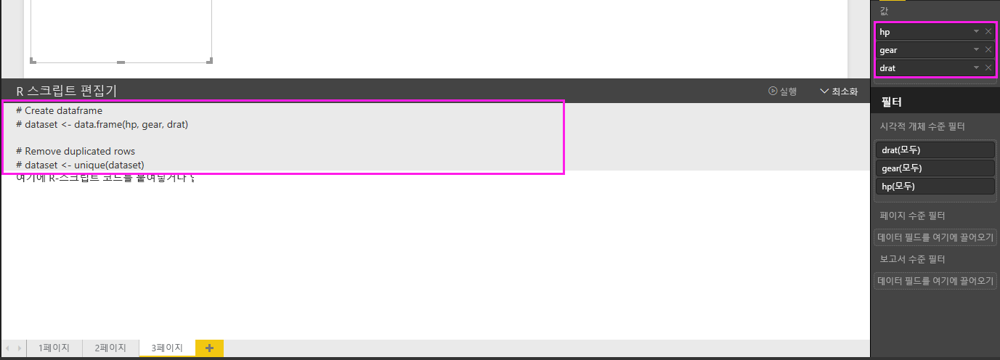
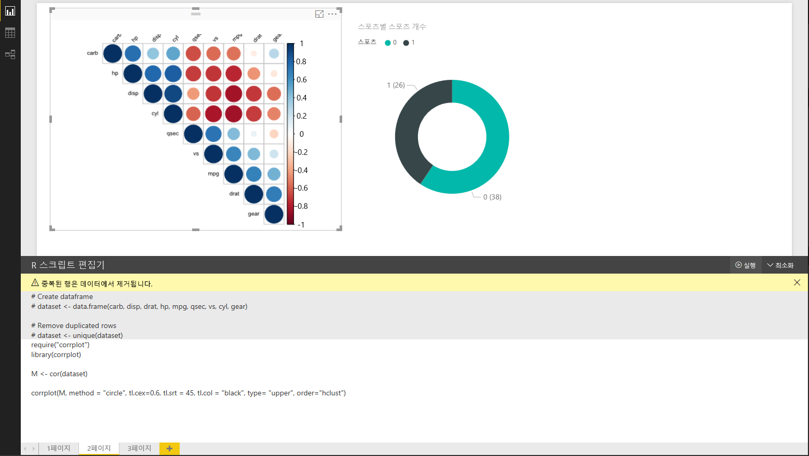
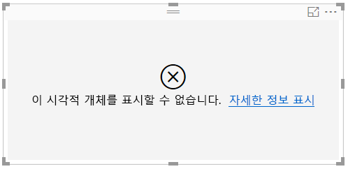

# R을 사용하여 Power BI 시각적 개체 만들기
**Power BI Desktop**에서 **R**을 사용하면 데이터를 시각화할 수 있습니다.

## R 설치
**Power BI Desktop**은 **R** 엔진을 포함, 배포 또는 설치하지 않습니다. **Power BI Desktop**에서 R 스크립트를 실행하려면 로컬 컴퓨터에 **R**을 별도로 설치해야 합니다. 여러 위치에서 무료로 [Revolution Open 다운로드 페이지](https://mran.revolutionanalytics.com/download/) 및 [CRAN 리포지토리](https://cran.r-project.org/bin/windows/base/)를 포함하는 **R**을 다운로드 및 설치할 수 있습니다. **Power BI Desktop**의 현재 R 스크립팅 릴리스는 설치 경로에서 공백(공백 문자)뿐만 아니라 유니코드 문자도 지원합니다.

## R 시각적 개체를 사용하도록 설정
R 시각적 개체를 사용하기 위해 **파일 > 옵션 및 설정 > 옵션**을 선택하면 **옵션** 페이지가 나타납니다. 다음 그림과 같이 **옵션** 창의 **R 스크립팅** 섹션에서 로컬에 설치된 R이 지정되었는지 확인합니다. 다음 그림에서 R의 로컬 설치 경로는 **C:\Program Files\R\R-3.2.0**이고 이 경로는 텍스트 상자에 명시적으로 제공됩니다. 표시되는 경로가 **Power BI Desktop**에서 사용할 로컬에 설치된 R을 올바르게 반영하는지 확인합니다.
   
   

R 설치를 지정하면 R 시각적 개체 만들기를 시작할 준비가 되었습니다.

## Power BI Desktop에서 R 시각적 개체 만들기
1. 다음 그림에 나와 있는 것처럼 **시각화** 창에서 **R 시각적 개체** 아이콘을 선택하여 R 시각적 개체를 추가합니다.
   
   

   보고서에 R 시각적 개체를 추가하면 **Power BI Desktop**에서 다음 작업을 수행합니다.
   
   - 자리 표시자 R 시각적 개체 이미지가 보고서 캔버스에 나타납니다.
   
   - 가운데 창의 아래쪽을 따라 **R 스크립트 편집기** 가 나타납니다.
   
   

2. 다음으로 다른 **Power BI Desktop** 시각적 개체와 마찬가지로 R 스트립트에 사용할 필드를 **필드**의 **값** 섹션에 추가합니다. 
    
    **필드** 웰에 추가된 필드만 R 스크립트에 사용할 수 있습니다. **Power BI Desktop R 스크립트 편집기**에서 R 스크립트 작업을 수행하면서 새 필드를 추가하거나 **필드** 웰에서 불필요한 필드를 제거할 수 있습니다. **Power BI Desktop**에서는 추가하거나 제거한 필드를 자동으로 감지합니다.
   
   > [!NOTE]
   > R 시각적 개체의 기본 집계 유형은 *요약 안 함*입니다.
   > 
   > 
   
3. 이제 선택한 데이터를 사용하여 도표를 만들 수 있습니다. 

    필드를 선택하면 선택한 필드를 기반으로 **R 스크립트 편집기** 가 편집기 창 상단의 회색 섹션을 따라 지원 R 스크립트 바인딩 코드를 생성합니다. 추가 필드를 선택하거나 필드를 제거하면 그에 따라 R 스크립트 편집기에서 지원 코드가 자동으로 생성되거나 제거됩니다.
   
   다음 그림의 예제에서는 세 개의 필드 hp, gear, drat가 선택되었습니다. 그 결과, R 스크립트 편집기에서 다음과 같은 바인딩 코드를 생성했습니다.
   
   * **dataset**라는 데이터 프레임이 생성
     * 이 데이터 프레임은 사용자가 선택한 여러 필드로 구성
   * 기본 집계는 테이블 시각적 개체와 마찬가지로 *요약되지 않으며*
   * 필드는 그룹화되고 중복 행은 한 번만 표시됩니다.
   
   
   
   > [!TIP]
   > 자동 그룹화를 사용하지 않으려는 경우 또는 중복 항목을 포함하여 모든 행을 표시하려는 경우가 있을 수 있습니다. 이 경우 데이터 세트에 인덱스 필드를 추가하면 모든 행이 고유한 행으로 간주되어 그룹화되지 않습니다.
   > 
   > 
   
   생성된 데이터 프레임을 **데이터 세트**라고 하고 선택된 열은 해당 이름으로 액세스할 수 있습니다. 예를 들어 R 스크립트에 *dataset$gear*라고 써서 gear 필드에 액세스합니다. 공백이나 특수 문자가 포함된 필드에 대해서는 작은따옴표를 사용합니다.

4. 선택한 필드에 의해 데이터 프레임이 자동으로 생성되면 R 기본 디바이스에 그림으로 표시될 R 스크립트 작성 준비가 완료된 것입니다. 스크립트가 완료되면 **R 스크립트 편집기** 제목 표시줄에서 **스크립트 실행** 을 선택합니다(**스크립트 실행**은 제목 표시줄의 오른쪽에 있음).
   
    **스크립트 실행**을 선택하면 **Power BI Desktop**에서 그림을 식별하여 캔버스에 표시합니다. 이 프로세스는 로컬에 설치된 R에서 실행되므로 필수 패키지가 설치되어 있어야 합니다.
   
   다음과 같은 이벤트가 발생하면 **Power BI Desktop**에서 시각적 개체를 다시 그립니다.
   
   * **R 스크립트 편집기** 제목 표시줄에서 **실행**을 선택할 때
   * 데이터 새로 고침, 필터링 또는 강조 표시로 인해 데이터가 변경될 때마다

     다음 이미지는 상관 관계 그림 코드의 예를 보여주고, 다양한 자동차의 특성 간 상관 관계를 그림으로 표시합니다.

     

5. 시각화 요소를 더 크게 보려면 **R 스크립트 편집기**를 최소화하면 됩니다. 물론 **Power BI Desktop**의 다른 시각적 개체와 마찬가지로 도넛형 시각적 개체(위 예제의 이미지 오른쪽에 있는 원형 시각적 개체)에서 스포츠카만 선택하여 상관 관계 그림을 교차 필터링할 수 있습니다.

    

6. 또한 R 스크립트를 수정하여 시각적 개체를 사용자 지정하고, 그리기 명령에 매개 변수를 추가하여 R의 성능을 활용할 수 있습니다.

    원래 그리기 명령은 다음과 같습니다.

    corrplot(M, method = "color",  tl.cex=0.6, tl.srt = 45, tl.col = "black")

    R 스크립트를 약간 변경한 지금, 명령은 다음과 같습니다.

    corrplot(M, method = "circle", tl.cex=0.6, tl.srt = 45, tl.col = "black", type= "upper", order="hclust")

    결과적으로 R 시각적 개체는 이제 다음 그림처럼 원을 그리고, 위쪽 절반만 고려하고, 행렬을 다시 정렬하여 상관 관계가 지정된 특성을 클러스터링합니다.

    

    R 스크립트를 실행했는데 오류가 발생하면 R 시각적 개체가 그려지지 않고 캔버스에 오류 메시지가 표시됩니다. 오류에 대한 자세한 내용을 보려면 캔버스의 R 시각적 개체 오류에서 **세부 정보 보기** 를 선택합니다.

    

    > **R 스크립트 보안:** R 시각적 개체는 R 스크립트에서 생성되며 보안 또는 개인 정보 위험에 대한 코드를 포함할 수 있습니다. 처음으로 R 시각적 개체를 보거나 조작하려고 하면 사용자에게 보안 경고 메시지가 표시됩니다. 만든 이와 원본을 신뢰하거나 R 스크립트를 검토하고 파악한 경우에만 R 시각적 개체를 사용합니다.
    > 
    > 

## 알려진 제한 사항
**Power BI Desktop**의 R 시각적 개체에는 다음과 같은 몇 가지 제한이 있습니다.

* 데이터 크기 제한 – R 시각적 개체가 그리기에 사용하는 데이터가 150,000행으로 제한됩니다. 150,000개를 초과하는 행을 선택할 경우 상위 150,000개만 사용되고 이미지에 메시지가 표시됩니다.
* 계산 시간 제한 - R 시각적 개체 계산 시간이 5분을 초과하면 실행 시간이 초과되어 오류가 발생합니다.
* 관계 – 다른 Power BI Desktop 시각적 개체와 마찬가지로, 테이블 간의 관계가 정의되지 않은 테이블의 데이터 필드를 선택하면 오류가 발생합니다.
* 데이터 업데이트, 필터링 및 강조 표시가 발생하면 R 시각적 개체가 새로 고쳐집니다. 그러나 이미지 자체는 대화형이 아니므로 교차 필터링의 소스로 사용할 수 없습니다.
* 다른 시각적 개체를 강조 표시하면 R 시각적 개체가 그에 응답하지만 R 시각적 개체의 요소를 클릭하여 다른 요소를 교차 필터링할 수는 없습니다.
* R 기본 디스플레이 디바이스에 그려지는 그림만 캔버스에 올바르게 표시 됩니다. 다른 R 디스플레이 디바이스를 명시적으로 사용하지 마세요.
* 이 릴리스에서 RRO 설치는 32비트 버전의 Power BI Desktop에서 자동으로 식별되지 않으므로 **옵션 및 설정 > 옵션 > R 스크립팅**에서 R 설치 디렉터리에 경로를 수동으로 제공해야 합니다.

## 다음 단계
Power BI의 R에 대한 자세한 내용은 다음을 참조하세요.

* [Power BI Desktop에서 R 스크립트 실행](desktop-r-scripts.md)
* [Power BI로 외부 R IDE 사용](desktop-r-ide.md)

