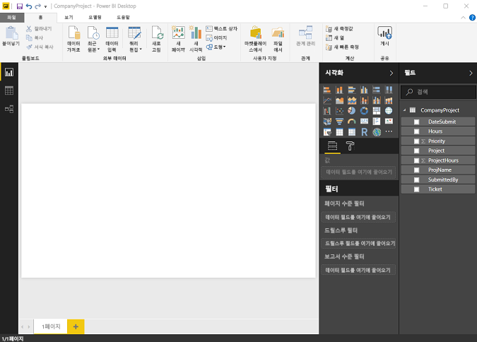
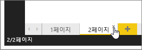
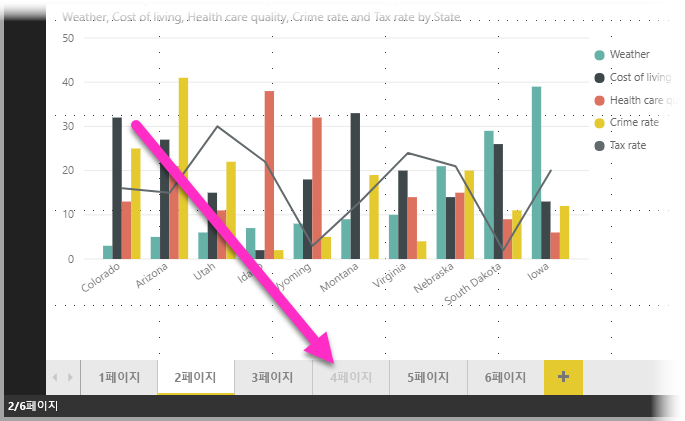

# Power BI Desktop의 보고서 보기
Power BI로 작업한 적이 있다면 데이터에 동적 관점과 통찰력을 제공하는 보고서를 얼마나 쉽게 만들 수 있는지 알고 있을 것입니다. Power BI Desktop에는 Power BI의 고급 기능도 있습니다. Power BI Desktop을 사용하여 고급 쿼리를 만들고, 여러 소스의 데이터를 매시업하고, 테이블 간에 관계를 만드는 등 많은 작업을 할 수 있습니다.

Power BI Desktop에는 시각화가 포함된 보고서 페이지를 원하는 개수만큼 만들 수 있는 **보고서 보기**가 포함되어 있습니다. Power BI Desktop의 보고서 보기는 Power BI 서비스의 보고서 편집용 보기와 거의 동일한 디자인 환경을 제공합니다. 시각화를 이동하고, 복사 및 붙여넣고, 병합할 수 있습니다.

이들 간 차이점은 Power BI Desktop을 사용하는 경우 데이터가 보고서에서 최상의 통찰력을 지원하도록 쿼리와 데이터 모델링 작업을 수행할 수 있다는 것입니다. 로컬 드라이브든, 클라우드든 관계없이 어디든지 Power BI Desktop 파일을 저장할 수 있습니다.

## 직접 살펴보겠습니다.
Power BI Desktop에서 처음 데이터를 로드하면 빈 캔버스가 있는 **보고서 보기**가 표시됩니다.

왼쪽 탐색 모음의 아이콘을 선택하여 **보고서 보기**, **데이터 보기**와 **관계 보기**를 전환할 수 있습니다.

일부 데이터를 추가한 후 캔버스의 새 시각화에 필드를 추가할 수 있습니다.

![[필드] 창에서 끌어 시각적 개체 추가](media/desktop-report-view/pbid_reportview_addvis.gif)

시각화 형식을 변경하려면 리본 메뉴의 **시각화** 그룹에서 선택하거나, 마우스 오른쪽 단추를 클릭하고 **시각화 형식 변경** 아이콘에서 다른 형식을 선택할 수 있습니다.

> [!TIP]
> 다양한 시각화 형식으로 실험해 보세요. 시각화가 데이터의 정보를 명확하게 전달하는 것이 중요합니다.

보고서에 시작할 빈 페이지가 하나 이상 있습니다. 페이지는 탐색기 창에서 캔버스 바로 왼쪽에 나타납니다. 한 페이지에 모든 종류의 시각화를 추가할 수 있지만 지나치게 많이 사용하지 않는 것이 중요합니다. 한 페이지에 시각화가 너무 많으면 복잡해 보이며 적절한 정보를 찾기 어렵습니다. 보고서에 새 페이지를 추가할 수 있습니다. 리본 메뉴에서 **새 페이지**를 클릭하기만 하면 됩니다.

페이지를 삭제하려면 보고서 보기의 아래쪽에 있는 페이지의 탭에서 **X**를 클릭합니다.

> [!NOTE]
> Power BI Desktop에서 보고서 및 시각화를 대시보드에 고정할 수 없습니다. 이렇게 하려면 Power BI 사이트에 [Power BI Desktop에서 게시](desktop-upload-desktop-files.md)해야 합니다.

## 보고서 간에 복사 및 붙여넣기

Power BI Desktop 보고서에서 시각적 개체를 가져와서 손쉽게 다른 보고서에 붙여넣을 수 있습니다. **Ctrl+C** 바로 가기 키를 사용하여 보고서 시각적 개체를 복사한 후 다른 Power BI Desktop 보고서에서 **Ctrl+V**를 사용하여 시각적 개체를 다른 보고서에 붙여넣습니다. 시각적 개체를 한 번에 하나 선택하거나 페이지에서 복사할 시각적 개체를 모두 선택한 후 대상 Power BI Desktop 보고서에 붙여넣을 수 있습니다. 

시각적 개체 복사 및 붙여넣기 기능은 여러 보고서를 자주 빌드하고 업데이트하는 경우에 유용합니다. 파일 간 복사할 때 서식 창에 명시적으로 설정된 설정 및 서식 적용이 수행되며, 테마에 사용되는 시각적 요소 또는 기본 설정이 대상 보고서의 테마와 일치하도록 자동으로 업데이트됩니다. 따라서 시각적 개체를 원하는 대로 서식을 지정하고 표시하려면 해당 시각적 개체를 복사하고 새 보고서에 붙여넣어 모든 서식 작업을 유지할 수 있습니다.

모델의 필드가 다르면 시각적 개체 오류 및 필드 없음에 대한 경고가 표시됩니다. 이 오류는 시각적 개체에서 사용 중인 모델에서 필드를 삭제할 때 표시되는 오류와 비슷합니다. 오류를 수정하려면 손상된 필드를 시각적 개체를 붙여넣은 보고서의 모델에서 사용하려는 필드로 바꿉니다. 사용자 지정 시각적 개체를 사용하는 경우 해당 사용자 지정 시각적 개체를 대상 보고서로 가져와야 합니다.

## 보고서 페이지 숨기기

보고서를 만들 때 보고서에서 페이지를 숨길 수도 있습니다. 이 기능은 다른 보고서 페이지에서 사용되는 테이블이나 지원되는 시각적 개체를 만드는 경우처럼, 보고서에 기본 데이터 또는 시각적 개체를 만들어야 하지만 해당 페이지가 다른 사람에게 표시되는 것을 원하지 않을 경우에 유용할 수 있습니다. 보고서 페이지를 만들고 게시하려는 보고서에서 페이지를 숨기려는 다른 독창적인 이유가 많이 있습니다. 

간단하게 보고서 페이지를 숨길 수 있습니다. 보고서 페이지 탭을 마우스 오른쪽 단추로 클릭하고 나타나는 메뉴에서 **페이지 숨기기**를 선택하면 됩니다.

보고서 페이지를 숨길 때 고려해야 할 몇 가지 사항이 있습니다.

* **Power BI Desktop**에서 페이지 제목이 회색으로 표시되는 경우에도 숨겨진 보고서 뷰를 볼 수 있습니다. 다음 이미지에서는 4페이지가 숨겨져 있습니다.

    

* **Power BI 서비스**에서 보고서를 볼 때 숨겨진 보고서 페이지를 볼 수 ‘없습니다’.

* 보고서 페이지 숨기기는 보안 조치가 ‘아닙니다’. 사용자는 페이지에 계속 액세스할 수 있으며, 드릴스루나 기타 방법으로 해당 콘텐츠에 여전히 액세스할 수 있습니다.

* 보기 모드에서 페이지가 숨겨진 경우, 보기 모드 탐색 화살표가 표시되지 않습니다.

