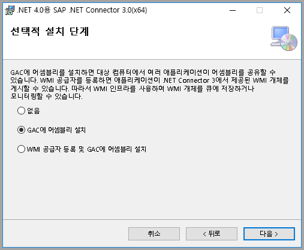
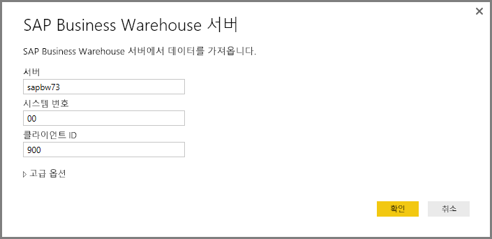
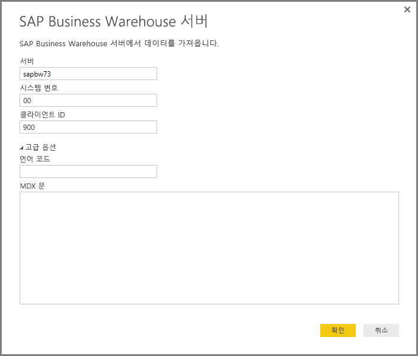
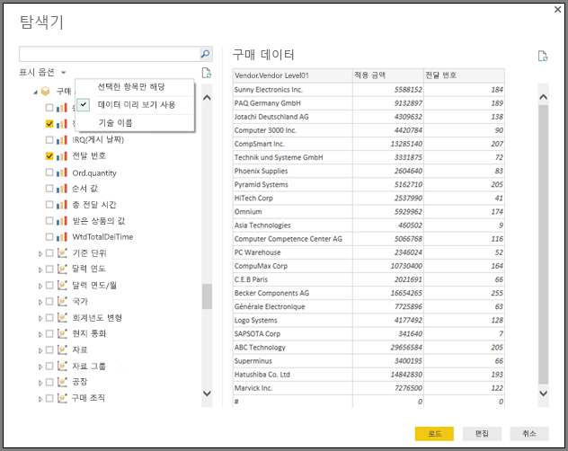
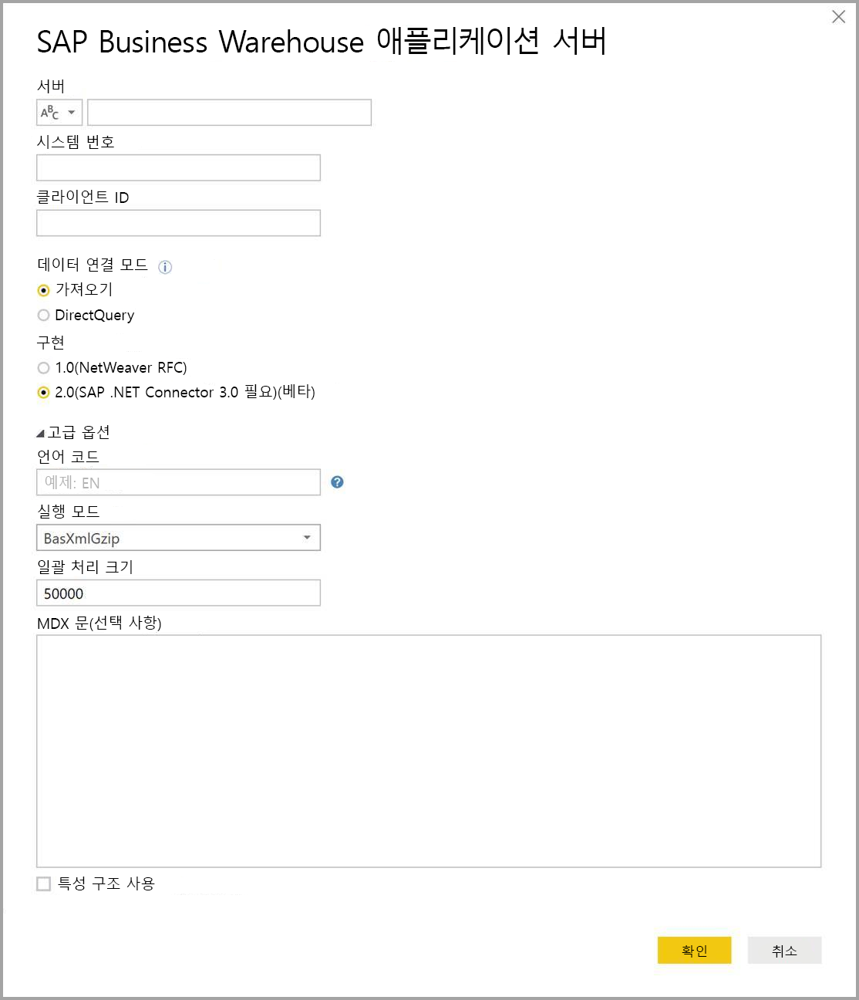

# Power BI Desktop에서 SAP BW Connector 사용
Power BI Desktop을 통해 **SAP BW(Business Warehouse)** 데이터에 액세스할 수 있습니다.

SAP 고객이 Power BI를 기존 SAP BW(Business Warehouse) 시스템에 연결하여 활용하는 방법에 대한 자세한 내용은 [Power BI 및 SAP BW 백서](https://aka.ms/powerbiandsapbw)를 참조하세요. DirectQuery 및 SAP BW 사용에 대한 자세한 내용은 [DirectQuery 및 SAP BW(Business Warehouse)](desktop-directquery-sap-bw.md) 아티클을 참조하세요.

**Power BI Desktop**(및 2018년 10월 릴리스부터 일반적으로 사용 가능)의 2018년 6월 릴리스부터 성능 및 기능이 크게 향상된 구현으로 SAP BW 커넥터를 사용할 수 있습니다. 이 업데이트된 버전의 SAP BW 커넥터는 Microsoft에서 개발했으며 **구현 2.0**라고 합니다. 버전 1(v1)의 **SAP BW 커넥터** 또는 **구현 2.0 SAP 커넥터** 중 하나를 선택할 수 있습니다. 다음 섹션에서는 각 버전의 설치를 차례로 설명합니다. Power BI Desktop에서 SAP BW에 연결할 때 하나 또는 다른 연결을 선택할 수 있습니다.

선택이 가능할 때마다 **구현 2.0 SAP 커넥터**를 사용하는 것이 좋습니다.

## 버전 1의 SAP BW 커넥터 설치
선택이 가능할 때마다 구현 2.0 SAP 커넥터를 사용하는 것이 좋습니다(다음 섹션의 지침 참조). 이 섹션에서는 버전1의 **SAP BW 커넥터** 설치에 대해 설명하며 다음 설치 단계를 수행하여 설치할 수 있습니다.

1. 로컬 컴퓨터에 **SAP NetWeaver** 라이브러리를 설치합니다. SAP 관리자 또는 직접 [SAP 소프트웨어 다운로드 센터](https://support.sap.com/swdc)에서 **SAP Netweaver** 라이브러리를 가져올 수 있습니다. **SAP 소프트웨어 다운로드 센터**에서 구조를 자주 변경했기 때문에 해당 사이트를 탐색하기 위한 보다 구체적인 지침을 사용할 수 없습니다. **SAP NetWeaver** 라이브러리는 일반적으로 SAP 클라이언트 도구 설치에도 포함됩니다.
   
   SAP Note #1025361을 검색하면 최신 버전에 대한 다운로드 위치를 가져올 수 있습니다.  **SAP NetWeaver** 라이브러리(32비트 또는 64비트)의 아키텍처가 **Power BI Desktop** 설치와 일치하는지 확인한 후, SAP Note에 따라 **SAP NetWeaver RFC SDK**에 포함된 모든 파일을 설치합니다.
2. **데이터 가져오기** 대화 상자에는 **데이터베이스** 범주에 **SAP Business Warehouse 애플리케이션 서버** 및 **SAP Business Warehouse Message 서버**에 대한 항목이 포함되어 있습니다.
   
   

## 구현 2.0 SAP 커넥터 설치

**구현 2.0** SAP 커넥터는 SAP.NET Connector 3.0이 필요합니다. 다음 링크를 사용하여 SAP 웹 사이트에서 [SAP .NET Connector 3.0](https://support.sap.com/en/product/connectors/msnet.html)을 다운로드할 수 있습니다.

* [SAP .NET Connector 3.0](https://support.sap.com/en/product/connectors/msnet.html)

다운로드에 액세스하려면 유효한 S 사용자가 필요합니다. SAP.NET Connector 3.0 가져오려는 고객은 SAP 으로 팀에 연락하는 것이 좋습니다. 

커넥터는 32비트 및 64비트 버전으로 제공되며 사용자는 설치된 Power BI Desktop과 일치하는 버전을 선택해야 *합니다*. 이 문서를 작성할 당시 웹 사이트는 두 가지 버전(.NET 4.0 framework 용)을 나열합니다.

* zip 파일(6,896KB) 형식의 Windows 32비트(x86) Microsoft.NET 3.0.20.0용 SAP 커넥터, 2018년 1월 16일
* zip 파일(7,180KB) 형식의 Windows 64비트(x64) Microsoft.NET 3.0.20.0용 SAP 커넥터, 2018년 1월 16일

설치 시 **옵션 설치 단계** 창에서 다음 이미지와 같이 *GAC에 어셈블리 설치* 옵션을 선택했는지 확인합니다.

> [!NOTE]
> 첫 번째 버전의 SAP BW 구현에는 Netweaver DLL이 필요합니다. 구현 2.0 SAP 커넥터를 사용하고 첫 번째 버전을 사용하지 않는 경우 Netweaver DLL은 필요하지 않습니다.

## 버전 1 SAP BW 커넥터 기능
Power BI Desktop의 버전 1 **SAP BW 커넥터**를 사용하면 **SAP Business Warehouse 서버** 큐브에서 데이터를 가져오거나 DirectQuery를 사용할 수 있습니다. 

**SAP BW 커넥터** 및 DirectQuery를 함께 사용하는 방법에 대해 자세히 알아보려면 [DirectQuery 및 SAP BW(Business Warehouse)](desktop-directquery-sap-bw.md) 아티클을 살펴보세요.

연결할 때는 *서버*, *시스템 번호* 및 *클라이언트 ID*를 지정하여 연결을 설정해야 합니다.

또한 두 가지 추가 **고급 옵션**인 언어 코드 및 지정된 서버에 대해 실행할 사용자 지정 MDX 문을 지정할 수 있습니다.

MDX 문이 지정되지 않은 경우 서버에서 사용 가능한 큐브 목록을 표시하는 **탐색기** 창과 차원 및 측정값을 포함하여 사용 가능한 큐브에서 항목을 드릴 다운하고 선택할 수 있는 옵션을 표시합니다. Power BI는 [BW Open Analysis Interface OLAP BAPI](https://help.sap.com/saphelp_nw70/helpdata/en/d9/ed8c3c59021315e10000000a114084/content.htm)에 의해 노출되는 쿼리와 큐브를 노출합니다.

서버에서 두 개 이상의 항목을 선택하면 선택에 따라 출력 테이블의 미리 보기가 만들어집니다.

또한 **탐색기** 창에서는 다음 작업을 수행할 수 있는 몇 가지 **표시 옵션**이 제공됩니다.

* ***선택한 항목만* 및 *모든 항목*(기본 보기) 표시:** 이 옵션은 선택한 항목의 최종 세트를 확인하는 데 유용합니다. 이 보기에 대한 다른 방법은 *미리 보기* 영역에서 열 이름을 선택하는 것입니다. 
* **데이터 미리 보기 사용(기본 동작):** 이 대화 상자에서 데이터 미리 보기를 표시할지 여부를 제어할 수도 있습니다. 미리 보기에 대한 데이터를 더 이상 요청하지 않으므로 데이터 미리 보기를 사용하지 않도록 설정하면 서버 호출의 양을 줄일 수 있습니다.
* **기술 이름:** SAP BW는 큐브 내의 개체에 대한 *기술 이름*의 개념을 지원합니다. 기술 이름을 사용하면 큐브 소유자가 큐브에 해당 개체에 대한 물리적 이름 대신 큐브 개체에 대한 *사용자 식별* 이름을 노출할 수 있습니다. 

**탐색기**에 필요한 모든 개체를 선택한 후에 **탐색기** 창의 맨 아래에서 다음 단추 중 하나를 선택하여 다음에 수행할 작업을 결정할 수 있습니다.

* **부하**를 선택하면 출력 테이블에 대한 행의 전체 집합을 Power BI Desktop 데이터 모델에 로드하도록 트리거한 다음 **데이터** 또는 **관계** 보기를 사용하여 데이터를 시각화하거나 추가로 수정할 수 있는 **보고서** 보기로 이동합니다.
* **편집**을 선택하면 **쿼리 편집기**가 나타나며 여기서 전체 행 집합을 Power BI Desktop 데이터 모델로 가져오기 전에 추가 데이터 변환 및 필터링 단계를 수행할 수 있습니다.

**SAP BW** 큐브에서 데이터를 가져올 뿐만 아니라 Power BI Desktop의 다른 광범위한 데이터 원본에서 데이터를 가져올 수도 있고 단일 보고서에서 결합할 수 있습니다. **SAP BW** 데이터의 맨 위에 보고 및 분석에 대한 모든 종류의 흥미로운 시나리오를 나타냅니다.

## 구현 2.0 SAP BW 커넥터 사용

구현 2.0 SAP BW 커넥터를 사용하려면 새 연결을 만들어야 합니다. 새 연결을 만들려면 다음 단계를 수행하세요.

1. **데이터 가져오기** 창에서 **SAP Business Warehouse 애플리케이션 서버** 또는 **SAP Business Warehouse 메시지 서버** 중 하나를 선택합니다.

2. 그러면 새로운 연결 대화 상자가 나타나 구현을 선택할 수 있습니다. 다음 이미지와 같이 **구현 2.0**을 선택하면 실행 모드, 일괄 처리 크기 및 특성 구조 활성화 옵션을 사용할 수 있습니다.

    

3. **확인**을 선택하면 **탐색기** 환경은 버전 1 SAP BW 커넥터의 이전 섹션에서 설명한 것과 동일합니다. 

### 구현 2.0의 새 옵션 

구현 2.0은 다음 옵션을 지원합니다.

1. **ExecutionMode** - 서버에서 쿼리를 실행하는 데 사용되는 MDX 인터페이스를 지정합니다. 유효한 옵션은 다음과 같습니다.

        a. SapBusinessWarehouseExecutionMode.BasXml
        b. SapBusinessWarehouseExecutionMode.BasXmlGzip
        c. SapBusinessWarehouseExecutionMode.DataStream

    이 옵션의 기본값은 SapBusinessWarehouseExecutionMode.BasXmlGzip입니다.

    대규모 데이터 세트에서 대기 시간이 긴 경우 *SapBusinessWarehouseExecutionMode.BasXmlGzip*을 사용하면 성능이 향상될 수 있습니다.

2. **BatchSize** - MDX 문을 실행할 때 한 번에 검색되는 최대 행 수를 지정합니다. 행 수가 적으면 대규모 데이터 세트를 검색하는 동안 서버에 대한 호출을 더 많이 변환합니다. 행 수가 많으면 성능이 향상될 수 있지만 SAP BW 서버의 메모리 문제가 발생할 수 있습니다. 기본값은 50000행입니다.

3. **EnableStructures** - 특성 구조가 인식되는지 여부를 나타내는 논리 값입니다. 이 옵션의 기본값은 false입니다. 선택할 수 있는 개체 목록에 영향을 줍니다. 기본 쿼리 모드에서는 지원되지 않습니다.

이 구현에서는 **ScaleMeasures** 옵션이 사용되지 않습니다. 이제 동작은 *ScaleMeasures = false* 설정과 동일하며, 스케일링되지 않은 값을 항상 표시합니다.

### 구현 2.0에 대한 추가 개선 사항 

다음 글머리 기호 목록은 새 구현과 함께 제공되는 몇 가지 추가 개선 사항을 설명합니다.

* 향상된 성능
* 수백만 행의 데이터를 검색할 수 있고 일괄 처리 크기 매개 변수를 통해 미세 조정할 수 있습니다.
* 실행 모드로 전환할 수 있습니다.
* 압축 모드를 지원합니다. 긴 대기 시간 연결 또는 대규모 데이터 세트에 특히 유용합니다.
* 날짜 변수의 향상된 검색
* [실험적] 날짜(ABAP 유형 DATS) 및 시간(ABAP 유형 TIMS) 차원을 텍스트 값 대신 날짜 및 시간으로 각각 표시합니다.
* 예외 처리가 향상됩니다. BAPI 호출에서 발생하는 오류가 이제 표시됩니다.
* BasXml 및 BasXmlGzip 모드의 열 접기입니다. 예를 들어 생성된 MDX 쿼리가 40개의 열을 검색하지만 현재 선택 항목에는 10개만 필요한 경우, 이 요청은 서버로 전달되어 더 작은 데이터 세트를 검색합니다.

### 2\.0 구현을 사용하기 위해 기존 보고서 변경 

**구현 2.0**을 사용하기 위해 기존 보고서를 변경하는 것은 가져오기 모드에만 가능하고 다음 수동 단계를 수행해야 합니다.

1. 기존 보고서를 열고 리본에서 **쿼리 편집**을 선택한 다음, 업데이트하려는 SAP Business Warehouse 쿼리를 선택합니다.

2. 조회를 마우스 오른쪽 단추로 클릭하고 **고급 편집기**를 선택합니다.

3. **고급 편집기**에서 SapBusinessWarehouse.Cubes 호출을 다음과 같이 변경합니다. 

    a. 다음 예에 나와 있는 것처럼 쿼리에 옵션 레코드가 이미 포함되어 있는지 확인합니다.

    

    b. 그렇다면 구현 2.0 옵션을 추가하고 그림과 같이 ScaleMeasures 옵션이 있다면 제거합니다.

    

    c. 쿼리에 옵션 레코드가 포함되어 있지 않으면 추가합니다. 예를 들어 다음이 있는 경우

    

    d. 이를 다음으로 변경합니다.

    

4. 구현 2.0 SAP BW 커넥터를 버전 1 SAP BW 커넥터와 호환되도록 모든 노력을 기울였습니다. 그러나 사용되는 다른 SAP BW MDX 실행 모드로 인해 약간의 차이가 있을 수 있습니다. 불일치를 해결하려면 실행 모드 간 전환을 시도하세요.

## 문제 해결
이 섹션에서는 **SAP BW** 커넥터로 작업하는 경우 상황(및 솔루션)의 문제 해결을 제공합니다.

1. **SAP BW**의 숫자 데이터는 쉼표 대신 소수점을 반환합니다. 예를 들어 1,000,000은 1.000.000으로 반환됩니다.
   
   **SAP BW**는 *,* (쉼표) 또는 *.* (점)을 소수 구분 기호로 사용하여 소수 데이터를 반환합니다. **Power BI Desktop**에서 사용하는 드라이버는 **SAP BW**에서 사용할 소수 구분 기호를 지정하기 위해 BAPI_USER_GET_DETAIL을 호출합니다.  이 호출은 소수 형식 표기법을 저장하는 *DCPFM* 이라는 필드가 있는 **DEFAULTS**라는 구조를 반환합니다.  다음 세 값 중 하나를 갖습니다.
   
       ‘ ‘ (space) = Decimal point is comma: N.NNN,NN
       'X' = Decimal point is period: N,NNN.NN
       'Y' = Decimal point is N NNN NNN,NN
   
   이 문제를 보고한 고객이 특정 사용자(잘못된 데이터를 보여주는 사용자)의 BAPI_USER_GET_DETAIL 호출이 다음과 유사한 오류 메시지와 함께 실패하는 것을 발견했습니다. 
   
       You are not authorized to display users in group TI:
           <item>
               <TYPE>E</TYPE>
               <ID>01</ID>
               <NUMBER>512</NUMBER>
               <MESSAGE>You are not authorized to display users in group TI</MESSAGE>
               <LOG_NO/>
               <LOG_MSG_NO>000000</LOG_MSG_NO>
               <MESSAGE_V1>TI</MESSAGE_V1>
               <MESSAGE_V2/>
               <MESSAGE_V3/>
               <MESSAGE_V4/>
               <PARAMETER/>
               <ROW>0</ROW>
               <FIELD>BNAME</FIELD>
               <SYSTEM>CLNTPW1400</SYSTEM>
           </item>
   
   이 오류를 해결하려면 사용자가 SAP 관리자에게 BAPI_USER_GET_DETAIL을 실행할 권한을 Power BI의 SAPBW 사용자에게 부여해 달라고 요청해야 합니다.  또한 이 문제 해결 솔루션의 앞 부분에서 설명한 것처럼 사용자에게 필요한 DCPFM 값이 있는지 확인하는 것도 중요합니다. 
   
2. **SAP BEx 쿼리에 대한 연결**
   
   다음 그림에 나와 있는 것처럼 특정 속성을 사용하도록 설정하여 Power BI Desktop에서 **BEx** 쿼리를 수행할 수 있습니다.
   
   
   
3. **탐색** 창은 데이터 미리 보기를 표시하지 않고 대신 ‘개체 참조가 개체의 인스턴스로 설정되지 않음’ 오류 메시지를 제공합니다. 
   
   SAP 사용자는 SAP BW의 InfoProviders에서 메타데이터를 가져오고 데이터를 검색하기 위해 특정 BAPI 함수 모듈에 대한 액세스 권한이 필요합니다. 내용은 다음과 같습니다.
   * BAPI_MDPROVIDER_GET_CATALOGS
   * BAPI_MDPROVIDER_GET_CUBES
   * BAPI_MDPROVIDER_GET_DIMENSIONS
   * BAPI_MDPROVIDER_GET_HIERARCHYS
   * BAPI_MDPROVIDER_GET_LEVELS
   * BAPI_MDPROVIDER_GET_MEASURES
   * BAPI_MDPROVIDER_GET_MEMBERS
   * BAPI_MDPROVIDER_GET_VARIABLES
   * BAPI_IOBJ_GETDETAIL

   이 문제를 해결하기 위해 사용자에게 *BAPI_IOBJ_GETDETAIL*뿐만 아니라 다양한 *MDPROVIDER* 모듈에 대한 액세스 권한이 있는지 확인하세요. 이 문제 또는 유사한 문제를 추가로 해결하려면 Power BI Desktop의 ‘옵션’ 내의 ‘진단’ 창에서 ‘추적 사용’을 선택합니다.    추적이 활성화되어 있는 동안 SAP BW에서 데이터를 검색하고 추적 파일에서 자세한 정보를 확인합니다.

## SAP BW 연결 지원

다음 표에서는 SAP BW에 대한 현재 지원을 자세히 설명합니다.

|Product  |모드  |인증  |커넥터  |SNC 라이브러리  |지원됨  |
|---------|---------|---------|---------|---------|---------|
|Power BI Desktop     |임의         | 사용자 / 암호  | 애플리케이션 서버 | 해당 없음  | 예  |
|Power BI Desktop     |임의         | Windows          | 애플리케이션 서버 | sapcrypto + gsskrb5/gx64krb5  | 예  |
|Power BI Desktop     |임의         | 가장을 통한 Windows | 애플리케이션 서버 | sapcrypto + gsskrb5/gx64krb5  | 예  |
|Power BI Desktop     |임의         | 사용자 / 암호        | 메시지 서버 | 해당 없음  | 예  |
|Power BI Desktop     |임의         | Windows        | 메시지 서버 | sapcrypto + gsskrb5/gx64krb5  | 예  |
|Power BI Desktop     |임의         | 가장을 통한 Windows | 메시지 서버 | sapcrypto + gsskrb5/gx64krb5  | 예  |
|Power BI 게이트웨이     |가져오기      | Power BI Desktop과 동일 |         |   |   |
|Power BI 게이트웨이     |DirectQuery | 사용자 / 암호        | 애플리케이션 서버 | 해당 없음  | 예  |
|Power BI 게이트웨이     |DirectQuery | 가장을 통한 Windows(고정 사용자, SSO 없음) | 애플리케이션 서버 | sapcrypto + gsskrb5/gx64krb5  | 예  |
|Power BI 게이트웨이     |DirectQuery | DirectQuery 쿼리에 대해 Kerberos를 통해 SSO 옵션 사용 | 애플리케이션 서버 | *해당 항목만* gsskrb5/gx64krb5   | 예  |
|Power BI 게이트웨이     |DirectQuery | 사용자 / 암호        | 메시지 서버 | 해당 없음  | 예  |
|Power BI 게이트웨이     |DirectQuery | 가장을 통한 Windows(고정 사용자, SSO 없음) | 메시지 서버 | sapcrypto + gsskrb5/gx64krb5  | 예  |
|Power BI 게이트웨이     |DirectQuery | DirectQuery 쿼리에 대해 Kerberos를 통해 SSO 옵션 사용 | 메시지 서버 | sapcrypto + gsskrb5/gx64krb5  | 아니요  |

## 다음 단계
SAP 및 DirectQuery에 대한 자세한 내용은 다음 리소스를 참조하세요.

* [DirectQuery 및 SAP HANA](desktop-directquery-sap-hana.md)
* [DirectQuery 및 SAP BW(Business Warehouse)](desktop-directquery-sap-bw.md)
* [Power BI의 DirectQuery](desktop-directquery-about.md)
* [DirectQuery에서 지원하는 데이터 원본](desktop-directquery-data-sources.md)
* [Power BI 및 SAP BW 백서](https://aka.ms/powerbiandsapbw)
