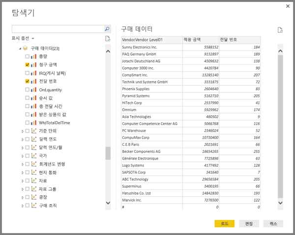
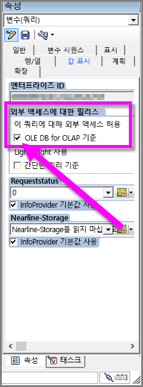

# Power BI Desktop에서 SAP BW Connector 사용
Power BI Desktop을 통해 **SAP BW(Business Warehouse)** 데이터에 액세스할 수 있습니다.

SAP 고객이 Power BI를 기존 SAP BW(Business Warehouse) 시스템에 연결하여 활용하는 방법에 대한 자세한 내용은 [Power BI 및 SAP BW 백서](https://aka.ms/powerbiandsapbw)를 참조하세요.

## SAP BW Connector 설치
**SAP BW Connector**를 사용하려면 다음 설치 단계를 진행합니다.

1. 로컬 컴퓨터에 **SAP NetWeaver** 라이브러리를 설치합니다. SAP 관리자 또는 직접 [SAP 소프트웨어 다운로드 센터](https://support.sap.com/swdc)에서 **SAP Netweaver** 라이브러리를 가져올 수 있습니다. **SAP 소프트웨어 다운로드 센터**에서 구조를 자주 변경했기 때문에 해당 사이트를 탐색하기 위한 보다 구체적인 지침을 사용할 수 없습니다. **SAP NetWeaver** 라이브러리는 일반적으로 SAP 클라이언트 도구 설치에도 포함됩니다.
   
   SAP Note #1025361을 검색하면 최신 버전에 대한 다운로드 위치를 가져올 수 있습니다. **SAP NetWeaver** 라이브러리(32비트 또는 64비트)의 아키텍처가 **Power BI Desktop** 설치와 일치하는지 확인한 후, SAP Note에 따라 **SAP NetWeaver RFC SDK**에 포함된 모든 파일을 설치합니다.
2. **데이터 가져오기** 대화 상자에는 **데이터베이스** 범주에 **SAP Business Warehouse 응용 프로그램 서버** 및 **SAP Business Warehouse Message 서버**에 대한 항목이 포함되어 있습니다.
   
   

## SAP BW Connector 기능
Power BI Desktop의 **SAP BW 커넥터**를 사용하면 **SAP Business Warehouse 서버** 큐브에서 데이터를 가져오거나 DirectQuery를 사용할 수 있습니다. 

**SAP BW 커넥터** 및 DirectQuery를 함께 사용하는 방법에 대해 자세히 알아보려면 [DirectQuery 및 SAP BW(Business Warehouse)](desktop-directquery-sap-bw.md) 아티클을 살펴보세요.

연결할 때는 *서버*, *시스템 번호* 및 *클라이언트 ID*를 지정하여 연결을 설정해야 합니다.

지정된 서버에 대해 실행되는 언어 코드 및 사용자 지정 MDX 문 등 두 개의 추가 **고급 옵션**을 지정할 수도 있습니다.

MDX 문이 지정되지 않은 경우 서버에서 사용 가능한 큐브 목록을 표시하는 **탐색기** 창과 차원 및 측정값을 포함하여 사용 가능한 큐브에서 항목을 드릴 다운하고 선택할 수 있는 옵션을 표시합니다. Power BI는 [BW Open Analysis Interface OLAP BAPI](https://help.sap.com/saphelp_nw70/helpdata/en/d9/ed8c3c59021315e10000000a114084/content.htm)에 의해 노출되는 쿼리와 큐브를 노출합니다.

서버에서 두 개 이상의 항목을 선택하면 선택에 따라 출력 테이블의 미리 보기가 만들어집니다.

또한 **탐색기** 창에서는 다음 작업을 수행할 수 있는 몇 가지 **표시 옵션**이 제공됩니다.

* **선택한 항목만과 *모든 항목* 표시(기본 뷰):** 이 옵션은 선택된 항목의 마지막 집합을 확인하는 데 유용합니다. 이 보기에 대한 다른 방법은 *미리 보기* 영역에서 열 이름을 선택하는 것입니다.
* **데이터 미리 보기(기본 동작) 사용:** 또한 이 대화 상자에서 데이터 미리 보기를 표시할지 여부를 제어할 수 있습니다. 미리 보기에 대한 데이터를 더 이상 요청하지 않으므로 데이터 미리 보기를 사용하지 않도록 설정하면 서버 호출의 양을 줄일 수 있습니다.
* **기술 이름:** SAP BW는 큐브 내의 개체에 대한 기술 이름의 개념을 지원합니다. 기술 이름을 사용하면 큐브 소유자가 큐브에 해당 개체에 대한 물리적 이름 대신 큐브 개체에 대한 *사용자 식별* 이름을 노출할 수 있습니다.

**탐색기**에 필요한 모든 개체를 선택한 후에 **탐색기** 창의 맨 아래에서 다음 단추 중 하나를 선택하여 다음에 수행할 작업을 결정할 수 있습니다.

* **부하**를 선택하면 출력 테이블에 대한 행의 전체 집합을 Power BI Desktop 데이터 모델에 로드하도록 트리거한 다음 **데이터** 또는 **관계** 보기를 사용하여 데이터를 시각화하거나 추가로 수정할 수 있는 **보고서** 보기로 이동합니다.
* **편집**을 선택하면 **쿼리 편집기**가 나타나며 여기서 전체 행 집합을 Power BI Desktop 데이터 모델로 가져오기 전에 추가 데이터 변환 및 필터링 단계를 수행할 수 있습니다.

**SAP BW** 큐브에서 데이터를 가져올 뿐만 아니라 Power BI Desktop의 다른 광범위한 데이터 원본에서 데이터를 가져올 수도 있고 단일 보고서에서 결합할 수 있습니다. **SAP BW** 데이터의 맨 위에 보고 및 분석에 대한 모든 종류의 흥미로운 시나리오를 나타냅니다.

## 문제 해결
이 섹션에서는 **SAP BW** Connector의 미리 보기 버전으로 작업하는 경우 상황(및 솔루션)의 문제 해결을 제공합니다.

1. **SAP BW**의 숫자 데이터는 쉼표 대신 소수점을 반환합니다. 예를 들어 1,000,000은 1.000.000으로 반환됩니다.
   
   **SAP BW**는 *,*(쉼표) 또는 *.*(점)을 소수 구분 기호로 사용하여 소수 데이터를 반환합니다. **Power BI Desktop**에서 사용하는 드라이버는 **SAP BW**에서 사용할 소수 구분 기호를 지정하기 위해 BAPI_USER_GET_DETAIL을 호출합니다. 이 호출은 소수 형식 표기법을 저장하는 *DCPFM* 이라는 필드가 있는 **DEFAULTS**라는 구조를 반환합니다. 다음 세 값 중 하나를 갖습니다.
   
       ‘ ‘ (space) = Decimal point is comma: N.NNN,NN
       'X' = Decimal point is period: N,NNN.NN
       'Y' = Decimal point is N NNN NNN,NN
   
   이 문제를 보고한 고객이 특정 사용자(잘못된 데이터를 보여주는 사용자)의 BAPI_USER_GET_DETAIL 호출이 다음과 유사한 오류 메시지와 함께 실패하는 것을 발견했습니다.
   
       You are not authorized to display users in group TI:
           <item>
               <TYPE>E</TYPE>
               <ID>01</ID>
               <NUMBER>512</NUMBER>
               <MESSAGE>You are not authorized to display users in group TI</MESSAGE>
               <LOG_NO/>
               <LOG_MSG_NO>000000</LOG_MSG_NO>
               <MESSAGE_V1>TI</MESSAGE_V1>
               <MESSAGE_V2/>
               <MESSAGE_V3/>
               <MESSAGE_V4/>
               <PARAMETER/>
               <ROW>0</ROW>
               <FIELD>BNAME</FIELD>
               <SYSTEM>CLNTPW1400</SYSTEM>
           </item>
   
   이 오류를 해결하려면 사용자가 SAP 관리자에게 BAPI_USER_GET_DETAIL을 실행할 권한을 Power BI의 SAPBW 사용자에게 부여해 달라고 요청해야 합니다. 또한 이 문제 해결 솔루션의 앞 부분에서 설명한 것처럼 사용자에게 필요한 DCPFM 값이 있는지 확인하는 것도 중요합니다. 
2. **SAP BEx 쿼리에 대한 연결**
   
   다음 그림에 나와 있는 것처럼 특정 속성을 사용하도록 설정하여 Power BI Desktop에서 **BEx** 쿼리를 수행할 수 있습니다.
   
   

## 다음 단계
SAP HANA 및 DirectQuery에 대한 자세한 내용은 다음 리소스를 참조하세요.

* [DirectQuery 및 SAP HANA](desktop-directquery-sap-hana.md)
* [Power BI의 DirectQuery](desktop-directquery-about.md)
* [DirectQuery에서 지원하는 데이터 원본](desktop-directquery-data-sources.md)
* [Power BI 및 SAP BW 백서](https://aka.ms/powerbiandsapbw)
