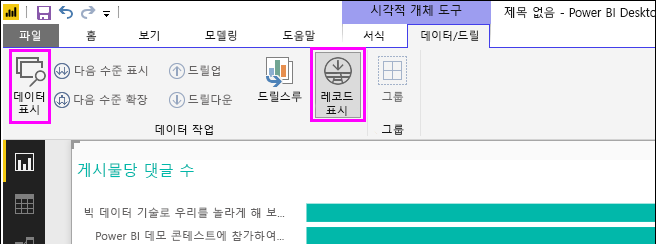
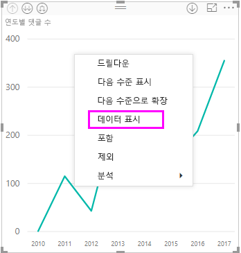
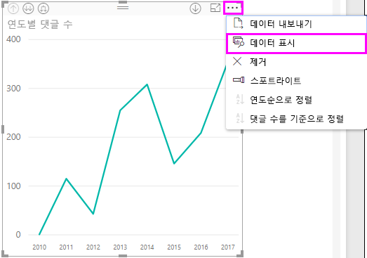
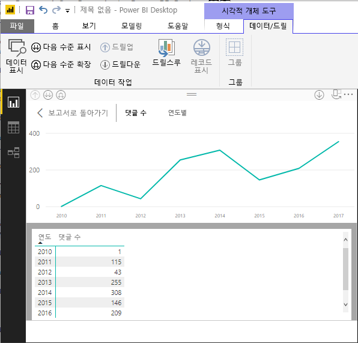
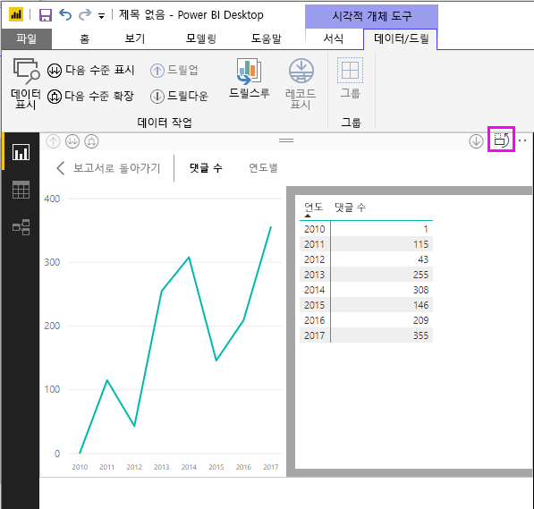
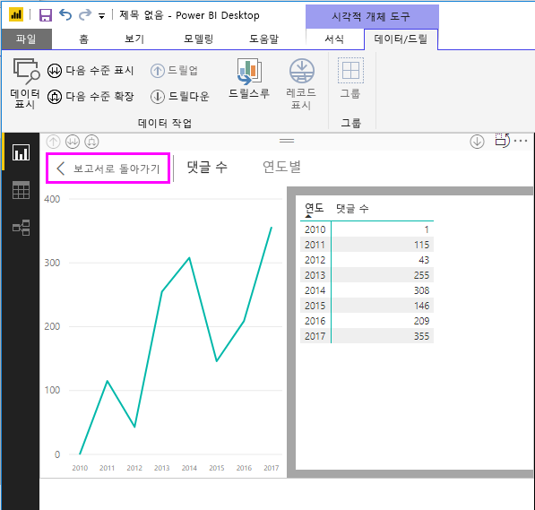
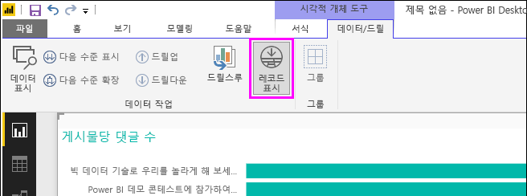
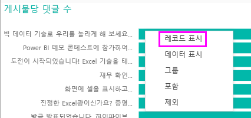
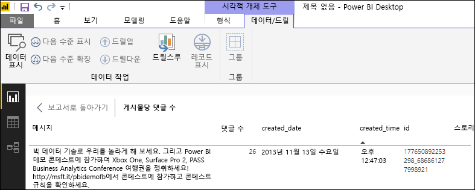
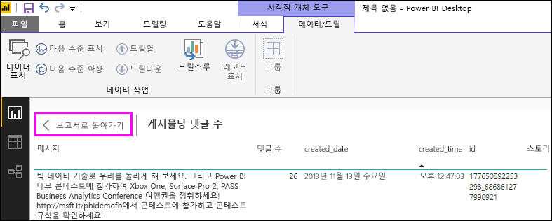

# Power BI Desktop에서 데이터 표시 및 레코드 표시 사용
**Power BI Desktop**에서는 시각화의 세부 정보로 드릴하고 선택한 시각적 개체에 대한 기본 데이터 또는 개별 데이터 레코드의 텍스트 표현을 볼 수 있습니다. 이러한 기능을 때로는 ‘클릭 광고’, ‘드릴스루’ 또는 ‘드릴스루 세부 정보’라고 합니다.   

**데이터 표시**를 사용하여 선택된 시각화에서 사용되는 값의 텍스트 버전을 보거나, **레코드 표시**를 사용하여 하나의 선택된 레코드 또는 데이터 요소에 대한 모든 데이터를 볼 수 있습니다. 

>[!IMPORTANT]
>**데이터 표시** 및 **레코드 표시**는 다음 시각화 형식만 지원합니다.
>  - 가로 막대형 차트
>  - 세로 막대형 차트
>  - 도넛형 차트
>  - 등치 지역도
>  - 깔때기형
>  - 맵
>  - 원형 차트
>  - 트리맵

## Power BI Desktop에서 데이터 표시 사용

**데이터 표시**는 시각화를 구성하는 데이터를 표시합니다. **데이터 표시**는 시각화 선택 시 리본의 **시각적 도구** 섹션에 있는 **데이터/드릴** 탭에 표시됩니다.

시각화를 마우스 오른쪽 단추로 클릭하고 표시되는 메뉴에서 **데이터 표시**를 선택하거나 시각화의 오른쪽 위에 있는 **추가 옵션**(...)을 선택한 다음, **데이터 표시**를 선택하여 데이터를 볼 수도 있습니다.

&nbsp;&nbsp;

> [!NOTE]
> 마우스 오른쪽 단추 클릭 메뉴를 사용하려면 시각적 개체에서 데이터 요소 위로 마우스를 가져가야 합니다.

**데이터 표시**를 선택하면 Power BI Desktop 캔버스에 데이터의 시각적 개체와 텍스트 표현이 모두 표시됩니다. ‘가로 보기’에서 시각적 개체는 캔버스의 위쪽 절반에 표시되고, 데이터는 아래쪽 절반에 표시됩니다.  

캔버스의 오른쪽 위에 있는 아이콘을 선택하여 가로 보기와 ‘세로 보기’ 간에 토글할 수 있습니다. 

보고서로 돌아가려면 캔버스의 왼쪽 위에 있는 **< 보고서로 돌아가기**를 선택합니다.

## Power BI Desktop에서 레코드 참조 사용

시각화에서 하나의 데이터 레코드에 포커스를 맞추고 그 뒤의 데이터로 드릴할 수도 있습니다. **레코드 표시**를 사용하려면 시각화를 선택하고, 리본의 **시각적 도구** 섹션에 있는 **데이터/드릴** 탭에서 **레코드 표시**를 선택한 다음, 시각화에서 데이터 요소 또는 행을 선택합니다. 

> [!NOTE]
> 리본의 **레코드 표시** 단추가 사용하지 않도록 설정되어 회색으로 표시되면 선택된 시각화가 **레코드 표시**를 지원하지 않는 것입니다.

데이터 요소를 마우스 오른쪽 단추로 클릭하고 표시되는 메뉴에서 **레코드 표시**를 선택할 수도 있습니다.

데이터 요소에 대해 **레코드 표시**를 선택하면 Power BI Desktop 캔버스에 선택된 요소와 연결된 모든 데이터가 표시됩니다. 

보고서로 돌아가려면 캔버스의 왼쪽 위에 있는 **< 보고서로 돌아가기**를 선택합니다.

> [!NOTE]
>**레코드 표시**에는 다음과 같은 제한 사항이 있습니다.
> - **레코드 표시** 보기에서 데이터를 변경하고 다시 보고서에 저장할 수는 없습니다.
> - 시각적 개체에서 계산된 측정값을 사용할 때는 **레코드 표시**를 사용할 수 없습니다.
> - 라이브 다차원(MD) 모델에 연결된 경우 **레코드 표시**를 사용할 수 없습니다.

## 다음 단계
**Power BI Desktop**에는 모든 종류의 보고서 서식 및 데이터 관리 기능이 있습니다. 몇 가지 예를 보려면 다음 리소스를 확인하세요.

* [Power BI Desktop에서 그룹화 및 범주화 사용](desktop-grouping-and-binning.md)
* [Power BI Desktop 보고서에서 눈금선, 눈금에 맞춤, z-순서, 맞춤 및 균등 맞춤 사용](desktop-gridlines-snap-to-grid.md)

