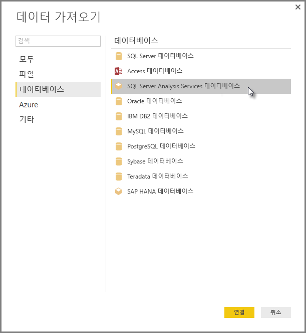

# Power BI Desktop에서 SSAS 다차원 모델에 연결
Power BI Desktop을 통해 일반적으로 **SSAS MD**라고 하는 **SSAS 다차원 모델**에 액세스할 수 있습니다.

**SSAS MD** 데이터베이스에 연결하려면 다음 이미지처럼 **데이터 가져오기 &gt; 데이터베이스 &gt; SQL Server Analysis Services 데이터베이스**를 선택합니다.

라이브 연결 모드의 **SSAS 다차원 모델**은 Power BI 서비스 및 Power BI Desktop에서 지원됩니다. 또한 라이브 모드에서 Power BI 서비스에 **SSAS 다차원 모델**을 사용하는 보고서를 게시 및 업로드할 수 있습니다.

## SSAS MD의 기능 및 특징
다음 섹션에서는 Power BI 및 SSAS MD 연결의 특징과 기능을 설명합니다.

### 다차원 모델의 테이블 형식 메타데이터
다음 테이블은 다차원 개체와 Power BI Desktop에 반환되는 테이블 형식 메타데이터 간의 관계를 보여줍니다. Power BI는 테이블 형식 메타 데이터에 대한 모델을 쿼리하고 반환된 메타데이터에 따라 테이블, 행렬, 차트 또는 슬라이서와 같은 시각화를 만들 때 Analysis Services에 대한 적절한 DAX 쿼리를 실행합니다.

| BISM-Multidimentional 개체 | 테이블 형식 메타데이터 |
| --- | --- |
| 큐브 |모델 |
| 큐브 차원 |테이블 |
| 차원 특성(키), 이름 |열 |
| 측정값 그룹 |테이블 |
| 측정값 |측정값 |
| 연결된 측정값 그룹이 없는 측정값 |측정값이라고 하는 테이블 내에서 |
| 측정값 그룹 -> 큐브 차원 관계 |관계 |
| 큐브 뷰 |큐브 뷰 |
| KPI |KPI |
| 사용자/부모-자식 계층 구조 |계층 구조 |

### 측정값, 측정값 그룹 및 KPI
다차원 큐브의 측정값 그룹은 **필드** 창의 측정값 그룹에 옆에 ∑ 기호가 있는 테이블처럼 Power BI에 노출됩니다. 연결된 측정값 그룹이 없는 계산 측정값은 테이블 형식 메타데이터의 *측정값* 이라고 하는 특수 테이블 아래에 그룹화됩니다.

다차원 모델에서 복잡한 모델을 간소화할 수 있는 표시 폴더내에 위치할 큐브에서 측정값 집합 또는 KPI 집합을 정의할 수 있습니다. Power BI는 테이블 형식 메타데이터의 표시 폴더를 인식하고 표시 폴더 내 측정값 및 KPI를 보여줍니다. 다차원 데이터베이스의 KPI는 값, 목표, 상태 그래픽 및 추세 그래픽을 지원합니다.

### 차원 특성 형식
다차원 모델은 또한 차원 특성과 특정 차원 특성 형식에 연결하는 것도 지원합니다. 예를 들어, **도시** , 시/도, 국가및 우편 번호 차원 특성이 적절한 지리 형식을 가지고 있고 이들과 연결된 *지리* 차원은 테이블 형식 메타데이터에 노출됩니다. Power BI는 메타 데이터를 인식하여 맵을 시각화할 수 있도록 해줍니다. Power BI의 *필드* 창 요소 옆에 있는 **맵** 아이콘으로 이러한 연결을 알아볼 수 있습니다.

또한 Power BI는 이미지의 URL(Uniform Resource Locator)을 포함하는 필드를 제공하면 이미지를 렌더링할 수도 있습니다. SQL Server 데이터 도구(또는 이후에 Power BI)에서 이들 필드를 *ImageURL* 형식으로 지정할 수 있고, 그 형식 정보는 테이블 형식 메타데이터의 Power BI에 제공됩니다. 그런 다음 Power BI는 URL에서 이러한 이미지를 검색하고 시각적 개체에 표시할 수 있습니다.

### 부모-자식 계층 구조
다차원 모델은 테이블 형식 메타데이터의 *계층* 으로 제공되는 부모-자식 계층 구조를 지원합니다. 부모-자식 계층 구조의 각 수준은 테이블 형식 메타데이터에 숨겨진 열로 노출됩니다. 부모-자식 차원의 키 특성은 테이블 형식 메타데이터에 노출되지 않습니다.

### 차원 계산 멤버
다차원 모델은 다양한 형식의 계산 멤버생성을 지원합니다. 가장 일반적인 두 가지 형식의 계산 멤버는 다음과 같습니다.

* 특성 계층 구조이며 *모두* 형제가 아닌 계산 멤버
* 사용자 계층 구조의 계산 멤버

다차원 모델은 *특성 계층의 계산 멤버* 를 열의 값으로 노출합니다. 이러한 형식의 계산 멤버를 노출하는 데 몇 가지 추가 옵션 및 제약 조건이 있습니다.

* 선택 사양인 UnknownMember를 가질 수 있는 차원 속성
* 계산 멤버를 포함하는 특성이 차원의 유일한 특성이 아닐 경우 해당 특성은 차원의 키 특성이 될 수 없습니다.
* 계산 멤버를 포함하는 특성은 부모-자식 특성일 수 없습니다.

사용자 계층 구조의 계산 멤버는 Power BI에 노출되지 않습니다. 사용자 계층 구조의 계산 멤버를 포함하는 큐브에 연결할 수 있지만 이전 글머리 기호 목록에서 설명된 제약 조건을 충족하지 않을 경우 계산 멤버를 볼 수 없습니다.

### 보안
다차원 모델은 역할을 통해 차원 및 셀 수준 보안을 지원합니다. Power BI를 사용하여 큐브에 연결하는 경우 적절한 사용 권한에 대해 인증되고 평가됩니다. 사용자가 차원 보안 을 적용하면, 해당 차원 멤버는 Power BI에서 사용자가 볼 수 없습니다. 그러나 사용자가 *셀 보안* 사용 권한을 정의하여 특정 셀을 제한하는 경우, 해당 사용자는 Power BI를 사용하여 큐브에 연결할 수 없습니다.

## Power BI Desktop에서 SSAS 다차원 모델의 제한 사항
**SSAS MD**를 사용하는 데에는 특정 제한 사항이 있습니다.

* 서버는 Power BI Desktop SSAS MD 커넥터가 제대로 작동하기 위해 SQL Server 2012 SP1 CU4 또는 이후 버전의 Analysis Services를 실행해야 합니다.
* *작업* 및 *명명된 집합* 은 Power BI에 노출되지 않지만, *작업* 또는 *명명된 집합* 을 포함하고 시각적 개체 및 보고서를 만드는 큐브에는 계속 연결할 수 있습니다.

## Power BI Desktop에서 지원되는 SSAS MD의 기능
다음은 Power BI Desktop에서 지원되는 SSAS MD 기능입니다.

* 다음 요소의 사용량 과금은 **SSAS MD**의 이 릴리스에서 지원됩니다(이러한 기능에 대해 [자세한 내용](https://msdn.microsoft.com/library/jj969574.aspx)을 얻을 수 있음).
  * 표시 폴더
  * KPI 추세
  * 기본 멤버
  * 차원 특성
  * 차원 계산 멤버(차원에 둘 이상의 특성이 있는 경우 단일 실제 멤버여야 하고 유일한 특성이지 않는 한 차원의 키 특성일 수 없으며 부모-자식 특성이 될 수 없습니다)
  * 차원 특성 형식
  * 계층 구조
  * 측정값(측정값 그룹 유무)
  * 변형으로서 측정값
  * KPI
  * ImageUrls
  * 차원 보안

