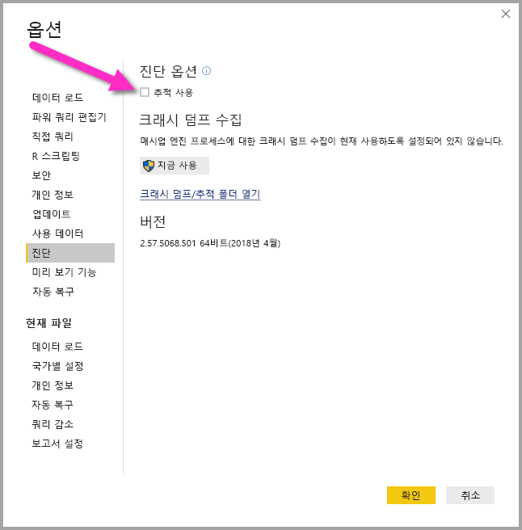

# Power BI Desktop에서 로그인 문제 해결
**Power BI Desktop**에 로그인하려고 하는데 오류가 발생하는 경우가 있습니다. 로그인 문제의 두 가지 기본 원인은 다음과 같습니다. **프록시 인증 오류** 및 **HTTPS 이외의 URL 리디렉션 오류**. 

로그인 문제를 일으키는 문제를 확인하기 위한 첫 번째 단계는 관리자에게 문의하고 관리자가 문제의 원인을 확인할 수 있도록 진단 정보를 제공하는 것입니다. 관리자는 로그인 문제와 관련된 문제를 추적하여 다음 중 어떤 오류가 적용되는지 확인할 수 있습니다. 

이러한 문제를 각각 차례로 살펴보겠습니다. 이 문서의 끝부분에는 Power BI Desktop에서 문제 해결을 추적하는 데 도움이 될 수 있는 ‘추적’ 캡처 방법에 대한 설명이 있습니다. 

## 프록시 인증 필요 오류

다음 화면에서는 ‘프록시 인증 필요’ 오류에 대한 예제를 보여줍니다. 

*Power BI Desktop* 추적 파일의 다음 예외 사항이 이 오류와 연결됩니다.

* *Microsoft.PowerBI.Client.Windows.Services.PowerBIWebException*
* *HttpStatusCode: ProxyAuthenticationRequired*

이 오류가 발생할 경우 가장 가능성이 큰 이유는 네트워크의 프록시 인증 서버가 **Power BI Desktop**에서 실행된 웹 요청을 차단하고 있기 때문입니다. 

네트워크에서 프록시 인증 서버를 사용하는 경우 관리자는 프록시 인증 서버에서 다음 도메인을 허용 목록에 추가하여 이 문제를 해결할 수 있습니다.

* app.powerbi.com
* api.powerbi.com
* *.analysis.windows.net 네임스페이스의 도메인

정부 클라우드에 속하는 고객의 경우 프록시 인증 서버에서 다음 도메인을 허용 목록에 추가하여 이 문제를 수정할 수 있습니다.

* app.powerbigov.us
* api.powerbigov.us
* *.analysis.usgovcloudapi.net 네임스페이스의 도메인

## HTTPS 이외의 URL 리디렉션이 지원되지 않는 오류

**Power BI Desktop**의 현재 버전이 비보안(HTTPS 이외) URL에 대한 리디렉션을 허용하지 않는 ADAL(Active Directory Authentication Library)의 최신 버전을 사용합니다. 

*Power BI Desktop* 추적 파일의 다음 예외 사항이 이 오류와 연결됩니다.

* *Microsoft.IdentityModel.Clients.ActiveDirectory.AdalServiceException:* HTTPS 이외의 URL 리디렉션이 webview에서 지원되지 않습니다.
* *ErrorCode: non_https_redirect_failed*

*ErrorCode: non_https_redirect_failed*가 발생하면 리디렉션 체인에 있는 하나 이상의 리디렉션 페이지 또는 공급자가 HTTPS 보호 엔드포인트가 아니거나 하나 이상의 리디렉션에 대한 인증서 발급자가 디바이스의 신뢰할 수 있는 루트가 아닌 것입니다. 로그인 리디렉션 체인의 모든 공급자는 HTTPS URL을 사용해야 합니다. 이 문제를 해결하려면 관리자에게 문의하고 해당 인증 사이트에 대해 보안 URL을 사용하도록 요청합니다. 

## Power BI Desktop에서 추적을 수집하는 방법

**Power BI Desktop**에서 추적을 수집하려면 다음 단계를 수행합니다.

1. **파일 > 옵션 및 설정 > 옵션**으로 이동한 다음, 왼쪽 창의 옵션에서 **진단**을 선택하여 **Power BI Desktop**에서 추적을 사용하도록 설정합니다. 표시되는 창에서 다음 이미지에 표시된 것처럼 **추적 사용** 옆에 있는 확인란을 선택합니다. **Power BI Desktop**을 다시 시작해야 할 수 있습니다.
   
   

2. 그런 다음, 오류를 재현하는 단계를 수행합니다. 이 문제가 발생하면 **Power BI Desktop**은 로컬 컴퓨터에 보관되는 추적 로그에 이벤트를 추가합니다.

3. 로컬 컴퓨터의 Traces 폴더로 이동합니다. 추적을 사용하도록 설정한 **진단**에서 이전 이미지에 ‘크래시 덤프/추적 폴더 열기’로 표시된 링크를 선택하여 해당 폴더를 찾을 수 있습니다.  보통 이 폴더는 로컬 컴퓨터에서 다음 위치에 있습니다.

    `C:\Users/<user name>/AppData/Local/Microsoft/Power BI Desktop/Traces`

해당 폴더에 많은 추적 파일이 있을 수 있습니다. 오류를 신속하게 식별할 수 있도록 관리자에게 최근 파일만 보내야 합니다. 

