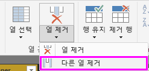
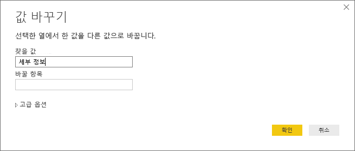
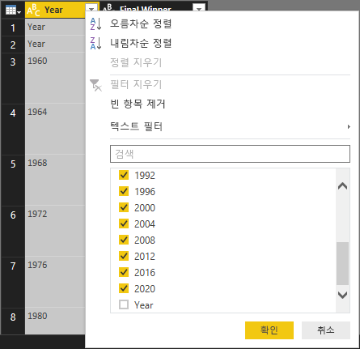
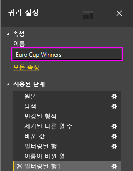
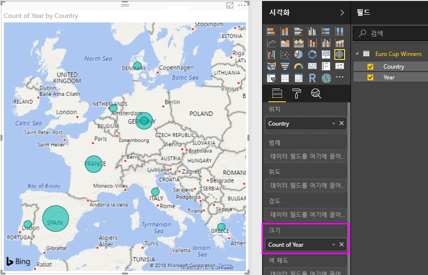

# Power BI Desktop을 사용하여 웹 페이지 데이터 분석(자습서)
이 자습서에서는 웹 페이지에서 데이터 테이블을 가져오고 이 데이터를 시각화하는 보고서를 만드는 방법을 배웁니다. 이 프로세스의 일부로, 웹 페이지에서 사용할 수 있는 표를 탐색하고 데이터 변환 단계를 적용하여 표를 새 모양으로 변경합니다.

 이 문서의 내용

* **작업 1:** 웹 데이터 원본에 연결
* **작업 2**: 쿼리 뷰에서 데이터 셰이핑
  * 1단계: 다른 열을 제거하여 관심 있는 열만 표시
  * 2단계: 값을 바꿔 선택한 열의 값 정리
  * 3단계: 열의 값 필터링
  * 4단계: 열 이름 바꾸기
  * 5단계: 열의 null 값 필터링
  * 6단계: 쿼리 이름 바꾸기
  * 생성되는 쿼리 단계
* **작업 3:** 보고서 뷰를 사용하여 시각화 만들기
  * 1단계: 보고서에 쿼리 로드
  * 2단계: 맵 시각화 만들기

## 작업 1: 웹 데이터 소스에 연결
 작업 1에서는 http://en.wikipedia.org/wiki/UEFA\_European\_Football\_Championship에 있는 UEFA 유럽 축구 선수권 대회 Wikipedia 페이지에서 토너먼트 요약 표를 가져옵니다.

### Wikipedia 페이지 데이터 소스 추가
1. **시작 대화 상자** 또는 **홈** 리본 탭에서 **데이터 가져오기**를 선택합니다.
2. **데이터 가져오기** 대화 상자가 표시되며, 여기서 다양한 데이터 소스 중에서 선택하여 데이터를 Power BI Desktop으로 가져올 수 있습니다. **모두** 또는 **기타** 그룹 아래에서 사용할 수 있는 **웹** 을 선택합니다.
3. **웹 콘텐츠** 대화 상자의 **URL** 텍스트 상자에 Wikipedia URL(http://en.wikipedia.org/wiki/UEFA\_European\_Football\_Championship)을 붙여넣습니다.
4. **확인**을 클릭합니다.

웹 페이지에 연결하면 이 Wikipedia 페이지에서 사용할 수 있는 테이블 목록이 **탐색기** 대화 상자에 표시됩니다. 각 표를 한 번 클릭하여 데이터를 미리 볼 수 있습니다.

**탐색기** 왼쪽 창에서 토너먼트 요약 결과에 대한 **결과[편집]** 테이블을 선택하거나 **결과[편집]** 테이블을 선택하고 **편집**을 선택합니다. 이렇게 하면 데이터가 분석에 필요한 모양이 아니기 때문에 이 표를 보고서에 로드하기 전에 모양을 변경할 수 있습니다.

이제 표의 미리 보기가 쿼리 뷰에 배치되며, 일련의 변환 단계를 적용하여 데이터를 정리할 수 있습니다.

## 작업 2: 제목 표에서 데이터 모양 지정
이제 제목 표가 데이터 쿼리에 대해 선택되었으므로 다양한 데이터 셰이핑 및 정리 단계를 수행하는 방법을 배웁니다.

**1단계:** 다른 열을 제거하여 관심 있는 열만 표시

이 단계에서는 **Year** 및 **Final Winners**를 제외한 모든 열을 제거합니다.

1. **쿼리 미리 보기** 표에서 **Year** 및 **Final Winners** 열을 선택합니다(**CTRL** + **클릭** 사용).
2. **쿼리 미리 보기** 표에서 열 머리글을 마우스 오른쪽 단추로 클릭하고 **다른 열 제거** 를 클릭하여 선택되지 않은 열을 제거합니다. 이 작업은 **홈** 리본 탭의 **열 관리** 그룹에서도 사용할 수 있습니다.

**2단계:** 값을 바꿔 선택한 열의 값 정리

이 단계에서는 **Year** 열의 Details 접미사를 바꿉니다. 이 접미사는 새 줄에 있으므로 표 미리 보기에 표시되지 않습니다. 그러나 연도 열에서 숫자 값이 포함된 셀 중 하나를 클릭하면 자세히 보기에 전체 값이 표시됩니다.

1. **Year** 열을 선택합니다.
2. **쿼리 뷰** 리본에서 **홈** 탭 아래의 **값 바꾸기** 를 클릭하거나 **Year** 열을 마우스 오른쪽 단추로 클릭하고 **값 바꾸기** 를 클릭하여 Details를 빈 텍스트로 바꿉니다.
3. **값 바꾸기** 대화 상자에서 **찾을 값** 텍스트 상자에 Details를 입력하고 **바꿀 내용** 텍스트 상자를 비워둡니다.
4. **확인**을 클릭합니다.

 **3단계:** 열의 값 필터링

이 단계에서는 **Year** 열을 필터링하여 "Year"를 포함하지 않는 행을 표시합니다.

1. **Year** 열에서 필터 드롭다운 화살표를 클릭합니다.
2. **필터** 드롭다운에서 **Year** 옵션을 선택 취소합니다.
3. **확인**을 클릭합니다.

**4단계:** 열 이름 바꾸기

**Year** 열의 데이터를 정리했으므로 **Final Winner** 열을 작업하겠습니다.

승자 목록만 확인하므로 이 열의 이름을 **Country**로 바꿀 수 있습니다.

1. 쿼리 미리 보기에서 **Final Winner** 열을 선택합니다.
2. **쿼리 뷰** 리본의 **변환** 탭 및 **Any Column(임의 열)** 그룹 아래에 **이름 바꾸기**가 있습니다.
3. 이렇게 하면 열 이름을 편집할 수 있습니다. 이 열의 이름을 **국가**로 바꾸겠습니다.

**5단계:** 열의 null 값 필터링

또한 **Country** 열에서 null 값을 필터링해야 합니다. 이 작업을 수행하기 위해 3단계에서 확인한 필터 메뉴를 사용하거나 다음을 수행할 수 있습니다.

1. **Country** 열에서 null 값이 포함된 셀 중 하나를 마우스 오른쪽 단추로 클릭합니다.
2. 상황에 맞는 메뉴에서 **텍스트 필터 -\> 같지 않음**을 선택합니다.
3. **Country** 열에서 null 값이 포함된 행을 제거하는 새 필터 단계가 만들어집니다.

**6단계:** 쿼리 이름 지정

이 단계에서는 최종 쿼리의 이름을 **Euro Cup Winners**로 지정합니다.

1. **쿼리 설정** 창의 **이름** 텍스트 상자에 **Euro Cup Winners**를 입력합니다.
   
   

## 작업 3: 보고서 뷰를 사용하여 시각화 만들기
이제 분석에 필요한 모양으로 데이터를 변환했으므로 결과 표를 보고서에 로드하고 몇 가지 시각화를 만들 수 있습니다.

**1단계:** 보고서에 쿼리 로드

쿼리 결과를 Power BI Desktop에 로드하고 보고서를 만들기 위해 **홈** 리본에서 **Close & Load(닫기 및 로드)**를 선택합니다.

이렇게 하면 쿼리 평가 및 보고서에 표 출력 로드가 트리거됩니다. Power BI Desktop에서 **보고서** 아이콘을 선택하여 보고서 뷰에서 Power BI Desktop을 봅니다.

**보고서 뷰** 오른쪽의 **필드 창**에서 결과 테이블 필드를 볼 수 있습니다.

**2단계:** 맵 시각화 만들기

시각화를 만들려면 **필드 목록** 에서 **보고서 캔버스**로 필드를 끌어서 놓으면 됩니다.

1. **Country** 필드를 **보고서 캔버스**로 끌어서 놓습니다. **보고서 캔버스**에 새 시각화가 만들어집니다. 여기서는 국가 목록이 있으므로 **지도 시각화**가 만들어집니다.
   
   
2. **시각화** 창에서 다른 아이콘을 클릭하여 시각화 형식을 쉽게 변경할 수 있습니다.
   
   
3. 지도에 대해 **지도** 시각화 형식을 사용할 것이며, 시각화의 모서리 중 하나를 원하는 크기까지 끌어 시각화의 크기를 조정할 수도 있습니다.
   
   
4. 지금은 맵에 있는 모든 점의 크기가 같습니다. 유로 컵 토너먼트 승리 횟수가 더 많은 국가가 맵에서 더 큰 점으로 표시되도록 이 모양을 변경하려고 합니다. 이 작업을 수행하려면 **필드 목록** 의 **Year** 필드를 **필드 창** 아래쪽에 있는 **값**상자로 끌면 됩니다.
   
   

살펴봤듯이 보고서에서 시각화를 매우 쉽게 사용자 지정하여 원하는 방식으로 데이터를 표시할 수 있습니다. Power BI Desktop은 다양한 데이터 소스에서 데이터를 가져오고 이 데이터를 풍부한 대화형 방식으로 시각화하기 위해 분석 요구 사항에 맞게 셰이핑하는 원활한 종단 간 환경을 제공합니다. 보고서가 준비되면 [Power BI로 업로드](desktop-upload-desktop-files.md)하고 보고서에 따라 대시보드를 만든 후 다른 Power BI 사용자와 공유할 수 있습니다.

이제 **웹에서 데이터 가져오기** 자습서를 마쳤습니다. [여기](http://download.microsoft.com/download/1/4/E/14EDED28-6C58-4055-A65C-23B4DA81C4DE/Analyzing_Data_From_The_Web.pbix)서 완료된 Power BI Desktop 파일을 다운로드할 수 있습니다.

## 자세한 정보를 얻을 수 있는 기타 위치
* [다른 Power BI Desktop 자습서 참고](http://go.microsoft.com/fwlink/?LinkID=521937)
* [Power BI Desktop 동영상 시청](http://go.microsoft.com/fwlink/?LinkID=519322)
* [Power BI 포럼 방문](http://go.microsoft.com/fwlink/?LinkID=519326)
* [Power BI 블로그 참고](http://go.microsoft.com/fwlink/?LinkID=519327)

