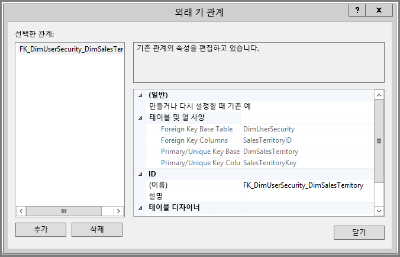
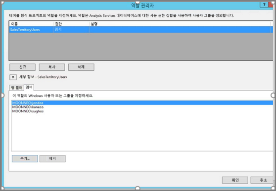
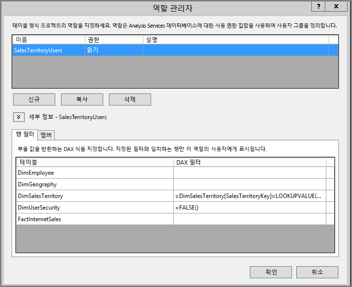
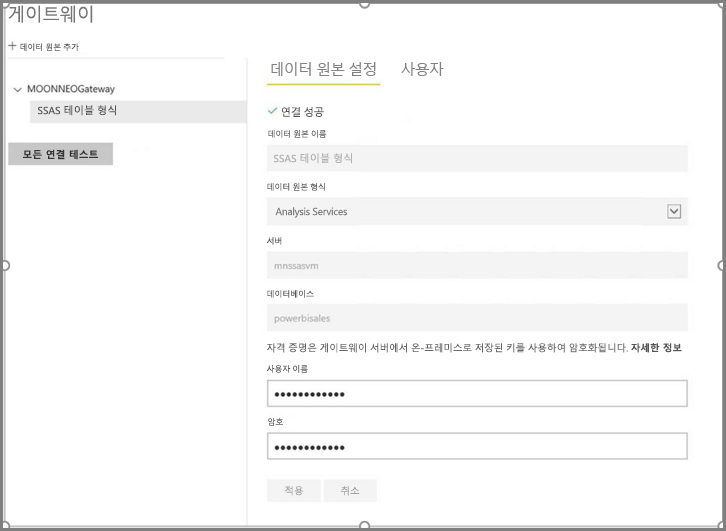
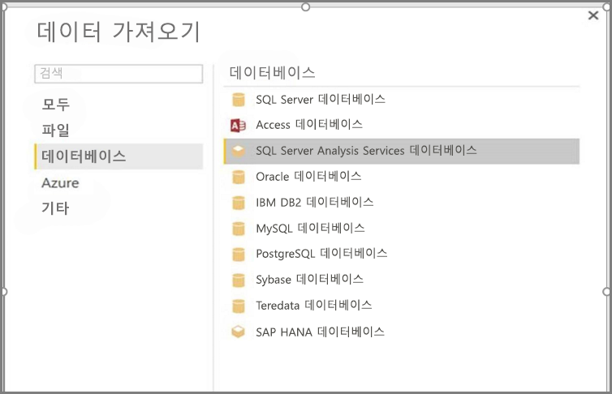
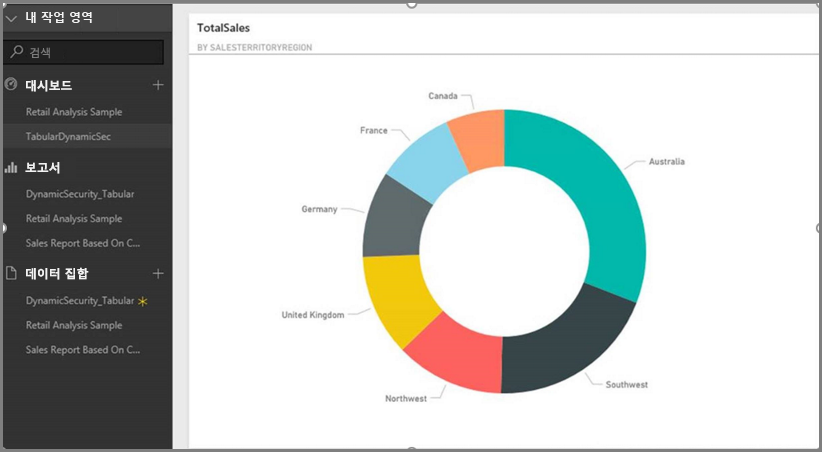
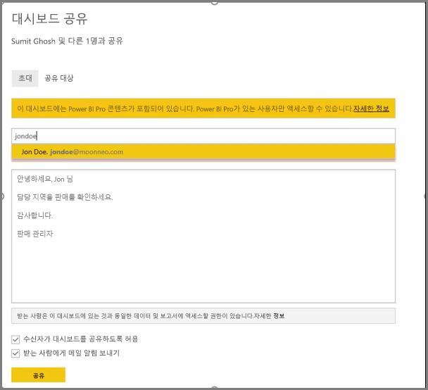
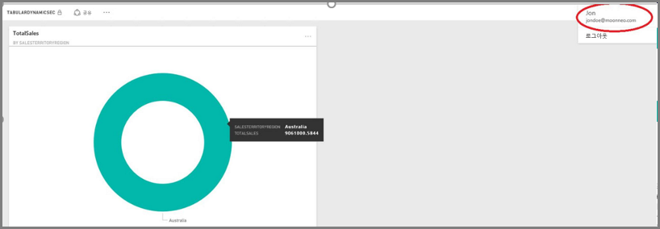

# <a name="dynamic-row-level-security-with-analysis-services-tabular-model"></a>Analysis Services 테이블 형식 모델을 사용하여 동적 행 수준 보안
이 자습서는 **Analysis Services 테이블 형식 모델** 내에서 **행 수준 보안**을 구현하는 데 필요한 단계를 설명하고 Power BI 보고서에서 사용하는 방법을 보여 줍니다. 이 자습서의 단계는 샘플 데이터 집합에서 완료하여 필요한 단계를 따르고 알아볼 수 있도록 설계되었습니다.

이 자습서에서 다음 단계는 Analysis Services 테이블 형식 모델로 동적 행 수준 보안을 구현하기 위해 수행해야 하는 작업을 이해할 수 있도록 자세히 설명되어 있습니다.

* **AdventureworksDW2012** 데이터베이스에서 새 보안 테이블 만들기
* 필요한 팩트 및 차원 테이블을 사용하여 테이블 형식 모델 빌드
* 사용자에 대한 역할 및 권한 정의
* **Analysis Services 테이블 형식** 인스턴스에 모델 배포
* Power BI Desktop을 사용하여 보고서에 액세스하는 사용자에게 해당하는 데이터를 표시하는 보고서 작성
* **Power BI 서비스**에 보고서 배포
* 보고서를 기반으로 새 대시보드 만들기 및 마지막으로
* 동료와 대시보드 공유

이 자습서의 단계를 수행하려면 **[리포지토리](https://github.com/Microsoft/sql-server-samples/releases/tag/adventureworks)** 에서 다운로드할 수 있는 **AdventureworksDW2012** 데이터베이스가 필요합니다.

## <a name="task-1-create-the-user-security-table-and-define-data-relationship"></a>작업 1: 사용자 보안 테이블 만들기 및 데이터 관계 정의
**SSAS(SQL Server Analysis Services) 테이블 형식** 모델을 사용하여 행 수준 동적 보안을 정의하는 방법을 설명하는 게시된 문서가 많이 있습니다. 예제에서는 [행 필터를 사용하여 동적 보안 구현](https://msdn.microsoft.com/library/hh479759.aspx) 문서를 따릅니다. 다음 단계는 이 자습서에서 첫 번째 작업을 안내합니다.

1. 샘플의 경우 **AdventureworksDW2012** 관계형 데이터베이스를 사용하고 있습니다. 해당 데이터베이스에서 다음 그림에 나와 있는 것처럼 **DimUserSecurity** 테이블을 만듭니다. 이 샘플의 경우 테이블을 만들기 위해 SSMS(SQL Server Management Studio)를 사용하고 있습니다.
   
   
2. 테이블이 만들어지고 저장되면 다음 그림에 나와 있는 것처럼 **DimUserSecurity** 테이블의 **SalesTerritoryID** 열과 **DimSalesTerritory** 테이블의 **SalesTerritoryKey** 열 사이에 관계를 만들어야 합니다. **DimUserSecurity** 테이블을 마우스 오른쪽 단추로 클릭하고 **디자인**을 선택하여 **SSMS**에서 이 작업을 수행할 수 있습니다. 그런 다음 메뉴에서 **테이블 디자이너 -> 관계...** 를 선택합니다.
   
   
3. 테이블을 저장한 다음 다시 **DimUserSecurity** 테이블을 마우스 오른쪽 단추로 클릭한 다음 **상위 200개 행 편집**을 선택하여 몇 개의 사용자 정보 행을 테이블에 추가합니다. 해당 사용자를 추가한 후 **DimUserSecurity** 테이블의 행은 다음 그림에서 수행하는 것처럼 보입니다.
   
   
   
   이후 작업에서 해당 사용자로 다시 돌아오겠습니다.
4. 다음으로 사용자와 연결된 지역 세부 정보를 보여 주는 **DimSalesTerritory** 테이블을 사용하여 *내부 조인*을 수행합니다. 다음 코드는 *내부 조인*을 수행하고 다음에 나오는 이미지는 *내부 조인*이 성공하면 테이블이 나타나는 방법을 보여 줍니다.
   
       select b.SalesTerritoryCountry, b.SalesTerritoryRegion, a.EmployeeID, a.FirstName, a.LastName, a.UserName from [dbo].[DimUserSecurity] as a join  [dbo].[DimSalesTerritory] as b on a.[SalesTerritoryKey] = b.[SalesTerritoryID]
   
   
5. 위의 이미지는 사용자가 담당하는 판매 지역과 같은 정보를 보여 줍니다. **2단계**에서 만든 관계 때문에 해당 데이터가 표시됩니다. 또한 사용자 **Jon Doe는 오스트레일리아 판매 지역의 일부입니다**. 이후 단계 및 작업에서 John Doe를 다시 방문할 예정입니다.

## <a name="task-2-create-the-tabular-model-with-facts-and-dimension-tables"></a>작업 2: 팩트 및 차원 테이블을 사용하여 테이블 형식 모델 만들기
1. 관계형 데이터 웨어하우스가 준비되면 이제 테이블 형식 모델을 정의할 시간입니다. **SSDT(SQL Server 데이터 도구)** 를 사용하여 모델을 만들 수 있습니다. 테이블 형식 모델을 정의하는 방법에 대한 자세한 정보를 가져오려면 [새 테이블 형식 모델 프로젝트 만들기](https://msdn.microsoft.com/library/hh231689.aspx)를 참조하세요.
2. 아래와 같이 필요한 모든 테이블을 모델로 가져옵니다.
   
    
3. 필요한 테이블을 가져오면 **읽기** 권한으로 **SalesTerritoryUsers**라는 역할을 정의해야 합니다. SQL Server 데이터 도구의 **모델** 메뉴를 클릭한 다음 **역할**을 클릭하여 수행할 수 있습니다. **역할 관리자** 대화 상자에서 **새로 만들기**를 클릭합니다.
4. **역할 관리자**의 **멤버** 탭 아래에서 **작업 1 - 3단계**의 **DimUserSecurity** 테이블에서 정의한 사용자를 추가합니다.
   
    
5. 다음으로 **행 필터** 탭 아래에서 아래에 표시된 대로 **DimSalesTerritory** 및 **DimUserSecurity** 테이블에 대한 적절한 함수를 추가합니다.
   
    
6. 이 단계에서 **LOOKUPVALUE** 함수를 사용하여 Windows 사용자 이름이 **USERNAME** 함수로 반환된 사용자 이름과 동일한 열에 대한 값을 반환합니다. 쿼리는 **LOOKUPVALUE**로 반환된 값이 동일한 또는 관련 테이블의 값과 일치하는 것으로 제한될 수 있습니다. **DAX 필터** 열에서 다음 수식을 입력합니다.
   
       =DimSalesTerritory[SalesTerritoryKey]=LOOKUPVALUE(DimUserSecurity[SalesTerritoryID], DimUserSecurity[UserName], USERNAME(), DimUserSecurity[SalesTerritoryID], DimSalesTerritory[SalesTerritoryKey])
    이 수식에서 **LOOKUPVALUE** 함수는 **DimUserSecurity [SalesTerritoryID]** 열에 대한 모든 값을 반환합니다. 여기에서 **DimUserSecurity [UserName]** 은 현재 로그온된 Windows 사용자 이름과 같고 **DimUserSecurity [SalesTerritoryID]** 는 **DimSalesTerritory [SalesTerritoryKey]** 와 같습니다.
   
   **LOOKUPVALUE**에서 반환된 Sales SalesTerritoryKey의 집합은 **DimSalesTerritory**에 표시된 행을 제한하는 데 사용됩니다. 행에 대한 **SalesTerritoryKey**가 **LOOKUPVALUE** 함수에서 반환된 ID의 집합에 있는 행만 표시됩니다.
8. **DimUserSecurity** 테이블의 경우 **DAX 필터** 열에서 다음 수식을 입력합니다.
   
       =FALSE()

    이 수식은 모든 열이 false 부울 조건에 대해 확인하는 것을 지정하므로 **DimUserSecurity** 테이블에 대한 열을 쿼리할 수 없습니다.
1. 이제 모델을 처리하고 배포해야 합니다. 모델 배포에 대한 도움말은 [배포 문서](https://msdn.microsoft.com/library/hh231693.aspx)를 참조할 수 있습니다.

## <a name="task-3-adding-data-sources-within-your-on-premises-data-gateway"></a>작업 3: 온-프레미스 데이터 게이트웨이 내에서 데이터 원본 추가
1. 테이블 형식 모델이 배포되고 사용 준비가 되면 Power BI 포털에서 온-프레미스 Analysis Services 테이블 형식 서버에 데이터 원본 연결을 추가해야 합니다.
2. 온-프레미스 분석 서비스에 대한 **Power BI 서비스** 액세스를 허용하려면 사용자 환경에 **[온-프레미스 데이터 게이트웨이](service-gateway-onprem.md)** 를 설치하고 구성해야 합니다.
3. 게이트웨이가 올바르게 구성되었으면 **Analysis Services** 테이블 형식 인스턴스에 대한 데이터 원본 연결을 만들어야 합니다. 이 문서는 [Power BI 포털 내에서 데이터 원본을 추가](service-gateway-enterprise-manage-ssas.md)하는 데 도움이 됩니다.
   
   
4. 이전 단계를 완료하여 게이트웨이가 구성되고 온-프레미스 **Analysis Services** 데이터 원본과 상호 작용할 준비가 되었습니다.

## <a name="task-4-creating-report-based-on-analysis-services-tabular-model-using-power-bi-desktop"></a>작업 4: Power BI Desktop을 사용하여Aanlysis Services 테이블 형식 모델 기반 보고서 만들기
1. **Power BI Desktop**을 시작하고 **데이터 가져오기 > 데이터베이스**를 선택합니다.
2. 데이터 원본 목록에서 **SQL Server Analysis Services 데이터베이스**를 선택하고 **연결**을 선택합니다.
   
   
3. **Analysis Services** 테이블 형식 인스턴스 세부 정보를 입력하고 **라이브 연결**을 선택합니다. **확인**을 선택합니다. **Power BI**와 함께 동적 보안은 **라이브 연결**만을 사용하여 작동합니다.
   
   
4. **Analysis Services** 인스턴스에 배포된 모델이 표시됩니다. 해당 모델을 선택하고 **확인**을 선택합니다.
   
   
5. **Power BI Desktop**은 이제 **필드** 창의 캔버스 오른쪽에 사용 가능한 모든 필드를 표시합니다.
6. 오른쪽의 **필드** 창에서 **FactInternetSales** 테이블의 **SalesAmount** 측정 및 **SalesTerritory** 테이블의 **SalesTerritoryRegion** 차원을 선택합니다.
7. 이 보고서를 간단하게 유지하므로 지금 더 많은 열을 추가하지 않습니다. 좀 더 의미 있는 데이터 표현을 위해 시각화를 **도넛형 차트**로 변경합니다.
   
   
8. 보고서가 준비되면 Power BI 포털에 직접 게시할 수 있습니다. **Power BI Desktop**의 **홈** 리본에서 **게시**를 선택합니다.

## <a name="task-5-creating-and-sharing-a-dashboard"></a>작업 5: 대시보드 만들기 및 공유
1. 보고서를 만들고 **Power BI Desktop**에서 **게시**를 클릭했으므로 보고서는 **Power BI** 서비스에 게시됩니다. 이제 서비스 중이므로 이전 단계에서 만든 예제를 사용하여 모델 보안 시나리오를 설명할 수 있습니다.
   
   그의 역할에서 **판매 관리자 - Sumit**은 다른 모든 판매 지역의 데이터를 볼 수 있습니다. 따라서 그는 이 보고서(이전 작업 단계에서 만든 보고서)를 만들고 Power BI 서비스에 게시합니다.
   
   보고서를 게시하면 해당 보고서를 기반으로 Power BI 서비스에 **TabularDynamicSec**이라는 대시보드를 만듭니다. 다음 그림에서 판매 관리자(Sumit)는 모든 판매 지역에 해당하는 데이터를 볼 수 있습니다.
   
   
2. 이제 Sumit은 오스트레일리아 지역의 판매 담당인 그의 동료 Jon Doe와 대시보드를 공유합니다.
   
   
   
   
3. Jon Doe가 **Power BI** 서비스에 로그인하고 Sumit이 만든 공유 대시보드를 볼 때 Jon Doe는 그가 담당하는 지역의 판매**만** 봐야 합니다. 따라서 Jon Doe가 로그인하고 Sumit이 함께 공유하는 대시보드에 액세스하고 Jon Doe는 오스트레일리아 지역의 판매**만** 봅니다.
   
   
4. 축하합니다! 온-프레미스 **Analysis Services** 테이블 형식 모델에서 정의된 동적 행 수준 보안이 **Power BI** 서비스에 성공적으로 반영되고 관찰되었습니다. Power BI는 **effectiveusername** 속성을 사용하여 쿼리를 실행하도록 현재 Power BI 사용자 자격 증명을 온-프레미스 데이터 원본에 전송합니다.

## <a name="task-6-understanding-what-happens-behind-the-scenes"></a>작업 6: 내부적으로 수행되는 작업 이해
1. 이 작업은 온-프레미스 SSAS 테이블 형식 인스턴스에서 SQL Server 프로파일러 추적을 캡처해야 하므로 SQL 프로파일러와 익숙하다고 가정합니다.
2. 세션은 사용자(이 경우 Jon Doe)가 Power BI 서비스의 대시보드에 액세스하는 즉시 초기화됩니다. **salesterritoryusers** 역할이 **<EffectiveUserName>jondoe@moonneo.com</EffectiveUserName>** 의 유효 사용자 이름으로 즉시 적용되는 것을 볼 수 있습니다.
   
       <PropertyList><Catalog>DefinedSalesTabular</Catalog><Timeout>600</Timeout><Content>SchemaData</Content><Format>Tabular</Format><AxisFormat>TupleFormat</AxisFormat><BeginRange>-1</BeginRange><EndRange>-1</EndRange><ShowHiddenCubes>false</ShowHiddenCubes><VisualMode>0</VisualMode><DbpropMsmdFlattened2>true</DbpropMsmdFlattened2><SspropInitAppName>PowerBI</SspropInitAppName><SecuredCellValue>0</SecuredCellValue><ImpactAnalysis>false</ImpactAnalysis><SQLQueryMode>Calculated</SQLQueryMode><ClientProcessID>6408</ClientProcessID><Cube>Model</Cube><ReturnCellProperties>true</ReturnCellProperties><CommitTimeout>0</CommitTimeout><ForceCommitTimeout>0</ForceCommitTimeout><ExecutionMode>Execute</ExecutionMode><RealTimeOlap>false</RealTimeOlap><MdxMissingMemberMode>Default</MdxMissingMemberMode><DisablePrefetchFacts>false</DisablePrefetchFacts><UpdateIsolationLevel>2</UpdateIsolationLevel><DbpropMsmdOptimizeResponse>0</DbpropMsmdOptimizeResponse><ResponseEncoding>Default</ResponseEncoding><DirectQueryMode>Default</DirectQueryMode><DbpropMsmdActivityID>4ea2a372-dd2f-4edd-a8ca-1b909b4165b5</DbpropMsmdActivityID><DbpropMsmdRequestID>2313cf77-b881-015d-e6da-eda9846d42db</DbpropMsmdRequestID><LocaleIdentifier>1033</LocaleIdentifier><EffectiveUserName>jondoe@moonneo.com</EffectiveUserName></PropertyList>
3. 유효 사용자 이름 요청에 따라 Analysis Services는 로컬 Active Directory를 쿼리 한 후 요청을 실제 moonneo\jondoe 자격 증명으로 변환합니다. **Analysis Services**가 Active Directory에서 실제 자격 증명을 가져오면 액세스에 따라 사용자는 데이터에 대한 권한을 가지고 **Analysis Services**는 권한이 있는 데이터만을 반환합니다.
4. 대시보드에서 더 많은 작업이 발생하는 경우, 예를 들어 Jon Doe가 SQL 프로파일러를 사용하여 대시보드에서 기본 보고서로 이동하면 특정 쿼리가 DAX 쿼리로 Analysis Services 테이블 형식 모델로 돌아오는 것을 볼 수 있습니다.
   
   
5. 또한 아래에서 DAX 쿼리가 실행되어 보고서에 대한 데이터를 채우는 것을 볼 수 있습니다.
   
   ```
   EVALUATE
     ROW(
       "SumEmployeeKey", CALCULATE(SUM(Employee[EmployeeKey]))
     )
   
   <PropertyList xmlns="urn:schemas-microsoft-com:xml-analysis">``
             <Catalog>DefinedSalesTabular</Catalog>
             <Cube>Model</Cube>
             <SspropInitAppName>PowerBI</SspropInitAppName>
             <EffectiveUserName>jondoe@moonneo.com</EffectiveUserName>
             <LocaleIdentifier>1033</LocaleIdentifier>
             <ClientProcessID>6408</ClientProcessID>
             <Format>Tabular</Format>
             <Content>SchemaData</Content>
             <Timeout>600</Timeout>
             <DbpropMsmdRequestID>8510d758-f07b-a025-8fb3-a0540189ff79</DbpropMsmdRequestID>
             <DbPropMsmdActivityID>f2dbe8a3-ef51-4d70-a879-5f02a502b2c3</DbPropMsmdActivityID>
             <ReturnCellProperties>true</ReturnCellProperties>
             <DbpropMsmdFlattened2>true</DbpropMsmdFlattened2>
             <DbpropMsmdActivityID>f2dbe8a3-ef51-4d70-a879-5f02a502b2c3</DbpropMsmdActivityID>
           </PropertyList>
   ```

## <a name="considerations"></a>고려 사항
행 수준 보안, SSAS 및 Power BI를 사용하여 작업할 때 염두에 두어야 할 몇 가지 고려 사항이 있습니다.

1. Power BI와 온-프레미스 행 수준 보안은 라이브 연결로만 제공됩니다.
2. 모델 처리 후 데이터의 변경 내용은 Power BI 서비스의 사용자(**라이브 연결**로 보고서에 액세스)가 즉시 사용할 수 있습니다.

